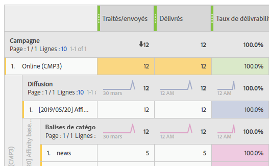
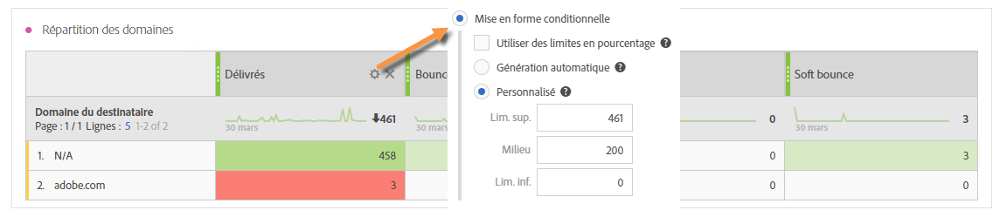

# Résolution des problèmes{#troubleshooting}

Cette section contient des questions courantes relatives aux rapports dynamiques.

## Pour les ouvertures uniques et les clics uniques, le décompte de la ligne agrégée ne correspond pas à ceux de chaque ligne. {#unique-open-clicks-no-match}

Il s'agit d'un comportement attendu.
Prenons l'exemple suivant pour expliquer ce comportement.

Un email est envoyé aux profils P1 et P2.

P1 ouvre l'email deux fois le premier jour, puis trois fois le jour suivant.

P2, quant à lui, ouvre l'email une fois le premier jour et ne le rouvre pas les jours suivants.
Voici une représentation visuelle de l'interaction des profils avec l'email envoyé :

<table> 
 <thead> 
  <tr> 
   <th align="center"> <strong>Jour</strong>   </th> 
   <th align="center"> <strong>Ouvertures</strong>  </th> 
   <th align="center"> <strong>Ouvertures uniques</strong>   </th> 
  </tr> 
 </thead> 
 <tbody> 
  <tr> 
   <td align="center"> Jour 1  </td> 
   <td align="center"> 2 + 1 = 3  </td> 
   <td align="center"> 1 + 1 = 2  </td> 
  </tr> 
  <tr> 
   <td align="center"> Jour 2  </td> 
   <td align="center"> 3 + 0 = 3  </td> 
   <td align="center"> 1 + 0 = 1  </td> 
  </tr>
 </tbody> 
</table>

Pour comprendre le nombre total des ouvertures uniques, nous devons additionner les chiffres des lignes des **[!UICONTROL Ouvertures uniques]**, ce qui nous donne la valeur 3. Toutefois, comme l'email n'était ciblé que sur 2 profils, le taux d'ouverture devrait être de 150 %.

Pour ne pas obtenir de pourcentage supérieur à 100, la définition des **[!UICONTROL ouvertures uniques]** est le nombre de broadlogs uniques ouverts. Dans ce cas, même si P1 a ouvert l'email le jour 1 et le jour 2, les ouvertures uniques sont toujours égales à 1.

Cela donne le tableau suivant :

<table> 
 <thead> 
  <tr> 
   <th align="center"> <strong>Jour</strong>   </th> 
   <th align="center"> <strong>Ouvertures</strong>  </th> 
   <th align="center"> <strong>Ouvertures uniques</strong>   </th> 
  </tr> 
 </thead> 
 <tbody> 
  <tr> 
   <td align="center"> Jour 1  </td> 
   <td align="center"> 6  </td> 
   <td align="center"> 2  </td>
  </tr> 
  <tr> 
   <td align="center"> Jour 2  </td> 
   <td align="center"> 3  </td> 
   <td align="center"> 2  </td> 
  </tr> 
 </tbody> 
</table>

>[!NOTE]
>
>Les décomptes uniques reposent sur un sketch HLL, ce qui peut entraîner de légères imprécisions dans le cas de nombres élevés.

## Les décomptes des ouvertures ne correspondent pas à ceux de la base de données. {#open-counts-no-match-database}

Cela peut être dû au fait que la méthode heuristique est utilisée dans les rapports dynamiques pour tracker les ouvertures, même lorsque nous ne pouvons pas tracker l'action **[!UICONTROL Ouvrir]**.

Par exemple, si un utilisateur a désactivé les images sur son client et qu'il clique sur un lien dans l'email, l'**[!UICONTROL Ouverture]** peut ne pas être trackée par la base de données mais le **[!UICONTROL clic]** oui.

Par conséquent, les logs de tracking des **[!UICONTROL ouvertures]** peuvent ne pas avoir le même décompte que dans la base de données.

Ces occurrences sont ajoutées car **"un clic sur un email implique l'ouverture de l'email"**.

>[!NOTE]
>
>Comme les décomptes uniques reposent sur le sketch HLL, des incohérences mineures entre les décomptes sont possibles.

## Comment les décomptes des diffusions récurrentes/transactionnelles sont-ils calculés ?

Lors de l'utilisation de diffusions récurrentes et transactionnelles, les décomptes sont attribués aux diffusions parents et enfants.

Prenons comme exemple une diffusion récurrente appelée **R1** définie pour s'exécuter tous les jours le jour 1 (RC1), le jour 2 (RC2) et le jour 3 (RC3).

Supposons que seule une personne a ouvert toutes les diffusions enfants à plusieurs reprises. Dans ce cas, chaque diffusion enfant récurrente affichera le nombre 1 d'**[!UICONTROL Ouverture]**.

Toutefois, comme la même personne a cliqué sur toutes les diffusions, la diffusion récurrente parent aura également un décompte de 1 pour les **[!UICONTROL ouvertures uniques]**.

Après la version 19.2.1 d'Adobe Campaign Standard, la définition des **décomptes uniques** est changée du **nombre de personnes uniques interagissant avec la diffusion** au **nombre de messages uniques ayant fait l'objet d'une interaction**.

Avant la version 19.2.1 d'Adobe Campaign Standard, les rapports ressemblaient à ce qui suit :

<table> 
 <thead> 
  <tr> 
   <th align="center"> <strong>Diffusion</strong>   </th> 
   <th align="center"> <strong>Envoyés</strong>   </th> 
   <th align="center"> <strong>Delivrés</strong>   </th>
   <th align="center"> <strong>Ouvertures</strong>  </th> 
   <th align="center"> <strong>Ouvertures uniques</strong>   </th>
  </tr> 
 </thead> 
 <tbody> 
  <tr> 
   <td align="center"> <strong>R1  </td> 
   <td align="center"> <strong>100  </td> 
   <td align="center"> <strong>90  </td> 
   <td align="center"> <strong>10  </td> 
   <td align="center"> <strong>1  </td> 
  </tr> 
  <tr> 
   <td align="center"> RC1  </td> 
   <td align="center"> 20  </td> 
   <td align="center"> 20  </td> 
   <td align="center"> 6  </td> 
   <td align="center"> 1  </td> 
  </tr>
    <tr> 
   <td align="center"> RC2  </td> 
   <td align="center"> 40  </td> 
   <td align="center"> 30  </td> 
   <td align="center"> 2  </td> 
   <td align="center"> 1  </td> 
  </tr> 
    <tr> 
   <td align="center"> RC3  </td> 
   <td align="center"> 40  </td> 
   <td align="center"> 40  </td> 
   <td align="center"> 2  </td> 
   <td align="center"> 1  </td> 
  </tr>
 </tbody> 
</table>

Après la version 19.2.1 d'Adobe Campaign Standard, les rapports ressemblent à ce qui suit :

<table> 
 <thead> 
  <tr> 
   <th align="center"> <strong>Diffusion</strong>   </th> 
   <th align="center"> <strong>Envoyés</strong>   </th> 
   <th align="center"> <strong>Delivrés</strong>   </th>
   <th align="center"> <strong>Ouvertures</strong>  </th> 
   <th align="center"> <strong>Ouvertures uniques</strong>   </th>
  </tr> 
 </thead> 
 <tbody> 
  <tr> 
   <td align="center"> <strong>R1  </td> 
   <td align="center"> <strong>100  </td> 
   <td align="center"> <strong>90  </td> 
   <td align="center"> <strong>10  </td> 
   <td align="center"> <strong>3  </td> 
  </tr> 
  <tr> 
   <td align="center"> RC1  </td> 
   <td align="center"> 20  </td> 
   <td align="center"> 20  </td> 
   <td align="center"> 6  </td> 
   <td align="center"> 1  </td> 
  </tr>
    <tr> 
   <td align="center"> RC2  </td> 
   <td align="center"> 40  </td> 
   <td align="center"> 30  </td> 
   <td align="center"> 2  </td> 
   <td align="center"> 1  </td> 
  </tr> 
    <tr> 
   <td align="center"> RC3  </td> 
   <td align="center"> 40  </td> 
   <td align="center"> 40  </td> 
   <td align="center"> 2  </td> 
   <td align="center"> 1  </td> 
  </tr> 
 </tbody> 
</table>

## Quelle est la signification des couleurs dans le tableau des rapports ? {#reports-color-signification}

Les couleurs affichées dans vos rapports sont aléatoires et ne peuvent pas être personnalisées. Elles représentent une barre de progression et s'affichent pour mettre en évidence la valeur maximale atteinte dans vos rapports.

Dans l'exemple ci-dessous, la cellule est de la même couleur car sa valeur est 100 %.

Si vous définissez la **mise en forme conditionnelle** sur personnalisée, lorsque la valeur atteint la limite supérieure, la cellule devient verte. En revanche, si elle atteint la limite inférieure, elle devient rouge.

Par exemple, ici, nous définissons la **limite supérieure** sur 500 et la **limite inférieure** sur 0.

