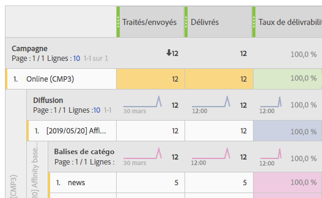

# Résolution des problèmes{#troubleshooting}

Cette section contient des questions courantes relatives aux rapports dynamiques.

## Pour les ouvertures uniques et les clics uniques, le décompte de la ligne agrégée ne correspond pas à ceux de chaque ligne. {#unique-open-clicks-no-match}

Il s&#39;agit d&#39;un comportement attendu.
Prenons l&#39;exemple suivant pour expliquer ce comportement.

Un email est envoyé aux profils P1 et P2.

P1 ouvre l&#39;email deux fois le premier jour, puis trois fois le jour suivant.

P2, quant à lui, ouvre l&#39;email une fois le premier jour et ne le rouvre pas les jours suivants.
Voici une représentation visuelle de l&#39;interaction des profils avec l&#39;email envoyé :

<table> 
 <thead> 
  <tr> 
   <th align="center"> <strong>Jour</strong>   </th> 
   <th align="center"> <strong>Ouvertures</strong>  </th> 
   <th align="center"> <strong>Ouvertures uniques</strong>   </th> 
  </tr> 
 </thead> 
 <tbody> 
  <tr> 
   <td align="center"> Jour 1  </td> 
   <td align="center"> 2 + 1 = 3  </td> 
   <td align="center"> 1 + 1 = 2  </td> 
  </tr> 
  <tr> 
   <td align="center"> Jour 2  </td> 
   <td align="center"> 3 + 0 = 3  </td> 
   <td align="center"> 1 + 0 = 1  </td> 
  </tr>
 </tbody> 
</table>

To understand the overall number of unique opens, we need to sum up the row counts of **[!UICONTROL Unique Opens]** which gives us the value 3. Toutefois, comme l&#39;email n&#39;était ciblé que sur 2 profils, le taux d&#39;ouverture devrait être de 150 %.

To not obtain percentage higher than 100, the definition of **[!UICONTROL Unique Opens]** is maintained to be the number of unique broadlogs that were opened. Dans ce cas, même si P1 a ouvert l&#39;email le jour 1 et le jour 2, les ouvertures uniques sont toujours égales à 1.

Cela donne le tableau suivant :

<table> 
 <thead> 
  <tr> 
   <th align="center"> <strong>Jour</strong>   </th> 
   <th align="center"> <strong>Ouvertures</strong>  </th> 
   <th align="center"> <strong>Ouvertures uniques</strong>   </th> 
  </tr> 
 </thead> 
 <tbody> 
  <tr> 
   <td align="center"> Jour 1  </td> 
   <td align="center"> 6  </td> 
   <td align="center"> 2  </td>
  </tr> 
  <tr> 
   <td align="center"> Jour 2  </td> 
   <td align="center"> 3  </td> 
   <td align="center"> 2  </td> 
  </tr> 
 </tbody> 
</table>

>[!NOTE]
>
>Les décomptes uniques reposent sur un sketch HLL, ce qui peut entraîner de légères imprécisions dans le cas de nombres élevés.

## Les décomptes des ouvertures ne correspondent pas à ceux de la base de données. {#open-counts-no-match-database}

This may be due to the fact that, heuristics are used in Dynamic reporting to track opens even when we can&#39;t track the **[!UICONTROL Open]** action.

For example, if a user has disabled images on their client and click on a link in the email, the **[!UICONTROL Open]** may not be tracked by the database but the **[!UICONTROL Click]** will.

Therefore, the **[!UICONTROL Open]** tracking logs counts may not have the same count in the database.

Ces occurrences sont ajoutées car **&quot;un clic sur un email implique l&#39;ouverture de l&#39;email&quot;**.

>[!NOTE]
>
>Comme les décomptes uniques reposent sur le sketch HLL, des incohérences mineures entre les décomptes sont possibles.

## Quelle est la signification des couleurs dans le tableau des rapports ? {#reports-color-signification}

Les couleurs affichées dans vos rapports sont aléatoires et ne peuvent pas être personnalisées. Elles représentent une barre de progression et s&#39;affichent pour mettre en évidence la valeur maximale atteinte dans vos rapports.

Dans l&#39;exemple ci-dessous, la cellule est de la même couleur car sa valeur est 100 %.

If you change the **[!UICONTROL Conditional formatting]** to custom, when the value reaches the upper limit the cell will get greener. En revanche, si elle atteint la limite inférieure, elle devient rouge.

Par exemple, ici, nous avons défini le paramètre **[!UICONTROL Upper limit]** sur 500 et **[!UICONTROL Lower limit]** sur 0.

## Pourquoi la valeur N/A apparaît-elle dans mes rapports ?

La valeur **N/A** peut parfois apparaître dans vos rapports dynamiques. Elle peut s&#39;afficher pour deux raisons :

* La diffusion a été supprimée et s&#39;affiche ici sous la forme **N/A** pour ne pas entraîner d&#39;incohérence dans les résultats.
* When drag and dropping the **[!UICONTROL Transactional Delivery]** dimension to your reports, the value **N/A** might appear as a result. Elle s&#39;affiche, car le rapport dynamique récupère chaque diffusion, même si elle n&#39;est pas transactionnelle.
This can also happen when drag and dropping the **[!UICONTROL Delivery]** dimension to your report but in this case, the **N/A** value will represent transactional deliveries.
