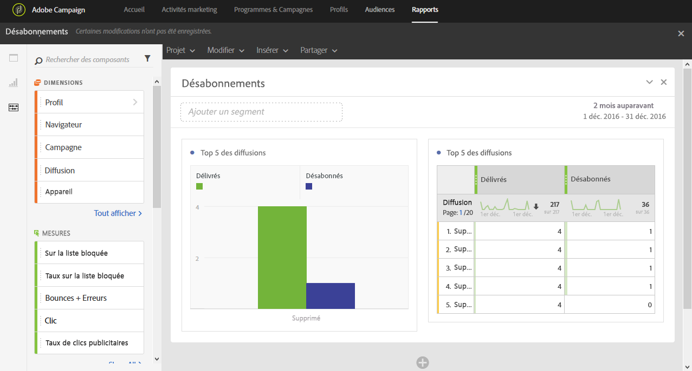

# Désinscriptions (Unsubscriptions){#unsubscriptions}

Le rapport **[!UICONTROL Désabonnements]** permet d'identifier les diffusions avec le plus de désabonnements.

Le tableau et graphique **[!UICONTROL Top 5 des diffusions]affiche le top 5 des diffusions avec le plus grand nombre de messages délivrés et le nombre de destinataires s'étant désabonnés.** Les données listées ici sont basées sur le nombre de clics sur le lien de désinscription du message.
