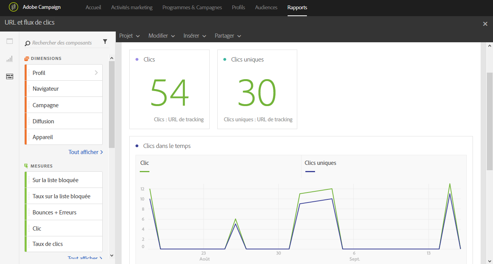

# URL et flux de clics (URLs and click streams){#urls-and-click-streams}

Le rapport **URL et flux de clics** (URLs and click streams) affiche les URL ayant obtenu le plus de clics lors d'une diffusion, ou plusieurs diffusions si elles sont liées à une campagne ou un programme.

Chaque tableau est représenté par des nombres et des graphiques de synthèse. Les paramètres de visualisation des détails vous permettent de modifier leur affichage.

Le tableau **Top des liens les plus visités** contient les données disponibles concernant l'activité des destinataires par diffusion, telles que :

* **Clic** : nombre de clics sur un contenu dans une diffusion.
* **Clics uniques** : nombre de destinataires ayant cliqué sur un contenu dans une diffusion.

