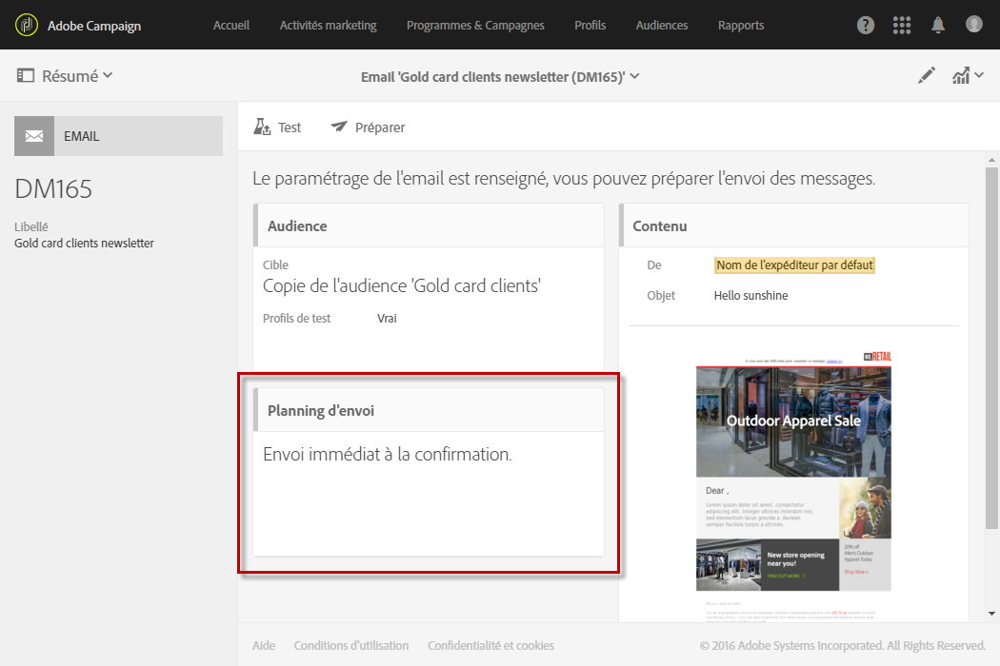
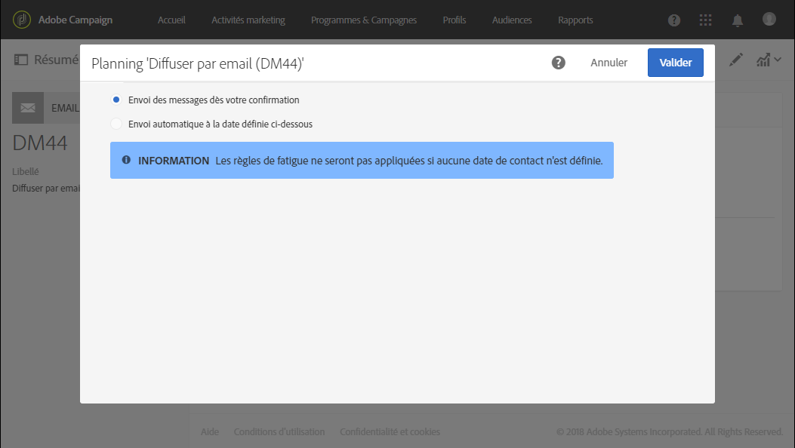
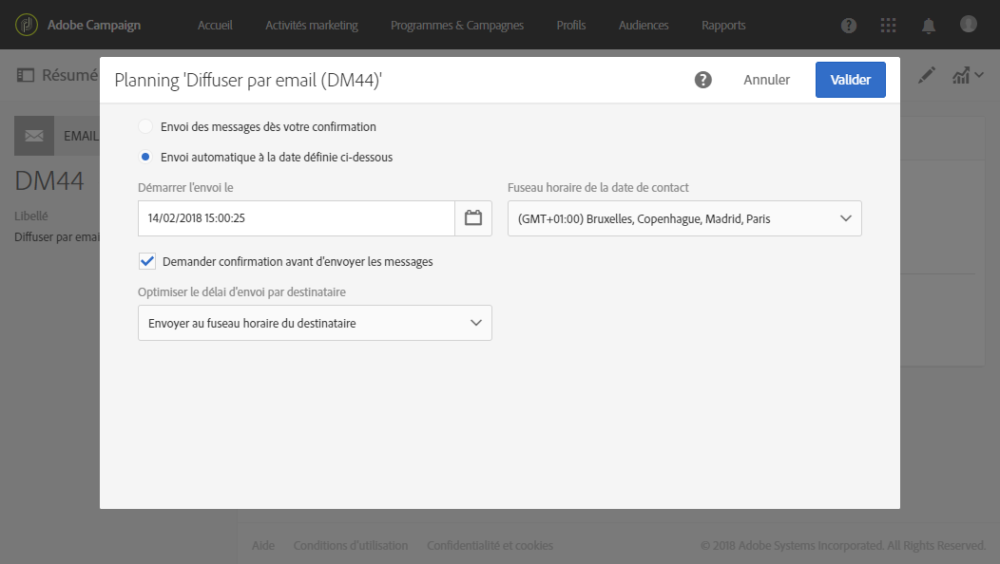

# A propos de la planification des messages{#about-scheduling-messages}

>[!CAUTION]
>
>Lorsque vous apportez des modifications au planning d'une diffusion, vous devez préparer de nouveau la diffusion en cliquant sur le bouton **Préparer** avant de cliquer sur **Confirmer**.

Dans le tableau de bord des messages, le bloc **[!UICONTROL Planning]** permet de définir à quel moment les messages (emails, SMS ou notifications push) seront envoyés.

Les propriétés de **[!UICONTROL Planning]** permettent de définir les options d'envoi pour vos emails, SMS ou notifications push :

* **[!UICONTROL Envoi des messages dès votre confirmation]** : les messages sont envoyés dès que l'envoi est confirmé. Voir [Confirmer l'envoi](../../sending/using/confirming-the-send.md).

   

* **[!UICONTROL Envoi automatique à la date définie ci-dessous]** : les messages seront envoyés à des date et heure ultérieures. Indiquez la **date de contact** dans le champ **Démarrer l'envoi le**.

   L'envoi peut être préparé et confirmé, mais les messages ne seront envoyés qu'à la date et à l'heure sélectionnées. Les étapes de préparation et de confirmation de l'envoi sont présentées dans les sections [Préparer l'envoi](../../sending/using/preparing-the-send.md) et [Confirmer l'envoi](../../sending/using/confirming-the-send.md).

   La liste déroulante **[!UICONTROL Fuseau horaire de la date de contact]** vous permet de modifier le fuseau horaire pris en compte pour l'heure d'envoi. Par exemple, si vous tapez 9 heures dans le champ **[!UICONTROL Démarrer l'envoi le]** et si vous sélectionnez Bruxelles, Copenhague, Madrid, Paris (GMT+1) dans la liste déroulante **[!UICONTROL Fuseau horaire de la date de contact]**, tous les destinataires recevront le message à 9 heures, heure de Paris. Un destinataire se trouvant à Moscou (GMT+3) recevra quant à lui le message à 11 heures, heure de Moscou.

   Si vous souhaitez confirmer manuellement l'envoi définitif des messages, cochez l'option **[!UICONTROL Demander une confirmation avant l'envoi des messages]**. Cette option est activée par défaut.

   

>[!CAUTION]
>
>Lors de la duplication d'une diffusion, tous les paramètres de planification sont supprimés. Si vous ne planifiez pas de nouvelle date de contact, la diffusion dupliquée sera envoyée dès que l'envoi aura été confirmé.

**Rubriques connexes** :

* [Optimiser l'heure d'envoi](../../sending/using/optimizing-the-sending-time.md)
* [Envoi des messages au fuseau horaire du destinataire](../../sending/using/sending-messages-at-the-recipient-s-time-zone.md)
* [Calcul de la date d'envoi](../../sending/using/computing-the-sending-date.md)

