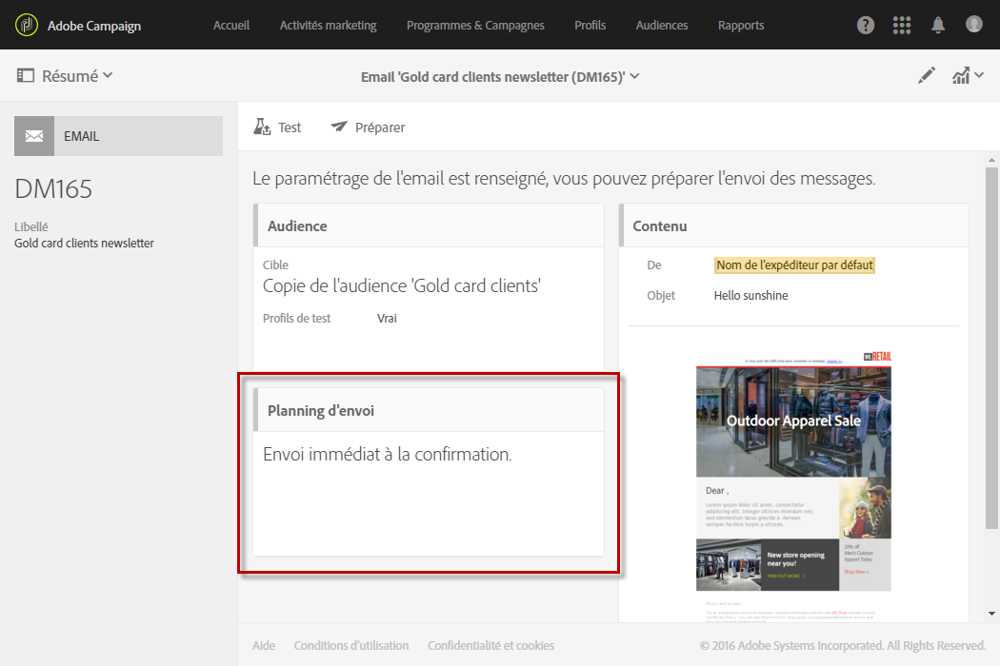
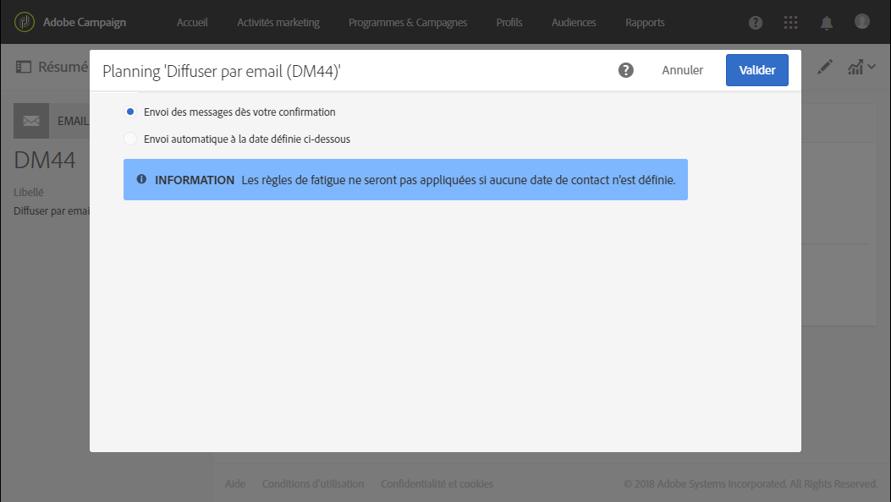
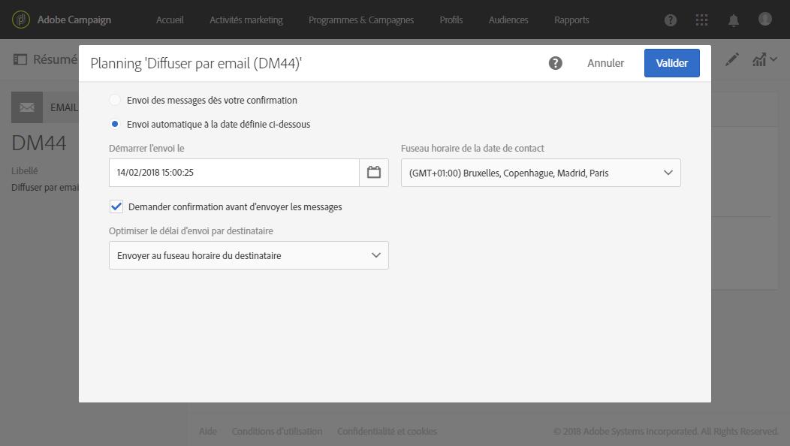

# À propos de la planification des messages{#about-scheduling-messages}

>[!IMPORTANT]
>
>Lorsque vous apportez des modifications au planning d&#39;une diffusion, vous devez préparer de nouveau la diffusion en cliquant sur le bouton **Préparer** avant de cliquer sur **Confirmer**.

Dans le tableau de bord des messages, le bloc **[!UICONTROL Planning]** permet de définir à quel moment les messages (emails, SMS ou notifications push) seront envoyés.

Les propriétés de **[!UICONTROL Planning]** permettent de définir les options d&#39;envoi pour vos emails, SMS ou notifications push :

* **[!UICONTROL Envoi des messages dès votre confirmation]** : les messages sont envoyés dès que l&#39;envoi est confirmé. Voir [Confirmer l’envoi](../../sending/using/confirming-the-send.md).

  

* **[!UICONTROL Envoi automatique à la date définie ci-dessous]** : les messages seront envoyés à des date et heure ultérieures. Indiquez la **date de contact** dans le champ **Démarrer l&#39;envoi le**.

  L&#39;envoi peut être préparé et confirmé, mais les messages ne seront envoyés qu&#39;à la date et à l&#39;heure sélectionnées. Les étapes de préparation et de confirmation de l&#39;envoi sont présentées dans les sections [Préparer l&#39;envoi](../../sending/using/preparing-the-send.md) et [Confirmer l&#39;envoi](../../sending/using/confirming-the-send.md).

  La liste déroulante **[!UICONTROL Fuseau horaire de la date de contact]** vous permet de modifier le fuseau horaire pris en compte pour l&#39;heure d&#39;envoi. Par exemple, si vous saisissez 9:00 dans le champ **[!UICONTROL Démarrer l’envoi le]** et sélectionnez Bruxelles, Copenhague, Madrid, Paris (GMT+1) dans la liste déroulante **[!UICONTROL Fuseau horaire de la date de contact]**, l’ensemble des destinataires recevra le message à 9:00, heure de Paris. Par conséquent, une personne destinataire située à Moscou (GMT+3) recevra le message à 11:00, heure de Moscou.

  Si vous souhaitez confirmer manuellement l&#39;envoi définitif des messages, cochez l&#39;option **[!UICONTROL Demander une confirmation avant l&#39;envoi des messages]**. Cette option est activée par défaut.

  

>[!IMPORTANT]
>
>Lors de la duplication d&#39;une diffusion, tous les paramètres de planification sont supprimés. Si vous ne planifiez pas de nouvelle date de contact, la diffusion dupliquée sera envoyée dès que l&#39;envoi aura été confirmé.

**Rubriques connexes** :

* [Optimiser l&#39;heure d&#39;envoi](../../sending/using/optimizing-the-sending-time.md)
* [Envoi des messages au fuseau horaire du destinataire](../../sending/using/sending-messages-at-the-recipient-s-time-zone.md)
* [Calcul de la date d&#39;envoi](../../sending/using/computing-the-sending-date.md)
