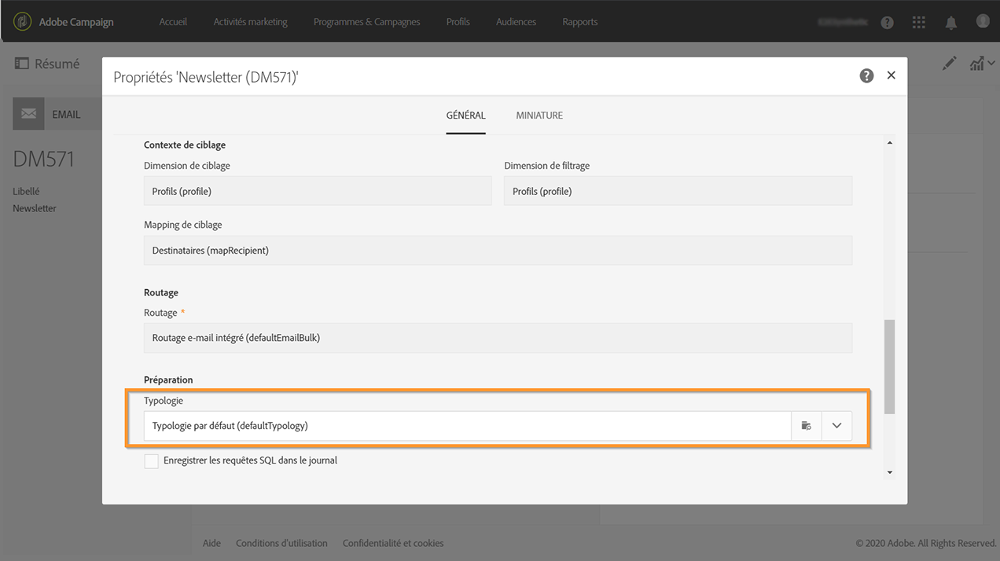

# À propos des typologies et des règles de typologie{#about-typology-rules}

Campaign Standard vous permet de lier un message à une **typologie**, afin de vérifier si le message est valide et répond à vos critères de qualité.

Les typologies sont des ensembles de **règles de typologie**, qui sont exécutés pendant la phase d’analyse du message. Elles vous permettent de vous assurer que vos e-mails contiennent toujours certains éléments (comme un lien de désinscription ou une ligne d’objet) ou des règles de filtrage pour exclure des groupes de votre cible visée (tels que les clients désabonnés, les concurrents et les clients ne faisant pas partie du programme de fidélité).

Des typologies prêtes à l&#39;emploi et des règles de typologie sont disponibles dans Campaign Standard. En fonction de vos besoins, vous pouvez également créer de nouvelles règles et les ajouter à des typologies existantes ou nouvelles pour les lier à vos messages.

Pour créer et appliquer une typologie aux messages, procédez comme suit :

1. Créez des règles de typologie (voir [cette section](../../sending/using/managing-typology-rules.md#creating-a-typology-rule)).
1. Créez une typologie et référencez les règles que vous avez créées dans celle-ci (voir [cette section](../../sending/using/managing-typologies.md#creating-a-typology)).
1. Configurez votre diffusion pour utiliser la typologie que vous avez créée (voir [cette section](../../sending/using/managing-typologies.md#applying-typologies-to-messages)).
1. Pendant la préparation du message, les profils sont exclus lorsque le critère est satisfait. Vous pouvez consulter les logs pour surveiller les exclusions.
