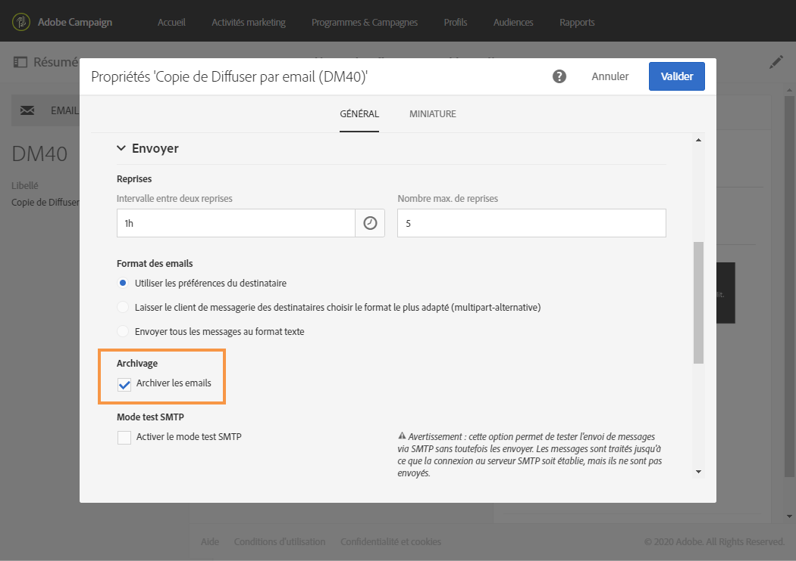

# Archivage avec Email BCC{#archiving-emails}

Vous pouvez paramétrer Adobe Campaign pour conserver une copie des emails envoyés depuis votre plateforme via Email BCC.

Activez cette fonctionnalité notamment si votre entreprise doit archiver tous les emails sortants à des fins de conformité. Celle-ci vous permet d’envoyer une copie cachée exacte des messages envoyés correspondants à une adresse email en Cci (invisible aux destinataires de l’envoi) que vous devez spécifier.

Une fois la fonctionnalité activée, vous devez activer Email BCC depuis l’option **[!UICONTROL Archiver les emails]** dans le modèle de diffusion Email.

>[!NOTE]
>
>Adobe Campaign ne gère pas les fichiers archivés. Il vous permet d’envoyer les messages de votre choix à une adresse dédiée, à partir de laquelle ils peuvent être traités et archivés au moyen d’un système externe.

## Recommandations et limitations       {#recommendations-and-limitations}

* Cette fonctionnalité est en option. Vérifiez votre contrat de licence et contactez votre chargé de compte pour l’activer.
* L’adresse en Cci de votre choix doit être fournie à l’équipe Adobe qui la configurera pour vous.
* Vous ne pouvez utiliser qu’une seule adresse email en Cci.
* Seuls les emails envoyés sont pris en compte, les rebonds ne le sont pas.
* Pour des raisons de confidentialité, les emails en Cci doivent être traités dans un système d’archivage capable de stocker en toute sécurité les informations d’identification personnelles (PII).
* Lors de la création d’un modèle de diffusion, l’option Email BCC n’est pas activée par défaut, même si elle a été achetée. Vous devez l’activer manuellement dans chaque modèle de diffusion où vous souhaitez l’utiliser.

>[!NOTE]
>
>Actuellement, les emails archivés ne peuvent pas être envoyés avec le MTA amélioré d’Adobe Campaign, même si vous avez déjà effectué une mise à niveau vers celui-ci.

## Activer l’archivage des emails       {#activating-email-archiving}

Une fois activée, la fonctionnalité Email BCC est activée dans le [modèle d’email](../../start/using/marketing-activity-templates.md) par le biais d’une option dédiée :

1. Accédez à **Ressources** > **Modèles** > **Modèles de diffusion**.
1. Dupliquez le modèle d’usine **[!UICONTROL Diffuser par email]**.
1. Sélectionnez le modèle dupliqué.
1. Cliquez sur le bouton **[!UICONTROL Editer les propriétés]** pour éditer les propriétés du modèle.
1. Développez la section **[!UICONTROL Envoi]**.
1. Cochez la case **[!UICONTROL Archiver les emails]** pour conserver une copie de tous les messages envoyés pour chaque diffusion selon ce modèle.

   

>[!NOTE]
>
>Si les emails envoyés à l’adresse en Cci sont ouverts et font l’objet de clics, cela sera pris en compte dans les **[!UICONTROL Ouvertures totales]** et les **[!UICONTROL Clics]** provenant de l’analyse d’envoi, ce qui pourrait entraîner des erreurs de calcul.