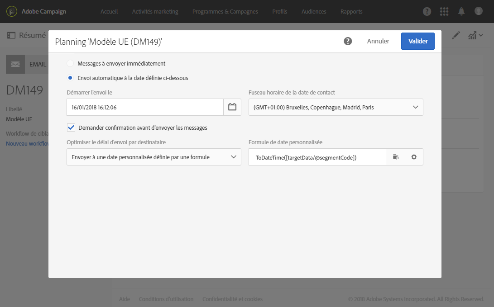
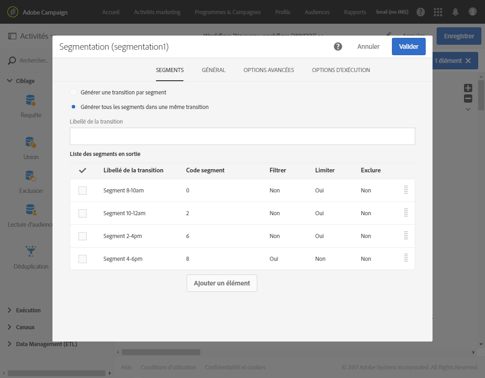

# Calcul de la date d'envoi{#computing-the-sending-date}

Vous pouvez également définir une formule pour envoyer le message à chaque destinataire à une date et à une heure précises.

## Personnalisation de la formule de date {#customizing-date-formula}

Par exemple, vous pouvez utiliser l'optimisation de l'heure d'envoi lors de l'installation d'une nouvelle plate-forme.

Lorsque d'importants volumes d'emails sont envoyés de façon soudaine, les Fournisseurs d'accès Internet (FAI) se méfient des adresses IP non reconnues et classent souvent ces messages dans le courrier indésirable. Si d'importants volumes d'emails sont envoyés de façon soudaine, les FAI les classent souvent en indésirables.

Pour éviter d'être bloqué par les FAI, vous pouvez augmenter progressivement les volumes envoyés en les répartissant sur plusieurs périodes. Cela devrait vous assurer une phase de démarrage en douceur tout en réduisant le taux d'adresses invalides.

Par exemple, vous pouvez segmenter aléatoirement la cible de votre message pour envoyer votre diffusion à cinq lots de destinataires. Vous enverrez ainsi un premier lot à 10 % de vos destinataires le 1er juin à 10 heures, puis un deuxième lot 24 heures plus tard à 15 % de vos destinataires, et ainsi de suite.

Ce processus peut être planifié à l'aide d'un workflow.


1. Accédez à la liste des activités marketing et créez un workflow. Voir à ce propos la section [Créer un workflow](../../automating/using/building-a-workflow.md#creating-a-workflow).
1. Placez une activité **Requête** dans votre workflow, puis ouvrez-la. Consultez la section [Requête](../../automating/using/query.md).
1. Choisissez une audience, par exemple tous vos clients Gold et cliquez sur **[!UICONTROL Confirmer]pour enregistrer la requête.**
1. Placez une activité **Segmentation** dans votre workflow, puis ouvrez-la. Consultez la section [Segmentation](../../automating/using/segmentation.md).
1. Définissez cinq segments. Pour chaque segment :

   * Remplissez le champ **[!UICONTROL Code segment] : saisissez manuellement la date et l'heure d'envoi du message.**

      Par exemple, si vous voulez envoyer le premier groupe le 1er juin à 10 heures GMT+1, le format doit être le suivant : **AAAA-MM-JJ hh:mm:ss+tz**.

      

      Pour envoyer le deuxième lot le jour suivant, saisissez **2017-06-02 10:00:00+01** pour le deuxième segment.

      Pour les segments restants, définissez les lots comme ceci :

      * **03/06/2017 10:00:00+01**
      * **04/06/2017 10:00:00+01**
      * **05/06/2017 10:00:00+01**
   * Veillez à sélectionner l'option **[!UICONTROL Limiter la population de ce segment].**

      Dans l'onglet **[!UICONTROL Limitation]**, sélectionnez **Tirage aléatoire]et saisissez le pourcentage souhaité pour chaque segment : 10 pour le premier groupe, 15 pour le deuxième, etc.[!UICONTROL **

      


1. Une fois que tous les segments ont été définis, sélectionnez **[!UICONTROL Générer tous les segments dans une même transition]** et cliquez sur **[!UICONTROL Confirmer]**.

   

1. Placez une activité **Diffusion Email** dans votre workflow, puis ouvrez-la. Consultez la section [Diffusion Email](../../automating/using/email-delivery.md).
1. Cliquez sur la section **[!UICONTROL Planning d'envoi]** dans le tableau de bord de l'email et sélectionnez **[!UICONTROL Envoi automatique à la date définie ci-dessous]**.
1. Dans le champ **[!UICONTROL Démarrer l'envoi le], définissez une date de contact.**
1. Dans le menu déroulant d'optimisation de l'heure d'envoi, sélectionnez **[!UICONTROL Envoyer à une date personnalisée définie par une formule]**.
1. Cliquez sur le bouton **[!UICONTROL Editer une expression]** du champ **Formule de date personnalisée[!UICONTROL .]**

   

1. Créez l'expression ci-après à l'aide de la fonction **[!UICONTROL ToDateTime]** et du champ **Code segment.** Vous pouvez également saisir directement l'expression, mais veillez à utiliser la syntaxe et l'orthographe correctes.

   ```
   ToDateTime([targetData/@segmentCode])
   ```

   La fonction **[!UICONTROL ToDateTime]transforme le code segment d'une chaîne de texte en valeur de date et heure.**

   Validez l'expression pour revenir à l'écran précédent.

   

   Dans la fenêtre **[!UICONTROL Planning d'envoi], la formule de la date personnalisée est affichée comme suit :**

   ```
   ToDateTime([targetData/@segmentCode])
   ```

   

1. Confirmez le planning, sauvegardez votre diffusion et exécutez le workflow.

La diffusion sera envoyée progressivement à tous les destinataires ciblés sur une période de cinq jours.

>[!NOTE]
>
>Lors de la confirmation de l'envoi, assurez-vous que toutes les dates sont dans le futur. Sinon, les messages seront envoyés dès que l'envoi aura été confirmé.

## A partir d'une expression {#using-an-expression}

L'optimisation de l'heure d'envoi est également utile pour les campagnes impliquant un centre d'appel. Elle permet de garantir que tous les messages ne seront pas reçus en même temps. Votre entreprise peut ainsi traiter le nombre d'appels en fonction de sa capacité.

Par exemple, vous voulez envoyer un email invitant vos clients à contacter un centre d'appel afin de bénéficier d'une offre promotionnelle. Pour éviter de surcharger le centre d'appel, vous décidez de segmenter aléatoirement la cible de votre message pour envoyer vos emails en quatre lots.

Ce processus peut être planifié à l'aide d'un workflow.


1. Accédez à la liste des activités marketing et créez un workflow. Voir à ce propos la section [Créer un workflow](../../automating/using/building-a-workflow.md#creating-a-workflow).
1. Placez une activité **Requête** dans votre workflow, puis ouvrez-la. Consultez la section [Requête](../../automating/using/query.md).
1. Choisissez une audience, par exemple les profils âgés de plus de 35 ans, et cliquez sur **[!UICONTROL Confirmer]pour enregistrer la requête.**
1. Placez une activité **Segmentation** dans votre workflow, puis ouvrez-la. Consultez la section [Segmentation](../../automating/using/segmentation.md).
1. Définissez quatre segments. Pour chaque segment :

   * Définissez les codes segment comme suit :

      * 8 heures - 10 heures : **0**. Le message sera envoyé au premier quart de la population cible à 8 heures (date de contact).
      * 10 heures - 12 heures : **2**. Le message sera envoyé au deuxième quart de la population cible à 10 heures (date de contact + 2 heures).
      * 14 heures - 16 heures : **6**. Le centre d'appel étant fermé entre 12 heures et 14 heures, le message sera envoyé au troisième quart de la population cible à 14 heures (date de contact + 6 heures).
      * 16 heures - 18 heures : **8**. Le message sera envoyé au dernier quart de la population cible à 16 heures (date de contact + 8 heures).
      >[!NOTE]
      >
      >La date de contact sera définie dans l'activité de Diffusion Email ultérieurement dans le workflow.

   * Veillez à sélectionner l'option **[!UICONTROL Limiter la population de ce segment].**
   * Dans l'onglet **[!UICONTROL Limitation]**, sélectionnez **[!UICONTROL Tirage aléatoire]et saisissez le pourcentage souhaité pour chaque segment :** 25 **.**


1. Une fois que tous les segments ont été définis, sélectionnez **[!UICONTROL Générer tous les segments dans une même transition]** et cliquez sur **[!UICONTROL Confirmer]**.

   

1. Placez une activité **Diffusion Email** dans votre workflow, puis ouvrez-la. Consultez la section [Diffusion Email](../../automating/using/email-delivery.md).
1. Cliquez sur la section **[!UICONTROL Planning]dans le tableau de bord de l'email.**
1. Sélectionnez **[!UICONTROL Envoi automatique à la date définie ci-dessous]**.
1. Dans le champ **[!UICONTROL Démarrer l'envoi le], définissez une date de contact.**

   Dans cet exemple, sélectionnez le 25 mai à 8 heures.

1. Dans le menu déroulant d'optimisation de l'heure d'envoi, sélectionnez **[!UICONTROL Envoyer à une date personnalisée définie par une formule]** et cliquez sur le bouton **Editer une expression[!UICONTROL .]**

   

1. In the **[!UICONTROL Expression editor]**, set the date and the segment codes to compute the data for each customer.

   Dans la liste des fonctions, sélectionnez **[!UICONTROL AddHours]**.

   

   In the available fields, select **[!UICONTROL Current delivery]** &gt; **[!UICONTROL Delivery scheduling]** &gt; **[!UICONTROL Contact date]**.

   

   Vous pourrez ainsi récupérer la date et l'heure spécifiées dans le champ **[!UICONTROL Démarrer l'envoi le].**

   Dans la liste des fonctions, sélectionnez **[!UICONTROL ToInteger]**. In the available fields, select **[!UICONTROL Additional data]** &gt; **[!UICONTROL Segment code]**.

   

   Vous pourrez ainsi récupérer les chiffres indiqués dans les codes segment.

   Vous devriez obtenir la formule suivante :

   ```
   AddHours([currentDelivery/scheduling/@contactDate], ToInteger([targetData/@segmentCode]))
   ```

1. Confirmez pour sauvegarder votre expression. Confirmez le planning, sauvegardez votre diffusion et exécutez le workflow.

* Le premier segment recevra le message à la date de contact (le 25 mai à 8 heures).
* Le deuxième segment recevra le message deux heures plus tard (le 25 mai à 10 heures).
* Le troisième segment recevra le message six heures plus tard (le 25 mai à 14 heures).
* Le quatrième segment recevra le message huit heures plus tard (le 25 mai à 16 heures).

