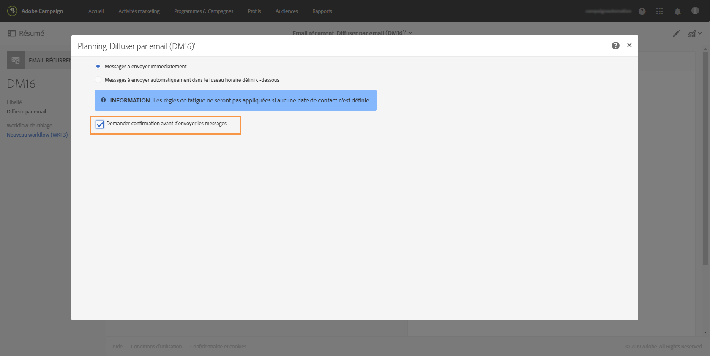

# Confirmer l'envoi{#confirming-the-send}

Une fois que la préparation de vos messages est terminée et que les étapes de validation ont été réalisées, vous pouvez démarrer l'envoi. Pour plus d'informations sur la préparation des messages, consultez la section [Préparer l'envoi](../../sending/using/preparing-the-send.md).

Seuls les utilisateurs qui détiennent le rôle **[!UICONTROL Démarrer des diffusions]** peuvent confirmer l'envoi. Voir à ce propos la section [Liste des rôles](../../administration/using/list-of-roles.md).

Le message suivant s'affiche pour les utilisateurs qui ne possèdent pas ce rôle :

Pour envoyer votre diffusion, cliquez sur le bouton **[!UICONTROL Confirmer l'envoi]** dans la barre d'actions du message.

Validez l'envoi en cliquant sur **[!UICONTROL OK]**.

Le message est en cours d'envoi.

>[!NOTE]
>
>Si le message est planifié, il sera envoyé à l'heure d'envoi. Pour plus d'informations sur la planification des messages, consultez [cette section](../../sending/using/about-scheduling-messages.md).

Si vous utilisez une diffusion récurrente sans période d'agrégation, vous pouvez demander confirmation avant l'envoi de la diffusion. Pour ce faire, ouvrez la zone **[!UICONTROL Planning]** du tableau de bord de diffusion, puis activez l'option dédiée.

La zone **[!UICONTROL Déploiement]** affiche la progression de l'envoi.

Lorsque le message est envoyé aux contacts, la zone **[!UICONTROL Déploiement]** affiche vos données d'indicateurs de performance clés (KPI) avec :

* le nombre de messages à envoyer,
* le nombre de messages envoyés,
* le pourcentage de messages délivrés,
* le pourcentage de bounces et d'erreurs,
* le pourcentage de messages ouverts,
* le pourcentage de clics dans les messages (pour les emails).

   >[!NOTE]
   >
   >Le **[!UICONTROL Taux d’ouverture]** et le **[!UICONTROL Taux de clics]** sont mis à jour toutes les heures.

Si les indicateurs de performance clés sont trop longs à se mettre à jour ou ne prennent pas en compte les résultats à partir des envois, cliquez sur le bouton **[!UICONTROL Calculer les statistiques]** dans la fenêtre **[!UICONTROL Déploiement]**.

Le message peut être visualisé dans l'historique d'un des profils clients faisant partie de l'audience. Voir à ce sujet la section [Profil client intégré](../../audiences/using/integrated-customer-profile.md).

Une fois un message envoyé, vous pouvez suivre le comportement des destinataires et le surveiller afin de mesurer son impact. Voir à ce propos les sections suivantes :

* [Tracker les messages](../../sending/using/tracking-messages.md)
* [Contrôler une diffusion](../../sending/using/monitoring-a-delivery.md)

