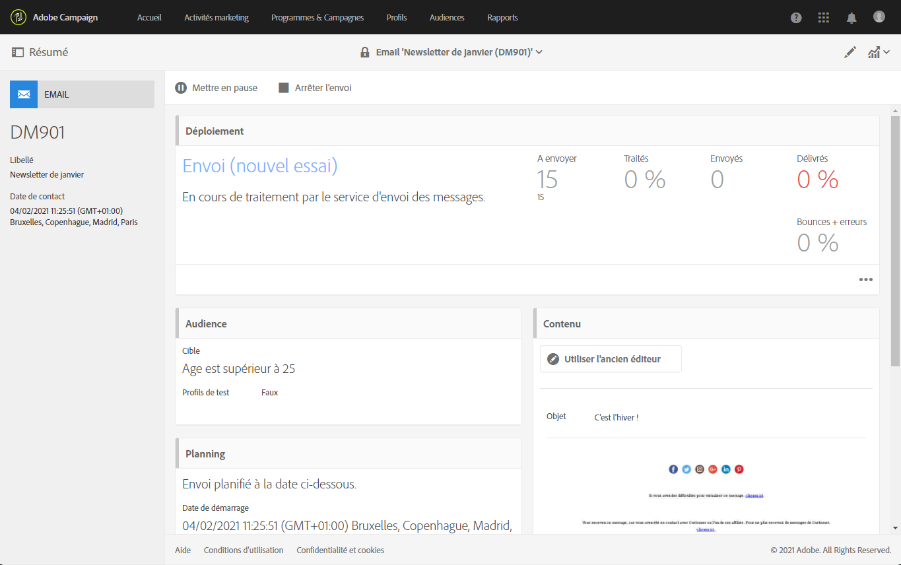
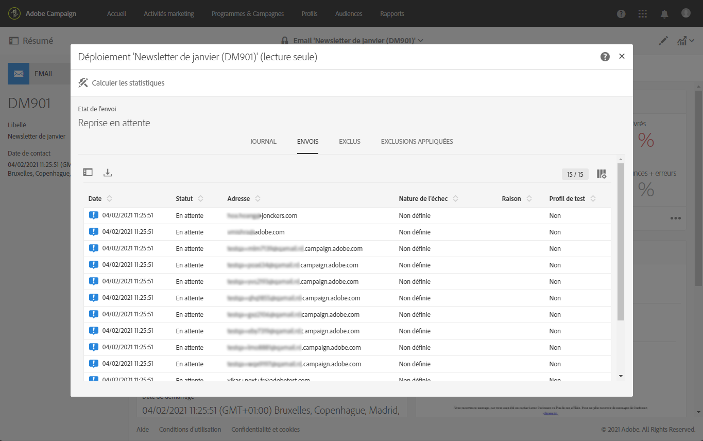

# Confirmer l&#39;envoi{#confirming-the-send}

Une fois que la préparation de vos messages est terminée et que les étapes de validation ont été réalisées, vous pouvez démarrer l&#39;envoi. Pour plus d&#39;informations sur la préparation des messages, consultez la section [Préparer l&#39;envoi](../../sending/using/preparing-the-send.md).

Seuls les utilisateurs qui détiennent le rôle **[!UICONTROL Démarrer des diffusions]** peuvent confirmer l&#39;envoi. Voir à ce propos la section [Liste des rôles](../../administration/using/list-of-roles.md).

<!--Users without this role will see the following message: 

-->

## Envoyer le message {#sending-message}

Une fois la préparation terminée, suivez les étapes ci-dessous pour envoyer votre message.

1. Cliquez sur le bouton **[!UICONTROL Confirmer l&#39;envoi]** situé dans la barre d&#39;actions du message.

   

1. Finalisez l’envoi en cliquant sur le bouton **[!UICONTROL OK]**.

   

1. Patientez pendant l’envoi du message. La zone **[!UICONTROL Déploiement]** affiche la progression de l&#39;envoi.

>[!NOTE]
>
>Si le message est planifié, il sera envoyé à l&#39;heure d&#39;envoi. Pour plus d&#39;informations sur la planification des messages, consultez [cette section](../../sending/using/about-scheduling-messages.md).

Si vous utilisez une diffusion récurrente sans période d&#39;agrégation, vous pouvez demander confirmation avant l&#39;envoi de la diffusion. Pour ce faire, lors de la configuration de votre message, ouvrez le bloc **[!UICONTROL Planification]** du tableau de bord de diffusion et activez l&#39;option dédiée.

## Présentation des indicateurs de message {#message-indicators}

Lorsque le message est envoyé aux contacts, la zone **[!UICONTROL Déploiement]** affiche vos données d&#39;indicateurs de performance clés (KPI) avec :

* le nombre de messages à envoyer,
* le nombre de messages envoyés,
* le pourcentage de messages délivrés,
* le pourcentage de bounces et d&#39;erreurs,
* le pourcentage de messages ouverts,
* le pourcentage de clics dans les messages (pour les emails).

   >[!NOTE]
   >
   >Le **[!UICONTROL Taux d&#39;ouverture]** et le **[!UICONTROL Taux de clics]** sont mis à jour toutes les heures.

Si la mise à jour des indicateurs de performance clés prend trop de temps ou ne prend pas en compte les résultats des journaux d&#39;envoi, cliquez sur le bouton **[!UICONTROL Calculer les statistiques]** dans la fenêtre **[!UICONTROL Déploiement]**.

Le message peut être affiché dans l’historique de l’un des profils ciblés. Voir à ce sujet la section [Profil client intégré](../../audiences/using/integrated-customer-profile.md).

Une fois qu’un message est envoyé, vous pouvez suivre le comportement de ses destinataires et le surveiller pour mesurer son impact. Voir à ce propos les sections suivantes :

* [Tracker les messages](../../sending/using/tracking-messages.md)
* [Contrôler une diffusion](../../sending/using/monitoring-a-delivery.md)

### Rapports de réussite de diffusion {#delivered-status-report}

>[!NOTE]
>
>Cette section s’applique uniquement aux canaux électroniques.

Dans la vue **[!UICONTROL Résumé]** de chaque courriel, le pourcentage **[!UICONTROL Livré]** début à 100 %, puis diminue progressivement tout au long de la diffusion [période de validité](../../administration/using/configuring-email-channel.md#validity-period-parameters), à mesure que les rebonds soft et hard sont rapportés<!--from the Enhanced MTA to Campaign-->.

En effet, tous les messages s&#39;affichent sous la forme **[!UICONTROL Envoyé]** dans les journaux d&#39;envoi [dès qu&#39;ils sont correctement relayés de Campaign vers l&#39;agent de transfert de messages amélioré. ](../../sending/using/monitoring-a-delivery.md#sending-logs) Ils restent dans ce statut à moins ou jusqu’à ce qu’un [rebond](../../sending/using/understanding-delivery-failures.md#delivery-failure-types-and-reasons) pour ce message soit communiqué de nouveau de la MTA améliorée à Campaign.

Lorsque les messages à rebond dur sont renvoyés à partir de la MTA améliorée, leur état passe de **[!UICONTROL Envoyé]** à **[!UICONTROL Échec]** et le pourcentage **[!UICONTROL Livré]** est réduit en conséquence.

Lorsque les messages rebondissant à l’écran sont renvoyés à partir de la MTA améliorée, ils apparaissent toujours sous la forme **[!UICONTROL Envoyé]** et le pourcentage **[!UICONTROL Livré]** n’est pas encore mis à jour. Les messages rebondissants sont ensuite [relancés](../../sending/using/understanding-delivery-failures.md#retries-after-a-delivery-temporary-failure) tout au long de la période de validité de la diffusion :

* Si une nouvelle tentative a réussi avant la fin de la période de validité, l’état du message reste **[!UICONTROL Envoyé]** et le pourcentage **[!UICONTROL Livré]** reste inchangé.

* Dans le cas contraire, l’état devient **[!UICONTROL Échec]** et le pourcentage **[!UICONTROL Livré]** est réduit en conséquence.

Par conséquent, vous devez attendre la fin de la période de validité pour voir le pourcentage final **[!UICONTROL Livré]** et le nombre final de **[!UICONTROL Envoyé]** et **[!UICONTROL Échec]**.

### Service de commentaires par courriel (bêta) {#email-feedback-service}

Grâce à la fonctionnalité de service de commentaires par courriel (EFS), l’état de chaque courriel est rapporté avec précision, car les commentaires sont capturés directement à partir de l’agent de transfert de messages amélioré.

>[!IMPORTANT]
>
>Le service de commentaires par courriel est actuellement disponible en version bêta.

Une fois la diffusion lancée, le pourcentage **[!UICONTROL Livré]** n’est plus modifié lorsque le message est relayé de Campaign vers la MTA améliorée.

Les logs de diffusion affichent le statut **[!UICONTROL En attente]** pour chaque adresse ciblée.

Lorsque le message est effectivement remis aux profils ciblés et que ces informations sont rapportées en temps réel à partir de la MTA améliorée, les logs de diffusion affichent l’état **[!UICONTROL Envoyé]** pour chaque adresse qui a reçu le message. Le pourcentage **[!UICONTROL Livré]** est augmenté en conséquence à chaque diffusion réussie.

Lorsque les messages à rebond dur sont renvoyés de la MTA améliorée, leur état de journal passe de **[!UICONTROL En attente]** à **[!UICONTROL Échec]** et le pourcentage **[!UICONTROL Rebonds + erreurs]** est augmenté en conséquence.

Lorsque les messages rebondissant à l’écran sont renvoyés de la MTA améliorée, leur état de journal passe également de **[!UICONTROL En attente]** à **[!UICONTROL Échec]** et le pourcentage **[!UICONTROL Rebonds + erreurs]** est augmenté en conséquence. Le pourcentage **[!UICONTROL Livré]** reste inchangé. Les messages rebondissants sont ensuite relancés tout au long de la [période de validité de la diffusion](../../administration/using/configuring-email-channel.md#validity-period-parameters) :

* Si une nouvelle tentative a réussi avant la fin de la période de validité, l’état du message passe à **[!UICONTROL Envoyé]** et le pourcentage **[!UICONTROL Livré]** est augmenté en conséquence.

* Sinon, l’état reste **[!UICONTROL Échec]**. Les pourcentages **[!UICONTROL Livrés]** et **[!UICONTROL Rebonds + erreurs]** restent inchangés.

>[!NOTE]
>
>Pour plus d’informations sur les rebonds durs et doux, voir [cette section](../../sending/using/understanding-delivery-failures.md#delivery-failure-types-and-reasons).
>
>Pour plus d’informations sur les Reprises après une défaillance temporaire d’une diffusion, voir [cette section](../../sending/using/understanding-delivery-failures.md#retries-after-a-delivery-temporary-failure).

<!--Soft-bouncing messages increment an error counter. When the error counter reaches the limit threshold or when the validity period is over, the address goes into quarantine and the status remains as **[!UICONTROL Failed]**. For more on conditions for sending an address to quarantine, see [this section](../../help/sending/using/understanding-quarantine-management.md#conditions-for-sending-an-address-to-quarantine).-->

### Modifications introduites par EFS {#changes-introduced-by-efs}

Le tableau ci-dessous présente les modifications des indicateurs de performance clés et l’état des journaux envoyés introduites par la fonctionnalité EFS.

| Etape du processus d’envoi   | Récapitulatif des IPC SANS EFS | Envoi du statut des journaux SANS EFS | Récapitulatif des IPC AVEC EFS | Envoi du statut des journaux AVEC EFS |
|--- |--- |--- | --- | --- |
| Le message est relayé de Campaign vers la MTA améliorée | <ul><li>**[!UICONTROL débuts en pourcentage]** distribués à 100 %</li><li>**[!UICONTROL Retours +]** taux d&#39;erreur - débuts de 0 %</li></ul> | Envoyés | <ul><li>**[!UICONTROL débuts en pourcentage]** distribués à 0 %</li><li>**[!UICONTROL Retours +]** taux d&#39;erreur - débuts de 0 %</li></ul> | En attente |
| Les messages à rebours différés sont renvoyés à partir de la MTA améliorée. | <ul><li>**[!UICONTROL Le pourcentage]** distribué est diminué en conséquence.</li><li>**[!UICONTROL Rebonds +]** pourcentage d&#39;erreurs sont augmentés en conséquence</li></ul> | En échec | <ul><li>Aucun changement dans le pourcentage **[!UICONTROL Livré]**</li><li>**[!UICONTROL Rebonds +]** pourcentage d&#39;erreurs sont augmentés en conséquence</li></ul> | En échec |
| Les messages rebondissant doucement sont renvoyés à partir de la MTA améliorée. | <ul><li>Aucun changement dans le pourcentage **[!UICONTROL Livré]**</li><li>Aucun changement dans le pourcentage **[!UICONTROL Retours + erreurs]**</li></ul> | Envoyés | <ul><li>Aucun changement dans le pourcentage **[!UICONTROL Livré]**</li><li>**[!UICONTROL Rebonds +]** pourcentage d&#39;erreurs sont augmentés en conséquence</li></ul> | En échec |
| Les Reprises de messages rebondissant doucement réussissent | <ul><li>Aucun changement dans le pourcentage **[!UICONTROL Livré]**</li><li>Aucun changement dans le pourcentage **[!UICONTROL Retours + erreurs]**</li></ul> | Envoyés | <ul><li>**[!UICONTROL Le pourcentage]** distribué est augmenté en conséquence.</li><li>**[!UICONTROL Rebonds +]** pourcentage d’erreurs sont diminués en conséquence.</li></ul> | Envoyés |
| Échec des Reprises de messages à rebond rapide | <ul><li>**[!UICONTROL Le pourcentage]** distribué est diminué en conséquence.</li><li>**[!UICONTROL Rebonds +]** pourcentage d&#39;erreurs sont augmentés en conséquence</li></ul> | En échec | <ul><li> Aucun changement dans le pourcentage **[!UICONTROL Livré]** </li><li> Aucun changement dans le pourcentage **[!UICONTROL Retours + erreurs]** </li></ul> | En échec |
