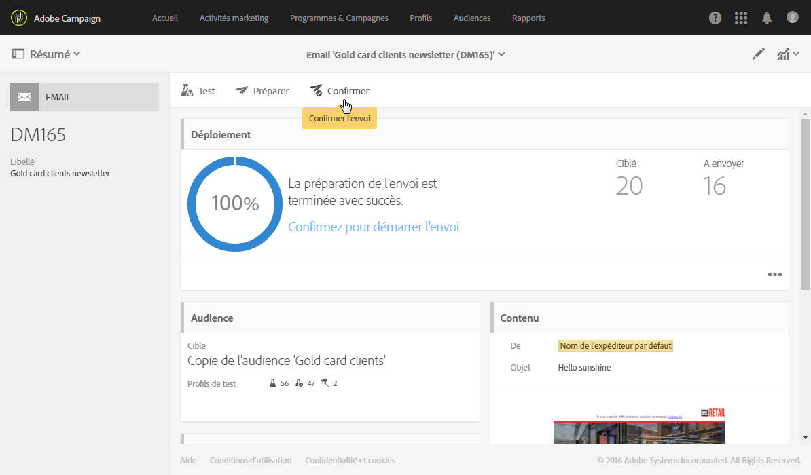

# Confirmer l&#39;envoi{#confirming-the-send}

Une fois que la préparation de vos messages est terminée et que les étapes de validation ont été réalisées, vous pouvez démarrer l&#39;envoi. Pour plus d&#39;informations sur la préparation des messages, consultez la section [Préparer l&#39;envoi](../../sending/using/preparing-the-send.md).

Seuls les utilisateurs qui détiennent le rôle **[!UICONTROL Démarrer des diffusions]** peuvent confirmer l’envoi. Pour plus d’informations, consultez la section [Liste des rôles](../../administration/using/list-of-roles.md).

<!--Users without this role will see the following message: 

-->

## Envoyer le message {#sending-message}

Une fois la préparation terminée, suivez les étapes ci-dessous pour envoyer votre message.

1. Cliquez sur le bouton **[!UICONTROL Confirmer l&#39;envoi]** situé dans la barre d&#39;actions du message.

   

1. Finalisez l’envoi en cliquant sur le bouton **[!UICONTROL OK]**.

   

1. Patientez pendant l’envoi du message. La zone **[!UICONTROL Déploiement]** affiche la progression de l&#39;envoi.

>[!NOTE]
>
>Si le message est planifié, il sera envoyé à l’heure d’envoi. Pour plus d’informations sur la planification des messages, consultez [cette section](../../sending/using/about-scheduling-messages.md).

Si vous utilisez une diffusion récurrente sans période d&#39;agrégation, vous pouvez demander confirmation avant l&#39;envoi de la diffusion. Pendant la configuration de votre message, ouvrez la zone **[!UICONTROL Planifier]** du tableau de bord de diffusion, puis activez l’option dédiée.

## Comprendre les indicateurs de message {#message-indicators}

Lorsque le message est envoyé aux contacts, la zone **[!UICONTROL Déploiement]** affiche vos données de KPI avec :

* le nombre de messages à envoyer,
* le nombre de messages envoyés,
* le pourcentage de messages délivrés,
* le pourcentage de bounces et d&#39;erreurs,
* le pourcentage de messages ouverts,
* le pourcentage de clics dans les messages (pour les emails).

   >[!NOTE]
   >
   >Le **[!UICONTROL Taux d&#39;ouverture]** et le **[!UICONTROL Taux de clics]** sont mis à jour toutes les heures.

Si les KPI sont trop longs à se mettre à jour ou ne prennent pas en compte les résultats à partir des logs d’envoi, cliquez sur le bouton **[!UICONTROL Calculer les statistiques]** dans la fenêtre **[!UICONTROL Déploiement]**.

Le message peut être affiché dans l’historique de l’un des profils ciblés. Voir à ce sujet la section [Profil client intégré](../../audiences/using/integrated-customer-profile.md).

Une fois un message envoyé, vous pouvez suivre le comportement des destinataires et le surveiller pour mesurer son impact. Pour plus d’informations, consultez les sections suivantes :

* [Tracker les messages](../../sending/using/tracking-messages.md)
* [Contrôler une diffusion](../../sending/using/monitoring-a-delivery.md)

### Rapports de réussite de diffusion {#delivered-status-report}

>[!NOTE]
>
>Cette section s’applique uniquement au canal email.

Dans la vue **[!UICONTROL Résumé]** de chaque email, le pourcentage **[!UICONTROL Délivrés]** débute à 100 %, puis diminue progressivement tout au long de la [période de validité](../../administration/using/configuring-email-channel.md#validity-period-parameters) de la diffusion, à mesure que les soft et hard bounces sont renvoyés<!--from the Enhanced MTA to Campaign-->.

En effet, tous les messages s&#39;affichent comme **[!UICONTROL Envoyés]** dans les [logs d&#39;envoi](../../sending/using/monitoring-a-delivery.md#sending-logs) dès qu&#39;ils sont correctement relayés de Campaign vers le MTA (Message Transfer Agent) amélioré. Ils restent dans cet état à moins ou jusqu’à ce qu’un [bounce](../../sending/using/understanding-delivery-failures.md#delivery-failure-types-and-reasons) pour ce message soit communiqué de nouveau de la MTA améliorée à Campaign.

Lorsque les messages hard bounce sont renvoyés du MTA amélioré, leur état passe de **[!UICONTROL Envoyés]** à **[!UICONTROL En échec]** et le pourcentage **[!UICONTROL Délivrés]** diminue en conséquence.

Lorsque les messages soft bounce sont renvoyés du MTA amélioré, ils apparaissent toujours comme **[!UICONTROL Envoyés]** et le pourcentage **[!UICONTROL Délivrés]** n&#39;est pas encore mis à jour. L&#39;envoi des messages soft bounce fait ensuite l&#39;objet de [reprises](../../sending/using/understanding-delivery-failures.md#retries-after-a-delivery-temporary-failure) tout au long de la période de validité de la diffusion :

* Si une reprise est effectuée avec succès avant la fin de la période de validité, l&#39;état du message reste **[!UICONTROL Envoyés]** et le pourcentage **[!UICONTROL Délivrés]** reste le même.

* Dans le cas contraire, l&#39;état devient **[!UICONTROL En échec]** et le pourcentage **[!UICONTROL Délivrés]** diminue en conséquence.

Par conséquent, vous devez attendre la fin de la période de validité pour voir le pourcentage **[!UICONTROL Délivrés]** final ainsi que le nombre final de messages réellement **[!UICONTROL Envoyés]** et **[!UICONTROL En échec]**.

### Service de commentaires par email (bêta) {#email-feedback-service}

Grâce à la fonctionnalité Service de commentaires par email (EFS), l&#39;état de chaque email est signalé avec précision, car les commentaires sont capturés directement depuis le MTA (Message Tranfer Agent) amélioré.

>[!IMPORTANT]
>
>Le service de commentaires par email est actuellement disponible en version bêta.

Une fois la diffusion lancée, le pourcentage **[!UICONTROL Délivrés]** n&#39;est plus modifié lorsque le message est relayé avec succès de Campaign vers le MTA amélioré.

Les logs de diffusion affichent l&#39;état **[!UICONTROL En attente]** pour chaque adresse ciblée.

Lorsque le message est effectivement diffusé aux profils ciblés et que ces informations sont renvoyées en temps réel depuis le MTA amélioré, les logs de diffusion affichent le statut **[!UICONTROL Envoyés]** pour chaque adresse ayant reçu le message avec succès. Le pourcentage **[!UICONTROL Délivrés]** augmente en conséquence lorsqu&#39;une diffusion est effectuée avec succès.

Lorsque les messages hard bounce sont renvoyés du MTA amélioré, leur état de log passe de **[!UICONTROL En attente]** à **[!UICONTROL En échec]** et le pourcentage **[!UICONTROL Bounces + erreurs]** augmente en conséquence.

Lorsque les messages soft bounce sont renvoyés du MTA amélioré, leur état de log passe également de **[!UICONTROL En attente]** à **[!UICONTROL En échec]** et le pourcentage **[!UICONTROL Bounces + erreurs]** augmente en conséquence. Le pourcentage **[!UICONTROL Délivrés]** reste inchangé. L&#39;envoi des messages soft bounce fait ensuite l&#39;objet de reprises tout au long de la [période de validité](../../administration/using/configuring-email-channel.md#validity-period-parameters) de la diffusion :

* Si une reprise est effectuée avec succès avant la fin de la période de validité, l’état du message passe à **[!UICONTROL Envoyés]** et le pourcentage **[!UICONTROL Délivrés]** augmente en conséquence.

* Sinon, l&#39;état reste **[!UICONTROL En échec]**. Les pourcentages **[!UICONTROL Délivrés]** et **[!UICONTROL Bounces + erreurs]** restent inchangés.

>[!NOTE]
>
>Pour plus d&#39;informations sur les hard et soft bounces, voir [cette section](../../sending/using/understanding-delivery-failures.md#delivery-failure-types-and-reasons).
>
>Pour plus d&#39;informations sur les reprises après une diffusion temporairement en échec, voir [cette section](../../sending/using/understanding-delivery-failures.md#retries-after-a-delivery-temporary-failure).

<!--Soft-bouncing messages increment an error counter. When the error counter reaches the limit threshold or when the validity period is over, the address goes into quarantine and the status remains as **[!UICONTROL Failed]**. For more on conditions for sending an address to quarantine, see [this section](../../help/sending/using/understanding-quarantine-management.md#conditions-for-sending-an-address-to-quarantine).-->

### Modifications ajoutées par le service EFS {#changes-introduced-by-efs}

Les tableaux ci-dessous présentent les modifications des KPI et des statuts des logs d’envoi ajoutées par la fonctionnalité EFS.

**Avec le service de commentaires par email**

| Étape du processus d’envoi | Récapitulatif des KPI | Statut des logs d’envoi |
|--- |--- |--- |
| Le message est relayé avec succès de Campaign vers le MTA amélioré | <ul><li>Le pourcentage **[!UICONTROL Délivrés]** commence à 0 %</li><li>Le pourcentage **[!UICONTROL Bounces + erreurs]** commence à 0 %</li></ul> | En attente |
| Les messages hard bounce sont renvoyés du MTA amélioré. | <ul><li>Aucun changement du pourcentage **[!UICONTROL Délivrés]**</li><li>Le pourcentage **[!UICONTROL Bounces + erreurs]** augmente en conséquence</li></ul> | En échec |
| Les messages soft bounce sont renvoyés du MTA amélioré. | <ul><li>Aucun changement du pourcentage **[!UICONTROL Délivrés]**</li><li>Le pourcentage **[!UICONTROL Bounces + erreurs]** augmente en conséquence</li></ul> | En échec |
| Les reprises des messages soft bounce sont effectuées avec succès | <ul><li>Le pourcentage **[!UICONTROL Diffusés]** augmente en conséquence</li><li>Le pourcentage **[!UICONTROL Bounces + erreurs]** diminue en conséquence</li></ul> | Envoyés |
| Échec des reprises des messages soft bounce | <ul><li> Aucun changement du pourcentage **[!UICONTROL Délivrés]** </li><li> Aucun changement du pourcentage **[!UICONTROL Bounces + erreurs]** </li></ul> | En échec |

**Sans le service de commentaires par email**

| Étape du processus d’envoi | Récapitulatif des KPI | Statut des logs d’envoi |
|--- |--- |--- |
| Le message est relayé avec succès de Campaign vers le MTA amélioré | <ul><li>Le pourcentage **[!UICONTROL Délivrés]** commence à 100 %</li><li>Le pourcentage **[!UICONTROL Bounces + erreurs]** commence à 0 %</li></ul> | Envoyés |
| Les messages hard bounce sont renvoyés du MTA amélioré. | <ul><li>Le pourcentage **[!UICONTROL Délivrés]** diminue en conséquence.</li><li>Le pourcentage **[!UICONTROL Bounces + erreurs]** augmente en conséquence</li></ul> | En échec |
| Les messages soft bounce sont renvoyés du MTA amélioré. | <ul><li>Aucun changement du pourcentage **[!UICONTROL Délivrés]**</li><li>Aucun changement du pourcentage **[!UICONTROL Bounces + erreurs]**</li></ul> | Envoyés |
| Les reprises des messages soft bounce sont effectuées avec succès | <ul><li>Aucun changement du pourcentage **[!UICONTROL Délivrés]**</li><li>Aucun changement du pourcentage **[!UICONTROL Bounces + erreurs]**</li></ul> | Envoyés |
| Échec des reprises des messages soft bounce | <ul><li>Le pourcentage **[!UICONTROL Délivrés]** diminue en conséquence.</li><li>Le pourcentage **[!UICONTROL Bounces + erreurs]** augmente en conséquence</li></ul> | En échec |
