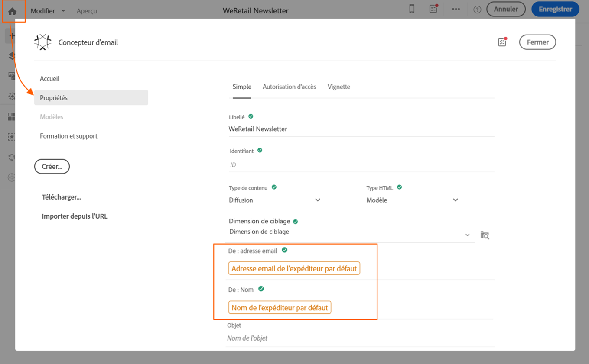

# Contrôle du contenu des emails{#control-email-content}

Pour augmenter le taux de délivrabilité de vos emails et qu&#39;ils parviennent à vos destinataires, l&#39;email doit suivre un certain nombre de règles.

* **Le nom et l&#39;adresse de l&#39;expéditeur** : l&#39;adresse doit identifier explicitement l&#39;expéditeur qui doit être propriétaire du domaine et l&#39;avoir enregistré. Le registre du domaine ne doit pas être privatisé.
* **L&#39;objet** : évitez les majuscules, la ponctuation et les mots fréquemment utilisés par les spammers (« gagner », « gratuit », etc.).
* **Personnalisez votre email** : personnaliser l&#39;email augmente les chances d&#39;ouverture de votre message.
* **Les images et le texte** : respectez un ratio texte/images correct (60% de texte et 40% d&#39;images).
* **Le lien et la landing page de désinscription** : le lien de désinscription est indispensable, il doit être visible, valide et le formulaire fonctionnel.
* **Utilisez les outils** proposés par Adobe Campaign pour optimiser le contenu de votre email (analyse de diffusion, analyse anti-spam).

Pour plus d&#39;informations sur la modification du contenu des emails, consultez la [présentation du Concepteur d&#39;email](../../designing/using/designing-content-in-adobe-campaign.md) et les [bonnes pratiques de conception de messages](../../designing/using/designing-content-in-adobe-campaign.md#content-design-best-practices).

## Nom et adresse de l&#39;expéditeur {#sender-name}

Certains FAI vérifient la validité de l&#39;adresse d&#39;expéditeur (From) avant d&#39;accepter les messages. Une adresse erronée peut causer un refus de la part du serveur receveur. Il faut s&#39;assurer qu&#39;une adresse correcte est bien renseignée au niveau de l&#39;instance ou dans les scénarios les plus couramment utilisés. Contactez votre administrateur.

Voir à ce propos la section [Personnaliser le nom de l&#39;expéditeur](../../designing/using/personalization.md#personalizing-the-sender).

## Optimisation de l&#39;heure d&#39;envoi {#send-time-optimization}

Pour améliorer le taux de succès de vos messages, vous pouvez définir manuellement une heure d&#39;envoi par destinataire. Dans la mesure du possible, chaque profil recevra le message à la date et à l&#39;heure spécifiées.

Voir à ce propos la section [Optimiser l&#39;heure d&#39;envoi](../../sending/using/optimizing-the-sending-time.md).

## Lien et formulaire de désinscription {#opt-out}

Par défaut, une règle de typologie vérifie au moment de l&#39;analyse qu&#39;un lien de désinscription est bien présent dans le contenu d&#39;une diffusion et génère un avertissement en cas d&#39;absence.

Il faut vérifier du début à la fin le bon fonctionnement du lien de désinscription avant chaque envoi. Par exemple, lors de l&#39;envoi du BAT, vérifiez que le lien est valide, que le formulaire est en ligne et que sa validation active bien les cases Ne plus contacter cette personne. Cette vérification doit être systématique car on ne peut pas exclure une erreur humaine dans la saisie du lien ou dans la modification du formulaire.

Au cas où un problème empêchant la désinscription ne serait détecté qu&#39;après le démarrage de la diffusion, il sera toutefois possible de désinscrire manuellement (à l&#39;aide d&#39;une mise à jour en masse, par exemple) les destinataires qui ont cliqué sur le lien de désinscription, même s&#39;ils n&#39;ont pas pu ou voulu confirmer ce choix.

Sauf dans des cas particuliers, il ne faut pas tenter de freiner la désinscription en demandant à l&#39;utilisateur de remplir certains champs comme l&#39;email, le nom, etc. La landing page de désinscription ne devra comprendre qu&#39;un seul bouton de validation. Demander une confirmation supplémentaire de l&#39;email n&#39;est pas fiable : il se peut qu&#39;une même personne possède deux adresses email redirigées vers la même boîte (par exemple, prenom.nom@club.fr et prenom.nom@club-internet.fr). Si ce profil ne se souvient que de la première adresse et qu&#39;il souhaite se désinscrire via un message envoyé à la seconde, le formulaire refusera la modification, car l&#39;identifiant crypté et l&#39;email saisi ne correspondent pas.

## Analyse anti-spam {#anti-spam-analysis}

L&#39;éditeur de messages d&#39;Adobe Campaign intègre une **Analyse anti-spam** qui permet d&#39;attribuer un score aux emails afin de déterminer si un message risque d&#39;être considéré comme indésirable par les outils anti-spam utilisés à sa réception. Voir à ce propos la section [Prévisualiser un message](../../sending/using/previewing-messages.md).

Dans l&#39;éditeur de contenus des messages, cliquez sur **[!UICONTROL Prévisualiser]**. Un message vous avertit si l&#39;analyse anti-spam a détecté un risque élevé pour le message. Pour afficher les détails, cliquez sur **[!UICONTROL Analyse anti-spam]**.

## Vérification de la réactivité des messages {#message-responsiveness}

Avant d&#39;envoyer votre message, vous pouvez vérifier son aspect sur différents appareils. Vous vous assurez ainsi que son affichage sera optimal sur divers clients web, webmails et appareils.

Pour vous aider, Adobe Campaign capture le rendu et le rend disponible dans un rapport dédié. Vous pouvez visualiser l&#39;affichage du message envoyé dans les différents contextes de réception.

Voir à ce propos la section [Rendu des emails](../../sending/using/email-rendering.md).

