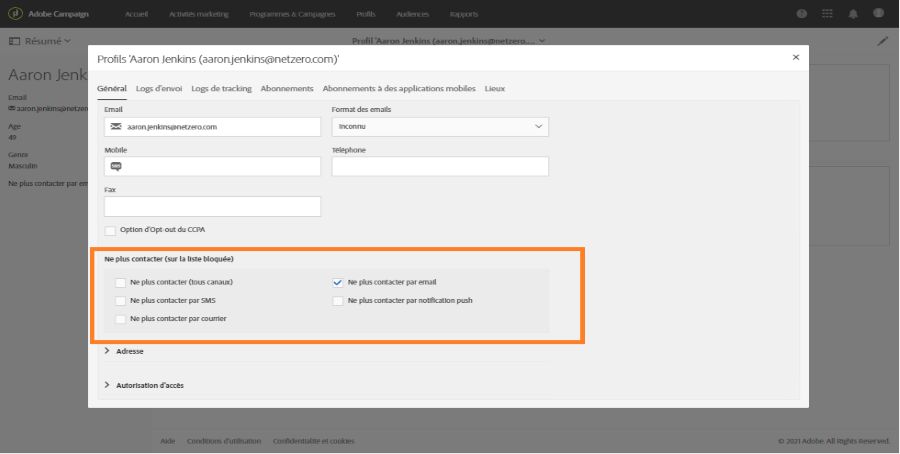

# Contrôle du contenu des emails{#control-email-content}

<!--TO KEEP because specific to Campaign-->

Pour que vos courriels atteignent vos destinataires et améliorent le taux de livraison de vos courriels, ils doivent respecter un certain nombre de règles. Sinon, le contenu de certains messages peut être détecté comme indésirable. Adobe Campaign fournit plusieurs outils pour que votre contenu respecte ces règles.

Suivez les principes ci-dessous lors de la conception du contenu de votre message :

* [Nom et adresse](#sender-name) de l&#39;expéditeur : l&#39;adresse doit identifier explicitement l&#39;expéditeur. Le domaine doit être détenu par l&#39;expéditeur et enregistré auprès de celui-ci. Le registre des domaines ne doit pas être privatisé.

   <!--**Subject**: Avoid excessive capitalization and punctuation, and words that are frequently used by spammers ("Win", "Free", etc.).-->
* [Personnalisation et optimisation](#perso-send-time-optimization) du temps d’envoi : la personnalisation du contenu et la définition d’une heure d’envoi par destinataire augmentent les chances d’ouverture de votre message.
* Images et texte : respectez un rapport texte/image correct (par exemple, 60 % de texte et 40 % d’images).
* [Désinscription ](#opt-out) linkand landing page : le lien désinscription est essentiel. Il doit être visible et valide et le formulaire doit être fonctionnel.
* Prévisualisation : utilisez les outils proposés par Adobe Campaign pour vérifier et optimiser le contenu de votre courrier électronique ([analyse antispam](#anti-spam-analysis), [Rendu du courrier électronique](#message-responsiveness)).

Pour obtenir des conseils supplémentaires sur l&#39;optimisation de la délivrabilité lors de la conception de contenu, consultez le [Guide des meilleures pratiques en matière de délivrabilité des Adobes](https://experienceleague.adobe.com/docs/deliverability-learn/deliverability-best-practice-guide/content-best-practices-for-optimal-delivery.html).

>[!NOTE]
>
>Pour plus d&#39;informations sur la modification du contenu des courriels, consultez les [Présentation du Concepteur de courriels](../../designing/using/designing-content-in-adobe-campaign.md) et les [meilleures pratiques de conception des messages](../../designing/using/designing-content-in-adobe-campaign.md#content-design-best-practices).

## Nom et adresse de l&#39;expéditeur {#sender-name}

Certains FAI vérifient la validité de l&#39;adresse de l&#39;expéditeur (**[!UICONTROL From]**) avant d&#39;accepter les messages. Une adresse mal formée peut entraîner son rejet par le serveur de réception.

Il faut s&#39;assurer qu&#39;une adresse correcte est bien renseignée au niveau de l&#39;instance ou dans les scénarios les plus couramment utilisés. Pour ce faire, contactez votre administrateur.

Pour plus d’informations sur ce sujet, voir [Définition de l’expéditeur de courrier électronique d’un courrier électronique](../../designing/using/subject-line.md#email-sender).

## Personnalisation et optimisation du temps d&#39;envoi {#perso-send-time-optimization}

Pour améliorer l’expérience de vos destinataires et les faire ouvrir, Adobe Campaign vous permet de personnaliser vos messages. Voir à ce propos [cette section](../../designing/using/personalization.md).

Pour augmenter le taux d&#39;ouverture de vos messages, vous pouvez également définir manuellement une heure d&#39;envoi par destinataire. Dans la mesure du possible, chaque profil recevra le message à la date et à l&#39;heure spécifiées. Voir à ce propos la section [Optimiser l&#39;heure d&#39;envoi](../../sending/using/optimizing-the-sending-time.md).

## Lien et formulaire de désinscription {#opt-out}

Par défaut, une règle de typologie vérifie au moment de l&#39;analyse qu&#39;un lien de désinscription est bien présent dans le contenu d&#39;une diffusion et génère un avertissement en cas d&#39;absence. Pour plus d&#39;informations sur la gestion des liens, consultez [cette section](../../designing/using/links.md).

Il faut vérifier du début à la fin le bon fonctionnement du lien de désinscription avant chaque envoi. Par exemple, lorsque [envoie le BAT](../../sending/using/sending-proofs.md), assurez-vous que le lien est valide, que le formulaire est en ligne et que la validation de cette opération vérifie les zones **[!UICONTROL Ne plus contacter]**. Cette vérification doit être systématique car on ne peut pas exclure une erreur humaine dans la saisie du lien ou dans la modification du formulaire. Pour plus d’informations sur la gestion de l’inclusion et de l’exclusion, voir [cette section](../../audiences/using/managing-opt-in-and-opt-out-in-campaign.md).

Au cas où un problème empêchant la désinscription ne serait détecté qu&#39;après le démarrage de la diffusion, il sera toutefois possible de désinscrire manuellement (à l&#39;aide d&#39;une mise à jour en masse, par exemple) les destinataires qui ont cliqué sur le lien de désinscription, même s&#39;ils n&#39;ont pas pu ou voulu confirmer ce choix.

En règle générale, vous ne devriez pas essayer de gêner les destinataires qui souhaitent s’exclure en leur demandant de remplir des champs tels que leur adresse électronique ou leur nom, par exemple. Le landing page de désinscription ne doit comporter qu’un seul bouton de validation.

La demande de confirmation supplémentaire n&#39;est pas fiable : un utilisateur peut voir deux adresses électroniques redirigées vers la même zone (par exemple : firstname.lastname@club.com et firstname.lastname@internet-club.com). Si le profil est capable de se souvenir de la première adresse seulement et souhaite se désabonner via un message envoyé à l&#39;autre, le formulaire refusera cette adresse car l&#39;identifiant chiffré et l&#39;adresse électronique saisie ne correspondent pas.

## Analyse anti-spam {#anti-spam-analysis}

L&#39;éditeur de messages d&#39;Adobe Campaign intègre une **Analyse anti-spam** qui permet d&#39;attribuer un score aux emails afin de déterminer si un message risque d&#39;être considéré comme indésirable par les outils anti-spam utilisés à sa réception. Voir à ce propos la section [Prévisualiser un message](../../sending/using/previewing-messages.md).

Dans l&#39;éditeur de contenus des messages, cliquez sur **[!UICONTROL Prévisualiser]**. Un message vous avertit si l&#39;analyse anti-spam a détecté un risque élevé pour le message. Pour afficher les détails, cliquez sur **[!UICONTROL Analyse anti-spam]**.

## Rendu des emails {#message-responsiveness}

Avant d&#39;envoyer votre message, vous pouvez tester la réactivité de votre message en vérifiant à quoi ressemblera votre message sur différents périphériques. Vous vous assurez ainsi que son affichage sera optimal sur divers clients web, webmails et appareils.

Pour vous aider, Adobe Campaign capture le rendu et le rend disponible dans un rapport dédié. Vous pouvez visualiser l&#39;affichage du message envoyé dans les différents contextes de réception.

Voir à ce propos la section [Rendu des emails](../../sending/using/email-rendering.md).