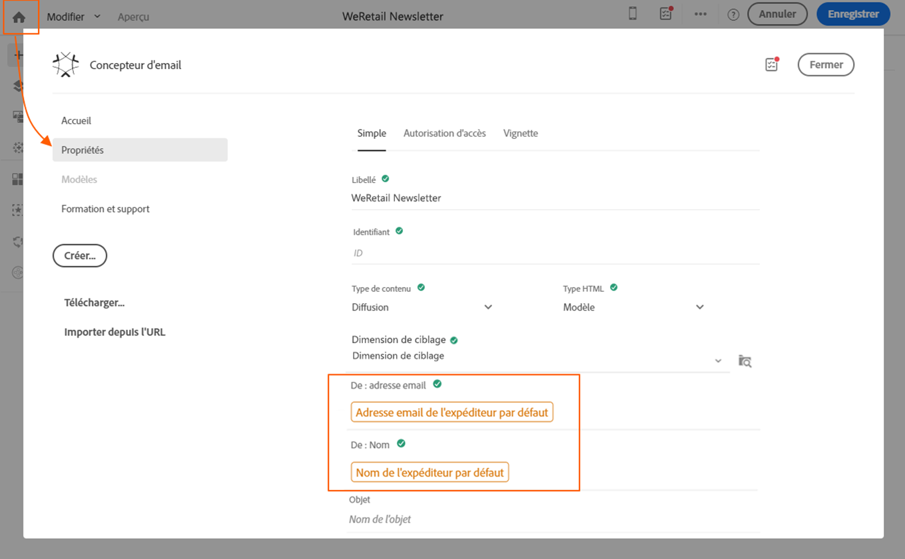
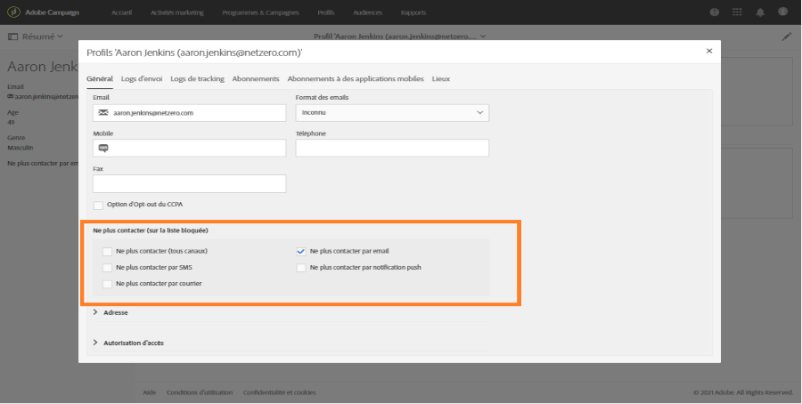
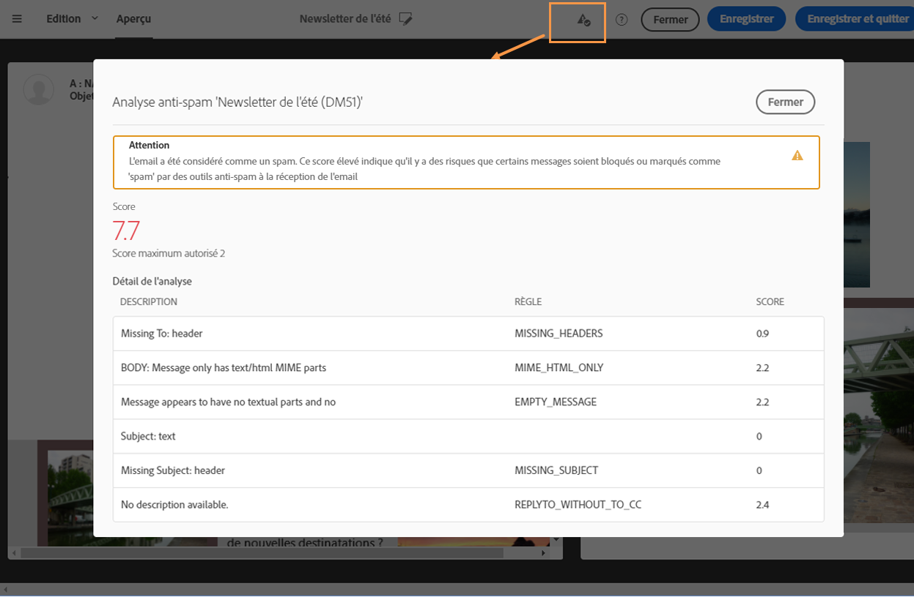
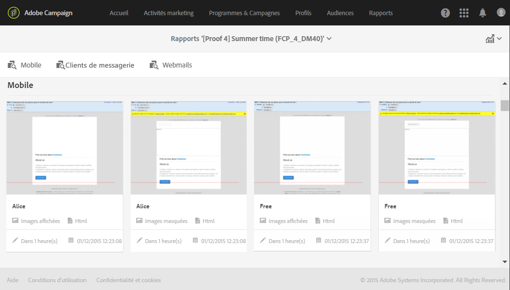

# Contrôle du contenu des e-mails{#control-email-content}

<!--TO KEEP because specific to Campaign-->

Pour que vos emails atteignent vos destinataires et améliorer ainsi leur taux de délivrabilité, assurez-vous qu’ils respectent un certain nombre de règles. Dans le cas contraire, le contenu de certains messages peut être détecté comme du spam. Adobe Campaign fournit plusieurs outils vous permettant de vérifier que votre contenu respecte ces règles.

Suivez les principes ci-dessous lors de la conception du contenu de votre message :

* [Nom et adresse de l’expéditeur ou de l’expéditrice](#sender-name) : l’adresse doit identifier explicitement l’expéditeur ou l’expéditrice. Le domaine doit appartenir à l’expéditeur et être enregistré auprès de lui. Le registre des domaines ne doit pas être privatisé.
  <!--**Subject**: Avoid excessive capitalization and punctuation, and words that are frequently used by spammers ("Win", "Free", etc.).-->
* [Personnalisation et optimisation de l’heure d’envoi](#perso-send-time-optimization) : la personnalisation du contenu et la définition d’une heure d’envoi par destinataire augmentent les chances d’ouverture de votre message.
* Images et texte : respectez un ratio texte/images correct (par exemple, 60 % de texte et 40 % d’images).
* [Lien de désinscription](#opt-out) et page de destination correspondante : le lien de désinscription est indispensable. Il doit être visible et valide, et le formulaire doit être fonctionnel.
* Prévisualisation : utilisez les outils fournis par Adobe Campaign pour vérifier et optimiser le contenu de votre e-mail ([Analyse anti-spam](#anti-spam-analysis), [Rendu des e-mails](#message-responsiveness)).

Pour obtenir des conseils supplémentaires sur l’optimisation de la délivrabilité lors de la conception du contenu, consultez le [Guide des bonnes pratiques relatives à la délivrabilité d’Adobe](https://experienceleague.adobe.com/docs/deliverability-learn/deliverability-best-practice-guide/content-best-practices-for-optimal-delivery.html?lang=fr).

>[!NOTE]
>
>Pour plus d’informations sur la modification du contenu des emails, consultez la [Présentation du concepteur d’e-mail](../../designing/using/designing-content-in-adobe-campaign.md) et les [Bonnes pratiques de conception de messages](../../designing/using/designing-content-in-adobe-campaign.md#content-design-best-practices).

## Nom et adresse de l’expéditeur {#sender-name}

Certains FAI vérifient la validité de l’adresse d’expédition (**[!UICONTROL De]**) avant d’accepter les messages. Une adresse erronée peut causer un refus de la part du serveur receveur.

Assurez-vous qu’une adresse correcte est bien renseignée au niveau de l’instance ou dans les scénarios les plus couramment utilisés. Pour ce faire, contactez votre administrateur.

Pour plus d’informations à ce sujet, consultez la section [Définition de l’expéditeur d’un email](../../designing/using/subject-line.md#email-sender).

## Personnalisation et optimisation de l’heure d’envoi {#perso-send-time-optimization}

Pour améliorer l’expérience de vos destinataires et les inciter à ouvrir votre email, Adobe Campaign vous permet de personnaliser vos messages. Voir à ce propos [cette section](../../designing/using/personalization.md).

Pour améliorer le taux d’ouverture de vos messages, vous pouvez également définir manuellement une heure d’envoi par destinataire. Dans la mesure du possible, chaque profil recevra le message à la date et à l’heure spécifiées. Pour plus d&#39;informations, consultez la section [Optimiser l&#39;heure d&#39;envoi](../../sending/using/optimizing-the-sending-time.md).

## Lien et formulaire d’opt-out {#opt-out}

Par défaut, une règle de typologie vérifie au moment de l’analyse du message qu’un lien d’opt-out est bien présent dans le contenu d’une diffusion et génère un avertissement en cas d’absence. Pour plus d’informations sur la gestion des liens, consultez [cette section](../../designing/using/links.md).

Vous devez vérifier le bon fonctionnement du lien d&#39;opt-out avant chaque envoi. Par exemple, lors de l’[envoi du BAT](../../sending/using/sending-proofs.md), assurez-vous que le lien est valide, que le formulaire est en ligne et que sa validation active bien les cases **[!UICONTROL Ne plus contacter]**. Cette vérification doit être systématique, car on ne peut pas exclure une erreur humaine dans la saisie du lien ou dans la modification du formulaire. Pour plus d’informations sur la gestion de l’opt-in et de l’opt-out, consultez [cette section](../../audiences/using/managing-opt-in-and-opt-out-in-campaign.md).

Au cas où un problème empêchant l’exclusion ne serait détecté qu’après le démarrage de la diffusion, il sera toutefois possible d’exclure manuellement (à l’aide d’une mise à jour en masse, par exemple) les destinataires qui ont cliqué sur le lien d’opt-out, même s’ils n’ont pas pu confirmer ce choix.

De manière générale, n’essayez pas de faire obstacle aux destinataires qui souhaitent se désinscrire en leur demandant de remplir des champs tels que leur adresse e-mail ou leur nom, par exemple. La landing page de désinscription ne doit comporter qu’un seul bouton de validation.

Demander une confirmation supplémentaire n’est pas fiable, car un utilisateur peut disposer de deux adresses email redirigées vers la même boîte (par exemple : prénom.nom@club.com et prénom.nom@internet-club.com). Si le profil est capable de se souvenir uniquement de la première adresse et souhaite se désinscrire via un message envoyé à l’autre, le formulaire refusera cette adresse, car l’identifiant chiffré et l’adresse e-mail saisie ne correspondront pas.

## Analyse anti-spam {#anti-spam-analysis}

L&#39;éditeur de messages d&#39;Adobe Campaign intègre une **Analyse anti-spam** qui permet d&#39;attribuer un score aux emails afin de déterminer si un message risque d&#39;être considéré comme indésirable par les outils anti-spam utilisés à sa réception. Pour plus d&#39;informations, consultez la section [Prévisualiser un message](../../sending/using/previewing-messages.md).

Dans l’éditeur de contenu du message, cliquez sur **[!UICONTROL Aperçu]**. Un message vous avertit si l’analyse anti-spam a détecté un risque élevé pour le message. Cliquez sur **[!UICONTROL Analyse anti-spam]** pour afficher les détails.

## Rendu des e-mails {#message-responsiveness}

Avant d’envoyer votre message, vous pouvez tester sa réactivité en vérifiant son apparence sur différents appareils. Vous vous assurez ainsi que son affichage sera optimal sur divers clients web, webmails et appareils.

Pour permettre cette opération, Adobe Campaign capture le rendu et le rend disponible dans un rapport dédié. Vous pouvez ainsi prévisualiser le message envoyé dans les différents contextes de réception.

Pour plus d’informations, consultez la section [Rendu des e-mails](../../sending/using/email-rendering.md).
