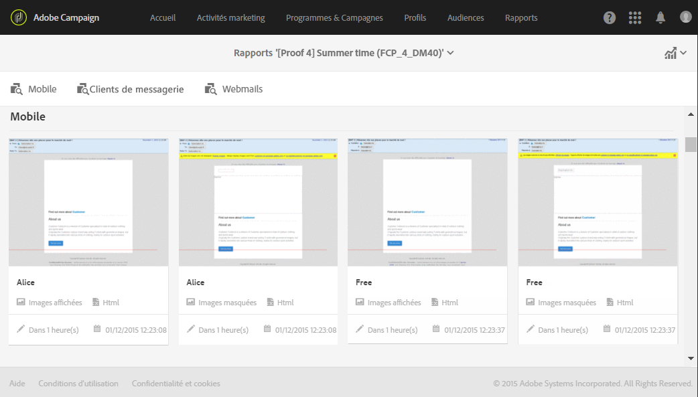

# Contrôle du contenu des courriers électroniques{#control-email-content}

Pour améliorer le taux de remise des courriers électroniques et veiller à ce que vos courriers électroniques parviennent à vos destinataires, ces derniers doivent respecter un certain nombre de règles.

* **Nom et adresse** de l'expéditeur : L'adresse doit identifier explicitement l'expéditeur. Le domaine doit être détenu et enregistré par l'expéditeur. Le registre des domaines ne doit pas être privatisé.
* **Objet**: Evitez les majuscules et les mots fréquemment utilisés par les spammeurs ("Win", "Free", etc.).
* **Personnalisez votre adresse électronique**: La personnalisation du courrier électronique augmente les chances d’ouverture du message.
* **Images et texte**: Respectez un rapport texte/image correct (par exemple, 60 % du texte et 40 % des images).
* **Lien de désabonnement et page** d’entrée : Le lien de désabonnement est essentiel. Il doit être visible et valide et le formulaire doit être fonctionnel.
* **Utilisez les outils** proposés par Adobe Campaign pour optimiser le contenu de votre courrier électronique (analyse de diffusion, analyse antispam).

Pour plus d’informations sur la modification du contenu d’un courrier électronique, consultez la présentation [du concepteur de](../../designing/using/designing-content-in-adobe-campaign.md) courrier électronique et les bonnes pratiques [en matière de conception de](../../designing/using/overview.md#content-design-best-practices)message.

## Nom et adresse de l’expéditeur {#sender-name}

Certains FAI vérifient la validité de l'adresse de l'expéditeur (De) avant d'accepter les messages. Une adresse mal formée peut entraîner son rejet par le serveur de réception. Vous devez vous assurer qu’une adresse correcte est donnée au niveau de l’instance ou dans les scénarios les plus fréquemment utilisés. Contactez votre administrateur.

Pour plus d’informations, voir [Personnalisation du nom](../../designing/using/personalization.md#personalizing-the-sender)de l’expéditeur.

## Objet {#subject-line}

Lors de la modification d’un courrier électronique, vous pouvez tester différentes lignes d’objet et obtenir une estimation de son taux d’ouverture avant de l’envoyer. For more on this, see [Testing the subject line of an email](../../sending/using/testing-subject-line-email.md).

Pour plus d’informations sur la définition de l’objet d’un courrier électronique, voir [cette section](../../designing/using/subject-line.md).

## Send time optimization {#send-time-optimization}

Pour améliorer le taux de réussite de vos messages, vous pouvez définir manuellement une heure d’envoi par destinataire. Chaque profil reçoit le message à la date et à l’heure spécifiées, chaque fois que cela est possible.

Pour plus d’informations, voir [Optimisation du temps](../../sending/using/optimizing-the-sending-time.md)d’envoi.

## Lien et formulaire d’exclusion {#opt-out}

Par défaut, lorsque le message est analysé, une règle de typologie vérifie si un lien d’exclusion a été inclus et génère un avertissement s’il est manquant.

Vous devez vérifier que le lien d’exclusion fonctionne correctement avant chaque envoi. Par exemple, lors de l’envoi de la preuve, assurez-vous que le lien est valide, que le formulaire est en ligne et que la validation de ce code change la valeur des cases à cocher Ne plus contacter sont cochées. Vous devez effectuer cette vérification systématiquement, car une erreur humaine est toujours possible lors de la saisie du lien ou de la modification du formulaire.

Si un problème de désabonnement est détecté après le démarrage de la remise, il est toujours possible d’effectuer un désabonnement manuellement (à l’aide de la fonction de mise à jour en masse, par exemple) pour les destinataires qui cliquent sur le lien d’exclusion même s’ils n’ont pas pu confirmer leur choix.

En règle générale, n’essayez pas d’empêcher les destinataires de s’exclure en leur demandant de remplir des champs tels que leur adresse électronique ou leur nom, par exemple. La page d’entrée de désabonnement ne doit comporter qu’un seul bouton de validation. La demande de confirmation supplémentaire n’est pas fiable : un utilisateur peut avoir deux adresses électroniques redirigées vers la même zone (par exemple : firstname.lastname@club.com et firstname.lastname@internet-club.com). Si le profil est capable de se souvenir de la première adresse seulement et souhaite se désabonner via un message envoyé à l’autre, le formulaire refusera ce message car l’identifiant chiffré et l’adresse électronique saisie ne correspondent pas.

## Analyse anti-spam {#anti-spam-analysis}

L’éditeur de messages d’Adobe Campaign intègre une analyse **** antispam qui vous permet de noter des courriers électroniques pour déterminer si un message risque d’être considéré comme indésirable par les outils antispam utilisés à la réception. Pour plus d’informations, voir [Prévisualisation des messages](../../sending/using/previewing-messages.md).

Dans l’éditeur de contenu du message, cliquez sur **[!UICONTROL Aperçu]**. Un message vous avertit si la vérification anti-spam a détecté un risque élevé pour ce message. Cliquez sur Analyse **** antispam pour afficher les détails.

## Vérification de la réactivité du message {#message-responsiveness}

Avant d’envoyer votre message, vous pouvez vérifier à quoi ressemblera votre message sur différents périphériques. Cela permet de s’assurer qu’il sera affiché de manière optimale sur une variété de clients Web, de courriels Web et de périphériques.

Pour vous aider, Adobe Campaign capture le rendu et le rend disponible dans un rapport dédié. Vous pouvez visualiser l'affichage du message envoyé dans les différents contextes de réception.

Voir à ce propos la section [Rendu des emails](../../sending/using/email-rendering.md).

