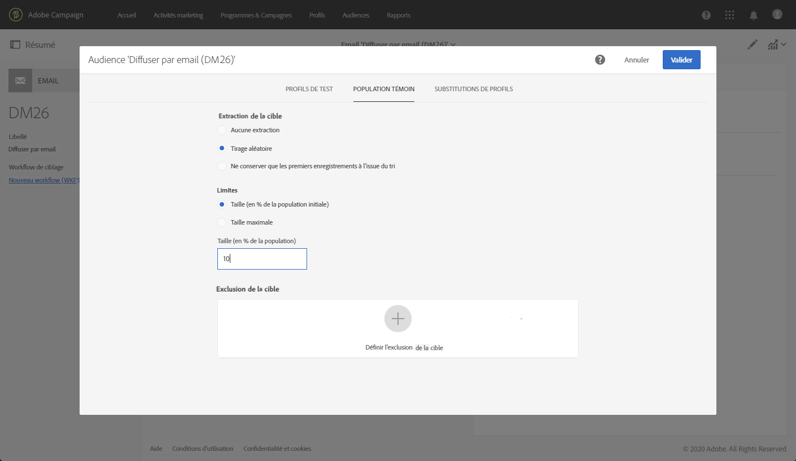
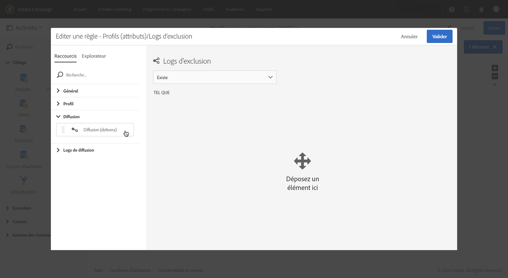

# Ajouter une population témoin {#adding-control-group}

Vous pouvez utiliser des populations témoins pour éviter d’envoyer des messages à une partie de votre audience afin de mesurer l’impact de vos campagnes.

Pour ce faire dans Adobe Campaign, créez une <b>population témoin</b> lors de la définition de la cible de votre diffusion. Les profils sont ajoutés à la population témoin de manière aléatoire, filtrés ou non, ou selon des critères.

Vous pourrez ensuite comparer le comportement de la population cible qui a reçu le message avec celui des contacts qui n’ont pas été ciblés. En fonction des logs d’envoi, vous pourrez également cibler une population témoin dans les prochaines campagnes.

<!--The control group is built when the delivery is prepared.-->

## Présentation {#overview}

La population témoin peut être extraite de manière aléatoire de la cible principale et/ou sélectionnée dans une population spécifique. Par conséquent, vous pouvez définir une population témoin de deux manières principales :
* En **extrayant** un certain nombre de profils de la cible principale.
* En **excluant** certains profils en fonction de critères définis dans une requête.

Vous pouvez utiliser les deux méthodes lors de la définition d’une population témoin.

Tous les profils faisant partie de la population témoin à l’étape de préparation de la diffusion seront supprimés de la cible principale. Ils ne recevront pas le message.

## Extraction de la population cible {#extraction-target-population}

Pour définir une population témoin, vous pouvez choisir d’extraire, de manière aléatoire ou selon un tri, un pourcentage ou un nombre fixe de profils de la population cible.

### Extraction cible {#target-extraction}

Tout d’abord, définissez la façon dont les profils seront extraits de la cible : **de manière aléatoire** ou en fonction d’un **tri**.

Dans la section **[!UICONTROL Extraction cible]**, sélectionnez l’une des options suivantes :

* **[!UICONTROL Tirage aléatoire]** : lors de la préparation de la diffusion, Adobe Campaign extraira de manière aléatoire un certain nombre de profils correspondant au pourcentage ou au nombre maximal que vous définissez comme [limite de taille](#size-limit).

   Par exemple, si vous définissez ensuite le seuil sur 10 dans la section **[!UICONTROL Limites]**, la population témoin sera composée des 10 % sélectionnés de manière aléatoire parmi la population ciblée.<!--Change screenshot to match example)-->

   

* **[!UICONTROL Conserver les premiers suite à un tri]** : cette option vous permet de définir une limite en fonction d’un ou de plusieurs ordres de tri.

   Par exemple :

   * Sélectionnez le champ **[!UICONTROL Age]** comme critère de tri.
   * Définissez 100 comme seuil dans la section **[!UICONTROL Limites]** (voir [Limite de taille](#size-limit)).
   * Laissez l’option **[!UICONTROL Tri descendant]** cochée.

   La population témoin sera composée par conséquent des 100 plus vieux destinataires.<!--Change screenshot to match example)-->

   

   Il peut être intéressant de définir une population témoin qui inclut les profils qui font quelques achats ou des achats fréquents et de comparer leur comportement à celui des destinataires contactés.

>[!NOTE]
>
>Sélectionnez **[!UICONTROL Aucune extraction]** si vous ne souhaitez pas utiliser l’option **[!UICONTROL Extraction cible]**.

<!---->

### Limite de taille {#size-limit}

Que vous ayez sélectionné l’option **[!UICONTROL Tirage aléatoire]** ou **[!UICONTROL Conserver les premiers suite à un tri]**, vous devez définir comment vous allez limiter le nombre de profils que vous extrayez de la cible principale. Effectuez l’une des opérations suivantes :

* Sélectionnez **[!UICONTROL Taille (en % de la population initiale)]** et remplissez le cadre correspondant.

   Par exemple, si vous définissez 10, selon l’option sélectionnée ci-dessus, Adobe Campaign va :
   * extraire de manière aléatoire 10 % de la population cible ;
   * extraire les 10 % de profils les plus âgés de la population cible, si vous avez sélectionné le champ **[!UICONTROL Age]** comme critère de tri.

   >[!NOTE]
   >
   >Si vous désélectionnez l’option **[!UICONTROL Tri descendant]**, les 10 % de profils les plus jeunes seront extraits.

* Sélectionnez **[!UICONTROL Taille maximale]** et remplissez le cadre correspondant.

   Par exemple, si vous définissez 100, Adobe Campaign va :
   * extraire de manière aléatoire 100 profils de la population cible ;
   * extraire les 100 profils les plus âgés de la population cible, si vous avez sélectionné le champ **[!UICONTROL Age]** comme critère de tri.

   >[!NOTE]
   >
   >Si vous désélectionnez l’option **[!UICONTROL Tri descendant]**, les 100 de profils les plus jeunes seront extraits.

## Exclusion d’une population spécifique {#excluding-specific-population}

Une autre manière de définir une population témoin consiste à exclure une population spécifique de la cible en utilisant une requête.

Pour cela :

1. Dans la section **[!UICONTROL Exclusion cible]**, cliquez sur **[!UICONTROL Définir l’exclusion cible]**.

   

1. Définissez les critères d’exclusion à l’aide de l’[éditeur de requêtes](../../automating/using/editing-queries.md). Vous pouvez également sélectionner une [audience](../../audiences/using/about-audiences.md) qui a été créée auparavant.

   

1. Cliquez sur **[!UICONTROL Confirmer]**.

Les profils correspondant au résultat de la requête seront exclus de la cible.

<!--For more on using the query editor, see the [Editing queries](../../automating/using/editing-queries.md) section.-->

## Cas pratique : configurer une population témoin {#control-group-example}

Vous trouverez ci-dessous un exemple de définition d’une population témoin à l’aide des deux méthodes : extraire des profils de la cible principale et utiliser une requête pour exclure une population spécifique.

1. Créez un workflow. Les étapes détaillées pour créer un workflow sont présentées dans la section [Création d’un workflow](../../automating/using/building-a-workflow.md).
1. Dans **[!UICONTROL Activités]** > **[!UICONTROL Ciblage]**, effectuez un glisser-déposer d’une activité [Requête](../../automating/using/query.md). Double-cliquez sur l’activité pour définir votre cible. <!--For example, in **[!UICONTROL Shortcuts]**, drag and drop **[!UICONTROL Profile]**, select **[!UICONTROL Age]** with the operator **[!UICONTROL Greater than]** and type 25 in the **[!UICONTROL Value]** field.-->

1. Dans **[!UICONTROL Activités]** > **[!UICONTROL Canaux]**, effectuez un glisser-déposer d’une activité [Diffusion Email](../../automating/using/email-delivery.md) après le segment cible principal et modifiez-la.
1. Cliquez sur le bloc **[!UICONTROL Audience]** du tableau de bord des diffusions.

1. Sélectionnez l’onglet **[!UICONTROL Population témoin]**.

   

1. Dans la section **[!UICONTROL Extraction cible]**, sélectionnez **[!UICONTROL Conserver les premiers suite à un tri]**.
1. Triez selon l’âge et laissez l’option **[!UICONTROL Tri descendant]** cochée.

   

1. Définissez 100 comme taille maximale. Les 100 plus vieux profils de votre cible seront extraits.

1. Dans la section **[!UICONTROL Exclusion cible]**, définissez les profils qui seront exclus de votre cible, en fonction des critères de votre choix à l’aide de l’[éditeur de requêtes](../../automating/using/editing-queries.md). Par exemple, « Age est inférieur à 20 ».

   

   Les profils dont l’âge est inférieur à 20 ans seront exclus.

1. Lancez la [préparation de la diffusion](../../sending/using/preparing-the-send.md) et [confirmez l’envoi](../../sending/using/confirming-the-send.md).

Les profils extraits (les 100 plus vieux profils) et ceux définis sur la base de la requête (profils de moins de 20 ans) seront retirés de la cible principale. Ils ne recevront pas le message.

## Comparaison des résultats {#delivery-logs}

Maintenant que vous avez envoyé votre diffusion, que pouvez-vous faire de la population témoin ?

Vous pouvez extraire les **logs d’envoi** pour comparer la façon dont la population témoin qui n’a pas reçu la communication s’est comportée par rapport à la cible effective. Vous pouvez également utiliser les logs de diffusion pour **créer un autre ciblage**.

>[!IMPORTANT]
>
>Vous devez avoir un [rôle d’ administrateur](../../administration/using/users-management.md#functional-administrators) et faire partie de l’[entité organisationnelle](../../administration/using/organizational-units.md) **[!UICONTROL Toutes]** pour pouvoir vous connecter à Adobe Campaign. Si vous souhaitez limiter l’accès d’un utilisateur ou d’un groupe d’utilisateurs spécifique, ne le liez pas aux entités **[!UICONTROL Toutes]** pour qu’il puisse accéder aux logs de diffusion.

### Vérification des logs de diffusion {#checking-logs}

Pour savoir quels profils ont été supprimés de la cible après l’envoi du message, vérifiez les **[!UICONTROL logs de diffusion]**. Pour en savoir plus sur les logs de diffusion et découvrir comment y accéder, consultez [cette section](../../sending/using/monitoring-a-delivery.md#delivery-logs).

* Dans l’onglet **[!UICONTROL Logs d’envoi]**, vous pouvez voir les profils extraits et exclus. Ils ont le statut **[!UICONTROL Ignoré]** et **[!UICONTROL Population témoin]** comme motif d’échec.

   

* Vous pouvez également vérifier l’onglet **[!UICONTROL Causes d’exclusion]** pour voir le nombre de profils qui n’ont pas été inclus dans la diffusion.

   

### Utilisation des logs de population témoin {#using-logs}

Une fois la diffusion envoyée, vous pouvez utiliser les logs de diffusion pour filtrer les profils qui n’ont pas reçu le message. Suivez les étapes ci-dessous :

1. Créez un workflow. Les étapes détaillées pour créer un workflow sont présentées dans la section [Création d’un workflow](../../automating/using/building-a-workflow.md).
1. Dans **[!UICONTROL Activités]** > **[!UICONTROL Ciblage]**, effectuez un glisser-déposer d’une activité [Requête](../../automating/using/query.md).
1. Dans l’onglet **[!UICONTROL Propriétés]**, définissez **[!UICONTROL Logs de diffusion]** comme **[!UICONTROL Ressource]** et **[!UICONTROL Profil]** comme **[!UICONTROL Dimension de ciblage]**.

   

1. Dans l’onglet **[!UICONTROL Cible]**, cliquez sur **[!UICONTROL Logs de diffusion]**.
1. Effectuez un glisser-déposer de **[!UICONTROL Statut]** et sélectionnez **[!UICONTROL Ignoré]** comme condition de filtrage.

   

1. Cliquez sur **[!UICONTROL Confirmer]**.

1. En étant toujours dans l’onglet **[!UICONTROL Cible]**, effectuez un glisser-déposer de **[!UICONTROL Nature de l’échec]** et sélectionnez **[!UICONTROL Population témoin]** comme condition de filtrage.

   

1. Cliquez sur **[!UICONTROL Confirmer]**.

   

Vous pouvez ensuite exporter les données des logs à l’aide d’une activité **Extraction de fichier** suivie d’une activité **Transfert de fichier**, par exemple. Vous pourrez ainsi analyser dans votre propre outil de reporting les résultats de votre campagne sur la cible effective par rapport à la population témoin. Pour plus d’informations sur les logs d’export, voir [cette section](../../automating/using/exporting-logs.md).

### Ciblage de la population témoin {#targeting-control-group}

Pour effectuer un ciblage basé sur les profils qui n’ont pas reçu le message, vous pouvez également utiliser les logs de diffusion. Suivez les étapes ci-dessous :

1. Créez un workflow. Les étapes détaillées pour créer un workflow sont présentées dans la section [Création d’un workflow](../../automating/using/building-a-workflow.md).
1. Dans **[!UICONTROL Activités]** > **[!UICONTROL Ciblage]**, effectuez un glisser-déposer d’une activité [Requête](../../automating/using/query.md).
1. Dans l’onglet **[!UICONTROL Propriétés]**, assurez-vous que la ressource **[!UICONTROL Profil]** est sélectionnée comme **[!UICONTROL Ressource]** et **[!UICONTROL Dimension de ciblage.]**

   

1. Dans l’onglet **[!UICONTROL Cible]**, développez **[!UICONTROL Diffusion]** et effectuez un glisser-déposer de **[!UICONTROL Logs de diffusion]**.

   

1. Dans la fenêtre **[!UICONTROL Ajouter une règle]**, effectuez un glisser-déposer de **[!UICONTROL Diffusion]**.

   

1. Sélectionnez l’email que vous avez envoyé comme condition de filtrage. Cliquez sur **[!UICONTROL Confirmer]**.

   

1. De retour dans la fenêtre **[!UICONTROL Ajouter une règle]**, effectuez un glisser-déposer de **[!UICONTROL Statut]** et sélectionnez **[!UICONTROL Ignoré]** comme condition de filtrage. Cliquez sur **[!UICONTROL Confirmer]**.

   

1. Effectuez un glisser-déposer de **[!UICONTROL Nature de l’échec]** et sélectionnez **[!UICONTROL Population témoin]** comme condition de filtrage. Cliquez sur **[!UICONTROL Confirmer]**.

   

1. Vérifiez que les conditions sont toutes alignées avec l’opérateur booléen **ET**.

   

1. Cliquez sur **[!UICONTROL Confirmer]**.

Vous pouvez maintenant cibler les profils qui n’ont pas reçu votre premier message, car ils faisaient partie de la population témoin et leur envoyer un autre email.

Dans le même workflow, vous pouvez également créer une autre requête pour cibler des profils qui ont bien reçu l’email et leur envoyer un autre message.

