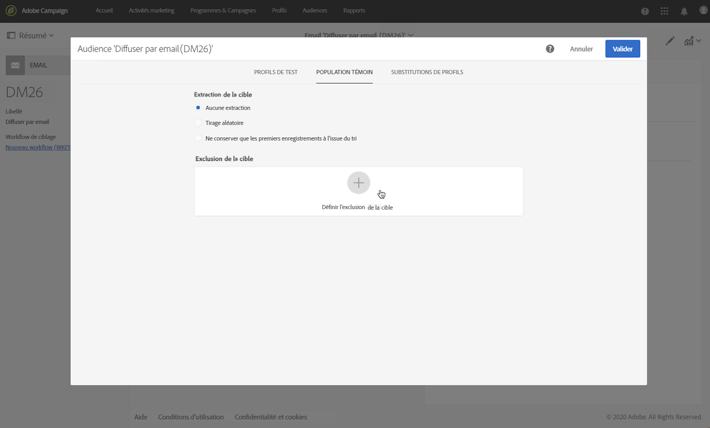

# Ajouter une population témoin {#adding-control-group}

Vous pouvez utiliser des Populations témoins pour éviter d’envoyer des messages à une partie de votre audience afin de mesurer l’impact de vos campagnes.

Pour ce faire dans Adobe Campaign, créez une <b>Population témoin</b> lors de la définition de la cible de votre diffusion. Les profils sont ajoutés à la Population témoin de manière aléatoire, filtrés ou non, ou selon des critères.

Vous pourrez ensuite comparer le comportement de la population de cibles qui a reçu le message au comportement des contacts qui n&#39;ont pas été ciblés. En fonction des journaux d’envoi, vous pouvez également cible une Population témoin dans les futures campagnes.

<!--The control group is built when the delivery is prepared.-->

## Présentation {#overview}

La Population témoin peut être extraite de façon aléatoire de la cible principale et/ou sélectionnée d&#39;une population spécifique. Par conséquent, vous pouvez définir une Population témoin de deux manières principales :
* **Extrayez** un certain nombre de profils de la cible principale.
* **Exclure** certains profils en fonction de critères définis dans une requête.

Vous pouvez utiliser les deux méthodes lors de la définition d’une Population témoin.

Tous les profils faisant partie de la Population témoin à l&#39;étape de préparation de la diffusion seront supprimés de la cible principale. Ils ne recevront pas le message une fois qu&#39;il aura été envoyé.

## Extraction de la population de cibles {#extraction-target-population}

Pour définir une Population témoin, vous pouvez choisir d’extraire, de manière aléatoire ou selon un tri, un pourcentage ou un nombre fixe de profils de la population de cibles.

### Extraction cible {#target-extraction}

Tout d&#39;abord, définissez la façon dont les profils seront extraits de la cible : **aléatoire** ou en fonction d’un **tri**.

Dans la section **[!UICONTROL Cible extraction]** , sélectionnez l’une des options suivantes :

* **[!UICONTROL Échantillonnage]** aléatoire : lors de la préparation de la diffusion, Adobe Campaign extraira aléatoirement un certain nombre de profils correspondant au pourcentage ou au nombre maximal que vous définissez comme limite [de](#size-limit)taille.

   Par exemple, si vous définissez ensuite le seuil sur 10 dans la section **[!UICONTROL Limites]** , la Population témoin sera composée de 10 % sélectionnés de manière aléatoire parmi la population ciblée.<!--Change screenshot to match example)-->

   

* **[!UICONTROL Ne conservez que les premiers enregistrements après le tri]**: cette option vous permet de définir une limite en fonction d&#39;un ou plusieurs ordres de tri.

   Par exemple :

   * Sélectionnez le champ **[!UICONTROL Age]** comme critère de tri.
   * Définissez 100 comme seuil dans la section **[!UICONTROL Limites]** (voir Limite [de](#size-limit)taille).
   * Laissez l&#39;option de tri **** Descendant cochée.

   En conséquence, la Population témoin sera composée des 100 plus vieux destinataires.<!--Change screenshot to match example)-->

   

   Il peut être intéressant de définir une Population témoin qui inclut les profils qui font peu ou fréquemment des achats et de comparer leur comportement à celui des destinataires contactés.

>[!NOTE]
>
>Sélectionnez **[!UICONTROL Aucune extraction]** si vous ne souhaitez pas utiliser l’option extraction **** Cible.

<!---->

### Limite de taille {#size-limit}

Que vous ayez sélectionné l’échantillonnage **** aléatoire ou **[!UICONTROL Ne conserver que les premiers enregistrements après le tri]**, vous devez définir comment vous allez limiter le nombre de profils que vous extrayez de la cible principale. Effectuez l’une des opérations suivantes :

* Sélectionnez **[!UICONTROL Taille (en % de la population initiale)]** et remplissez le cadre correspondant.

   Par exemple, si vous définissez 10, selon l’option sélectionnée ci-dessus, Adobe Campaign :
   * Extraction aléatoire de 10 % de la population de cibles.
   * Si vous avez sélectionné le champ **[!UICONTROL Age]** comme critère de tri, extrayez les 10 % de profils les plus âgés de la population cible.

   >[!NOTE]
   >
   >Si vous désélectionnez l&#39;option de tri **** Descendant, les 10 % de profils les plus jeunes seront extraits.

* Sélectionnez Taille **** maximale et remplissez le cadre correspondant.

   Par exemple, si vous définissez 100, Adobe Campaign :
   * Extraction aléatoire de 100 profils de la population de cibles.
   * Si vous avez sélectionné le champ **[!UICONTROL Age]** comme critère de tri, extrayez les 100 profils les plus âgés de la population de cibles.

   >[!NOTE]
   >
   >Si vous désélectionnez l&#39;option de tri **** Descendant, les 100 profils les plus jeunes seront extraits.

## Exclusion d’une population spécifique {#excluding-specific-population}

Une autre manière de définir une Population témoin consiste à exclure une population spécifique de la cible en utilisant une requête.

Pour cela :

1. Dans la section d’exclusion **[!UICONTROL des]** Cibles, cliquez sur **[!UICONTROL Définir l’exclusion]** des cibles.

   

1. Définissez les critères d’exclusion à l’aide de l’éditeur [de](../../automating/using/editing-queries.md)requêtes. Vous pouvez également sélectionner une [audience](../../audiences/using/about-audiences.md) qui a été créée précédemment.

   

1. Cliquez sur **[!UICONTROL Confirmer]**.

Les profils correspondant au résultat de la requête seront exclus de la cible.

<!--For more on using the query editor, see the [Editing queries](../../automating/using/editing-queries.md) section.-->

## Cas d’utilisation : configurer une Population témoin {#control-group-example}

Vous trouverez ci-dessous un exemple de définition d’une Population témoin à l’aide des deux méthodes : extraire des profils de la cible principale et utiliser une requête pour exclure une population spécifique.

1. Créer un workflow. Les étapes détaillées pour créer un workflow sont présentées dans la section [Création d&#39;un workflow](../../automating/using/building-a-workflow.md).
1. Dans **[!UICONTROL Activités]** > **[!UICONTROL Ciblage]**, effectuez un glisser-déposer d’une activité [Requête. ](../../automating/using/query.md) Double-click the activity and define your target. <!--For example, in **[!UICONTROL Shortcuts]**, drag and drop **[!UICONTROL Profile]**, select **[!UICONTROL Age]** with the operator **[!UICONTROL Greater than]** and type 25 in the **[!UICONTROL Value]** field.-->

1. In **[!UICONTROL Activities]** > **[!UICONTROL Channels]**, drag and drop an [Email delivery](../../automating/using/email-delivery.md) activity after the main target segment and edit it.
1. Cliquez sur le bloc **[!UICONTROL Audience]** du tableau de bord de diffusion.

1. Sélectionnez l’onglet **[!UICONTROL Population témoin]** .

   

1. Dans la section **[!UICONTROL Cible extraction]** , sélectionnez **[!UICONTROL Conserver uniquement les premiers enregistrements après le tri]**.
1. Triez selon l’âge et laissez l’option de tri **[!UICONTROL Descendant]** cochée.

   

1. Définissez 100 comme taille maximale. Les 100 plus vieux profils de votre cible seront extraits.

1. Dans la section d’exclusion **[!UICONTROL des]** Cibles, définissez les profils qui seront exclus de votre cible, en fonction des critères de votre choix à l’aide de l’éditeur [de](../../automating/using/editing-queries.md)requêtes. Par exemple, &quot;L&#39;âge est inférieur à 20 ans&quot;.

   

   Les profils dont l&#39;âge est inférieur à 20 ans seront exclus.

1. Lancez la préparation [de la](../../sending/using/preparing-the-send.md) diffusion et [confirmez l’envoi](../../sending/using/confirming-the-send.md).

Les profils extraits (les 100 plus vieux profils) et ceux définis sur la base de la requête (profils de moins de 20 ans) seront retirés de la cible principale. Ils ne recevront pas le message.

## Comparaison des résultats {#delivery-logs}

Maintenant que vous avez envoyé votre diffusion, que pouvez-vous faire de la Population témoin ?

Vous pouvez extraire les journaux **d’** envoi pour comparer l’action de la Population témoin qui n’a pas reçu la communication par rapport à la cible effective. Vous pouvez également utiliser les logs de diffusion pour **créer un autre ciblage**.

>[!IMPORTANT]
>
>Vous devez avoir un rôle [d’](../../administration/using/users-management.md#functional-administrators) administrateur et faire partie de l’unité **** organisationnelle [All](../../administration/using/organizational-units.md) pour pouvoir vous connecter à Adobe Campaign. Si vous souhaitez limiter l’accès à un utilisateur ou à un groupe d’utilisateurs particulier, ne liez pas ce dernier à **[!UICONTROL Toutes les]** unités pour pouvoir accéder aux logs de diffusion.

### Vérification des logs de diffusion {#checking-logs}

Pour savoir quels profils ont été supprimés de la cible après l’envoi du message, vérifiez les **[!UICONTROL Logs de diffusion]**. Pour en savoir plus sur les logs de diffusion et comment y accéder, consultez [cette section](../../sending/using/monitoring-a-delivery.md#delivery-logs).

* Dans l&#39;onglet **[!UICONTROL Envoi de journaux]** , vous pouvez voir les profils extraits et exclus. Ils ont le statut **[!UICONTROL Ignoré]** et la **[!UICONTROL Population témoin]** pour cause d&#39;échec.

   

* Vous pouvez également vérifier l’onglet **[!UICONTROL Exclusion cause]** l’affichage du nombre de profils qui n’ont pas été inclus dans la diffusion.

   

### Utilisation des journaux de Population témoin {#using-logs}

Une fois la diffusion envoyée, vous pouvez utiliser les logs de diffusion pour filtrer les profils qui n’ont pas reçu le message. Suivez les étapes ci-dessous :

1. Créer un workflow. Les étapes détaillées pour créer un workflow sont présentées dans la section [Création d&#39;un workflow](../../automating/using/building-a-workflow.md).
1. Dans **[!UICONTROL Activités]** > **[!UICONTROL Ciblage]**, effectuez un glisser-déposer d’une activité [Requête](../../automating/using/query.md).
1. Dans l’onglet **[!UICONTROL Propriétés]** , définissez **[!UICONTROL Logs de diffusion]** comme **[!UICONTROL Ressource]** et **[!UICONTROL Profil comme Dimension de ciblage.]******

   

1. Dans l’onglet **[!UICONTROL Cible]** , cliquez sur **[!UICONTROL Logs de diffusion]**.
1. Faites glisser et déposez **[!UICONTROL l’état]** et sélectionnez **[!UICONTROL Ignoré]** comme condition de filtre.

   

1. Cliquez sur **[!UICONTROL Confirmer]**.

1. Toujours dans l’onglet **[!UICONTROL Cible]** , faites glisser et déposez **[!UICONTROL Nature de l’échec]** et sélectionnez **[!UICONTROL Population témoin]** comme condition de filtre.

   

1. Cliquez sur **[!UICONTROL Confirmer]**.

   

Vous pouvez ensuite exporter les données du journal à l’aide d’une activité de fichier **** Extract suivie d’une activité de fichier **** Transférer, par exemple. Vous pourrez ainsi analyser dans votre propre outil de rapports les résultats de votre campagne sur la cible efficace par rapport à la Population témoin. For more on exporting logs, see [this section](../../automating/using/exporting-logs.md).

### Ciblage de la Population témoin {#targeting-control-group}

Pour effectuer un ciblage basé sur les profils qui n’ont pas reçu le message, vous pouvez également utiliser les logs de diffusion. Suivez les étapes ci-dessous :

1. Créer un workflow. Les étapes détaillées pour créer un workflow sont présentées dans la section [Création d&#39;un workflow](../../automating/using/building-a-workflow.md).
1. In **[!UICONTROL Activities]** > **[!UICONTROL Targeting]**, drag and drop a first [Query](../../automating/using/query.md) activity.
1. Dans l&#39;onglet **[!UICONTROL Propriétés]** , assurez-vous que la ressource de **[!UICONTROL Profil]** est sélectionnée comme ressource **[!UICONTROL et]** **[!UICONTROL Dimension de ciblage.]**

   

1. Dans l’onglet **[!UICONTROL Cible]** , développez **[!UICONTROL Diffusion]** et faites glisser et déposez **[!UICONTROL des Logs de diffusion]**.

   

1. Dans la fenêtre **[!UICONTROL Ajouter une règle]** , faites glisser et déposez la **[!UICONTROL Diffusion]**.

   

1. Sélectionnez le message électronique que vous avez envoyé comme condition de filtrage. Cliquez sur **[!UICONTROL Confirmer]**.

   

1. De retour dans la fenêtre **[!UICONTROL Ajouter une règle]** , faites glisser et déposez le **[!UICONTROL statut]** et sélectionnez **[!UICONTROL Ignoré]** comme condition de filtre. Cliquez sur **[!UICONTROL Confirmer]**.

   

1. Faites glisser et déposez **[!UICONTROL Nature de l’échec]** et sélectionnez **[!UICONTROL Population témoin]** comme condition de filtre. Cliquez sur **[!UICONTROL Confirmer]**.

   

1. Assurez-vous que les conditions sont toutes alignées avec l’opérateur booléen **ET** .

   

1. Cliquez sur **[!UICONTROL Confirmer]**.

Vous pouvez désormais cible les profils qui n’ont pas reçu votre premier message car ils faisaient partie de la Population témoin et leur envoyer un autre courriel.

Dans le même processus, vous pouvez également créer une autre requête pour cible des profils qui ont reçu le courrier électronique et leur envoyer un autre message.

