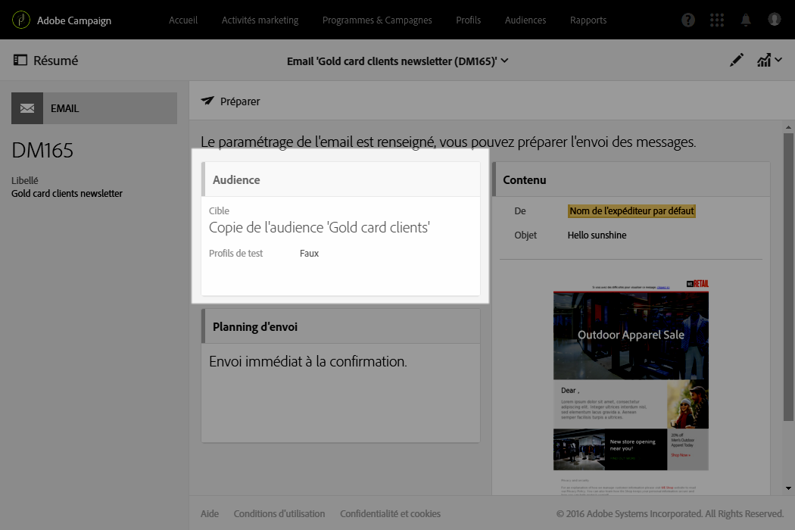

# Rendu des emails{#email-rendering}

Avant d'appuyer sur le bouton **[!UICONTROL Envoyer], vérifiez que l'affichage de votre message sera optimal sur divers clients web, webmails et appareils.**

Pour vous aider, Adobe Campaign capture le rendu et le rend disponible dans un rapport dédié. Vous pouvez visualiser l'affichage du message envoyé dans les différents contextes de réception.

Les clients mobiles, de messagerie et webmail disponibles pour le **Rendu des emails** dans Adobe Campaign sont répertoriés sur le [site web](https://litmus.com/email-testing) de Litmus (cliquez sur **View all email clients**).

## Consulter le rapport de rendu des emails {#checking-the-email-rendering-report}

Une fois que vous avez créé votre diffusion email et défini son contenu ainsi que la population ciblée, suivez la procédure décrite ci-après.

1. Cliquez sur **Audiences** afin d'accéder à l'onglet **[!UICONTROL Profils de test].**

   

1. Utilisez l'éditeur de requêtes pour définir les profils de test à utiliser, notamment ceux destinés à l'utilisation du **Rendu des emails.** Voir [À propos des profils de test](../../sending/using/managing-test-profiles-and-sending-proofs.md#about-test-profiles).

   

1. Validez votre requête, puis enregistrez vos modifications.
1. Cliquez sur le bouton **[!UICONTROL Tester]présent dans la barre d'actions.**

   

1. Sélectionnez l'option **[!UICONTROL Rendu des emails]**, puis cliquez sur **[!UICONTROL OK]**.

   

   >[!NOTE]
   >
   >L'option **[!UICONTROL Bon à tirer + Rendu des emails]vous permet d'envoyer un bon à tirer et d'utiliser la fonctionnalité de rendu des emails simultanément.** Votre message peut être validé par les destinataires du BAT et sa réception testée en même temps en fonction des boîtes de messagerie ciblées. Dans ce cas, vous devez également sélectionner les profils de test du BAT. Voir [À propos des profils de test](../../sending/using/managing-test-profiles-and-sending-proofs.md#about-test-profiles).

   La diffusion de test est envoyée.

1. Les vignettes de rendu sont accessibles quelques minutes après l'envoi des messages. Pour y accéder, sélectionnez **[!UICONTROL Bons à tirer]** dans la liste déroulante **Résumé[!UICONTROL .]**

   

1. Dans la liste **[!UICONTROL Bons à tirer]**, cliquez sur l'icône **Accéder au rendu des emails[!UICONTROL .]**

   

Le rapport dédié au rendu des emails s'affiche. Voir [Description du rapport de rendu des emails](../../sending/using/email-rendering.md#email-rendering-report-description).

**Rubriques connexes** :

* [Créer un email](../../channels/using/creating-an-email.md)
* [Gérer les profils de test et envoyer un bon à tirer](../../sending/using/managing-test-profiles-and-sending-proofs.md)
* [Editeur de requêtes](../../automating/using/editing-queries.md#about-query-editor)

## Description du rapport de rendu des emails {#email-rendering-report-description}

Ce rapport présente les rendus des emails tels qu'ils apparaissent côté destinataire. Les rendus des emails peuvent être différents selon le mode d'ouverture de la diffusion email par le destinataire : dans un navigateur, sur un appareil mobile ou via une application de messagerie.

>[!NOTE]
>
>Le nombre de rendus disponibles est listé dans votre accord de licence. Chaque diffusion pour laquelle le **Rendu des emails** est activé réduit vos rendus disponibles (également appelés jetons) d'une unité. Si vous êtes un client Litmus, vous pouvez utiliser votre compte Litmus pour activer et utiliser l'option Rendu des emails dans Adobe Campaign. Pour plus d'informations, contactez votre gestionnaire de compte Adobe.

La synthèse du rapport présente le nombre de messages reçus, indésirables, non reçus ou en attente de réception.

The report is divided into three parts: **[!UICONTROL Mobile]**, **[!UICONTROL Messaging clients]**, and **[!UICONTROL Webmails]**. Faites défiler le rapport pour afficher tous les rendus regroupés dans ces trois catégories.

Pour voir les détails de chaque rapport, cliquez sur la vignette correspondante. Le rendu s'affiche pour le moyen de réception sélectionné.

L'onglet **[!UICONTROL Données techniques]permet d'obtenir plus d'informations, telles que les dates de réception et de capture et les en-têtes complets des emails.**
