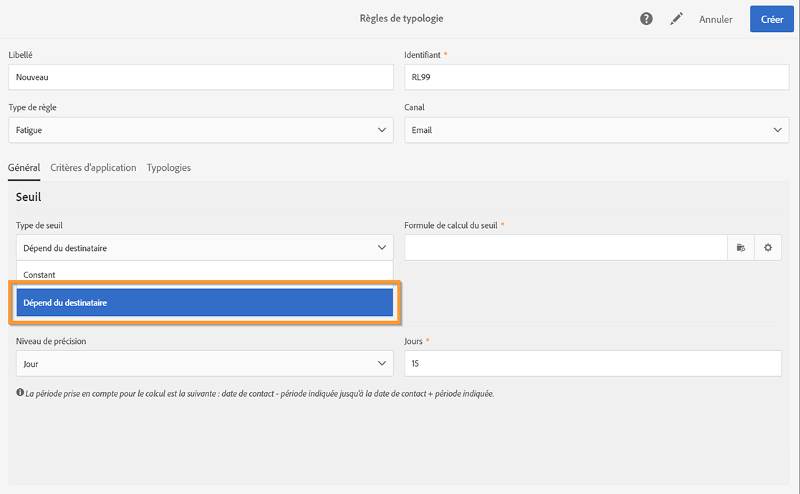
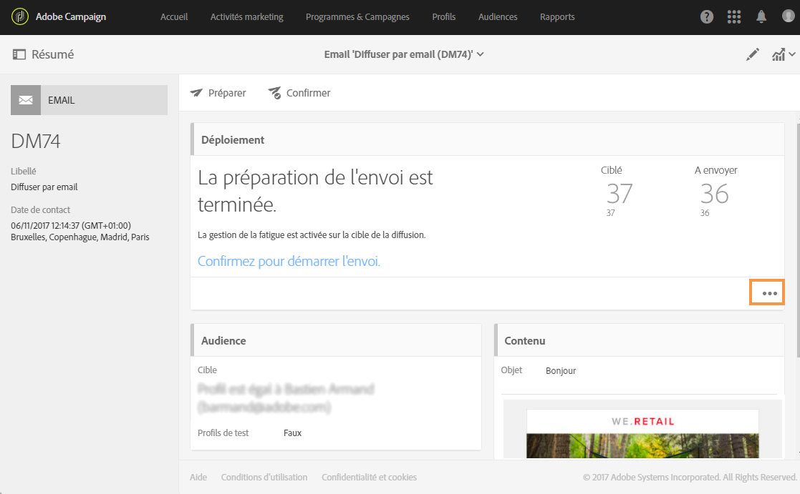

# Règles de fatigue{#fatigue-rules}

## A propos des règles de fatigue {#about-fatigue-rules}

Les règles de fatigue permettent aux marketeurs de définir des règles métier cross-canal globales qui excluront automatiquement les profils sur-sollicités des campagnes.

Pour implémenter une règle de fatigue, vous devez définir un nombre maximum de messages par profil et sélectionner une période pendant laquelle s&#39;appliquera la règle. Lors de la préparation de la diffusion, les profils sont exclus ou non de la diffusion, selon le nombre de messages qui leur ont déjà été adressés.

>[!NOTE]
>
>Pour que les règles de fatigue soient appliquées, vous devez définir une date de contact pour votre diffusion. Si vous choisissez d&#39;envoyer immédiatement les messages, la règle de fatigue ne sera pas appliquée.

Rubriques connexes :

* [Préparation](../../administration/using/configuring-email-channel.md#preparation)
* [Gestion des typologies](../../sending/using/managing-typologies.md)
* [Règles de typologie](../../sending/using/managing-typology-rules.md)
* [Optimisation de la fréquence de communication pour éviter la fatigue de contact](https://helpx.adobe.com/fr/campaign/kb/simplify-campaign-management.html#Engageyourcustomersateverystep)

## Créer une règle de fatigue  {#creating-a-fatigue-rule}

Pour créer et paramétrer une règle de typologie de type **[!UICONTROL Fatigue]**, les étapes sont les suivantes :

1. Click the Adobe Campaign logo, in the top left corner of the interface, then select **[!UICONTROL Administration]** > **[!UICONTROL Channels]** > **[!UICONTROL Typologies]** > **[!UICONTROL Typology rules]**.

   

1. From the list of typology rules, click **[!UICONTROL Create]**.

   

1. Dans le **[!UICONTROL Rule type]** champ, sélectionnez **[!UICONTROL Fatigue]**.

   

1. In the **[!UICONTROL Channel]** field, select which channel your rule will apply to. You can either select a single channel (email, SMS, direct mail, mobile application) or select **[!UICONTROL All channels]**. Voir [Choisir le canal](#choosing-the-channel).

   

1. In the **[!UICONTROL General]** tab, define the method for calculating the maximum number of messages per profile. Vous pouvez choisir un seuil constant ou variable. Vous pouvez également affiner le seuil sur les profils et diffusions. Voir à ce sujet la section [Définir le seuil](#defining-the-threshold).

   

1. Choose a **[!UICONTROL Sliding period]** on which the typology rule will apply. Consultez à ce sujet la section [Définir la période glissante](#setting-the-sliding-period).

   

   Dans cet exemple (voir les captures d&#39;écran précédentes), nous avons choisi d&#39;envoyer un nombre maximum de 4 messages sur une période glissante de 15 jours.

1. In the **[!UICONTROL Application criteria]** tab, you can choose to apply this rule to all deliveries or restrict the applicability of the rule according to the message to send. La règle ne s&#39;exécutera que si la condition d&#39;application est remplie. Vous pouvez par exemple appliquer uniquement la règle aux messages dont le libellé commence par un mot donné ou dont l&#39;identifiant contient certaines lettres. Voir [Restreindre la portée d&#39;une règle de filtrage](../../sending/using/filtering-rules.md#restricting-the-applicability-of-a-filtering-rule).

   

1. Sélectionnez l&#39;onglet **[!UICONTROL Typologies]** et associez votre règle de typologie à la typologie utilisée pour vos diffusions. Voir [Gestion des typologies](../../sending/using/about-typology-rules.md#managing-typologies) et [Règles de typologie](../../sending/using/about-typology-rules.md#typology-rules).

   

   >[!NOTE]
   >
   >La typologie peut être définie au niveau du modèle de diffusion afin d&#39;être appliquée automatiquement à toutes les diffusions créées à partir de ce modèle.

Lors de la préparation de la diffusion, les profils sont exclus ou non de la diffusion, selon le nombre de diffusions qui leur ont déjà été adressées. Vous pouvez consulter les résultats de l&#39;exécution des règles de fatigue dans les logs de diffusion. Voir [Consulter les résultats de la fatigue](#viewing-the-fatigue-results).

>[!IMPORTANT]
>
>Pour que les règles de fatigue fonctionnent, vous devez définir une date de contact pour votre diffusion. Si vous choisissez d&#39;envoyer immédiatement les messages, la règle de fatigue ne sera pas appliquée.

## Choisir le canal  {#choosing-the-channel}

Les règles de fatigue sont disponibles pour divers canaux. The channel is defined in the **[!UICONTROL Channel]** field of the typology rule settings. You can either select a single channel or select **[!UICONTROL All channels]**.

**Canaux disponibles**

Les canaux suivants sont disponibles :

* Email
* Mobile (SMS)
* Canal Courrier
* Application mobile : ce canal permet d&#39;envoyer des notifications push à des profils ou des abonnés de l&#39;application. Si vous choisissez d&#39;envoyer des notifications push à des profils, ils seront compatibles avec les règles de fatigue multicanal.

   >[!IMPORTANT]
   >
   >Les règles de fatigue sont incompatibles avec les notifications push envoyées aux abonnés de l&#39;application. Si vous envoyez des messages aux abonnés de l&#39;application, les règles de fatigue ne s&#39;appliqueront pas.

* Tous les canaux : cette option permet d&#39;appliquer la règle à tous les canaux. Vous pouvez par exemple décider d&#39;envoyer un maximum de 3 messages par mois sur n&#39;importe quel canal. Si vous avez envoyé 2 emails à un profil la semaine dernière et que vous essayez d&#39;envoyer une notification push aujourd&#39;hui, ce profil sera exclu.

**Types de diffusions**

Les règles de fatigue sont compatibles avec tous les types de diffusions : diffusions ponctuelles, diffusions récurrentes, diffusions de workflow et messages transactionnels.

Les **messages transactionnels** peuvent être utilisés pour envoyer des messages de service ciblant un événement (rtEvent) et des messages de remarketing (ciblant des profils). Les règles de fatigue sont compatibles uniquement avec les messages marketing (ciblant des profils). Les messages transactionnels basés sur un événement ne contiennent pas d&#39;informations sur les profils. Ils ne sont donc pas compatibles avec les règles de fatigue (même dans le cas d&#39;un enrichissement avec des profils). Grâce à la prise en charge des messages marketing dans les messages transactionnels, vous pouvez **appliquer une règle de fatigue à tous les canaux, notamment les messages transactionnels de marketing**.

## Définir le seuil  {#defining-the-threshold}

Chaque règle de fatigue définit un seuil, c&#39;est-à-dire le nombre maximum de messages pouvant être envoyés à chaque profil sur une période. Une fois ce seuil atteint, aucune diffusion ne sera envoyée jusqu&#39;à la fin de la période concernée. Ce mode de fonctionnement permet d&#39;exclure automatiquement un profil d&#39;une diffusion si l&#39;envoi du message provoquait le dépassement du seuil défini, et ainsi une sur-sollicitation.

La valeur de ce seuil peut être constante ou variable. Pour une même période, le seuil peut donc varier d&#39;un profil à l&#39;autre, et même pour un même profil.

**Utiliser un seuil fixe**

Le seuil représente le nombre maximum de messages pouvant être envoyés à un même profil pendant la période concernée.

Par défaut, le seuil est constant et vous devez indiquer le nombre maximum de messages autorisés par la règle.

**Utiliser un seuil variable**

Pour définir un seuil de variable, sélectionnez la **[!UICONTROL Depends on the recipient]** valeur dans le **[!UICONTROL Threshold type]** champ.

Vous avez ensuite deux possibilités :

* sélectionner un champ de profil : le seuil variera pour chaque profil en fonction du champ sélectionné. For example, if you have extended the profiles resource with a &#39;Communication frequency&#39; field, click the button on the right of the **[!UICONTROL Threshold computation formula]** field and select your field. Pour chaque profil, le seuil prendra la valeur du champ &#39;Fréquence des communications&#39;.

   

* define a formula: click the second button on the right of the **[!UICONTROL Threshold computation formula]** field to define an advanced threshold calculation formula. Par exemple, vous pouvez faire dépendre le nombre de messages autorisés en fonction du segment auquel appartient le profil. Ainsi, un profil répertorié dans un segment &#39;Web&#39; pourrait recevoir plus de messages que les autres profils. An **[!UICONTROL Iif (@origin='Web', 5, 3)]** type formula authorizes the delivery of 5 messages to profiles of the Web segment and 3 for other segments.

   

**Affiner le seuil sur les profils et diffusions**

Par défaut, tous les messages sont pris en compte pour le calcul du seuil. Cochez la **[!UICONTROL Refine Threshold on profiles and deliveries]** case pour filtrer le  et le  à compter lors de la préparation du.

Dans l&#39;exemple ci-après, seuls les profils masculins et les diffusions dont le libellé commence par **Newsletters** sont comptabilisés.

Refining the threshold on deliveries is different than restricting the applicability of the entire rule ( **[!UICONTROL Application criteria]** tab):

* **[!UICONTROL Application criteria]**: vous choisissez d’exécuter la règle ou non selon des critères spécifiques. Par exemple, si votre condition d&#39;application est &#39;Libellé commence par Newsletter&#39;, la règle ne s&#39;appliquera qu&#39;aux diffusions respectant cette condition. Si le libellé de la diffusion commence par &#39;Promotion&#39;, la règle ne s&#39;exécutera pas.
* **[!UICONTROL Refine threshold on profiles and deliveries > Deliveries to count]**: tous les  utilisant ce  exécuteront la règle, mais vous déciderez, parmi le passé et le calendrier des , lesquels vous voulez compter. Par exemple, si votre restriction est &#39;Libellé commence par Newsletter&#39;, la règle sera exécutée même si le libellé de la diffusion commence par &#39;Promo&#39;. Sur la période glissante, elle comptabilisera le nombre de diffusions dont le libellé commence par &#39;Newsletter&#39;.

## Définir la période glissante  {#setting-the-sliding-period}

Les règles de fatigue sont définies par périodes glissantes de n jours. The period is configured in the **[!UICONTROL Sliding period]** section, for example 2 weeks, 7 days or 5 hours.

Lors de l&#39;exécution de la règle, les diffusions déjà envoyées et les diffusions planifiées sont prises en compte. Ainsi, le seuil n&#39;est jamais dépassé pendant une période glissante donnée.

Par exemple, si vous définissez une période de 48 heures, le système effectuera une recherche 48 heures **avant la date de contact** et 48 heures **après la date de contact**. La période sélectionnée est donc doublée afin de permettre l&#39;intégration des diffusions à venir ainsi que celles déjà envoyées.

Pour limiter à une période de 15 jours la prise en compte des diffusions, entrez **Jour** et **7** ou 1 semaine dans la section **Période glissante.** Les diffusions envoyées jusqu&#39;à 7 jours avant la date de diffusion et planifiées jusqu&#39;à 7 jours après la date de diffusion à laquelle la règle est appliquée seront prises en compte dans le calcul.

## Consulter les résultats de la fatigue  {#viewing-the-fatigue-results}

Lors de la préparation de la diffusion, les profils sont exclus ou non de la diffusion, selon le nombre de diffusions qui leur ont déjà été adressées. To view fatigue rule execution results, click the button in the bottom right corner of the **[!UICONTROL Deployment]** block.

Trois onglets sont disponibles. Ils indiquent les détails des résultats de l&#39;exécution de la fatigue, notamment le nom de la règle qui a été appliquée :

* Logs de diffusion :

   

* Exclus :

   

* Exclusions appliquées :

   

## Affichage du rapport Synthèse des règles de fatigue  {#viewing-the-fatigue-rule-summary-report}

Adobe Campaign propose un rapport dédié sur les règles de fatigue afin de vous aider à comprendre la façon dont elles sont appliquées à vos campagnes. Vous pouvez ainsi déterminer l&#39;incidence que vos campagnes ont les unes sur les autres et effectuer les réglages nécessaires.

The **[!UICONTROL Fatigue rules summary]** report can be accessed from the **[!UICONTROL Reports]** button, in the top right corner of each program, campaign, and message.

Dans la partie gauche de l&#39;écran, vous pouvez filtrer les données du rapport en fonction de la date de contact des diffusions. Par défaut, la période sélectionnée démarre 15 jours avant la date courante et se termine 15 jours après. Vous pouvez également appliquer un filtre d&#39;après une règle de fatigue spécifique.

Le graphique en secteurs présente les informations suivantes sur la période sélectionnée :

* **[!UICONTROL Total targeted]**: le nombre total de  avant la préparation du message
* **[!UICONTROL Excluded]**: le nombre total d&#39;exclusions dues à l&#39;application de règles de fatigue
* **[!UICONTROL Other exclusions]**: le nombre total d&#39;exclusions dues à d&#39;autres 
* **[!UICONTROL To deliver]**: nombre total de messages à diffuser après la préparation du message ( **[!UICONTROL To deliver]** = **[!UICONTROL Total targeted]** - **[!UICONTROL Excluded]** - **[!UICONTROL Other exclusions]** )

A droite du graphique, vous trouverez le nombre d&#39;exclusions, répartis par règle de fatigue.

La table du bas présente toutes les diffusions au cours de la période sélectionnée. Pour chaque diffusion, vous pouvez voir les règles de fatigue appliquées et les exclusions correspondantes. Les diffusions sans date de contact sont également affichées dans la table.

* **[!UICONTROL 0]** signifie que la règle de fatigue s&#39;appliquait, mais sans exclusion.
* **[!UICONTROL -N]** signifie que N exclusions ont été réalisées.
* Un champ vide signifie que la règle de fatigue ne s&#39;appliquait pas.

>[!NOTE]
>
>Les données affichées ne dépendent pas du contexte du programme, du message ou de la campagne à partir duquel vous accédez au rapport. Ce rapport affiche toutes les règles de fatigue et diffusions pour l&#39;ensemble des entités organisationnelles. Vous obtenez ainsi une vue globale de toutes les diffusions afin de comprendre la façon dont vos campagnes s&#39;influencent entre elles.

## Exemples  {#examples}

L&#39;implémentation de la gestion de la fatigue offre de nombreuses possibilités. Voici quelques exemples de ce que vous pouvez faire :

* Créer une règle de fatigue qui utilise un **seuil constant** s&#39;appliquant à **tous les canaux** :

   Imaginons que vous créez une règle multicanal avec un seuil constant de 3 sur une période glissante de 7 jours.

   La semaine dernière, les profils Premium ont reçu un email de promotion et un email de remarketing transactionnel. Vous avez également planifié un SMS qui sera envoyé la semaine prochaine. Vous décidez d&#39;envoyer aujourd&#39;hui une notification push ciblant tous vos profils. Les profils Premium seront exclus de la notification push d&#39;aujourd&#39;hui, car leur nombre maximum de messages sur une période de 15 jours a déjà été atteint.

   

* Créer une règle de fatigue qui utilise un **seuil variable** reposant sur un **champ de profil** :

   Vous avez étendu la ressource Profiles avec un champ &#39;Limiter les communications&#39; afin de définir un seuil différent pour chaque profil. Dans la règle de fatigue, définissez un seuil variable qui repose sur ce champ et sélectionnez une période glissante de 2 jours. Prenons deux exemples de profil : la limite des communications de Jean est de 1 et le seuil de David est de 2. Jean et David ont déjà reçu un email de newsletter hier. Vous décidez de leur envoyer un autre email aujourd&#39;hui. Seul David le recevra, car Jean a été exclu de la cible.

   

* Créer une règle de fatigue qui utilise une **formule de calcul du seuil** :

   Vous souhaitez changer le seuil selon l&#39;âge de vos profils. Si un profil a moins de 40 ans, vous souhaitez définir une limite de 4. Pour les profils plus âgés, vous voulez une limite de 2. Au lieu de définir ce seuil pour chaque profil avec un champ étendu, vous pouvez créer une formule directement dans la règle de fatigue afin de calculer le seuil selon l&#39;âge des profils. In our example, the formula would be **[!UICONTROL Iif (@age<40, 4, 2)]**.

   

   >[!NOTE]
   >
   >Cette section contient également un exemple détaillé de règle de fatigue utilisant une formule de calcul du seuil.

* Créer une règle de fatigue qui **affine le seuil** sur les profils et diffusions :

   Vous avez étendu la ressource Profiles avec un champ &#39;Score&#39; et la ressource des diffusions avec un champ &#39;Type&#39;. Vous voulez définir un seuil constant de 3, mais souhaitez exclure de la comptabilisation toutes les diffusions de type &#39;Alerte&#39; ou &#39;Black Friday&#39; et tous les profils dont le score est supérieur à 10. Lors de l&#39;exécution de la règle, celle-ci comptabilisera, parmi les diffusions déjà envoyées et les diffusions planifiées, toutes les diffusions qui ne sont pas de type &#39;Alerte&#39; ni &#39;Black Friday&#39; envoyées aux profils dont le score est inférieur à 10.

   

Vous trouverez ci-dessous un exemple détaillé de règle de fatigue utilisant une formule de calcul du seuil.

Dans ce cas pratique, nous allons créer une règle de typologie afin de ne pas envoyer plus de 2 messages par semaine aux profils Premium et pas plus de 2 messages par semaine aux profils standards.

To identify customers and prospects, we extended the profiles resource with the **[!UICONTROL Status]** field, which contains 0 for premium profiles and 1 for standard profiles.

Les étapes de création de cette règle sont les suivantes :

1. Créez une règle de typologie de type **Fatigue**.
1. In the **[!UICONTROL Threshold]** section, we want to create a formula to calculate the threshold depending on each profile. Sélectionnez la **[!UICONTROL Depends on the recipient]** valeur dans le **[!UICONTROL Threshold type]** champ, puis cliquez sur l’icône du deuxième bouton à droite du **[!UICONTROL Threshold computation formula]** champ.

   

1. Dans la **[!UICONTROL List of functions]** section, -cliquez sur la fonction **Iif** dans le **[!UICONTROL Others]** noeud.

   

1. Then select the profile&#39;s **Status** in the **[!UICONTROL Available fields]** section.

   

1. Saisissez les valeurs souhaitées pour créer la formule suivante :**Iif(@status=0,2,4)**

   

   Cette formule permet d&#39;attribuer la valeur 2 si le statut est égal à 0, et la valeur 4 pour tout autre statut.

1. Click **[!UICONTROL Confirm]** to approve the formula.
1. Indicate the **[!UICONTROL Sliding period]** on which the rule will apply: 7 days in this case, to restrict the deliveries taken into account to a 2-week period.

   

1. Vous devez maintenant associer la règle que vous venez de créer à une typologie afin de pouvoir l&#39;appliquer à vos diffusions. To do this, select the **[!UICONTROL Typologies]** tab, click **[!UICONTROL Create element]** and select the typology used for your deliveries.

   

1. Enregistrez la règle pour en valider la création.

La règle sera appliquée à toutes les diffusions selon la typologie.
