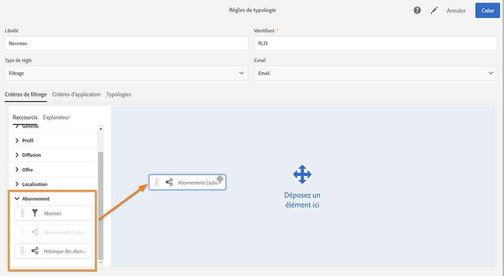
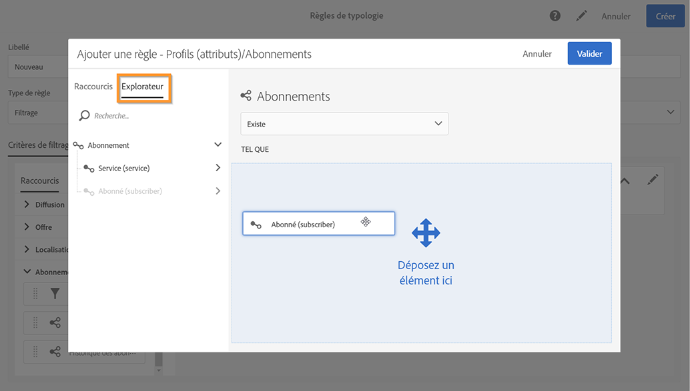
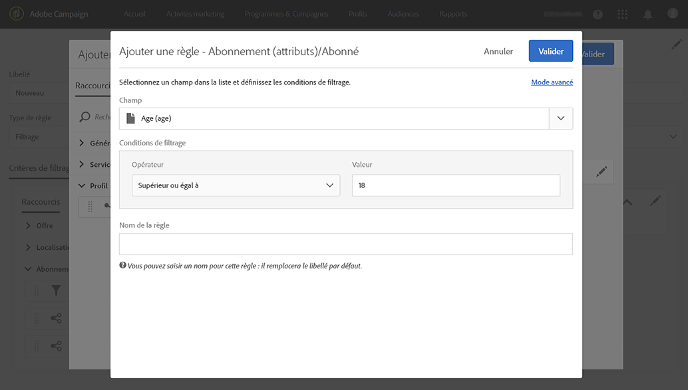
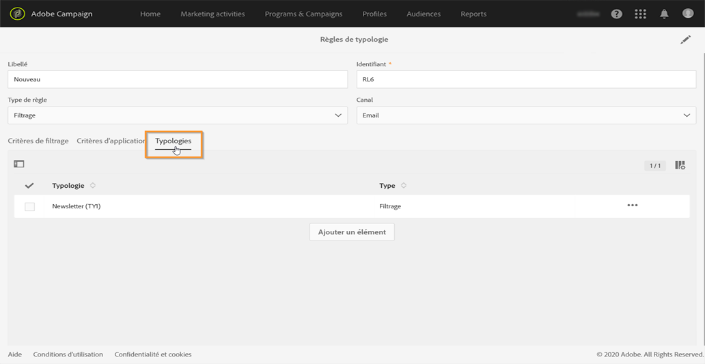
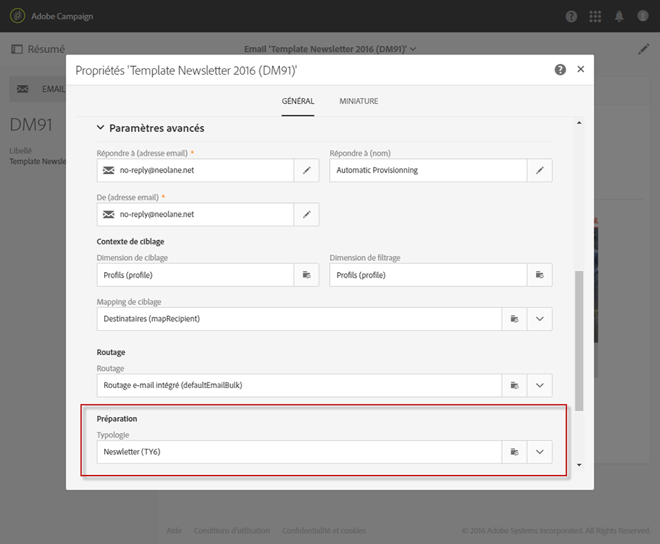
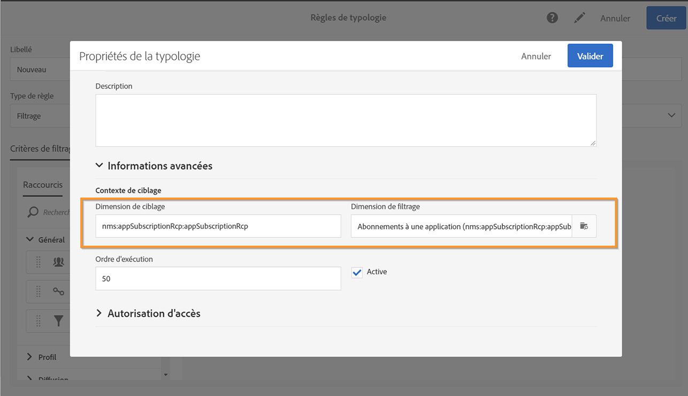
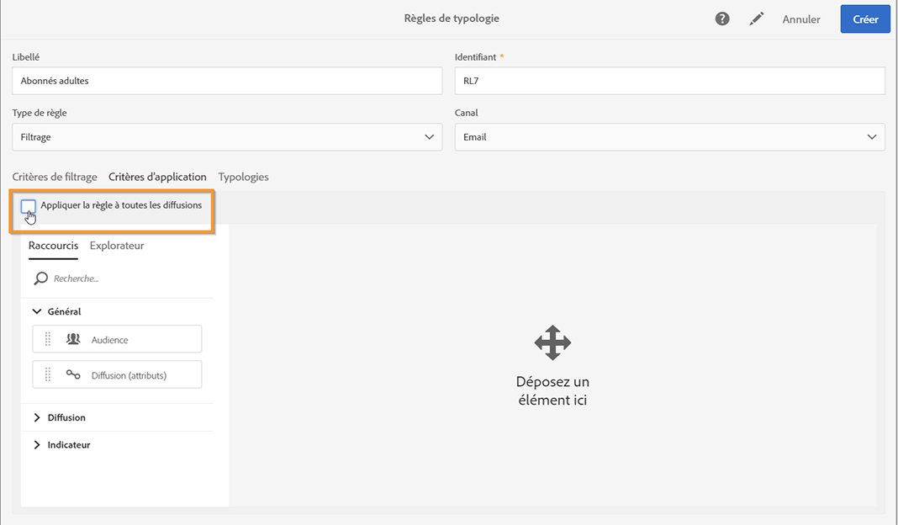
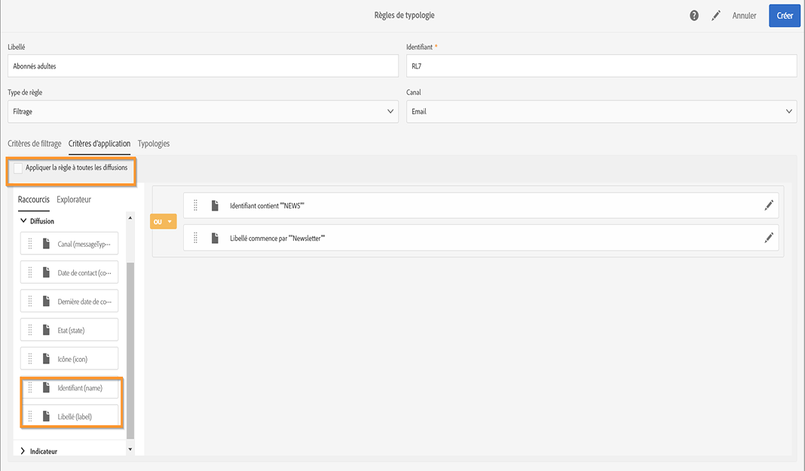

# Règles de filtrage {#filtering-rules}

Les règles de filtrage permettent d&#39;exclure une partie de la cible des messages en fonction de critères définis dans une requête, comme des profils mis en quarantaine ou à qui on a déjà envoyé un certain nombre d&#39;emails.

## Règle de typologie de filtrage par défaut {#default-filtering-typology-rules}

Le tableau ci-dessous fournit des informations sur les règles de filtrage d’usine ainsi que sur leurs canaux associés.

| Libellé | Canal | Description |
---------|----------|---------
| **[!UICONTROL Adresse non renseignée]** | Tous | Exclut la population cible sans adresse spécifiée (adresse électronique, adresse postale, etc. selon le canal sélectionné). |
| **[!UICONTROL Adresse sur liste bloquée]** | Tous | Exclut les adresses qui se trouvent sur la liste bloquée. |
| **[!UICONTROL Doublon]** | Tous | Exclut les duplicatas en fonction du champ **[!UICONTROL Adresse]** de la population cible. |
| **[!UICONTROL Exclure les applications mobiles]** | Mobile application | Exclut les abonnements aux applications qui ne correspondent pas à l’application mobile définie dans le message. |
| **[!UICONTROL Exclure les applications mobiles pour le message In-App]** | In-App | Exclut les abonnements aux applications qui ne correspondent pas à l’application mobile définie dans le message (modèle In-App). |
| **[!UICONTROL Exclure les applications mobiles des diffusions In-App]** | In-App | Exclut les abonnements à des applications qui ne correspondent pas à l’application mobile définie dans le message (modèle de diffusion In-App). |
| **[!UICONTROL Exclure les applications mobiles pour les notifications push]** | Mobile application | Exclut les abonnements à des applications qui ne correspondent pas à l’application mobile définie dans le message (pour Push). |
| **[!UICONTROL Adresse en quarantaine]** | Tous | Exclut les adresses mises en quarantaine. |
| **[!UICONTROL Cible limitée en taille]** | Tous | Vérifie si la taille maximale de diffusion a été atteinte pour la cible. S’applique aux diffusions de mailing direct avec l’option « date limite de diffusion » activée. |

Outre ces règles de filtrage par défaut, deux règles d’exclusion sont disponibles :

* **[!UICONTROL Exclusion d’adresses]** (**[!UICONTROL addressExclusions]**)
* **[!UICONTROL Exclusion de domaines]** (**[!UICONTROL domainExclusions]**).

Pendant l&#39;analyse de l&#39;email, ces règles comparent les adresses email des destinataires aux adresses ou noms de domaine interdits contenus dans une liste de suppression globale cryptée, gérée dans l&#39;instance de délivrabilité. S&#39;il existe une correspondance, le message n&#39;est pas envoyé au destinataire concerné.

Ces règles d’exclusion permettent d’éviter toute mise en liste bloquée liée à une activité malveillante, notamment l’utilisation d’un spam trap (piège à spam). Si un spam trap est par exemple utilisé pour s’abonner par le biais de l’un de vos formulaires web, un email de confirmation lui est automatiquement envoyé. Votre adresse est alors automatiquement mise en liste bloquée.

>[!NOTE]
>
>Les adresses et les noms de domaine contenus dans la liste de suppression globale sont masqués. Seul le nombre des destinataires exclus est indiqué dans les logs d&#39;analyse de diffusion.

## Créer une règle de filtrage      {#creating-a-filtering-rule}

Vous pouvez créer vos propres règles de filtrage en fonction de vos besoins. Vous pouvez par exemple filtrer la population cible de votre newsletter afin de ne jamais adresser de communications aux inscrits de moins de 18 ans.

Pour créer cette règle de typologie de filtrage, procédez comme suit :

1. Créer une nouvelle règle de typologie. Les étapes principales pour créer des règles de typologie de sont détaillées dans [cette section](../../sending/using/managing-typology-rules.md).

1. Sélectionnez le type de règle **[!UICONTROL Filtrage]**, puis spécifiez le canal de votre choix.

1. Dans l&#39;onglet **[!UICONTROL Critères de filtrage]**, sélectionnez les abonnements dans la catégorie **[!UICONTROL Abonnement]**.

   

1. Dans l&#39;onglet **[!UICONTROL Explorateur]** de l&#39;éditeur de requêtes, faites glisser le nœud **[!UICONTROL Abonné]** dans la partie centrale de l&#39;écran.

   

1. Sélectionnez le champ **[!UICONTROL Age]** et définissez les conditions de filtrage de sorte que l&#39;âge des abonnés soit supérieur ou égal à 18.

   

1. Dans l&#39;onglet **[!UICONTROL Typologies]**, associez cette règle à une typologie.

   

1. Assurez-vous que la typologie est bien sélectionnée dans la diffusion ou le modèle de diffusion que vous souhaitez utiliser. Voir à ce propos [cette section](../../sending/using/managing-typologies.md#applying-typologies-to-messages).

   

Lorsque cette règle est utilisée dans un message, les abonnés mineurs sont automatiquement exclus.

## Configuration du contexte de ciblage des règles de filtrage {#configuring-filtering-rules-targeting-context}

Campaign Standard vous permet de configurer les dimensions **Ciblage** et **Filtrage** à utiliser en fonction des données que vous souhaitez cibler.

Pour ce faire, ouvrez les propriétés de la règle de typologie, puis accédez à la section **[!UICONTROL Informations avancées]**.

Par défaut, le filtrage porte sur les **[!UICONTROL Profils]**. Par exemple, si la règle est destinée à une application mobile, la **[!UICONTROL Dimension de filtrage]** peut être changée en **[!UICONTROL Abonnements à une application]**.

## Restreindre la portée d&#39;une règle de filtrage     {#restricting-the-applicability-of-a-filtering-rule}

Vous pouvez restreindre le champ d&#39;application d&#39;une règle de filtrage en fonction du message à envoyer.

1. Dans l&#39;onglet **[!UICONTROL Critères d&#39;application]** de la règle de typologie, décochez l&#39;option **[!UICONTROL Appliquer la règle à toutes les diffusions]**, activée par défaut.

   

1. Utilisez l&#39;éditeur de requêtes pour définir le filtre de votre choix. Vous pouvez par exemple appliquer uniquement la règle aux messages dont le libellé commence par un mot donné ou dont l&#39;identifiant contient certaines lettres.

   

Dans ce cas, la règle n&#39;est appliquée qu&#39;aux messages correspondant aux critères définis.
