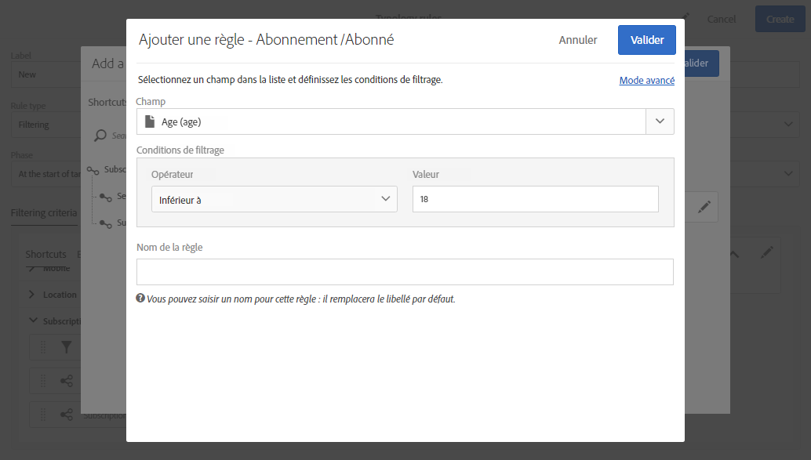

# Règles de filtrage {#filtering-rules}

Les règles de filtrage permettent d&#39;exclure une partie de la cible des messages en fonction de critères définis dans une requête, comme des profils mis en quarantaine ou à qui on a déjà envoyé un certain nombre d&#39;emails.

##  de filtrage par défaut {#default-filtering-typology-rules}

Le tableau ci-dessous fournit des informations sur les règles de filtrage prêtes à l’emploi, ainsi que sur les  de leurs associés.

| Libellé | Channel | Description |
---------|----------|---------|---------
| **[!UICONTROL Address not specified]** | Tous | Exclut la population de  sans adresse spécifiée (adresse électronique, adresse postale, etc.). selon le  sélectionné). |
| **[!UICONTROL Blacklisted address]** | Tous | Exclut les adresses. |
| **[!UICONTROL Duplicate]** | Tous | Exclut les  d’après le **[!UICONTROL Address]** champ de population . |
| **[!UICONTROL Exclude mobile applications]** | Mobile application | Exclut les  d’application qui ne correspondent pas à l’application mobile définie dans le message. |
| **[!UICONTROL Exclude mobile applications for In-App]** | In-App | Exclut les  d’application qui ne correspondent pas à l’application mobile définie dans le message (modèle in-app). |
| **[!UICONTROL Exclude mobile applications for In-App broadcast]** | In-App | Exclut les  d’application  qui ne correspondent pas à l’application mobile définie dans le message (modèle de diffusion in-app). |
| **[!UICONTROL Exclude mobile applications for Push]** | Mobile application | Exclut les d’application   qui ne correspondent pas à l’application mobile définie dans le message (pour Push). |
| **[!UICONTROL Quarantined address]** | Tous | Exclut les adresses mises en quarantaine. |
| **[!UICONTROL Target limited in size]** | Tous | Vérifie si la taille maximale du  du a été atteinte pour le . S’applique aux  de messagerie directe avec l’option &quot;&quot; activée. |

Outre ces règles de filtrage par défaut, deux règles d’exclusion sont disponibles :

* **[!UICONTROL Exclusion of addresses]** ( **[!UICONTROL addressExclusions]** )
* **[!UICONTROL Exclusion of domains]** ( **[!UICONTROL domainExclusions]** ).

Pendant l&#39;analyse de l&#39;email, ces règles comparent les adresses email des destinataires aux adresses ou noms de domaine interdits contenus dans une liste de suppression globale cryptée, gérée dans l&#39;instance de délivrabilité. S&#39;il existe une correspondance, le message n&#39;est pas envoyé au destinataire concerné.

Ces règles d&#39;exclusion permettent d&#39;éviter tout blacklistage lié à une activité malveillante, notamment l&#39;utilisation d&#39;un spam trap (piège à spam). Si un spam trap est par exemple utilisé pour s&#39;abonner par le biais de l&#39;un de vos formulaires web, un email de confirmation lui est automatiquement envoyé. Votre adresse est alors automatiquement blacklistée.

>[!NOTE]
>
>Les adresses et les noms de domaine contenus dans la liste de suppression globale sont masqués. Seul le nombre des destinataires exclus est indiqué dans les logs d&#39;analyse de diffusion.

## Créer une règle de filtrage  {#creating-a-filtering-rule}

Vous pouvez créer vos propres règles de filtrage en fonction de vos besoins. Vous pouvez, par exemple, filtrer la population  des bulletins d’information afin que les abonnés de moins de 18 ans ne reçoivent jamais de communications.

Pour créer un  de filtrage, procédez comme suit :

1. Créez un nouveau  de. Les étapes principales pour créer des  de sont détaillées dans [cette section](../../sending/using/managing-typology-rules.md).

1. Sélectionnez le type de **[!UICONTROL Filtering]** règle, puis spécifiez le  de souhaité.

1. In the **[!UICONTROsL Filtering criteria]** tab, select the subscriptions in the **[!UICONTROL Subscription]** category.

   

1. In the **[!UICONTROL Explorer]** tab of the query editor, drag and drop the **[!UICONTROL Subscriber]** node into the main part of the screen.

   

1. Sélectionnez le champ **[!UICONTROL Age]** et définissez les conditions de filtrage de sorte que l&#39;âge des abonnés soit supérieur ou égal à 18.

   

1. Dans l&#39;onglet **[!UICONTROL Typologies]**, associez cette règle à une typologie.

   

1. Assurez-vous que la typologie est sélectionnée dans le  de ou le  de à utiliser. Voir à ce propos [cette section](../../sending/using/managing-typologies.md#applying-typologies-to-messages).

   

Lorsque cette règle est utilisée dans un message, les abonnés mineurs sont automatiquement exclus.

## Configuration du contexte de ciblage des règles de filtrage {#configuring-filtering-rules-targeting-context}

Campaign Standard vous permet de configurer les dimensions **Ciblage** et **Filtrage** à utiliser en fonction des données à .

Pour ce faire, ouvrez les propriétés  du, puis accédez à la **[!UICONTROL Advanced information]** section.

By default, filtering is carried out on the **[!UICONTROL Profiles]**. Si, par exemple, la règle est destinée à une application mobile, vous **[!UICONTROL Filtering dimension]** pouvez la remplacer par **[!UICONTROL Subscriptions to an application]**.

## Restreindre la portée d&#39;une règle de filtrage {#restricting-the-applicability-of-a-filtering-rule}

Vous pouvez restreindre le champ d&#39;application d&#39;une règle de filtrage en fonction du message à envoyer.

1. Dans l’ **[!UICONTROL Application criteria]** onglet  du, désélectionnez l’ **[!UICONTROL Apply the rule on all deliveries]** option activée par défaut.

   

1. Utilisez l&#39;éditeur de requêtes pour définir le filtre de votre choix. Vous pouvez par exemple appliquer uniquement la règle aux messages dont le libellé commence par un mot donné ou dont l&#39;identifiant contient certaines lettres.

   

Dans ce cas, la règle n&#39;est appliquée qu&#39;aux messages correspondant aux critères définis.
