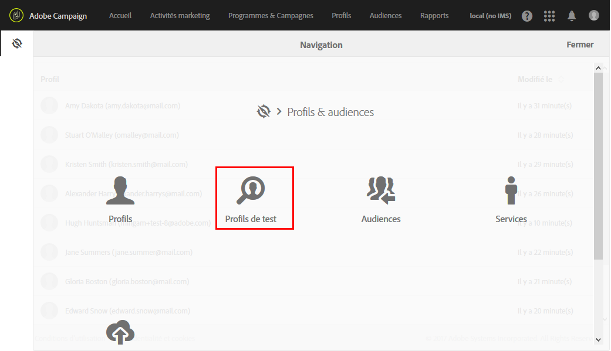
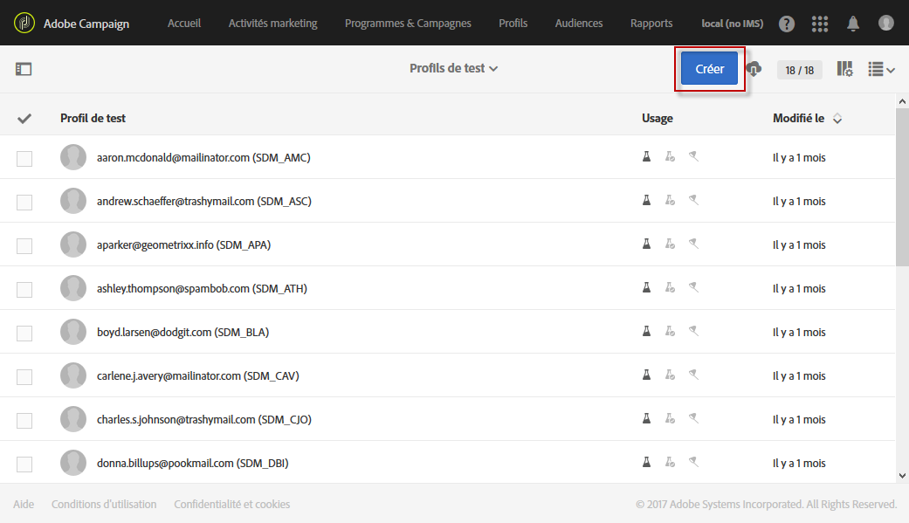
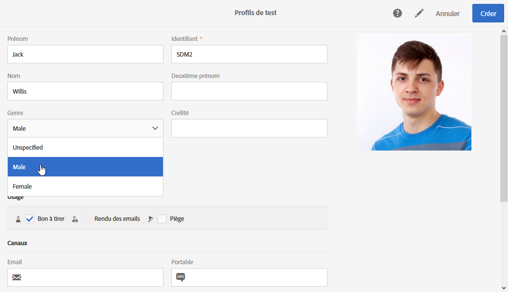
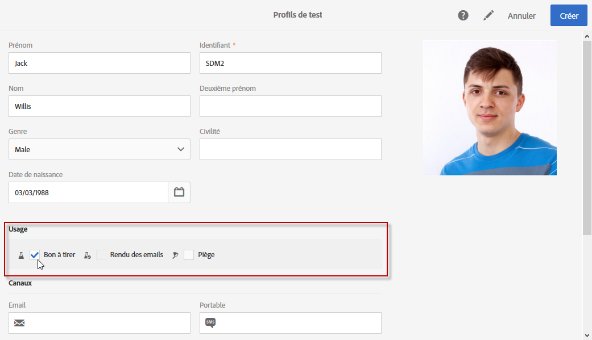
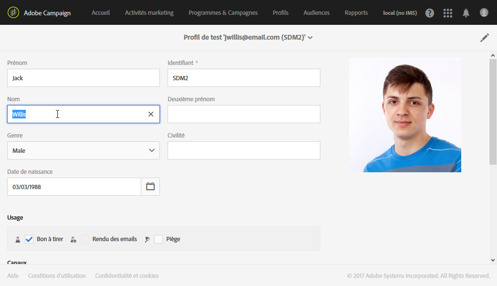
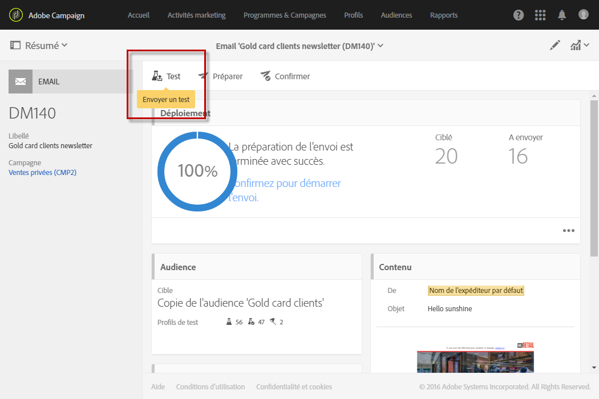
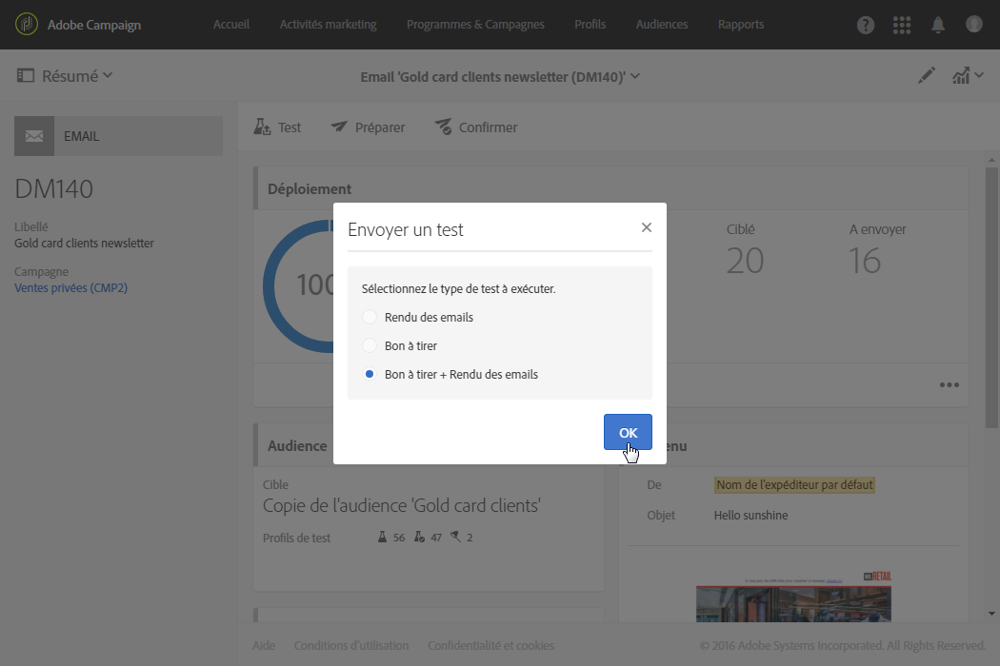
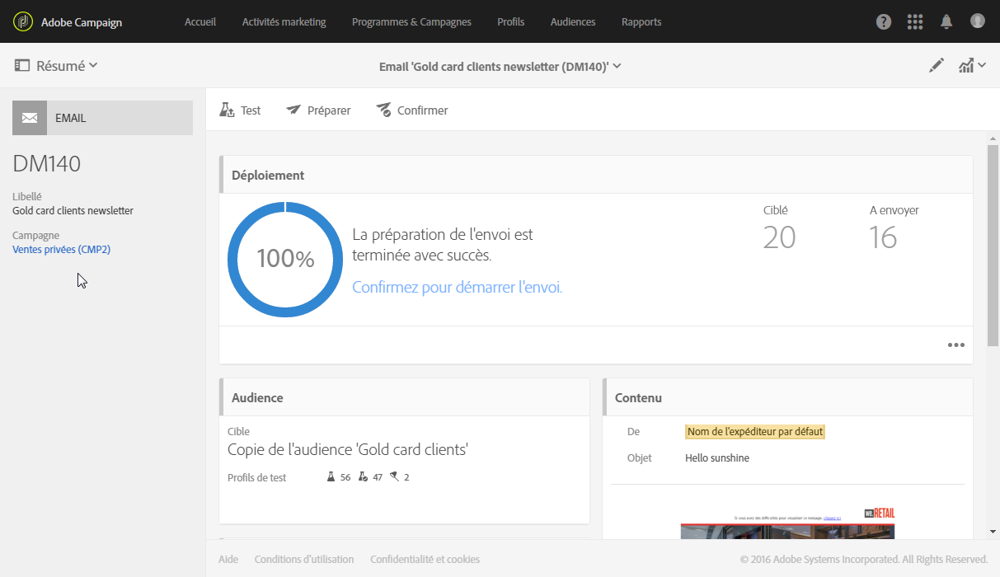
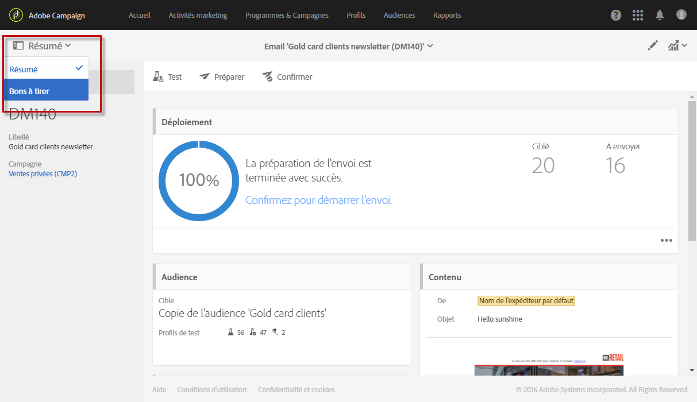
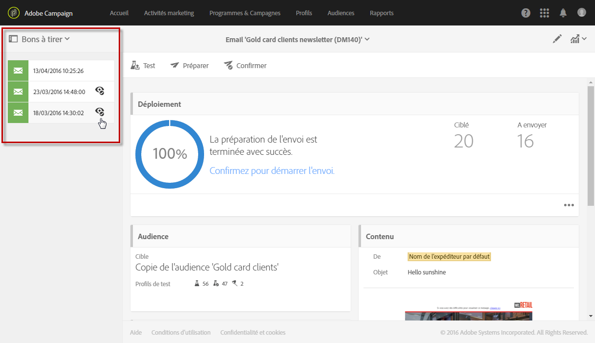

# Gérer les profils de test et envoyer un bon à tirer{#managing-test-profiles-and-sending-proofs}

## Profils de test {#about-test-profiles}

Les profils de test permettent de cibler des destinataires additionnels, qui ne correspondent pas aux critères de ciblage définis. Ils sont ajoutés à l'audience d'un message afin de détecter une utilisation frauduleuse de votre base de destinataire ou de contrôler la bonne réception de vos messages.

Vous pouvez gérer vos profils de test depuis le menu avancé **[!UICONTROL Profils &amp; audiences &gt; Profils de test]**.

Un profil de test est un profil contenant des informations de contact fictives ou contrôlées par l'expéditeur et pouvant être utilisé dans un message dans les contextes suivants :

* Pour envoyer un **Bon à tirer** : le bon à tirer (BAT) est un message spécifique qui permet de valider le message avant l'envoi de la diffusion finalisée aux destinataires. Un profil de test de type Bon à tirer est chargé de la validation de la diffusion, tant sur son contenu que sur sa forme. Voir [Envoyer un bon à tirer](../../sending/using/managing-test-profiles-and-sending-proofs.md#sending-proofs).
* Pour le **Rendu des emails** : un profil de test de type Rendu des emails est utilisé pour contrôler l'affichage d'un message en fonction de la boîte de messagerie qui le réceptionne. Par exemple : webmail, service de messagerie, mobile, etc. Voir [Rendu des emails](../../sending/using/email-rendering.md).

   L'usage **Rendu des emails** est en lecture seule. Des profils de test disposant de cet usage sont disponibles uniquement nativement dans Adobe Campaign.

* Comme **Piège** : le message est envoyé au profil de test au même titre que la cible principale, notamment pour identifier une utilisation frauduleuse de votre fichier client.
* Pour la **Prévisualisation** des messages : un profil de test peut être sélectionné lors de la prévisualisation d'un message afin de tester les éléments de personnalisation.

## Gestion des profils de test {#managing-test-profiles}

### Créer un profil de test {#creating-test-profiles}

1. Pour accéder à la liste des profils de test, sélectionnez **Profils &amp; audiences &gt; Profils de test** dans le menu de navigation (via le logo Adobe Campaign).

   

1. Depuis le tableau de bord des **[!UICONTROL Profils de test]**, cliquez sur **Créer**.

   

1. Renseignez les données de ce profil.

   

1. Sélectionnez l'usage du profil de test.

   

1. Enter the contact channels **[!UICONTROL Email, Telephone, Mobile, Mobile app]**, as well as the test profile address if necessary.

   >[!NOTE]
   >
   >Vous pouvez définir une préférence de format d'email : **[!UICONTROL Texte]** ou **[!UICONTROL HTML]**.

1. Spécifiez un type d'événement et les données de cet événement si vous souhaitez utiliser ce profil de test pour tester la personnalisation d'un message transactionnel.
1. Cliquez sur **[!UICONTROL Créer]pour enregistrer le profil de test.**

Le profil de test est alors ajouté dans la liste des profils.

**Rubrique connexe :**

Vidéo [Créer un profil de test](https://helpx.adobe.com/campaign/kt/acs/using/acs-test-profiles-feature-video-use.html).

### Editer un profil de test {#editing-test-profiles}

Pour éditer un profil de test et consulter les données qui lui sont associées, ou pour le modifier, les étapes sont les suivantes :

1. Sélectionnez le profil de test voulu en cliquant sur son image.
1. Consultez ou modifiez les champs.

   

1. Choisissez **[!UICONTROL Enregistrer]** si vous avez saisi des modifications ; ou sélectionnez le nom du profil de test puis **Profils de test]dans la section supérieure de l'écran pour revenir au tableau de bord des profils de test.[!UICONTROL **

## Envoyer un bon à tirer {#sending-proofs}

Le bon à tirer (BAT) est un message spécifique qui permet de tester un message avant son envoi à la cible principale.

Les destinataires du BAT sont chargés de la validation du message (contenu et forme). Ils sont définis dans les **Profils de test**. Voir à ce sujet la section [Gérer les profils de test](../../sending/using/managing-test-profiles-and-sending-proofs.md#managing-test-profiles).

Pour pouvoir envoyer un bon à tirer, des profils de test doivent être inclus dans l'audience de votre message.

Au niveau d'un message :

1. Cliquez sur le bouton **[!UICONTROL Envoyer un test].**

   

1. Sélectionnez le type de BAT que vous souhaitez utiliser :

   * **[!UICONTROL Rendu des emails]** : sélectionnez cette option pour tester la réception de votre message en fonction des boîtes de messagerie ciblées. Pour plus d'informations, voir [Rendu des emails](../../sending/using/email-rendering.md).
   * **[!UICONTROL Bon à tirer]** : sélectionnez cette option pour tester le message avant son envoi à la cible principale. Les destinataires du BAT sont chargés de la validation de la diffusion, tant sur son contenu que sur sa forme.
   * **[!UICONTROL Bon à tirer + Rendu des emails]** : cette option regroupe les deux options précédentes.
   

1. Validez votre choix.

   Les BAT sont envoyés aux profils de test.

   

1. Vous pouvez consulter les BAT depuis la liste déroulante **[!UICONTROL Bons à tirer].**

   

1. Sélectionnez un BAT pour accéder à son résumé. Pour un email, si vous avez sélectionné l'option **rendu des emails** lors du choix des BAT, l'icône **[!UICONTROL Accéder au rendu des emails]est affichée à droite du libellé du BAT.** Voir [Rendu des emails](../../sending/using/email-rendering.md).

   

En fonction des remarques des personnes qui reçoivent le BAT, vous serez amené à modifier le contenu de la diffusion. Une fois vos modifications effectuées, vous devez relancer la préparation de l'email puis envoyer à nouveau un BAT. Chaque nouveau BAT est accessible depuis le bouton **[!UICONTROL Afficher les bons à tirer].**

Vous devez envoyer autant de BAT que nécessaire jusqu'à ce que le contenu de votre diffusion soit finalisé. Dès lors, vous pouvez envoyer la diffusion à la cible principale et clore le cycle de validation.

**Rubrique connexe :**

Vidéo [Envoyer un test, préparer un email et l'envoyer](https://helpx.adobe.com/campaign/kt/acs/using/acs-sending-test-preparing-sending-email-feature-video-use.html)

## Sending proofs using additional data {#sending-proofs-using-additional-data}

Cette section explique comment envoyer des épreuves à l'aide de données client réelles accessibles via un flux de travail, plutôt que d'utiliser des données de profil de test factice. Cela vous permet de vérifier que les variables utilisées dans le processus sont exactes et d'obtenir une vue du message reçu par vos destinataires.

1. Create a test profile and enable **[!UICONTROL Proof]** and **[!UICONTROL Trap]** as the intended usage. Voir à ce sujet la section [Gérer les profils de test](../../sending/using/managing-test-profiles-and-sending-proofs.md#managing-test-profiles).

   Ce profil de test fait partie du public ciblé.

   >[!NOTE]
   >
   >Lors de l'utilisation d'un profil de test comme recouvrement, pour les champs enrichis d'un message, les données supplémentaires correspondantes sont sélectionnées de manière aléatoire à partir d'un profil ciblé réel et affectées au profil du test de recouvrement.

1. Accédez à la liste des activités marketing et créez un processus de test.

   Voir à ce propos la section [Créer un workflow](../../automating/using/building-a-workflow.md#creating-a-workflow).

1. Placez une activité **[!UICONTROL Requête]dans votre workflow, puis ouvrez-la.**

   L'activité Requête est présentée dans la section [Requête](../../automating/using/query.md).

1. Ajoutez des données supplémentaires à partir d'un tableau lié. For more on this, see [Enriching data](../../automating/using/query.md#enriching-data).

1. Placez une activité **Diffusion Email** dans votre workflow, puis ouvrez-la.

   L'activité Diffusion Email est présentée dans la section [Diffusion Email](../../automating/using/email-delivery.md).

1. Dans le tableau de bord des messages électroniques, sélectionnez le profil de test avec l'utilisation du recouvrement que vous avez créée.

1. Ajoutez aux champs de personnalisation de votre contenu email les données supplémentaires que vous avez définies dans l'activité Requête.

1. Enregistrez le courrier électronique et démarrez le processus.

Lors de la préparation du message, le nombre de cibles inclut le profil de test que vous avez sélectionné.
Une fois le message envoyé, d'autres données sont remplacées par des données provenant d'un profil réel.

>[!NOTE]
>
>Seules les données supplémentaires sont remplacées. Aucune donnée de profil réelle, telle que prénom ou nom, ne sera utilisée pour le profil de test.
