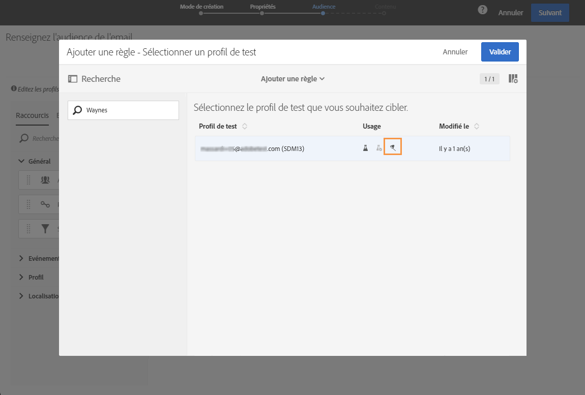
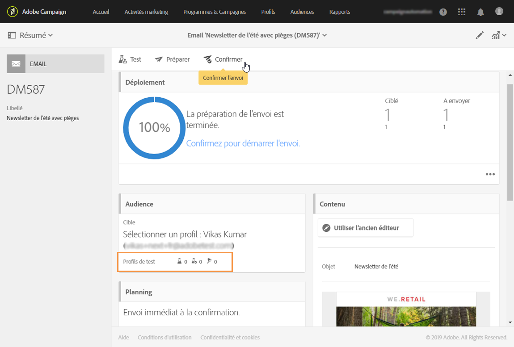

# Gérer les profils de test et envoyer un bon à tirer{#managing-test-profiles-and-sending-proofs}

## Profils de test {#about-test-profiles}

Les profils de test permettent de cibler des destinataires additionnels, qui ne correspondent pas aux critères de ciblage définis. Ils sont ajoutés à l'audience d'un message afin de détecter une utilisation frauduleuse de votre base de destinataire ou de contrôler la bonne réception de vos messages.

Vous pouvez gérer vos profils de test depuis le menu avancé **[!UICONTROL Profils &amp; audiences &gt; Profils de test]**.

Un profil de test est un profil contenant des informations de contact fictives ou contrôlées par l'expéditeur et pouvant être utilisé dans un message dans les contextes suivants :

* Pour envoyer un **Bon à tirer** : le bon à tirer (BAT) est un message spécifique qui permet de valider le message avant l'envoi de la diffusion finalisée aux destinataires. Un profil de test de type Bon à tirer est chargé de la validation de la diffusion, tant sur son contenu que sur sa forme. Voir [Envoyer un bon à tirer](../../sending/using/managing-test-profiles-and-sending-proofs.md#sending-proofs).
* Pour le **Rendu des emails** : un profil de test de type Rendu des emails est utilisé pour contrôler l'affichage d'un message en fonction de la boîte de messagerie qui le réceptionne. Par exemple : webmail, service de messagerie, mobile, etc. Voir [Rendu des emails](../../sending/using/email-rendering.md).

   L'usage **Rendu des emails** est en lecture seule. Des profils de test disposant de cet usage sont disponibles uniquement nativement dans Adobe Campaign.

* **En tant que piège**: le message est envoyé au profil d'essai tout comme il est envoyé à la cible principale. Voir [Utilisation des pièges](../../sending/using/managing-test-profiles-and-sending-proofs.md#using-traps).
* Pour la **Prévisualisation** des messages : un profil de test peut être sélectionné lors de la prévisualisation d'un message afin de tester les éléments de personnalisation. Voir [Prévisualiser le message](/help/sending/using/previewing-messages.md).

## Gestion des profils de test   {#managing-test-profiles}

### Créer un profil de test {#creating-test-profiles}

1. Pour accéder à la liste des profils de test, sélectionnez **Profils &amp; audiences &gt; Profils de test** dans le menu de navigation (via le logo Adobe Campaign).

   

1. Depuis le tableau de bord des **[!UICONTROL Profils de test]**, cliquez sur **Créer**.

   

1. Renseignez les données de ce profil.

   

1. Sélectionnez l'usage du profil de test.

   

1. Renseignez les canaux de contacts **[!UICONTROL Email, Téléphone, Mobile, Application mobile]**, ainsi que l'adresse du profil de test si besoin.

   >[!NOTE]
   >
   >Vous pouvez définir une préférence de format d'email : **[!UICONTROL Texte]** ou **[!UICONTROL HTML]**.

1. Spécifiez un type d'événement et les données de cet événement si vous souhaitez utiliser ce profil de test pour tester la personnalisation d'un message transactionnel.
1. Cliquez sur **[!UICONTROL Créer]** pour enregistrer le profil de test.

Le profil de test est alors ajouté dans la liste des profils.

**Rubrique connexe :**

Vidéo [Créer un profil de test](https://helpx.adobe.com/campaign/kt/acs/using/acs-test-profiles-feature-video-use.html).

### Editer un profil de test {#editing-test-profiles}

Pour éditer un profil de test et consulter les données qui lui sont associées, ou pour le modifier, les étapes sont les suivantes :

1. Sélectionnez le profil de test voulu en cliquant sur son image.
1. Consultez ou modifiez les champs.

   

1. Choisissez **[!UICONTROL Enregistrer]** si vous avez saisi des modifications ; ou sélectionnez le nom du profil de test puis **[!UICONTROL Profils de test]** dans la section supérieure de l'écran pour revenir au tableau de bord des profils de test.

## Envoyer un bon à tirer {#sending-proofs}

Le bon à tirer (BAT) est un message spécifique qui permet de tester un message avant son envoi à la cible principale.

Les destinataires du BAT sont chargés de la validation du message (contenu et forme). Ils sont définis dans les **Profils de test**. Voir à ce sujet la section [Gérer les profils de test](../../sending/using/managing-test-profiles-and-sending-proofs.md#managing-test-profiles).

Pour pouvoir envoyer un bon à tirer, des profils de test doivent être inclus dans l'audience de votre message.

Au niveau d'un message :

1. Cliquez sur le bouton **[!UICONTROL Envoyer un test]**.

   

1. Sélectionnez le type de BAT que vous souhaitez utiliser :

   * **[!UICONTROL Rendu des emails]** : sélectionnez cette option pour tester la réception de votre message en fonction des boîtes de messagerie ciblées. Pour plus d'informations, voir [Rendu des emails](../../sending/using/email-rendering.md).
   * **[!UICONTROL Bon à tirer]** : sélectionnez cette option pour tester le message avant son envoi à la cible principale. Les destinataires du BAT sont chargés de la validation de la diffusion, tant sur son contenu que sur sa forme.
   * **[!UICONTROL Bon à tirer + Rendu des emails]** : cette option regroupe les deux options précédentes.
   

1. Validez votre choix.

   Les BAT sont envoyés aux profils de test.

   

1. Vous pouvez consulter les BAT depuis la liste déroulante **[!UICONTROL Bons à tirer]**.

   

1. Sélectionnez un BAT pour accéder à son résumé. Pour un email, si vous avez sélectionné l'option **rendu des emails** lors du choix des BAT, l'icône **[!UICONTROL Accéder au rendu des emails]** est affichée à droite du libellé du BAT. Voir [Rendu des emails](../../sending/using/email-rendering.md).

   

En fonction des remarques des personnes qui reçoivent le BAT, vous serez amené à modifier le contenu de la diffusion. Une fois vos modifications effectuées, vous devez relancer la préparation de l'email puis envoyer à nouveau un BAT. Chaque nouveau BAT est accessible depuis le bouton **[!UICONTROL Afficher les bons à tirer]**.

Vous devez envoyer autant de BAT que nécessaire jusqu'à ce que le contenu de votre diffusion soit finalisé. Dès lors, vous pouvez envoyer la diffusion à la cible principale et clore le cycle de validation.

**Rubrique connexe :**

Vidéo [Envoyer un test, préparer un email et l'envoyer](https://helpx.adobe.com/campaign/kt/acs/using/acs-sending-test-preparing-sending-email-feature-video-use.html)

## À l'aide de pièges {#using-traps}

Lorsque vous utilisez des pièges, le message est envoyé au profil d'essai comme il est envoyé à la cible principale, comme moyen de déterminer si votre dossier client est utilisé frauduleusement.

Les pièges ont été conçus à l'origine pour des livraisons directes. Ils vous permettent :
* Vérifiez que votre fournisseur de courrier direct envoie réellement la communication.
* Recevez le courrier en même temps et dans les mêmes conditions que vos clients.
* Conservez une copie exacte du courrier envoyé.
* Vérifiez que votre liste de clients n'est pas utilisée par votre fournisseur de courrier direct. En effet, si une autre communication est envoyée à l'adresse de votre profil d'essai, votre dossier client peut avoir été utilisé sans votre connaissance. C'est pourquoi l'adresse du profil d'essai ne devrait être utilisée qu'à cette fin.

Pour plus d'informations sur l'ajout de pièges à un public de publipostage direct, voir [Ajouter des profils d'essai et de capture](../../channels/using/defining-the-direct-mail-audience.md#adding-test-and-trap-profiles).

Pour les autres canaux de communication, vous pouvez ajouter des profils d'essai de piège à votre cible principale afin de :
* Vérifiez que votre message a été envoyé avec succès.
* Obtenez et conservez une copie exacte de votre message.
* Track quand il a été envoyé et reçu.

Pour utiliser un profil d'essai comme piège, il doit être inclus dans le public de votre message.

>[!NOTE]
>
>Par opposition aux profils d'essai utilisés pour [les épreuves](../../sending/using/managing-test-profiles-and-sending-proofs.md#sending-proofs) ou [le rendu électronique](../../sending/using/email-rendering.md), le message est envoyé en même temps à la cible principale et aux profils d'essai utilisés comme pièges.

Lorsque vous définissez le public d'un message :

1. À partir de **[!UICONTROL l'onglet Profils]** d'essai, sélectionnez un profil d'essai. Assurez-vous qu'il a **[!UICONTROL le piège]** comme l'usage prévu.

   

1. Une fois le contenu de votre message prêt, cliquez sur **[!UICONTROL le]** bouton Préparer. Voir [Préparer l'envoi](../../sending/using/preparing-the-send.md).
   >[!NOTE]
   >
   >Assurez-vous que vous avez choisi un objectif principal. Sinon, votre message ne peut pas être envoyé.

1. Cliquez sur le bouton **[!UICONTROL Confirmer.]** Voir [Confirmer l'envoi](../../sending/using/confirming-the-send.md).

   

Le message est envoyé à la cible principale et au profil d'essai.

>[!NOTE]
>
>Lorsque l'on utilise un profil d'essai comme piège, pour tout champ enrichi dans un message, les données supplémentaires correspondantes sont choisies aléatoirement à partir d'un profil ciblé réel et assigné au profil d'essai du piège. Pour plus d'enrichissement, voir [cet exemple](../../automating/using/enrichment.md#example--enriching-profile-data-with-data-contained-in-a-file).
