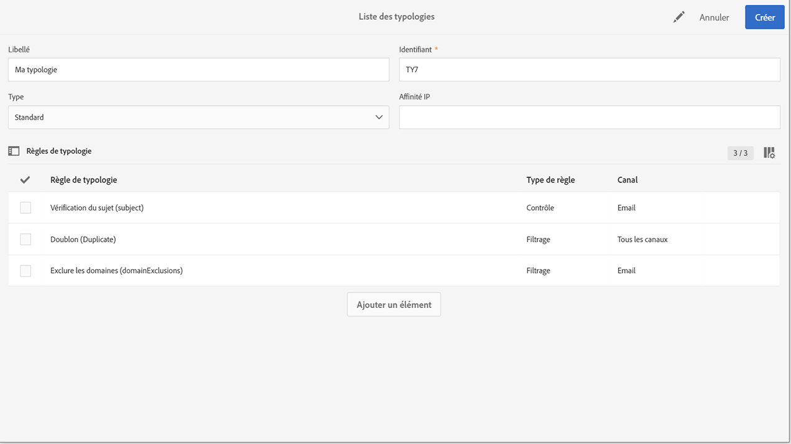

# Gestion des typologies {#managing-typologies}

## À propos des typologies {#about-typologies}

Les typologies sont des ensembles de règles qui vous permettent de vérifier la validité de votre message avant de l’envoyer. Par exemple : le contenu du message n’est pas vide, un désabonnement est présent, une exclusion des doublons, etc.

Les typologies sont accessibles via le menu **[!UICONTROL Administration]** > **[!UICONTROL Canaux]** > **[!UICONTROL Typologies]**. Par défaut, une typologie par défaut est disponible dans l’application. Selon vos besoins, vous pouvez créer vos propres typologies ou modifier celles qui existent déjà.

Pour chaque typologie, la section **[!UICONTROL Règles de typologie]** répertorie l’ensemble des règles qui sont exécutées lors de l’utilisation de la typologie avec un message.

>[!NOTE]
>
>Pour plus d’informations sur une règle de typologie, double-cliquez dessus. La règle s’affiche en mode lecture seule.

## Création d’une typologie {#creating-a-typology}

Pour créer une typologie procédez comme suit :

1. Accédez au menu **[!UICONTROL Administration]** > **[!UICONTROL Canaux]** > **[!UICONTROL Typologies]**.

1. La liste des typologies s’affiche. Cliquez sur le bouton **[!UICONTROL Créer]**.

   

1. Définissez le **[!UICONTROL libellé]** de la typologie, puis cliquez sur le bouton **[!UICONTROL Ajouter un élément]** pour sélectionner les règles de typologie que vous souhaitez y inclure. Pour plus d’informations sur les règles de typologie, consultez [cette section](../../sending/using/managing-typology-rules.md).

   

   >[!NOTE]
   >
   >Le champ **[!UICONTROL Affinité IP]** permet de gérer les affinités selon votre configuration. Celles-ci sont définies dans le fichier de configuration de l’instance. Si vous souhaitez utiliser les affinités, contactez votre administrateur.

1. Cliquez sur **[!UICONTROL Créer]** pour confirmer votre sélection. Votre typologie est maintenant prête à être utilisée dans les messages.

## Application de typologies aux messages {#applying-typologies-to-messages}

Lors de l’association d’une typologie à un message ou à un modèle de message, les règles de typologie incluses dans la typologie sont exécutées pour vérifier la validité du message.

>[!NOTE]
>
>Chaque message ou modèle de message ne peut se voir affecter qu’une seule typologie.

Pour lier une typologie à un message, procédez comme suit :

1. Accédez aux propriétés du message. Notez que les modèles de message sont accessibles à partir du menu de navigation **[!UICONTROL Ressources]** > **[!UICONTROL Modèles]**.

1. Dans la section **[!UICONTROL Paramètres avancés]** > **[!UICONTROL Préparation]**, sélectionnez la typologie à lier au message.

   

1. Cliquez sur **[!UICONTROL Confirmer]**.

   La typologie sélectionnée est maintenant liée au message. Toutes les règles de typologie associées seront exécutées pour vérifier la validité du message.
