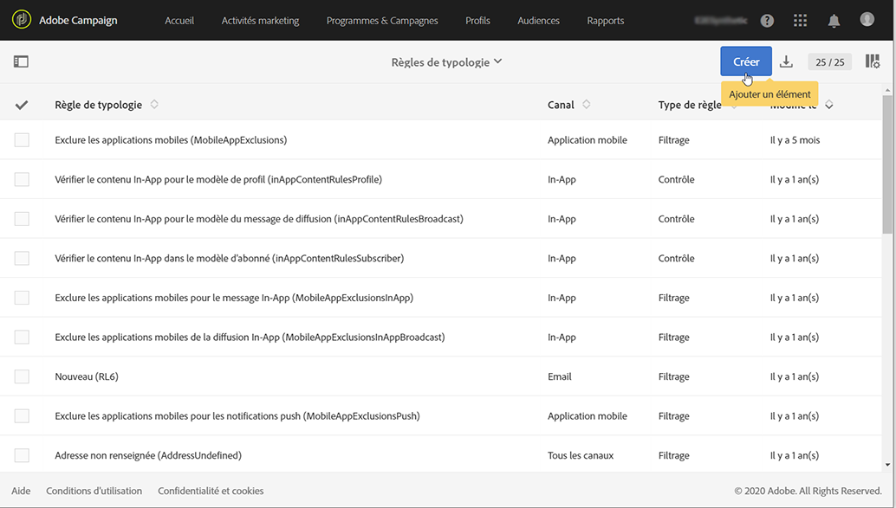
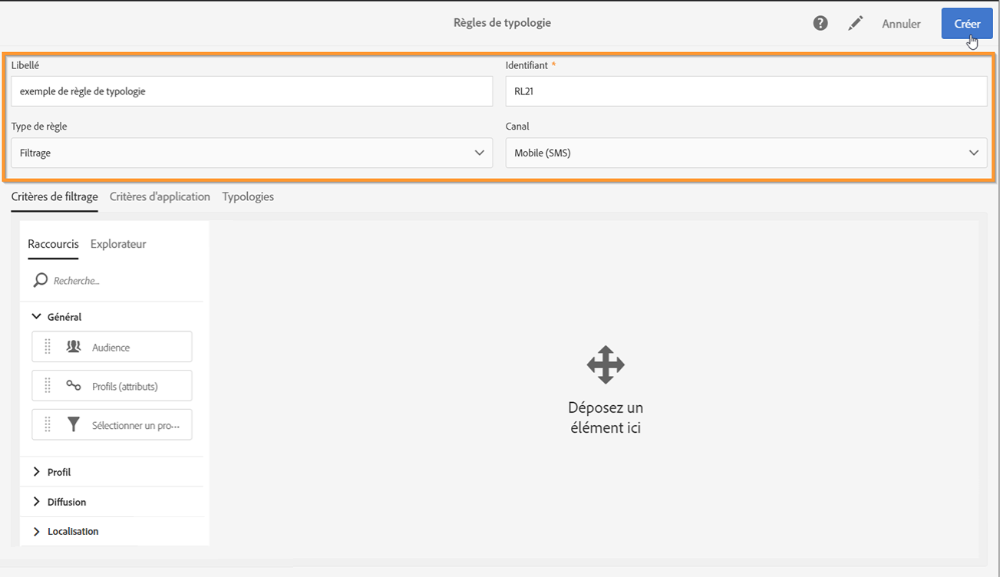
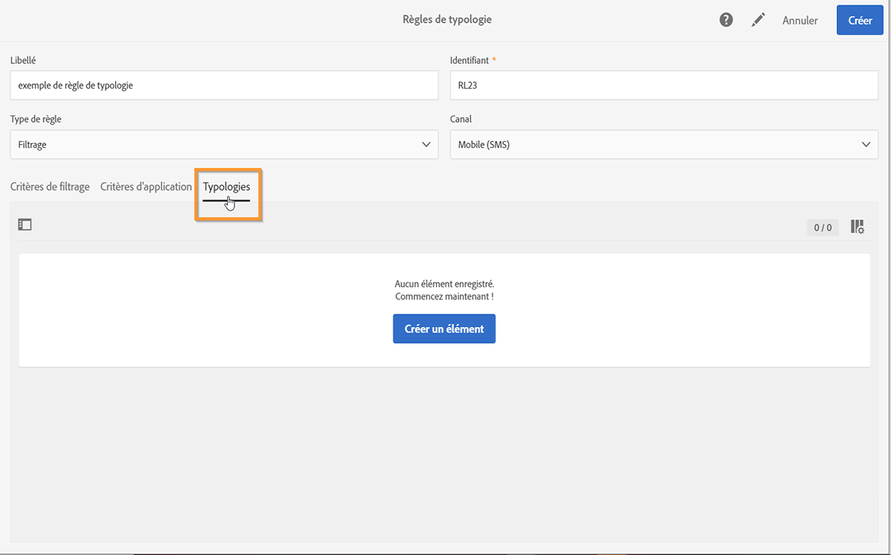
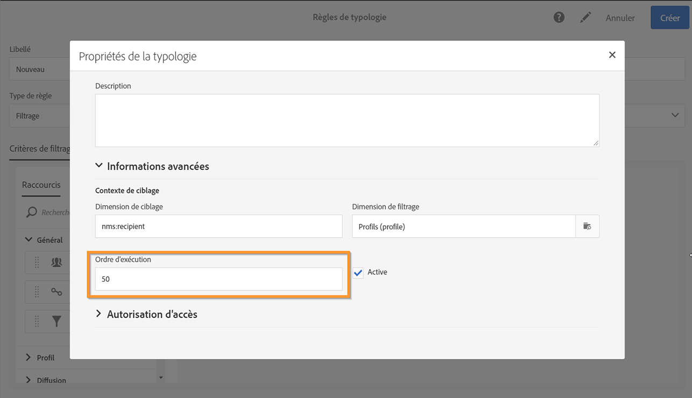
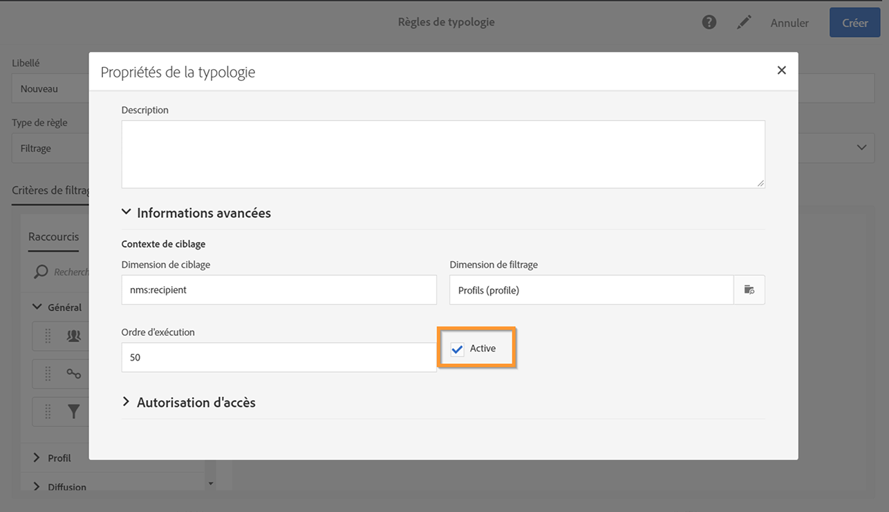

# Gestion des règles de typologie {#managing-typology-rules}

## A propos des règles de typologie {#about-typology-rules}

 Les règles de typologie sont des règles d’entreprise qui vous permettent d’effectuer des vérifications et filtrages de votre message avant de l’envoyer. Les types de règles de typologie disponibles sont les suivants :

* Règles de **filtrage** : Ce type de règle permet d’exclure une partie de la cible des messages en fonction de critères définis dans une requête, comme des profils mis en quarantaine ou à qui on a déjà envoyé un certain nombre d&#39;emails. Voir à ce propos [cette section](../../sending/using/filtering-rules.md).

* Règles de **fatigue** : Ce type de règle permet de définir un nombre maximum de messages par profil pour éviter de sur-solliciter les profils. Voir à ce propos [cette section](../../sending/using/fatigue-rules.md).

* Règles de **contrôle** : Ce type de règle permet de vérifier la validité et la qualité des messages avant leur envoi : affichage des caractères, taille des SMS, format des adresses, etc. Voir à ce propos [cette section](../../sending/using/control-rules.md).

Les règles de typologie sont disponibles depuis le menu **[!UICONTROL Administration]** > **[!UICONTROL Canaux]** > **[!UICONTROL Typologies]** > **[!UICONTROL Règles de typologie]**.

Par défaut, plusieurs règles de typologie de **filtre** et de **contrôle** d’usine sont disponibles. Elles sont détaillées dans les sections [Règles de filtrage](../../sending/using/fatigue-rules.md) et [Règles de contrôle](../../sending/using/control-rules.md).

Selon vos besoins, vous pouvez modifier des règles de typologie existantes ou en créer de nouvelles, à l’exception des règles de **[!UICONTROL contrôle]** , qui sont en lecture seule et ne peuvent pas être modifiées.

## Créer une règle de typologie {#creating-a-typology-rule}

Les principales étapes de création d’ue règle de typologie sont les suivantes :

1. Accédez au menu **[!UICONTROL Administration]** / **[!UICONTROL Canaux]** / **[!UICONTROL Typologies]** / **[!UICONTROL Règles de typologie]**, puis cliquez sur **[!UICONTROL Créer]**.

   

1. Entrez le **[!UICONTROL libellé]** de typologie, puis spécifiez le **[!UICONTROL canal]** auquel la règle doit s’appliquer.

   

1. Spécifiez le **[!UICONTROL type]** de règle de typologie, puis configurez-le selon vos besoins. Notez que la configuration des règles de typologie varie selon leur type. Pour plus d’informations, reportez-vous aux sections **[Règles de filtrage](../../sending/using/filtering-rules.md)** et **[Règles de fatigue](../../sending/using/fatigue-rules.md)**.

1. Sélectionnez les typologies dans lesquelles vous souhaitez inclure la nouvelle règle. Pour ce faire, sélectionnez l’onglet **[!UICONTROL Typologies]**, puis cliquez sur le bouton **[!UICONTROL Créer un élément]**.

   

1. Sélectionnez la typologie désirée, puis cliquez sur **[!UICONTROL Confirmer]**.

   

1. Une fois toutes les typologies sélectionnées, cliquez sur **[!UICONTROL Créer]** pour confirmer la création de la règle de typologie.

## Ordre d&#39;exécution des règles de typologie      {#typology-rules-execution-order}

Les règles de typologie sont exécutées dans un ordre précis lors des phases de ciblage, d&#39;analyse et de personnalisation des messages.

Dans un fonctionnement standard, les règles sont appliquées dans l&#39;ordre suivant :

1. Règles de contrôle, si elles s&#39;appliquent au début du ciblage.
1. Règles de filtrage :

   * Règles d’application natives pour la qualification des adresses : adresse définie/adresse non vérifiée/adresse sur liste bloquée/adresse mise en quarantaine/qualité de l’adresse.
   * Règles de filtrage définies par l&#39;utilisateur.

1. Règles de contrôle, si elles s&#39;appliquent à la fin du ciblage.
1. Règles de contrôle, si elles s&#39;appliquent au début de la personnalisation.
1. Règles de contrôle, si elles s&#39;appliquent à la fin de la personnalisation.

Cependant, vous pouvez adapter l&#39;ordre d&#39;exécution des règles de même type dans chaque typologie. En effet, lorsque plusieurs règles sont exécutées lors de la même phase de traitement des messages, vous pouvez choisir dans quel ordre elles doivent être appliquées.

Par exemple, une règle de filtrage dont l&#39;ordre d&#39;exécution est positionné à 20 sera exécutée avant une règle de filtrage dont l&#39;ordre d&#39;exécution est positionné à 30.

Dans les **[!UICONTROL Propriétés]** d&#39;une règle de typologie, vous pouvez définir son ordre d&#39;exécution. Lorsque plusieurs règles doivent être appliquées, l&#39;ordre d&#39;exécution de chaque règle détermine celles à traiter en premier. Voir à ce propos la section [Ordre d&#39;exécution des règles de typologie](#typology-rules-execution-order).

Une règle de typologie peut être désactivée via ses **[!UICONTROL Propriétés]** si vous souhaitez que la règle ne soit pas appliquée au moment de l&#39;analyse des messages sur lesquels elle porte.

