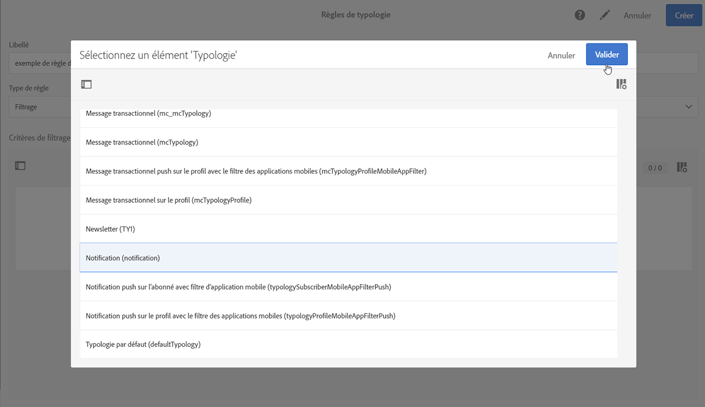

# Gestion des {#managing-typology-rules}

## A propos des règles de typologie {#about-typology-rules}

 sont des règles de fonctionnement qui vous permettent d’effectuer des vérifications et de filtrer votre message avant de l’envoyer. Les types de  disponibles sont les suivants :

* **Règles de filtrage** : Ce type de règle vous permet d’exclure une partie du de messages en fonction de critères définis dans un, tels que les mis en quarantaine ou les qui ont déjà reçu un certain nombre de courriers électroniques. Voir à ce propos [cette section](../../sending/using/filtering-rules.md).

* **Les règles de fatigue** : Ce type de règles vous permet de définir un nombre maximal de messages par  afin d’éviter les sollicitations excessives. Voir à ce propos [cette section](../../sending/using/fatigue-rules.md).

* **Règles de contrôle** : Ce type de règles permet à l&#39;utilisateur de vérifier la validité et la qualité des messages avant leur envoi, tels que l&#39;affichage des caractères, la taille des messages SMS, le format d&#39;adresse, etc. Voir à ce propos [cette section](../../sending/using/control-rules.md).

Les  de sont disponibles sous le menu **[!UICONTROL Administration]** > **[!UICONTROL Channels]** > **[!UICONTROL Typologies]** > **[!UICONTROL Typology rules]** .

Par défaut, plusieurs **filtres** prêts à l’emploi et des  de **contrôle** sont disponibles. Elles sont détaillées dans les sections Règles [de](../../sending/using/fatigue-rules.md) filtrage et Règles [de](../../sending/using/control-rules.md) contrôle.

Selon vos besoins, vous pouvez modifier des  de existantes ou en créer de nouvelles, à l’exception des **[!UICONTROL Control]** règles, qui sont en lecture seule et ne peuvent pas être modifiées.

## Créer une règle de typologie {#creating-a-typology-rule}

Les principales étapes de création d’un  sont les suivantes :

1. Accédez au menu **[!UICONTROL Administration]** / **[!UICONTROL Channels]** / **[!UICONTROL Typologies]** / **[!UICONTROL Typology rules]** , puis cliquez sur **[!UICONTROL Create]**.

   

1. Entrez la typologie **[!UICONTROL Label]**, puis indiquez **[!UICONTROL Channel]** à quel niveau la règle doit s’appliquer.

   

1. Spécifiez le  de **[!UICONTROL Type]**, puis configurez-le selon vos besoins. Notez que la configuration  du varie selon leur type. Pour plus d’informations, reportez-vous aux sections Règles **[de](../../sending/using/filtering-rules.md)**filtrage et Règles**[ de](../../sending/using/fatigue-rules.md)** fatigue.

1. Sélectionnez les typologies dans lesquelles vous souhaitez inclure la nouvelle règle. Pour ce faire, sélectionnez l’ **[!UICONTROL Typologies]** onglet, puis cliquez sur **[!UICONTROL Create element]** bouton.

   

1. Sélectionnez une typologie, puis cliquez sur **[!UICONTROL Confirm]**.

   

1. Une fois toutes les typologies sélectionnées, cliquez sur **[!UICONTROL Create]** pour confirmer la création du.

## Ordre d&#39;exécution des règles de typologie {#typology-rules-execution-order}

Les  de sont exécutées dans l’ordre spécifié lors des phases de ciblage, de  de et de personnalisation des messages.

Dans un fonctionnement standard, les règles sont appliquées dans l&#39;ordre suivant :

1. Règles de contrôle, si elles s&#39;appliquent au début du ciblage.
1. Règles de filtrage :

   * Règles natives de l&#39;application pour la qualification des adresses : adresse définie / adresse non vérifiée / adresse en blackliste / adresse en quarantaine / qualité de l&#39;adresse.
   * Règles de filtrage définies par l&#39;utilisateur.

1. Règles de contrôle, si elles s&#39;appliquent à la fin du ciblage.
1. Règles de contrôle, si elles s&#39;appliquent au début de la personnalisation.
1. Règles de contrôle, si elles s&#39;appliquent à la fin de la personnalisation.

Cependant, vous pouvez adapter l&#39;ordre d&#39;exécution des règles de même type dans chaque typologie. En effet, lorsque plusieurs règles sont exécutées lors de la même phase de traitement des messages, vous pouvez choisir dans quel ordre elles doivent être appliquées.

Par exemple, une règle de filtrage dont l&#39;ordre d&#39;exécution est positionné à 20 sera exécutée avant une règle de filtrage dont l&#39;ordre d&#39;exécution est positionné à 30.

In the **[!UICONTROL Properties]** of a typology rule, you can set its execution order. Lorsque plusieurs règles doivent être appliquées, l&#39;ordre d&#39;exécution de chaque règle détermine celles à traiter en premier. Voir à ce propos la section [Ordre d&#39;exécution des règles de typologie](#typology-rules-execution-order).

A typology rule can be deactivated through its **[!UICONTROL Properties]** if you do not want the rule to be applied at the moment that the messages concerned by the rule are analyzed.

