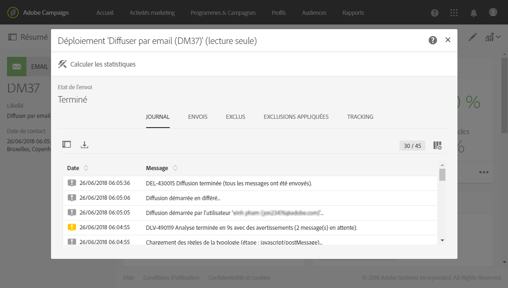

# Surveillance de la délivrabilité{#monitor-deliverability}

Vous trouverez ci-dessous des informations détaillées sur le rapport **[!UICONTROL Débit des diffusions]** ainsi que sur les différents outils de monitoring proposés par Adobe Campaign. Voici quelques instructions supplémentaires pour le suivi de la délivrabilité :

* Vérifiez régulièrement le débit des diffusions pour l’ensemble de la plateforme afin de contrôler qu’il correspond à la configuration d’origine.
* Vérifiez que les reprises sont paramétrées correctement (30 minutes pour la période des reprises et plus de 20 reprises) dans les modèles de diffusion.
* Vérifiez régulièrement que la boîte des mails rebonds est accessible et que le compte n’arrive pas à expiration.
* Vérifiez chaque débit de diffusion pour vous assurer qu’il correspond à la validité du contenu de la diffusion (par exemple, les ventes Flash doivent être diffusées en quelques minutes et non en plusieurs jours).
* Vérifiez que le nombre d’erreurs et les mises en quarantaines correspondent aux autres diffusions.
* Consultez attentivement les logs de diffusion pour déterminer le type des erreurs indiquées (listes bloquées, problèmes liés aux DNS, règles anti-spam, etc…).

## Débit des diffusions {#delivery-throughput}

Ce rapport contient les informations relatives au débit de diffusion de l’ensemble de la plateforme sur une période donnée afin de mesurer la vitesse de diffusion des messages.

Pour plus d&#39;informations, consultez la section [Débit de diffusion](../../reporting/using/delivery-throughput.md).

Vous pouvez paramétrer l’affichage des valeurs en sélectionnant le périmètre de la vue.

D’autres rapports sont disponibles, tels que **[!UICONTROL Synthèse de diffusion]** ou **[!UICONTROL Non-délivrables et rebonds]**. Pour plus d&#39;informations, consultez la section [Rapports dynamiques](../../reporting/using/about-dynamic-reports.md).

## Surveillance des diffusions {#monitoring-deliveries}

Le tableau de bord des messages vous permet d&#39;accéder aux logs de diffusion : **[!UICONTROL Logs d&#39;envoi]**, **[!UICONTROL Logs d&#39;exclusion]**, **[!UICONTROL Causes d&#39;exclusions]**, **[!UICONTROL Logs de tracking]** et **[!UICONTROL URL suivies]**. Ils indiquent le détail de l&#39;envoi, la cible exclue et les raisons de l&#39;exclusion, et fournissent des informations de tracking telles que les ouvertures et les clics.

Pour plus d&#39;informations, consultez la section [Suivre une diffusion](../../sending/using/monitoring-a-delivery.md).

## Recevoir des alertes {#receiving-alerts}

La fonctionnalité **[!UICONTROL Alertes de diffusion]** est un système de gestion des alertes qui permet à un groupe d’utilisateurs de recevoir automatiquement des notifications contenant des informations sur l’exécution de leurs diffusions.

Pour plus d&#39;informations, consultez la section [Recevoir des alertes en cas d&#39;échec](../../sending/using/receiving-alerts-when-failures-happen.md).

<!--## External tools (#external-tools)

### Signal Spam {#signal-spam}

Signal Spam is a French service which offers anonymized feedback loop reporting for French ISPs (Orange, SFR).

This service allows you to follow the reputation of the French ISPs and track customers' activity evolution.

Signal Spam also provides direct complaints that end users log through a dedicated interface. Those complaints are then quarantined from the email address database.

### 250ok {#solution-250ok}

250ok is a monitoring solution which provides IP and domain denylists, as well as reputation indicators.

The information provided is real-time, which allows for a pro-active assistance. 250ok a complementary solution to the Adobe deliverability internal tools.-->
