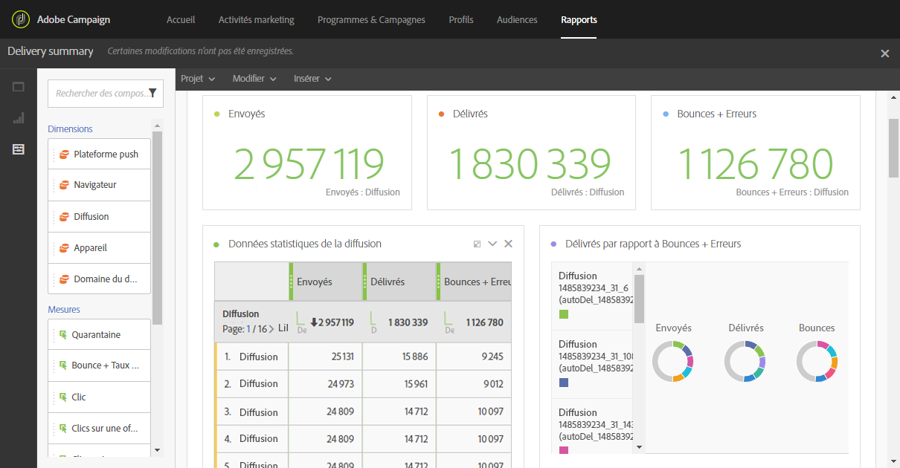

# Contrôle de la délivrabilité{#monitor-deliverability}

Vous trouverez ci-dessous des informations détaillées sur le rapport **[!UICONTROL Débit des diffusions]** ainsi que sur les différents outils de monitoring proposés par Adobe Campaign. Voici quelques instructions supplémentaires pour le suivi de la délivrabilité :
* Vérifiez régulièrement le débit des diffusions pour l&#39;ensemble de la plateforme afin de contrôler qu&#39;il correspond à la configuration d&#39;origine.
* Vérifiez que les reprises sont paramétrées correctement (30 minutes pour la période des reprises et plus de 20 reprises) dans les modèles de diffusion.
* Vérifiez régulièrement que la boîte des mails rebonds est accessible et que le compte n&#39;arrive pas à expiration.
* Vérifiez chaque débit de diffusion pour vous assurer qu&#39;il correspond à la validité du contenu de la diffusion (par exemple, les ventes Flash doivent être diffusées en quelques minutes et non en plusieurs jours).
* Lors de l&#39;utilisation des vagues, vérifiez que chaque vague a le temps de se terminer avant le déclenchement de la suivante.
* Vérifiez que le nombre d&#39;erreurs et les mises en quarantaines correspondent aux autres diffusions.
* Consultez attentivement les logs de diffusion en détail pour vérifier le type d&#39;erreurs qui sont mises en évidence (listes bloquées, problèmes DNS, règles anti-spam, etc..).

## Débit des diffusions (Delivery throughput){#delivery-throughput}

Ce rapport contient les informations relatives au débit de diffusion de l&#39;ensemble de la plateforme sur une période donnée afin de mesurer la vitesse de diffusion des messages.

Voir à ce propos la section [Débit de diffusion](../../reporting/using/delivery-throughput.md).

Vous pouvez paramétrer l&#39;affichage des valeurs en sélectionnant le périmètre de la vue.

D’autres rapports sont disponibles, tels que **[!UICONTROL synthèse de diffusion]** ou **[!UICONTROL échecs et bounces]**. Voir à ce propos la section [Rapports dynamiques](../../reporting/using/about-dynamic-reports.md).

## Suivre les diffusions {#monitoring-deliveries}

Le tableau de bord des messages vous permet d&#39;accéder aux logs de diffusion : **[!UICONTROL Logs d&#39;envoi]**, **[!UICONTROL Logs d&#39;exclusion]**, **[!UICONTROL Causes d&#39;exclusions]**, **[!UICONTROL Logs de tracking]** et **[!UICONTROL URL trackées]**. Ils indiquent le détail de l&#39;envoi, la cible exclue et les raisons de l&#39;exclusion, et fournissent des informations de tracking telles que les ouvertures et les clics.

Voir à ce propos la section [Suivre une diffusion](../../sending/using/monitoring-a-delivery.md).

## Recevoir des alertes {#receiving-alerts}

La fonctionnalité **[!UICONTROL Alertes de diffusion]** est un système de gestion des alertes qui permet à un groupe d&#39;utilisateurs de recevoir automatiquement des notifications contenant des informations sur l&#39;exécution de leurs diffusions.

Voir à ce propos la section [Recevoir des alertes en cas d&#39;échec](../../sending/using/receiving-alerts-when-failures-happen.md).

## Signal Spam {#signal-spam}

Signal Spam est un service français qui propose un reporting de rétroaction anonyme pour les FAI français (Orange, SFR).

Ce service permet de suivre la réputation des FAI français et l&#39;évolution de l&#39;activité des clients.

Signal Spam fournit permet également aux utilisateurs finaux de déposer des plaintes directes via une interface dédiée. Ces plaintes sont ensuite mises en quarantaine dans la base de données des adresses email.

## 250ok {#solution-250ok}

250ok est une solution de surveillance qui fournit des listes bloquées IP et domaine, ainsi que des indicateurs de réputation.

Les informations sont fournies en temps réel, ce qui permet une assistance proactive. 250ok est une solution complémentaire aux outils internes de délivrabilité d&#39;Adobe.
