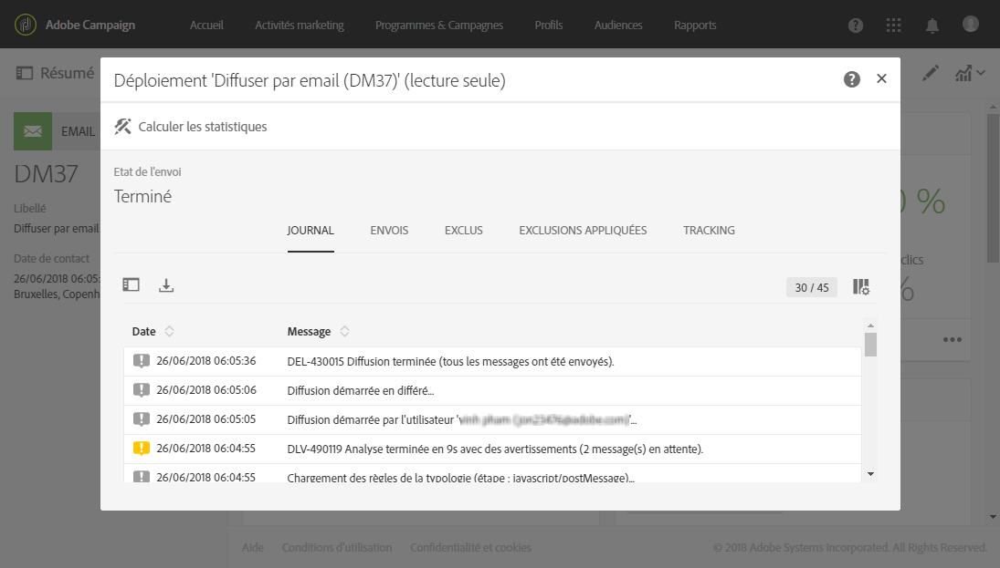
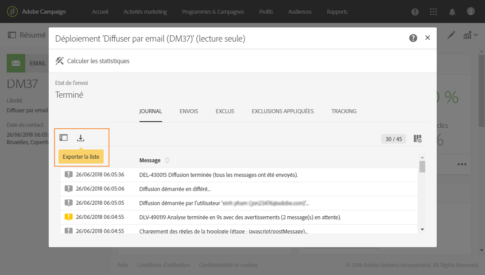
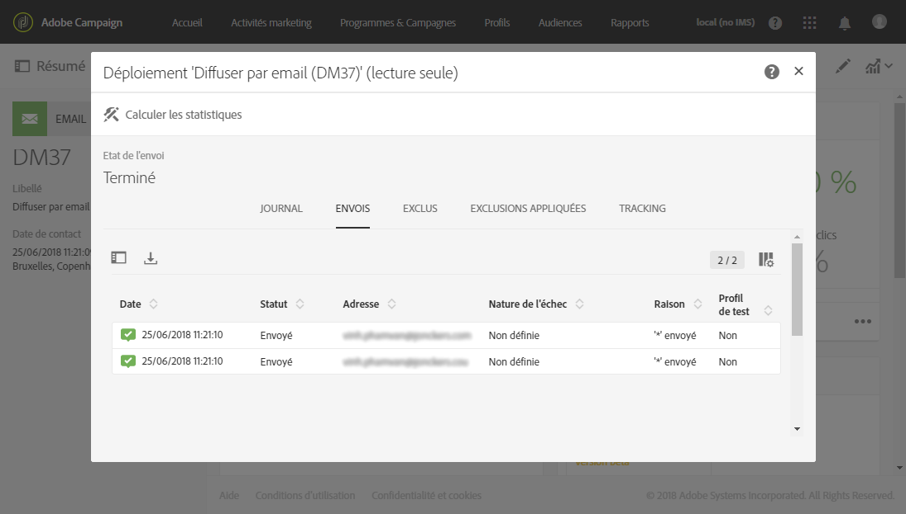
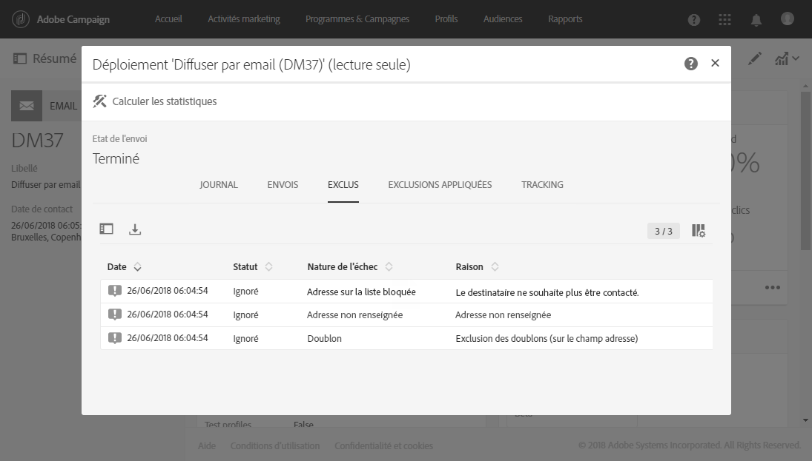
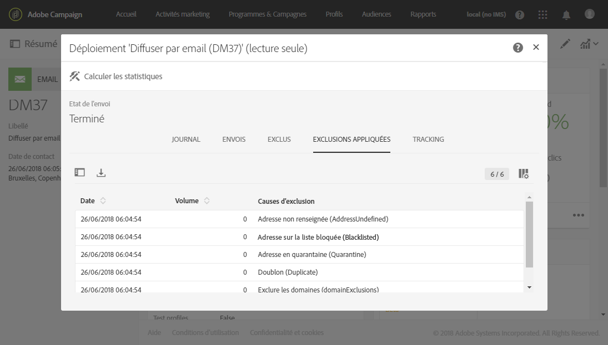

# Contrôler une diffusion{#monitoring-a-delivery}

Plusieurs méthodes permettent de contrôler une diffusion et de mesurer son impact :

* **Logs des messages** : ces logs sont accessibles depuis le tableau de bord des messages. Ils indiquent le détail de l'envoi, la cible exclue et les raisons de l'exclusion et fournissent des informations de tracking telles que les ouvertures et les clics.

   Pour visualiser les logs des messages, cliquez sur l'icône située en bas à droite du bloc **[!UICONTROL Déploiement].**

   Several tabs contain information (if it exists) regarding the **[!UICONTROL Sending logs]**, **[!UICONTROL Exclusion logs]**, **[!UICONTROL Exclusion causes]**, **[!UICONTROL Tracking logs]** and **[!UICONTROL Tracked URLs]**. Voir [Logs de diffusion](../../sending/using/monitoring-a-delivery.md#delivery-logs).

   

   Le journal contient tous les messages relatifs à la diffusion et aux bons à tirer (BAT). Des icônes spécifiques permettent de repérer les erreurs ou avertissements. Voir à ce propos la section [Valider les messages](../../sending/using/previewing-messages.md).

   Vous pouvez exporter le journal en cliquant sur le bouton **[!UICONTROL Exporter la liste].**

   

* **Alertes de diffusion** : pour tracker les performances des diffusions, Adobe Campaign propose un système d'alerte par email qui envoie des notifications afin d'avertir les utilisateurs des activités système importantes.
* **Rapports** : depuis le tableau de bord d'un message, vous pouvez accéder à plusieurs rapports relatifs à ce message spécifique. Un menu **[!UICONTROL Rapports]vous permet également d'accéder à la liste complète des rapports intégrés ou personnalisés que vous pouvez utiliser pour mettre en avant des mesures spécifiques relatives à votre message ou campagne.**
* Un administrateur peut également exporter des logs dans un fichier distinct qui peut être traité dans vos outils de reporting ou de Business Intelligence. Voir à ce propos la section [Exporter des logs](../../automating/using/exporting-logs.md).

**Rubriques connexes :**

* [Recevoir des alertes en cas d'échec](../../sending/using/receiving-alerts-when-failures-happen.md)
* [Rapports](../../reporting/using/about-dynamic-reports.md)

## Logs de diffusion {#delivery-logs}

### Envois {#sending-logs}

L'onglet **[!UICONTROL Envois]propose un historique des occurrences de cette diffusion.** Y est répertoriée la liste des messages envoyés et leur statut. Il permet de visualiser l'état de la diffusion pour chaque destinataire.

Pour chaque profil dont l'état est **[!UICONTROL Envoyé]**, la colonne **Date]indique quand le message a été envoyé.[!UICONTROL **

### Exclus {#exclusion-logs}

L'onglet **[!UICONTROL Exclus]liste tous les messages qui ont été exclus de l'envoi à la cible et indique la raison de l'échec de l'envoi.**

### Exclusions appliquées {#exclusion-causes}

L'onglet **[!UICONTROL Exclusions appliquées]indique le volume (en nombre de messages) des messages qui ont été exclus de l'envoi à la cible.**

