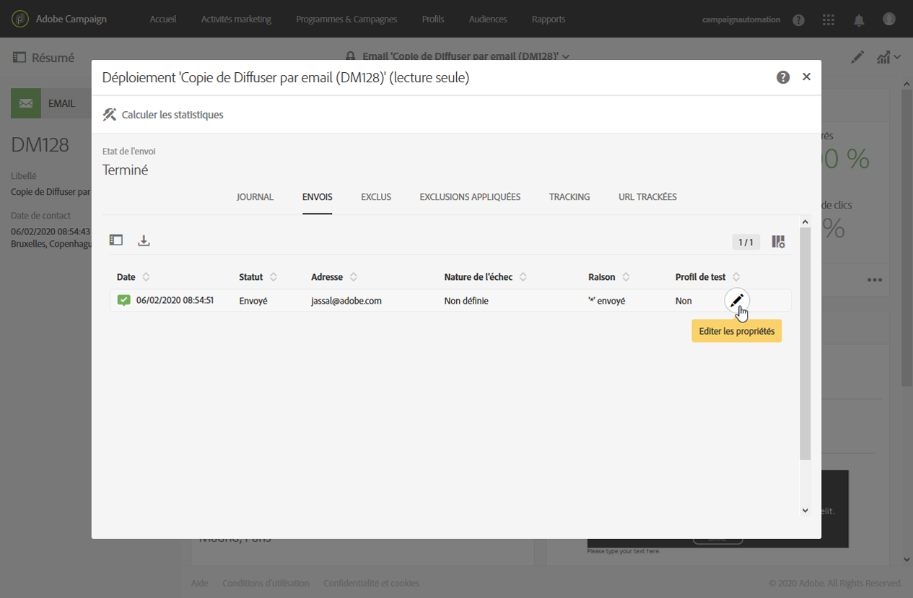
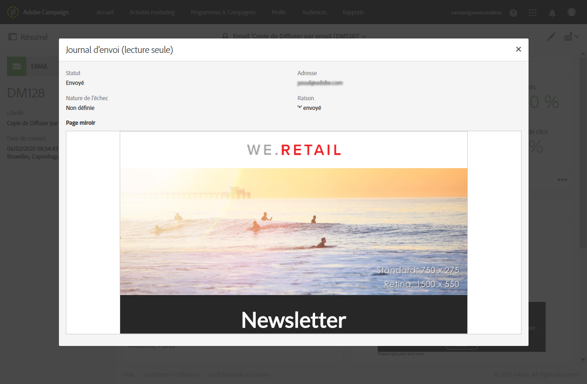

# Contrôler une diffusion{#monitoring-a-delivery}

Plusieurs méthodes permettent de contrôler une diffusion et de mesurer son impact : En tant qu’administrateur fonctionnel, vous pouvez accéder aux logs de messages et aux logs de diffusion.
>[!CAUTION]
>
>Seuls les [administrateurs](../../administration/using/users-management.md#functional-administrators) fonctionnels, avec un rôle d’**[!UICONTROL administration]** et un accès aux entités **Toutes**, peuvent accéder aux logs d’envoi, aux logs de messages, aux logs de tracking, aux logs d’exclusion ou aux logs d’abonnement. Un utilisateur autre qu’administrateur peut cibler ces logs mais en commençant par une table liée (profils, diffusion).

* **Logs des messages** : ces logs sont accessibles depuis le tableau de bord des messages. Ils indiquent le détail de l&#39;envoi, la cible exclue et les raisons de l&#39;exclusion et fournissent des informations de tracking telles que les ouvertures et les clics.

   Pour visualiser les logs des messages, cliquez sur l&#39;icône située en bas à droite du bloc **[!UICONTROL Déploiement]**.

   Plusieurs onglets contiennent les informations (si elles existent) relatives aux **[!UICONTROL Envois]**, aux **[!UICONTROL Exclus]**, aux **[!UICONTROL Exclusions appliquées]**, au **[!UICONTROL Tracking]** et aux **[!UICONTROL URL trackées]**. Voir [Logs de diffusion](#delivery-logs).

   

   Le journal contient tous les messages relatifs à la diffusion et aux bons à tirer (BAT). Des icônes spécifiques permettent de repérer les erreurs ou avertissements. Voir à ce propos la section [Valider les messages](../../sending/using/previewing-messages.md).

   Vous pouvez exporter le journal en cliquant sur le bouton **[!UICONTROL Exporter la liste]**.

   

* **Alertes de diffusion** : pour tracker les performances des diffusions, Adobe Campaign propose un système d&#39;alerte par email qui envoie des notifications afin d&#39;avertir les utilisateurs des activités système importantes.
* **Rapports** : depuis le tableau de bord d&#39;un message, vous pouvez accéder à plusieurs rapports relatifs à ce message spécifique. Un menu **[!UICONTROL Rapports]** vous permet également d&#39;accéder à la liste complète des rapports intégrés ou personnalisés que vous pouvez utiliser pour mettre en avant des mesures spécifiques relatives à votre message ou campagne.
* Un administrateur peut également exporter des logs dans un fichier distinct qui peut être traité dans vos outils de reporting ou de Business Intelligence. Voir à ce propos la section [Exporter des logs](../../automating/using/exporting-logs.md).

**Rubriques connexes :**

* [Recevoir des alertes en cas d&#39;échec](../../sending/using/receiving-alerts-when-failures-happen.md)
* [Rapports](../../reporting/using/about-dynamic-reports.md)

## Logs de diffusion {#delivery-logs}

### Envois {#sending-logs}

L&#39;onglet **[!UICONTROL Envois]** propose un historique des occurrences de cette diffusion. Y est répertoriée la liste des messages envoyés et leur statut. Il permet de visualiser l&#39;état de la diffusion pour chaque destinataire.

Pour chaque profil dont l&#39;état est **[!UICONTROL Envoyé]**, la colonne **[!UICONTROL Date]** indique quand le message a été envoyé.

Pour accéder aux détails d&#39;un log d’envoi spécifique, cliquez sur l’icône représentant un crayon à droite de la ligne correspondante.

Tous les détails du log d’envoi sont en lecture seule. Vous pouvez également afficher un aperçu de la page miroir.

>[!NOTE]
>
>Pour afficher le rendu de la page miroir dans l’interface utilisateur de Campaign, l’URL du serveur de page miroir doit être sécurisée. Dans ce cas, utilisez https:// plutôt que http:// pour configurer cette URL lors de la [configuration de votre marque](../../administration/using/branding.md#configuring-and-using-brands).

### Exclus {#exclusion-logs}

L&#39;onglet **[!UICONTROL Exclus]** liste tous les messages qui ont été exclus de l&#39;envoi à la cible et indique la raison de l&#39;échec de l&#39;envoi.

### Exclusions appliquées {#exclusion-causes}

L&#39;onglet **[!UICONTROL Exclusions appliquées]** indique le volume (en nombre de messages) des messages qui ont été exclus de l&#39;envoi à la cible.

