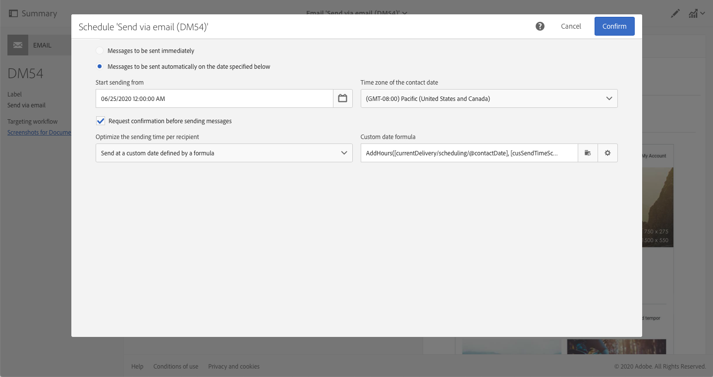

# Optimisation de la conception et de la diffusion avec des emails optimisés par l’IA{#journey-ai}

## Prise en main des emails optimisés par l’IA{#journey-ai-ovv}

Grâce à Campaign, vous pouvez optimiser la conception et la diffusion des parcours client afin de prédire les préférences d’engagement de chaque individu. Optimisé par l’IA de parcours, Adobe Campaign peut analyser et estimer les taux d’ouverture, les temps d’envoi optimaux et l’attrition probable en fonction des mesures d’engagement historiques.

**Modèles d’apprentissage automatique**

Adobe Campaign Standard offre deux nouveaux modèles d’apprentissage automatique : **optimisations prédictives de l’heure d’envoi** et **scoring d’engagement prédictif**. Ces deux modèles sont appelés IA de parcours. L’IA de parcours est une classe de modèles d’apprentissage machine qui sont spécifiques à la conception et à la proposition de parcours client optimisé.

* **Optimisation prédictive de l’heure d’envoi** : prédit la meilleure heure d’envoi pour chaque profil de destinataire pour les ouvertures ou clics d’email. Pour chaque profil de destinataire, les scores indiquent la meilleure heure d’envoi pour chaque jour de la semaine et le jour de la semaine le plus approprié à l’envoi afin d’obtenir les meilleurs résultats.

* **Scoring d’engagement prédictif** : prédit la probabilité qu’un destinataire interagisse avec un message, ainsi que la probabilité d’opt out (désinscription) dans les 7 jours qui suivent l’envoi du prochain email. Les probabilités sont divisées en compartiments selon le risque spécifique de désengagement, c’est-à-dire moyen ou faible. Le modèle fournit également le rang centile de risque pour les clients, ce qui permet de comprendre le rang d’un certain client par rapport aux autres.

>[!CAUTION]
>Cette fonctionnalité ne fait pas partie des paramètres d’usine du produit. La mise en œuvre nécessite l’implication d’Adobe Consulting. Veuillez contacter votre représentant Adobe pour en savoir plus.
>
>La fonctionnalité nécessite l’utilisation d’un stockage Azure qui doit être fourni par le client.

## Optimisation prédictive de l’heure d’envoi{#predictive-send-time}

### Optimiser les clics et les ouvertures{#about-predictive-send-time}

L’optimisation prédictive de l’heure d’envoi prédit la meilleure heure d’envoi pour chaque profil de destinataire pour les ouvertures et les clics d’email. Pour chaque profil de destinataire, les scores indiquent la meilleure heure d’envoi pour chaque jour de la semaine et le jour de semaine le plus approprié à l’envoi afin d’obtenir les meilleurs résultats.

Dans le modèle d’optimisation prédictive de l’heure d’envoi, il existe deux sous-modèles :
* L’heure d’envoi prédictive pour les ouvertures est le meilleur moment pour envoyer une communication au client afin de maximiser les ouvertures
* L’heure d’envoi prédictive pour les clics est le meilleur moment pour envoyer une communication au client afin de maximiser les clics

**Entrée du modèle** : logs de diffusion, logs de tracking et attributs de profil (autres que PII)

**Sortie du modèle** : meilleur moment pour envoyer un message (pour les ouvertures et les clics)


Détails de la sortie

* Calculez la meilleure heure d’envoi de l’email pendant les 7 jours de la semaine avec des intervalles d’une heure (p. ex. : 9 h, 10 h, 11 h)
* Le modèle indique le meilleur jour de la semaine et la meilleure heure de la journée.
* Chaque heure optimale est calculée deux fois : une fois pour maximiser le taux d’ouverture et une fois pour maximiser le taux de clics
* 16 champs sont proposés (14 pour les jours de la semaine et 2 pour toute la semaine) :
   * meilleur moment pour envoyer un email afin d’optimiser les clics pour le lundi - valeurs comprises entre 0 et 23
   * meilleur moment pour envoyer un email afin d’optimiser les ouvertures pour le lundi - valeurs comprises entre 0 et 23
   * meilleur moment pour envoyer un email afin d’optimiser les clics pour le mardi - valeurs comprises entre 0 et 23
   * ...
   * meilleur moment pour envoyer un email afin d’optimiser les clics pour le dimanche - valeurs comprises entre 0 et 23
   * meilleur moment pour envoyer un email afin d’optimiser les ouvertures pour le dimanche - valeurs comprises entre 0 et 23
   * ...
   * meilleure journée pour envoyer un email afin d’optimiser les ouvertures pour toute la semaine - Du lundi au dimanche
   * meilleur moment pour envoyer un email afin d’optimiser les ouvertures pour toute la semaine - valeurs comprises entre 0 et 23

>[!NOTE]
>
>Ces fonctionnalités de prévision s’appliquent uniquement aux envois d’email.
>
>Le modèle nécessite au moins un mois de données pour produire des résultats significatifs.


### Accéder aux scores du profil{#access-predictive-send-time-scores}

Une fois mises en œuvre dans Campaign, les fonctionnalités d’apprentissage automatique enrichissent les données des profils avec de nouveaux onglets contenant leurs meilleurs scores d’ouverture/de clic. Les mesures sont calculées par l’IA de parcours et elles sont introduites dans Campaign à l’aide de workflows techniques.

Pour accéder à ces mesures, vous devez effectuer les opérations suivantes :

1. Ouvrir un profil et cliquer sur le bouton Editer.

1. Cliquer sur l’onglet **Envoyer le score de l’heure par clic** ou **Envoyer le score de l’heure par ouverture**.

Par défaut, les scores du profil indiquent le meilleur moment de la journée pour chaque jour de la semaine et le meilleur moment général de la semaine.


### Envoyer des messages au meilleur moment{#use-predictive-send-time}

Pour que les emails soient envoyés à l’heure optimale par profil, la diffusion doit être planifiée à l’aide de l’option **[!UICONTROL Envoyer à une date personnalisée définie par une formule]**.
Découvrez comment calculer la date d’envoi [dans cette section](../../sending/using/computing-the-sending-date.md).

La formule doit être renseignée avec le meilleur moment du jour donné où l’email sera envoyé.



Exemple de formule :

```
AddHours([currentDelivery/scheduling/@contactDate], 
[cusSendTimeScoreByClickprofile_link/@EMAIL_BEST_TIME_TO_CLICK_WEDNESDAY])
```


>[!NOTE]
>
>Le modèle de données peut être différent selon votre implémentation.


## Scoring d’engagement prédictif{#predictive-scoring}

Le scoring d’engagement prédictif vous permet d’effectuer les opérations suivantes :

* **Sélectionner une audience** : en utilisant l’activité de requête, vous pouvez sélectionner l’audience à qui s’adresse un message spécifique.
* **Exclure une audience** : en utilisant l’activité de requête, vous pouvez supprimer l’audience à désabonner.
* **Personnaliser** : personnalisez le message en fonction du niveau d’engagement (les utilisateurs à forte interaction recevront un message différent de celui des utilisateurs à faible interaction).

Ce modèle utilise plusieurs scores pour indiquer :

* **Score d’engagement avec ouverture/Score d’engagement avec clic** : cette valeur correspond à la probabilité qu’un abonné interagisse avec un message spécifique (ouverture ou clic). Les valeurs sont comprises entre 0,0 et 1,0.
* **Probabilité de désabonnement** : cette valeur correspond à la probabilité pour le destinataire de se désabonner d’un canal email après l’ouverture d’un email. Les valeurs sont comprises entre 0,0 et 1,0.
* **Niveau de rétention** : cette valeur classe les utilisateurs en trois niveaux : bas, moyen et élevé. Élevé indique que l’utilisateur est susceptible de rester fidèle à la marque et faible indique qu’il est susceptible de se désabonner.
* **Rang centile de rétention** : profil classé en termes de probabilité de désabonnement. Les valeurs sont comprises entre 0,0 et 1,0. Par exemple, si le rang de pourcentage de rétention est de 0,953, ce destinataire est plus susceptible de rester fidèle à la marque et moins susceptible de se désabonner que 95,3 % de tous les destinataires.

>[!NOTE]
>
>Ces fonctionnalités de prévision s’appliquent uniquement aux envois d’email.
>
>Le modèle nécessite au moins un mois de données pour produire des résultats significatifs.


**Entrée du modèle** : logs de diffusion, logs de tracking et attributs de profil spécifiques

**Sortie du modèle** : attribut de profil qui décrit le score et la catégorie du profil


### Utilisation du score d’engagement pour le canal email

Pour accéder à ces mesures, vous devez :

1. Ouvrir un profil et cliquer sur le bouton Modifier.

1. Cliquer sur l’onglet **Scores d’engagement pour le canal email**.

En utilisant une activité de requête dans un workflow, vous pouvez utiliser le score pour optimiser votre audience.

Par exemple, avec les critères de **niveau de rétention** :


