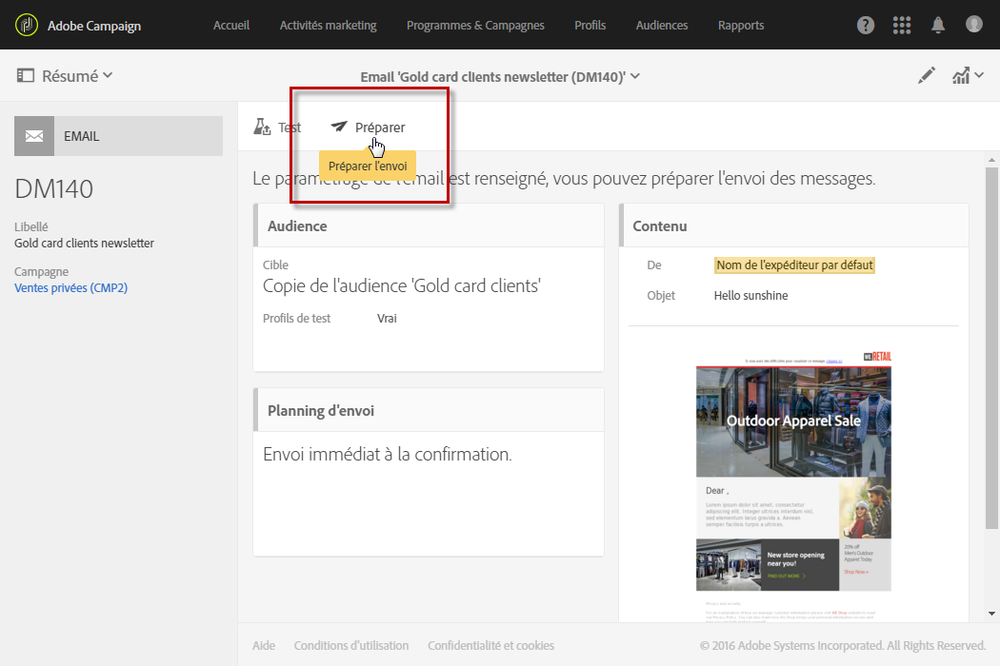
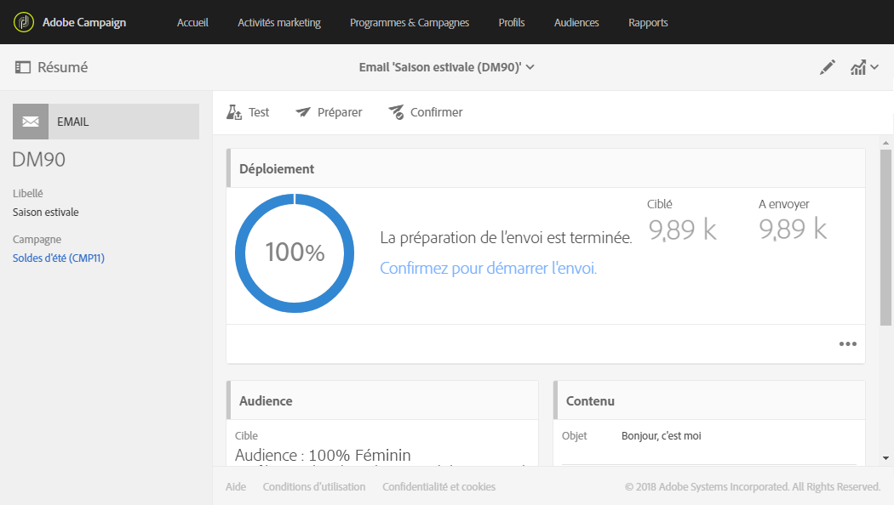
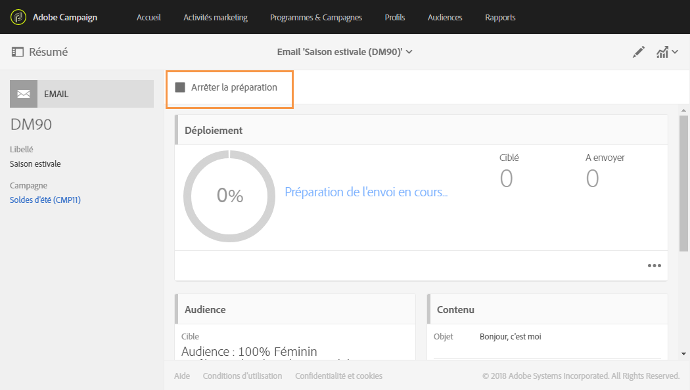
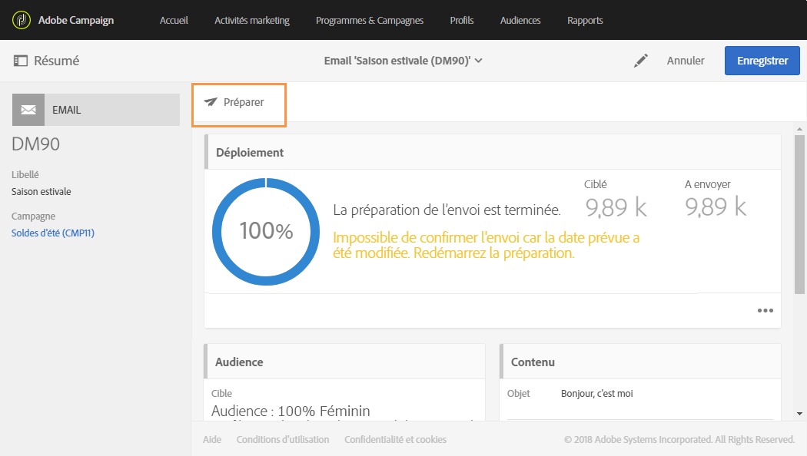
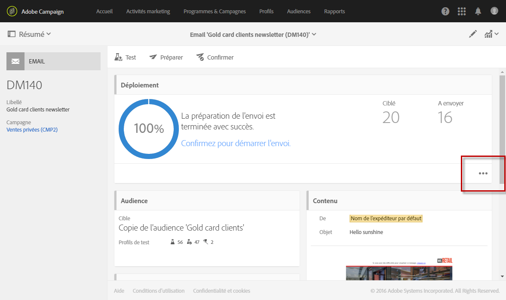
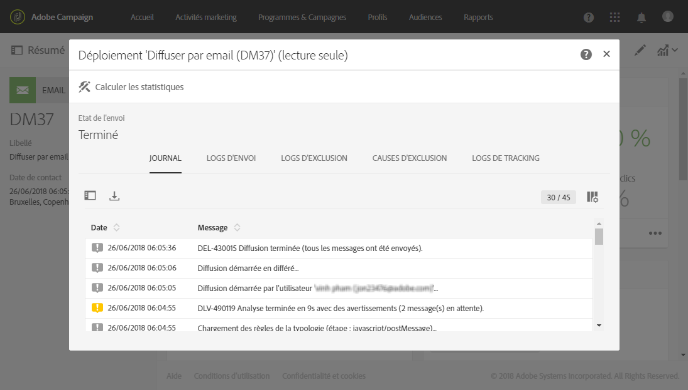

# Préparer l'envoi{#preparing-the-send}

La préparation correspond à l'étape de calcul de la population cible et de génération des contenus des messages pour chaque profil inclus dans la cible. Lorsque la préparation est terminée, les messages sont prêts à être envoyés immédiatement ou aux [date et heure planifiées](../../sending/using/about-scheduling-messages.md).

1. Pour lancer la préparation de l'envoi, cliquez sur le bouton **Préparer**, disponible dans la barre d'actions.

   

1. Le bloc **[!UICONTROL Déploiement]** affiche l’état d'avancement de la préparation, puis le résultat de la préparation : nombre de messages ciblés et à envoyer, etc.

   La durée de cette opération varie en fonction de la taille de la population ciblée.

   

1. Arrêtez à tout moment cette opération via le bouton **Arrêter**, disponible dans la barre d'actions.

   Pendant la phase de préparation, aucun message n'est envoyé. Vous pouvez donc lancer ou annuler cette opération sans aucun risque.

   

1. Votre message est automatiquement enregistré pendant la préparation de la phase de diffusion. Si vous devez apporter des modifications au planning de votre message après l'étape de préparation, vous devrez cliquer de nouveau sur le bouton **[!UICONTROL Préparer]** pour que les modifications soient prises en compte. Pour plus d'informations sur la planification d'un message, consultez cette [page](../../sending/using/about-scheduling-messages.md).

   

1. Pour visualiser les logs de préparation, cliquez sur le bouton situé en bas à droite du bloc.

   

1. La fenêtre **[!UICONTROL Déploiement]** s'affiche. Corrigez les erreurs, puis relancez la préparation.

   Le dernier message de logs affiche les erreurs éventuelles et leur nombre. Une icône spécifique permet de visualiser le type d'erreur rencontrée : l'icône jaune indique une erreur de traitement non bloquante, l'icône rouge indique une erreur qui empêche le lancement de la diffusion.

   

1. Vérifiez le résultat de la préparation avant de confirmer l'envoi des messages. Si le nombre de messages à envoyer ne correspond pas à votre paramétrage, modifiez la définition de la population ciblée (voir [Sélectionner une audience dans un message](../../audiences/using/selecting-an-audience-in-a-message.md)) et relancez la préparation.

Une fois la préparation terminée, votre message est prêt à être envoyé. Voir à ce propos la section [Confirmer l'envoi](../../sending/using/confirming-the-send.md).

**Règles de typologie**

Adobe Campaign contient un ensemble de règles de typologie intégrées qui sont appliquées pendant la préparation du message. Elles servent à vérifier qu'un message est valide et qu'il répond à vos critères de qualité. Voir [Typologies](../../administration/using/about-typology-rules.md). Vous pouvez définir vos propres règles de typologie. Par exemple, vous pouvez définir des règles de fatigue cross-canal globales qui excluront automatiquement les profils sur-sollicités des campagnes. Voir [Règles de fatigue](../../administration/using/fatigue-rules.md).

**Contrôle des messages SMS**

Si vous avez inséré des champs de personnalisation ou du texte conditionnel dans le contenu de votre SMS, cela peut introduire des caractères non pris en charge par l'encodage GSM. Lorsque vous lancez la préparation, la longueur des messages est contrôlée et un message d'avertissement est affiché en cas de dépassement.

Voir à ce propos les sections [Encodage, longueur et translittération des SMS](../../administration/using/configuring-sms-channel.md#sms-encoding--length-and-transliteration) et [Personnaliser un SMS](../../channels/using/personalizing-sms-messages.md).
