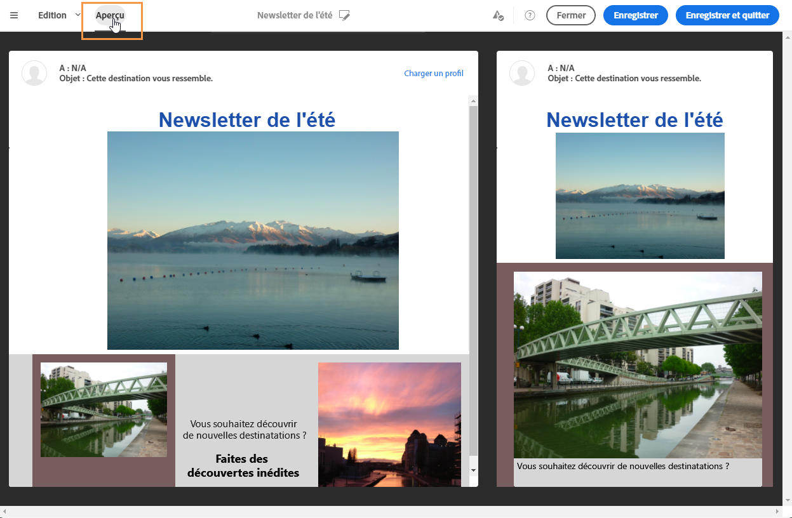
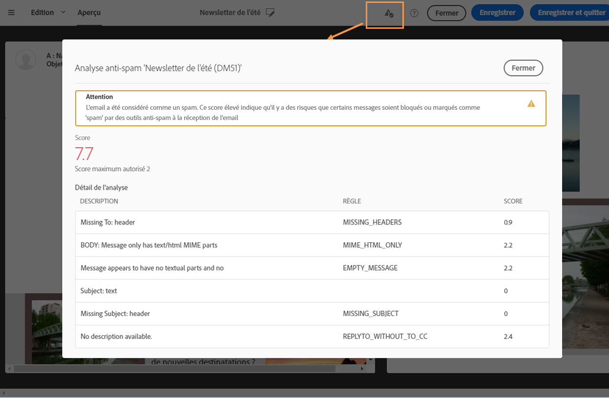
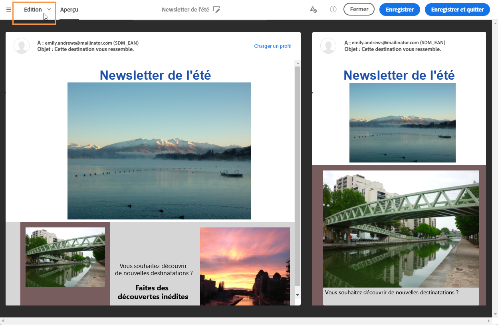

# Prévisualiser un message{#previewing-messages}

Une fois des profils de test ajoutés à la fenêtre **[!UICONTROL Audience], vous pouvez prévisualiser votre message pour vérifier sa personnalisation et l'affichage de la diffusion par vos destinataires.**

1. Dans le [Concepteur d'email](../../designing/using/about-email-content-design.md#about-the-email-designer), cliquez sur le bouton **[!UICONTROL Aperçu].**

   

   Une vue pour les postes de travail et une vue réactive pour les mobiles de votre email s'affichent côte à côte.

1. Une vérification anti-spam est automatiquement effectuée à chaque prévisualisation. Cliquez sur le bouton **[!UICONTROL Analyse anti-spam]pour connaitre les raisons de l'avertissement.**

   

1. Sélectionnez le bouton **[!UICONTROL Charger un profil]pour choisir le profil de test sur lequel vous souhaitez tester les éléments de personnalisation.**
1. Pour quitter le mode de **[!UICONTROL prévisualisation]**, sélectionnez le bouton **Editer]en haut à gauche de l'écran.[!UICONTROL **

   

