# Prévisualiser des diffusions {#previewing-messages}

## Prévisualiser l&#39;email        {#previewing-emails}

Campaign Standard vous permet de prévisualiser les messages avant l’envoi, afin de vérifier leur personnalisation et la manière dont vos destinataires les verront.

La prévisualisation des messages est effectuée à l’aide de **profils de test** que vous ajoutez à la cible du message.

Pour les **emails**, Campaign Standard permet de prévisualiser les messages à l’aide de profils ciblés plutôt que de profils de test. Vous obtenez ainsi une représentation exacte du message qu’un profil spécifique recevra. Pour plus d’informations, voir [Test des emails à l’aide des profils ciblés](../../sending/using/testing-messages-using-target.md).

Pour prévisualiser un message à l’aide des profils de test, procédez comme suit :

1. Dans le [Concepteur d’email](../../designing/using/designing-content-in-adobe-campaign.md), cliquez sur le bouton **[!UICONTROL Aperçu]**.

   

   Une vue pour les postes de travail et une vue réactive pour les mobiles de votre email s’affichent côte à côte.

1. Une vérification anti-spam est automatiquement effectuée à chaque prévisualisation. Cliquez sur le bouton **[!UICONTROL Analyse anti-spam]** pour connaitre les raisons de l’avertissement.

   

1. Sélectionnez le bouton **[!UICONTROL Charger un profil]** pour choisir le profil de test sur lequel vous souhaitez tester les éléments de personnalisation.

   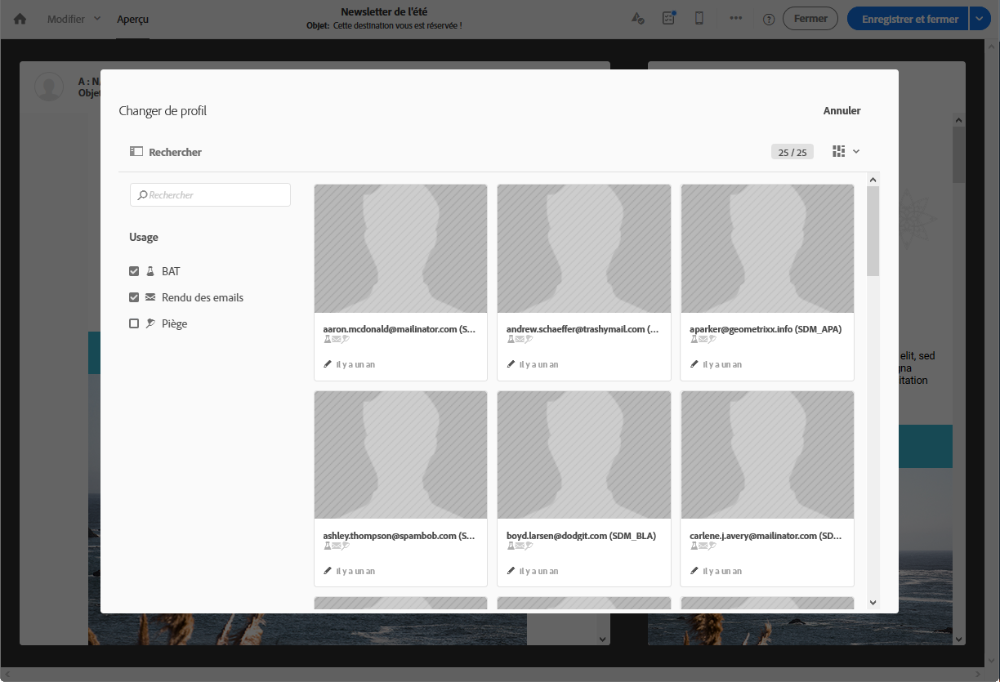

1. Pour quitter le mode de **[!UICONTROL prévisualisation]**, sélectionnez le bouton **[!UICONTROL Editer]** en haut à gauche de l’écran.

   

**Rubriques connexes :**

* [Gestion des profils de test](../../audiences/using/managing-test-profiles.md)
* [Test des emails à l’aide des profils ciblés](../../sending/using/testing-messages-using-target.md)
* [Envoyer un bon à tirer](../../sending/using/sending-proofs.md)

## Prévisualiser des SMS {#previewing-sms}

Pour les **SMS**, Campaign Standard vous permet de prévisualiser les messages à l’aide de profils de test. Vous obtenez ainsi une représentation exacte du message qu’un profil spécifique recevra. Voir à ce sujet la section [Gérer les profils de test](../../audiences/using/managing-test-profiles.md).

Pour prévisualiser un SMS à l’aide de profils de test, procédez comme suit :

1. Une fois que vous avez renseigné les **[!UICONTROL Propriétés]** de votre SMS et sélectionné vos audiences, vous pouvez personnaliser votre diffusion. Voir à ce sujet [cette section](../../channels/using/personalizing-sms-messages.md).

   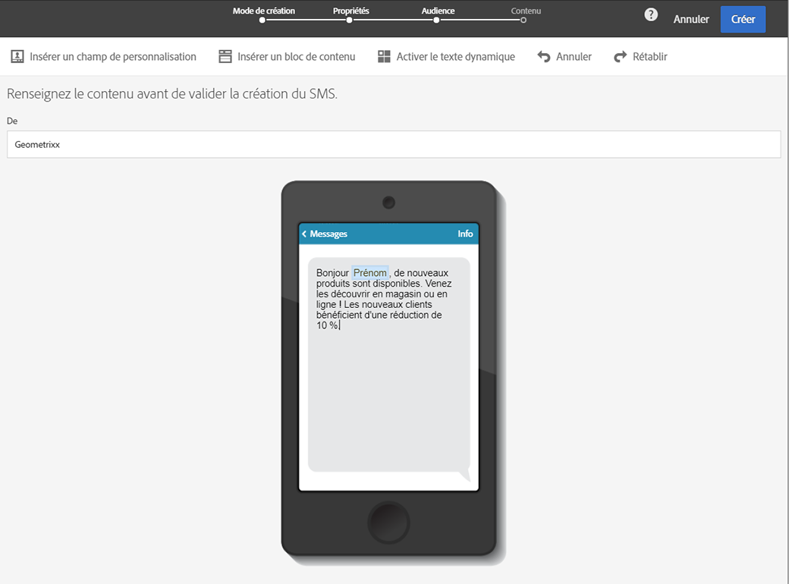

1. Après avoir personnalisé votre contenu, cliquez sur **[!UICONTROL Créer]** pour accéder à la fenêtre **[!UICONTROL Résumé]**.

1. Dans la fenêtre **[!UICONTROL Résumé]**, cliquez sur **[!UICONTROL Contenu]** pour commencer la prévisualisation de votre diffusion.

   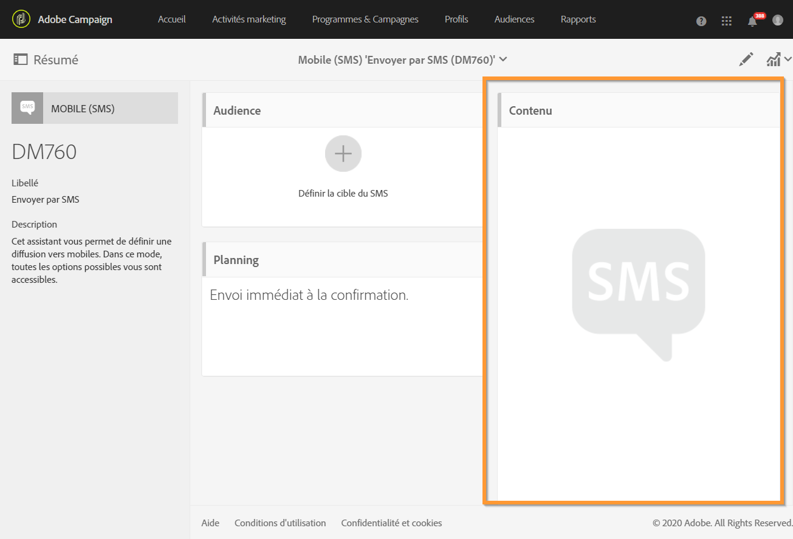

1. Dans la barre d’outils, cliquez sur **[!UICONTROL Aperçu]**.

   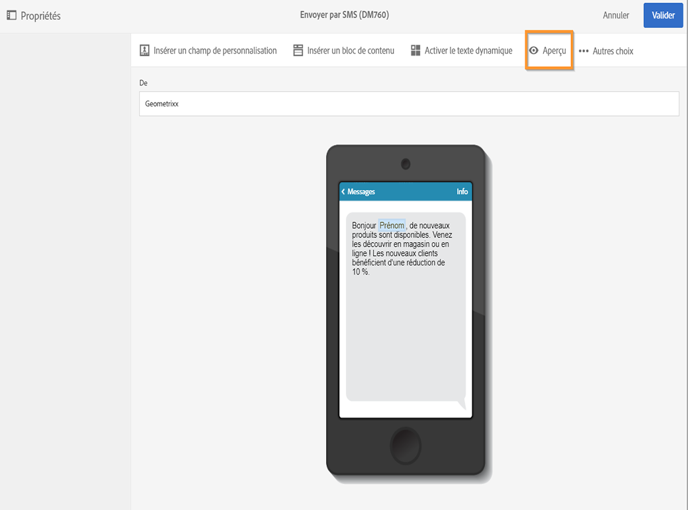

1. Cliquez sur **[!UICONTROL Charger un profil]** pour sélectionner votre profil de test, puis sur **[!UICONTROL Confirmer]**.

   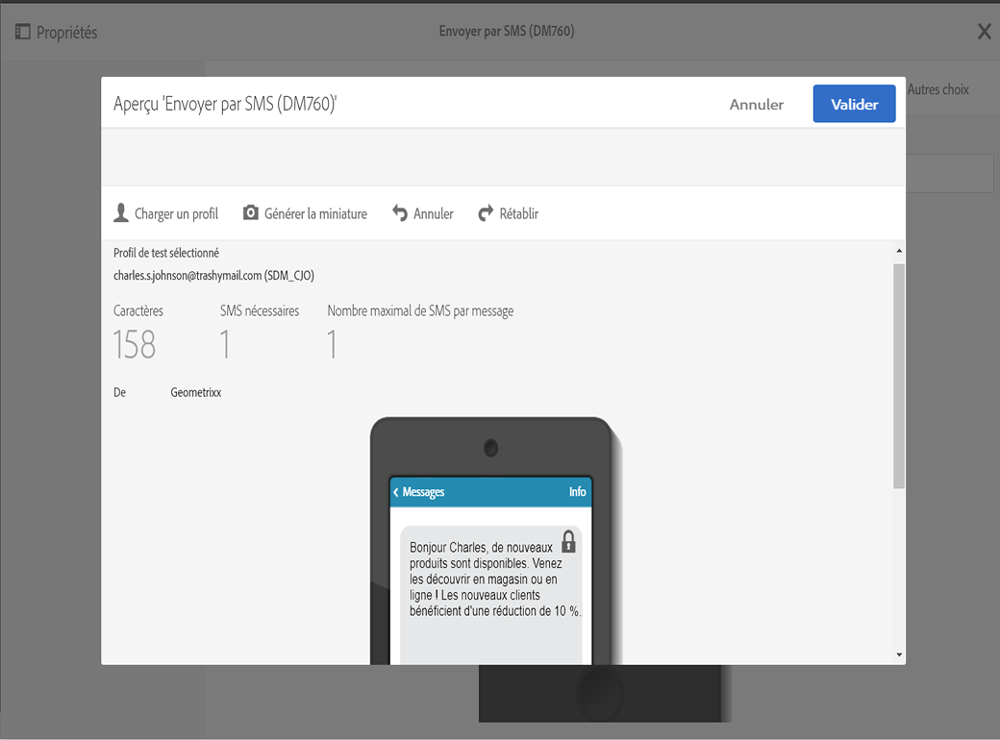

Vous pouvez maintenant voir la représentation exacte de votre message en fonction des profils de test sélectionnés.

**Rubriques connexes :**

* [A propos des SMS](../../channels/using/about-sms-messages.md)
* [Créer un SMS](../../channels/using/creating-an-sms-message.md)
* [Personnaliser un SMS](../../channels/using/personalizing-sms-messages.md)

## Prévisualiser des notifications push {#previewing-push}

Pour les **notifications push**, Campaign Standard vous permet de prévisualiser les messages à l’aide de profils de test. Vous obtenez ainsi une représentation exacte du message qu’un profil spécifique recevra. Voir à ce sujet la section [Gérer les profils de test](../../audiences/using/managing-test-profiles.md).

Pour prévisualiser une notification push à l’aide de profils de test, procédez comme suit :

1. Une fois que vous avez renseigné les **[!UICONTROL Propriétés]** de votre notification push et sélectionné vos audiences, vous pouvez personnaliser votre diffusion. Pour plus d’informations, consultez la section [Personnalisation d&#39;une notification push](../../channels/using/customizing-a-push-notification.md).

1. Après avoir personnalisé votre contenu, vous pouvez vérifier directement le rendu de vos notifications push en fonction des appareils et du système d’exploitation dans la fenêtre d’aperçu.

   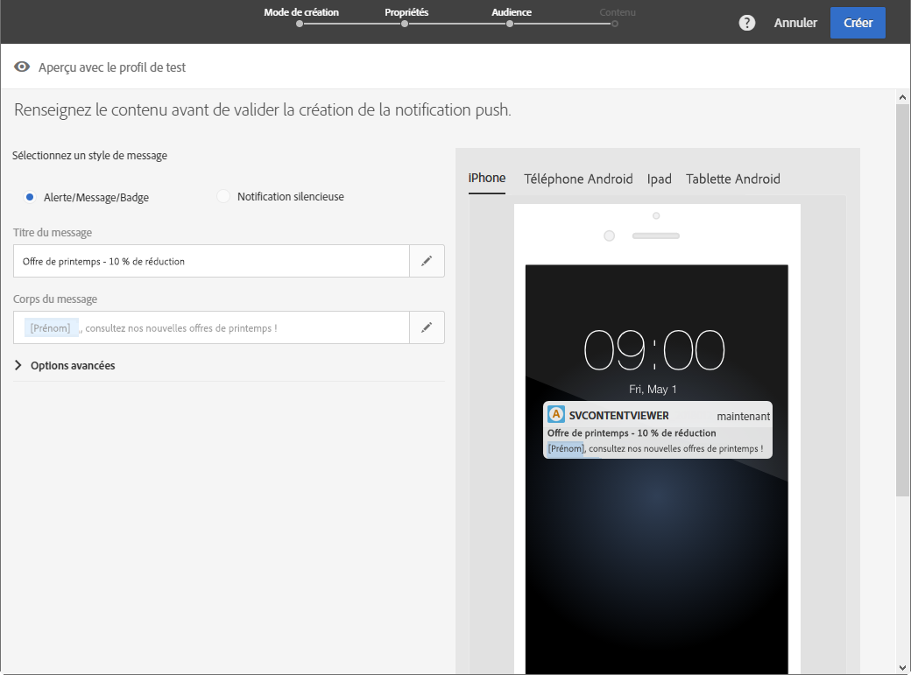

1. Pour prévisualiser votre notification push à l’aide de profils de test, cliquez sur **[!UICONTROL Aperçu avec le profil de test]**.

   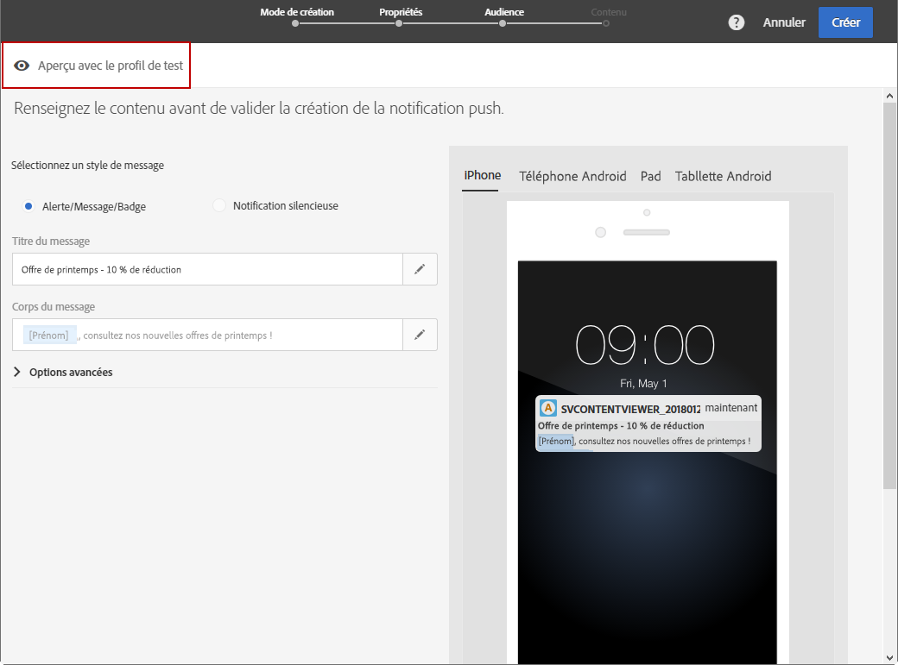

1. Sélectionnez votre profil de test, puis cliquez sur **[!UICONTROL Confirmer]**.

Vous pouvez maintenant voir la représentation exacte de votre message en fonction des profils de test sélectionnés.

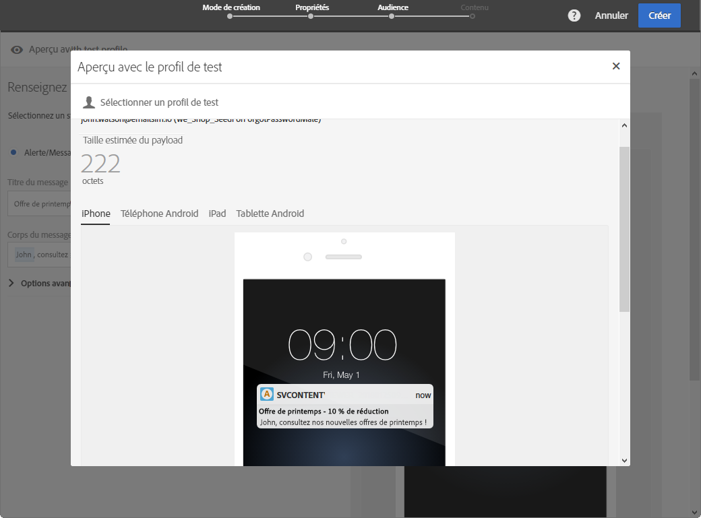

**Rubriques connexes :**

* [A propos des notifications push](../../channels/using/about-push-notifications.md)
* [Préparation et envoi d’une notification push](../../channels/using/preparing-and-sending-a-push-notification.md)
* [Personnalisation d’une notification push](../../channels/using/customizing-a-push-notification.md)

## Prévisualiser des messages In-App {#previewing-in-app}

Pour **In-App**, Campaign Standard vous permet de prévisualiser les messages à l’aide de profils de test. Vous obtenez ainsi une représentation exacte du message qu’un profil spécifique recevra. Voir à ce sujet la section [Gérer les profils de test](../../audiences/using/managing-test-profiles.md).

Pour prévisualiser un message In-App à l&#39;aide de profils de test, procédez comme suit :

1. Une fois que vous avez renseigné les **[!UICONTROL propriétés]** de votre message In-App, sélectionné vos audiences et défini vos **[!UICONTROL triggers]**, vous pouvez personnaliser votre diffusion. Pour plus d’informations, voir [Personnalisation d’un message In-App](../../channels/using/customizing-an-in-app-message.md).

1. Après avoir personnalisé votre contenu, vous pouvez vérifier directement le rendu de votre message In-App en fonction des appareils et du système d’exploitation dans la fenêtre d’aperçu.

   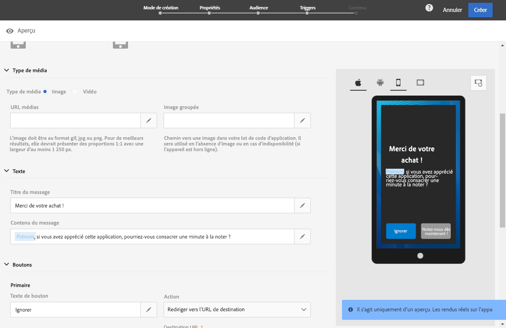

1. Pour prévisualiser votre message In-App à l’aide de profils de test, cliquez sur **[!UICONTROL Aperçu]**.

   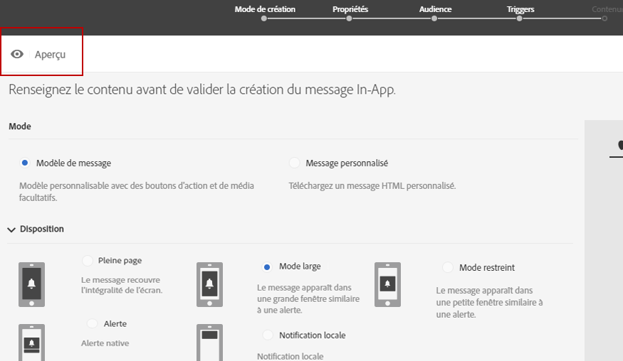

1. Sélectionnez votre profil de test, puis cliquez sur **[!UICONTROL Confirmer]**.

Vous pouvez maintenant voir la représentation exacte de votre message en fonction des profils de test sélectionnés.

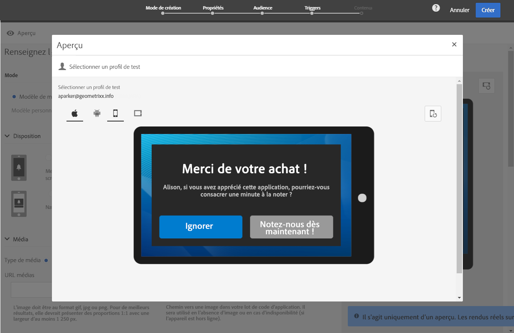

**Rubriques connexes :**

* [A propos de la messagerie In-App](../../channels/using/about-in-app-messaging.md)
* [Préparation et envoi d’un message In-App](../../channels/using/preparing-and-sending-an-in-app-message.md)
* [Personnalisation d’un message In-App](../../channels/using/customizing-an-in-app-message.md)