# Recevoir des alertes en cas d'échec{#receiving-alerts-when-failures-happen}

## A propos des alertes de diffusion {#about-delivery-alerting}

La fonctionnalité **Alertes de diffusion** est un système de gestion des alertes qui permet à un groupe d'utilisateurs de recevoir automatiquement des notifications contenant des informations sur l'exécution de leurs diffusions.

Les notifications envoyées comportent un rapport qui repose sur les critères par défaut suivants :

* Diffusions en échec
* Diffusions avec préparation en échec
* Diffusions avec un mauvais taux de soft bounces
* Diffusions avec un mauvais taux de hard bounces
* Diffusions avec un statut 'en attente' plus long que d'habitude
* Diffusions avec faible débit
* Diffusions en cours

Les destinataires des alertes peuvent contrôler les diffusions qui sont traitées par Adobe Campaign et prendre les mesures qui s'imposent en cas de problèmes liés à leur exécution.

Ces notifications d'alerte peuvent être personnalisées selon des critères d'alerte spécifiques qui sont définis par le biais d'un tableau de bord dans l'interface d'Adobe Campaign.

>[!NOTE]
>
>Les notifications d'alerte sont diffusées par email uniquement.

Les notifications envoyées contiennent les éléments suivants :

* Une **[!UICONTROL Synthèse]indiquant le nombre de diffusions répondant aux critères définis et le libellé/la couleur choisis pour chaque critère.**
* Une section **[!UICONTROL Détails]répertoriant tous les critères de diffusion définis pour le tableau de bord correspondant et toutes les diffusions pour chaque critère.**

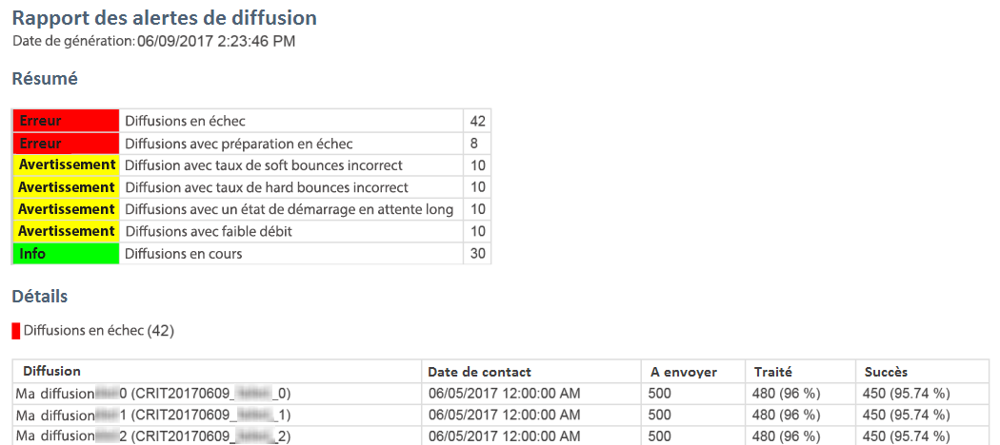

## Tableaux de bord des alertes de diffusion {#delivery-alerting-dashboards}

### A propos des tableaux de bord des alertes de diffusion {#about-delivery-alerting-dashboards}

Pour gérer les destinataires des notifications, définir les critères des alertes et accéder à l'historique des alertes, vous devez utiliser des tableaux de bord.

>[!NOTE]
>
>Pour accéder aux tableaux de bord ainsi qu'aux critères des alertes et les configurer, vous devez disposer de droits d'administration ou figurer dans le groupe de sécurité **Superviseurs de diffusion.** Les utilisateurs standard n'ont pas accès aux tableaux de bord dans l'interface d'Adobe Campaign. Ils peuvent uniquement recevoir les notifications d'alerte. Pour plus d'informations sur les utilisateurs et la sécurité dans Adobe Campaign, voir [Types d'utilisateurs](../../administration/using/users-management.md) et [Groupes de sécurité](../../administration/using/managing-groups-and-users.md#about-security-groups).

Depuis l'interface d'Adobe Campaign, vous pouvez :

* Créer et gérer des tableaux de bord d'alerte de diffusion. Voir [Création d'un tableau de bord des alertes de diffusion](../../sending/using/receiving-alerts-when-failures-happen.md#creating-a-delivery-alerting-dashboard).
* Définir et gérer les critères des alertes de diffusion de chaque tableau de bord. Par exemple, vous pouvez créer des alertes basées sur les diffusions avec préparation en échec ou les diffusions avec faible débit uniquement. Voir [À propos des critères des alertes de diffusion](../../sending/using/receiving-alerts-when-failures-happen.md#about-alerting-criteria).
* Modifier les paramètres des critères pour chaque tableau de bord. Voir [Paramètres des critères](../../sending/using/receiving-alerts-when-failures-happen.md#criteria-parameters).
* Définir un groupe de destinataires pour chaque tableau de bord.

   Vous souhaitez par exemple informer les utilisateurs disposant de droits d'administration des diffusions en échec uniquement. Vous voulez également que les utilisateurs marketing reçoivent des informations sur les diffusions avec mauvais taux de soft bounces. Vous devez donc créer deux tableaux de bord différents et définir les critères souhaités pour chaque groupe de destinataires.

* Accéder à l'historique de toutes les alertes envoyées pour chaque tableau de bord.

   Lorsque vous sélectionnez un tableau de bord, la dernière alerte envoyée associée à celui-ci s'affiche par défaut. Toutes les alertes envoyées sont répertoriées dans la partie gauche de l'écran. Cliquez sur un élément dans la liste **[!UICONTROL Historique]pour accéder aux alertes correspondantes.**

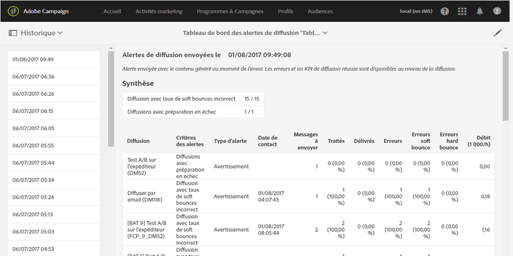

### Création d'un tableau de bord des alertes de diffusion {#creating-a-delivery-alerting-dashboard}

Si vous souhaitez envoyer des notifications selon des critères spécifiques à différents groupes d'utilisateurs, vous devez utiliser plusieurs tableaux de bord. Pour créer un tableau de bord :

1. Go to **[!UICONTROL Administration]** &gt; **[!UICONTROL Channels]** &gt; **[!UICONTROL Delivery alerting]**.
1. Sélectionnez **[!UICONTROL Tableaux de bord des alertes de diffusion]** et cliquez sur **[!UICONTROL Créer]**.
1. Cochez la case **[!UICONTROL Activé]pour activer le tableau de bord en cours.**

   Si cette option est désactivée, les notifications associées à ce tableau de bord ne sont plus envoyées. Par défaut, cette option est désactivée.

   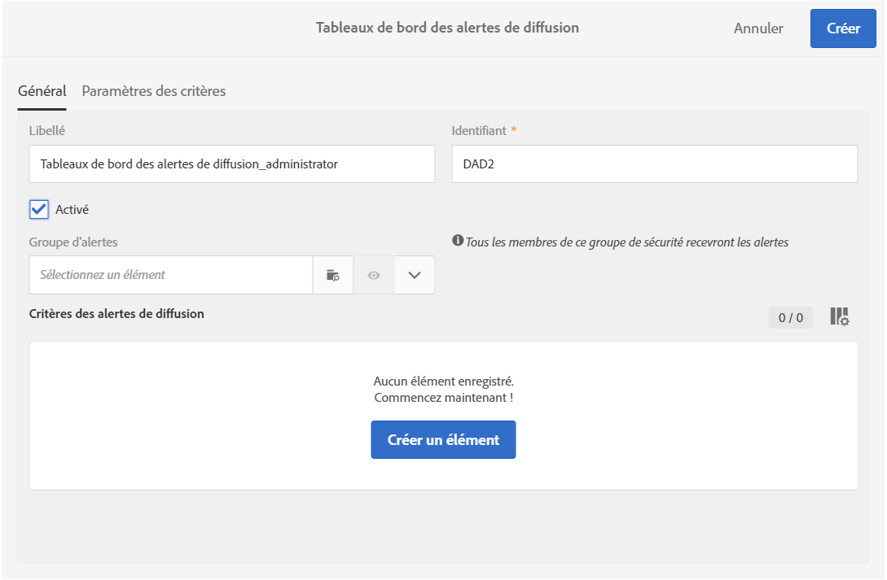

1. Sélectionnez le groupe de destinataires que vous souhaitez avertir dans la liste déroulante **[!UICONTROL Groupe d'alertes.]** Pour créer ou modifier un groupe, consultez la section [Créer un groupe de sécurité et affecter des utilisateurs](../../administration/using/managing-groups-and-users.md#creating-a-security-group-and-assigning-users).
1. Dans la section **[!UICONTROL Critères des alertes de diffusion]**, cliquez sur **Créer un élément]pour ajouter des critères.[!UICONTROL ** Voir [À propos des critères des alertes de diffusion](../../sending/using/receiving-alerts-when-failures-happen.md#about-alerting-criteria).
1. Cliquez sur le bouton **[!UICONTROL Editer les propriétés.]** Dans l'onglet **[!UICONTROL Paramètres des critères], définissez comment les critères seront appliqués.** Voir [Paramètres des critères](../../sending/using/receiving-alerts-when-failures-happen.md#criteria-parameters).
1. Cliquez sur **[!UICONTROL Créer]pour enregistrer le tableau de bord.**

Désormais, dès qu'une diffusion répond aux critères définis dans ce tableau de bord, une notification d'alerte est envoyée aux groupes d'utilisateurs indiqués.

## Critères des alertes de diffusion {#delivery-alerting-criteria}

### A propos des critères des alertes de diffusion {#about-alerting-criteria}

To access the delivery alerting criteria, go to **[!UICONTROL Administration]** &gt; **[!UICONTROL Channels]** &gt; **[!UICONTROL Delivery alerting]** and select **[!UICONTROL Delivery alerting criteria]**.

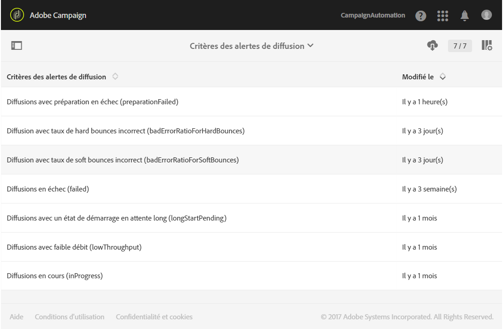

Les critères suivants peuvent être utilisés dans les tableaux de bord des alertes de diffusion :

* **[!UICONTROL Diffusions en échec]** : toute diffusion planifiée sur une période définie, ayant un statut en erreur.
* **[!UICONTROL Diffusions avec préparation en échec]** : toute diffusion modifiée pendant une période définie pour laquelle l'étape de préparation (calcul de la cible et génération du contenu) n'a pas réussi. Voir à ce propos la section [Préparer l'envoi](../../sending/using/preparing-the-send.md).
* **[!UICONTROL Diffusion avec un taux d'erreur incorrect pour les rebonds soft]**: Toute livraison planifiée dans une plage définie, avec un état au moins **[!UICONTROL En cours]**, avec un rapport d'erreur de rebond soft supérieur à un pourcentage défini.
* **[!UICONTROL Diffusion avec un taux d'erreur incorrect pour les rebonds durs]**: Toute livraison planifiée dans une plage définie, avec un état au moins **[!UICONTROL En cours]**, avec un rapport d'erreur de rebond hard supérieur à un pourcentage défini.
* **[!UICONTROL Diffusions avec un état de démarrage en attente long]** : toute diffusion planifiée sur une période définie, ayant le statut **[!UICONTROL Démarrage en attente]** pendant une durée supérieure à celle spécifiée. Le statut **Démarrage en attente]signifie que les messages n'ont pas encore été pris en compte par le système.[!UICONTROL **
* **[!UICONTROL Diffusions avec faible débit]** : toute diffusion ayant démarré depuis plus longtemps qu'une durée définie, avec un pourcentage de messages traités inférieur à un pourcentage défini et un débit inférieur à une valeur définie.
* **[!UICONTROL Diffusions en cours]** :toute diffusion planifiée sur une période définie, ayant le statut **[!UICONTROL En cours].**

>[!NOTE]
>
>Tous les paramètres s'appliquant aux critères ci-dessus possèdent des valeurs par défaut. Ces valeurs peuvent être modifiées dans l'onglet **[!UICONTROL Paramètres des critères]des tableaux de bord des alertes de diffusion.** Voir [Paramètres des critères](../../sending/using/receiving-alerts-when-failures-happen.md#criteria-parameters).

Vous pouvez sélectionner n'importe quel élément dans la liste **[!UICONTROL Critères des alertes de diffusion]pour accéder à ses détails.**

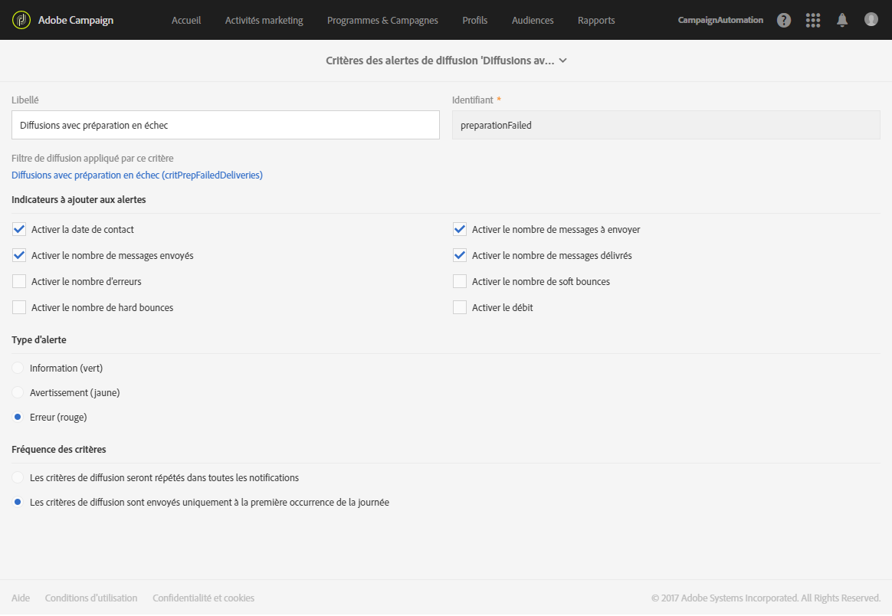

Pour chaque critère, vous pouvez définir les paramètres suivants :

* **[!UICONTROL Indicateurs à ajouter dans les alertes]**, c'est-à-dire les colonnes qui apparaîtront dans la section **[!UICONTROL Détails]de la notification pour les diffusions correspondant au critère sélectionné.**

   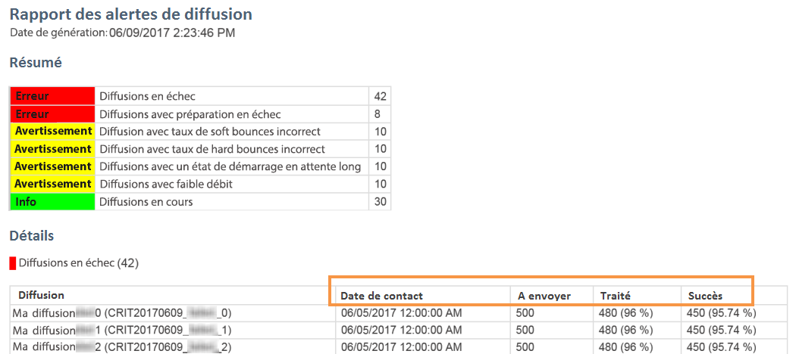

* **[!UICONTROL Type d'alerte]**, c'est-à-dire le libellé et la couleur qui apparaîtront en regard du critère de diffusion dans la synthèse de la notification.

   

* **[!UICONTROL Fréquence des critères]** : si une diffusion répond à un critère, ce dernier est répété dans chaque notification envoyée pendant la période de contrôle. Sinon, une seule alerte est envoyée par jour (à la première occurrence) par critère d'alerte pour une diffusion.

   Cette option est définie par défaut sur une fois par jour pour tous les critères.

**Rubriques connexes :**

* [Envois](../../sending/using/monitoring-a-delivery.md#sending-logs)
* [Fréquence des alertes](../../sending/using/receiving-alerts-when-failures-happen.md#alerting-frequency)
* [Icônes et statuts des activités marketing](../../start/using/marketing-activities.md#marketing-activity-icons-and-statuses)

### Créer un critère d'alerte de diffusion {#creating-a-delivery-alerting-criterion}

Vous pouvez créer des critères d'alerte de diffusion en fonction de vos besoins.

Vous pouvez par exemple créer un critère qui permet l'envoi d'une notification répertoriant toutes les diffusions ayant le statut **[!UICONTROL Terminé].**

Pour cela, vous devez d'abord étendre la ressource **Diffusion** et ajouter un nouveau filtre permettant de sélectionner uniquement les diffusions ayant le statut **[!UICONTROL Terminé].**

1. Accédez à **Adobe Campaign** &gt; **Administration** &gt; **Développement** &gt; **Ressources personnalisées** et cliquez sur **[!UICONTROL Créer]**.
1. Sélectionnez **[!UICONTROL Etendre une ressource existante]**, sélectionnez la ressource **[!UICONTROL Diffusion]dans la liste déroulante et cliquez sur** Créer] pour l'éditer.**[!UICONTROL **

   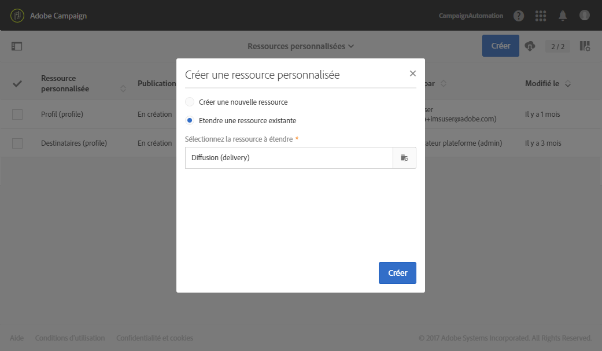

   Pour plus d'informations sur l'extension d'une ressource existante, voir [Définir la ressource](../../developing/using/creating-or-extending-the-resource.md).

1. Dans la ressource **[!UICONTROL Diffusion]**, accédez à l'onglet **[!UICONTROL Définition des filtres]et cliquez sur** Ajouter un élément] pour créer un filtre.**[!UICONTROL **

   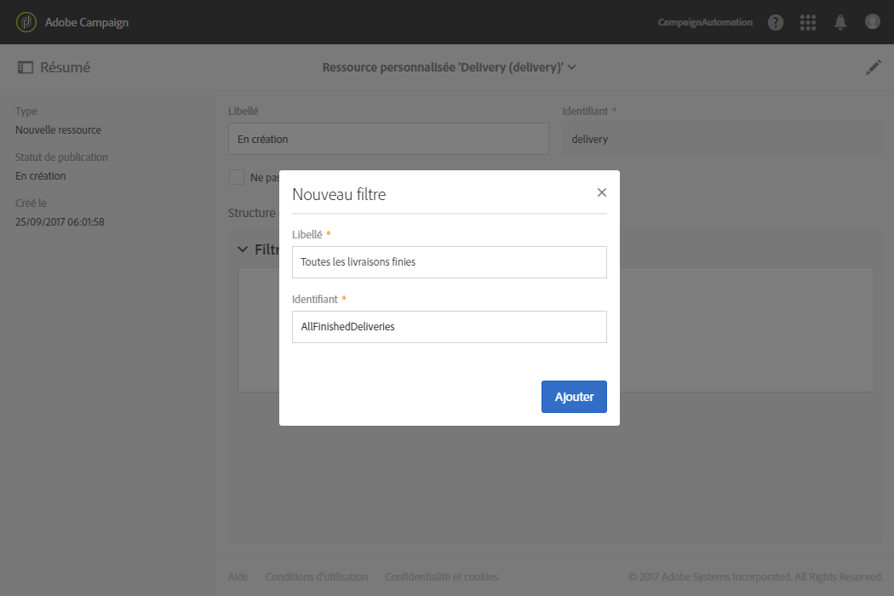

1. Editez la définition du nouveau filtre : dans la fenêtre **[!UICONTROL Définition des filtres]**, placez l'élément **[!UICONTROL Statut]dans l'espace de travail et sélectionnez** Terminé] en tant que condition de filtre.**[!UICONTROL **

   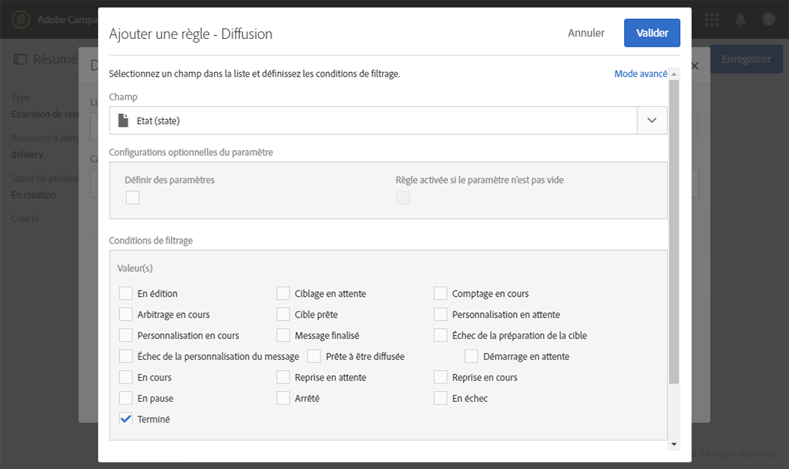

   Pour plus d'informations sur la création et l'édition des filtres personnalisés, voir [Définir des filtres](../../developing/using/configuring-filter-definition.md).

1. Enregistrez vos modifications et publiez vos ressources. Voir à ce propos la section [Publier une ressource personnalisée](../../developing/using/updating-the-database-structure.md#publishing-a-custom-resource).

   Le filtre est créé. Il peut maintenant être sélectionné dans un nouveau critère d'alerte de diffusion.

1. Go to **[!UICONTROL Administration]** &gt; **[!UICONTROL Channels]** &gt; **[!UICONTROL Delivery alerting]**, select **[!UICONTROL Delivery alerting criteria]** and click **[!UICONTROL Create]**.
1. Dans la liste déroulante **[!UICONTROL Filtre de diffusion appliqué par ce critère], sélectionnez le filtre que vous venez de créer.**

   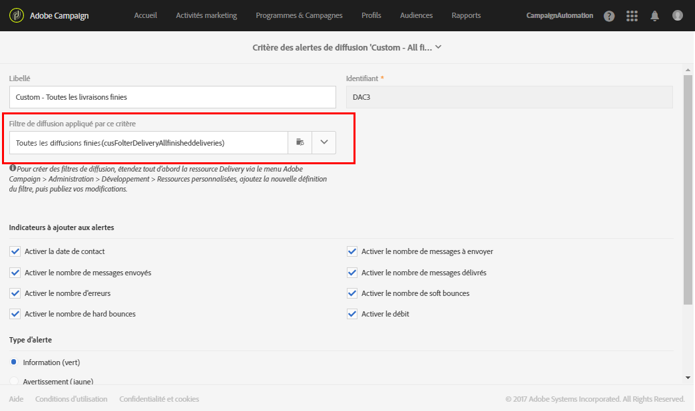

   Vous pouvez définir les paramètres du critère de la même manière que pour les critères par défaut. Voir [À propos des critères des alertes de diffusion](../../sending/using/receiving-alerts-when-failures-happen.md#about-alerting-criteria).

Une fois créés, ces critères peuvent être ajoutés, ainsi que d'autres critères, à un tableau de bord des alertes de diffusion. Voir [À propos des tableaux de bord des alertes de diffusion](../../sending/using/receiving-alerts-when-failures-happen.md#about-delivery-alerting-dashboards).

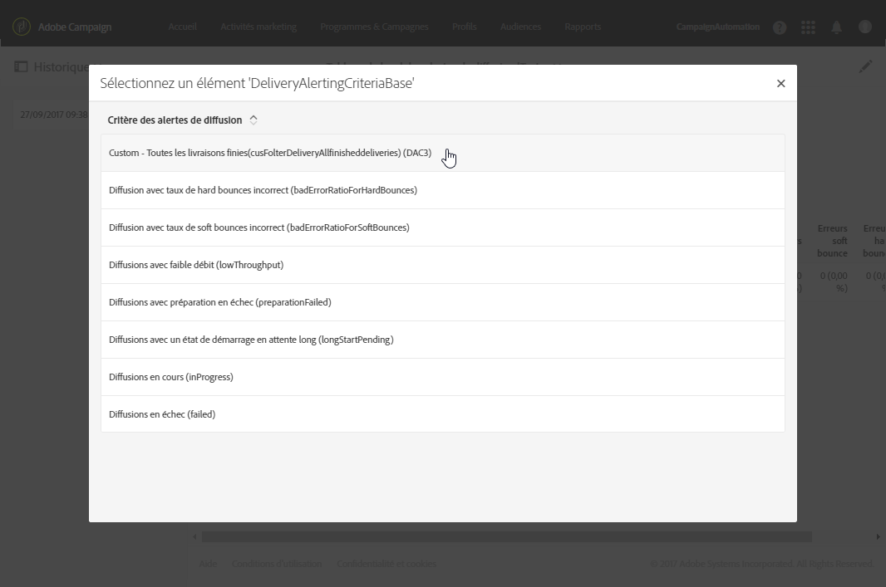

**Rubrique connexe :**

[Ajouter ou étendre une ressource](../../developing/using/key-steps-to-add-a-resource.md)

## Paramètres des alertes de diffusion {#delivery-alerting-parameters}

### Paramètres des critères {#criteria-parameters}

Dans l'onglet **[!UICONTROL Paramètres des critères]** d'un [tableau de bord des alertes de diffusion](../../sending/using/receiving-alerts-when-failures-happen.md#creating-a-delivery-alerting-dashboard), vous pouvez définir les paramètres qui s'appliquent aux critères sélectionnés du tableau de bord donné.

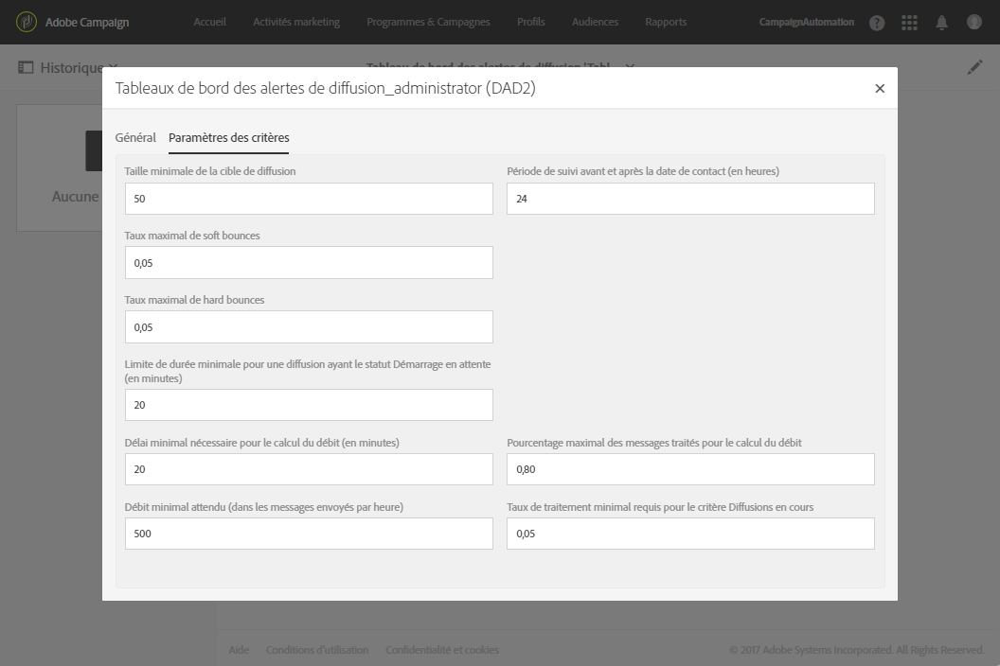

* **[!UICONTROL Taille minimale de la cible de la diffusion]** : si vous saisissez par exemple la valeur 100 dans ce champ, une notification est envoyée uniquement pour les diffusions dont la cible est supérieure ou égale à 100 destinataires. Ce paramètre s'applique à tous les critères.
* **[!UICONTROL Période de contrôle avant et après la date de contact (en heures)]** : nombre d'heures avant et après l'heure actuelle. Seules les diffusions dont la date de contact est comprise dans cette plage sont prises en compte. Ce paramètre s'applique à tous les critères. Par défaut, la valeur de ce champ est définie sur 24 heures.

   Pour plus d'informations sur la date de contact, voir [Planning](../../sending/using/about-scheduling-messages.md).

* **[!UICONTROL Taux maximal de soft bounces]** : une notification est envoyée pour toutes les diffusions dont le taux de soft bounces est supérieur à la valeur spécifiée. Par défaut, la valeur de ce champ est définie sur 0,05 (5 %).

   Pour plus d'informations sur les soft bounces, voir [À propos de la qualification des emails bounce](../../sending/using/understanding-delivery-failures.md#bounce-mail-qualification) et [Liste des types de diffusions en échec](../../sending/using/understanding-delivery-failures.md#delivery-failure-types-and-reasons).

* **[!UICONTROL Taux maximal de soft bounces]** : une notification est envoyée pour toutes les diffusions dont le taux de hard bounces est supérieur à la valeur spécifiée. Par défaut, la valeur de ce champ est définie sur 0,05 (5 %).

   Pour plus d'informations sur les hard bounces, voir [À propos de la qualification des emails bounce](../../sending/using/understanding-delivery-failures.md#bounce-mail-qualification) et [Liste des types de diffusions en échec](../../sending/using/understanding-delivery-failures.md#delivery-failure-types-and-reasons).

* **[!UICONTROL Limite de durée minimale pour une diffusion ayant le statut 'Démarrage en attente' (en minutes)]** : une notification est envoyée pour toutes les diffusions ayant le statut **[!UICONTROL Démarrage en attente]** pendant une durée supérieure à celle spécifiée dans le champ. Le statut **Démarrage en attente]signifie que les messages n'ont pas encore été pris en compte par le système.[!UICONTROL **
* **[!UICONTROL Délai minimal (en minutes) nécessaire pour le calcul du débit]** : seules les diffusions ayant démarré (avec le statut **[!UICONTROL En cours]**) depuis plus longtemps que la durée spécifiée sont prises en compte pour le critère **Diffusions avec faible débit[!UICONTROL .]**
* **[!UICONTROL Pourcentage maximal des messages traités pour le calcul du débit]** : seules les diffusions dont le pourcentage de messages traités est inférieur au pourcentage spécifié sont prises en compte pour le critère **[!UICONTROL Diffusions avec faible débit].**
* **[!UICONTROL Débit minimal attendu (dans les messages envoyés par heure)]** : seules les diffusions dont le débit est inférieur à la valeur spécifiée sont prises en compte pour le critère **[!UICONTROL Diffusions avec faible débit].**
* **[!UICONTROL Taux de traitement minimal requis pour le critère 'Diffusions en cours']** : seules les diffusions dont le pourcentage de messages traités est supérieur au pourcentage spécifié sont prises en compte.

### Fréquence des alertes {#alerting-frequency}

L'option **[!UICONTROL Fréquence des alertes de diffusion]permet de définir le délai entre deux envois d'alerte.** Par défaut, elle est définie sur 10 minutes.

You can change this setting through the **[!UICONTROL Administration]** &gt; **[!UICONTROL Application settings]** &gt; **[!UICONTROL Options]** menu.

>[!NOTE]
>
>Cette option s'applique à tous les tableaux de bord définis dans Adobe Campaign. Vous ne pouvez pas définir une fréquence spécifique pour chaque tableau de bord.

## Motifs des alertes de diffusion {#delivery-alerting-reasons}

La fonctionnalité **Alertes de diffusion** maintient automatiquement informés tous les utilisateurs actifs d'Adobe Campaign en ce qui concerne le statut d'exécution des diffusions, par email ou par le biais d'un tableau de bord.

Lorsque vous recevez une notification d'alerte de diffusion, voici ce que vous pouvez faire.

Tout d'abord, consultez l'onglet **Log** de la diffusion pour afficher toutes les informations relatives à la diffusion et aux BAT. Les icônes rouge et jaune permettent de repérer les erreurs ou avertissements. L'icône rouge indique une erreur critique qui empêche le démarrage de la diffusion.

Pour afficher l'historique de chaque occurrence d'une diffusion, sélectionnez l'onglet **[!UICONTROL Envois].** Il contient la liste des messages envoyés et leur statut. There you can check the delivery status for each recipient ( **[!UICONTROL Sent]**, **[!UICONTROL Pending]**, **[!UICONTROL Failed]**, etc.). Pour plus d'informations à ce sujet, voir [Envois](../../sending/using/monitoring-a-delivery.md#sending-logs).

Vous trouverez ci-dessous quelques raisons possibles de la réception de notifications d'alerte lorsque les critères d'une diffusion sont respectés.

* **[!UICONTROL Diffusions en échec]** : ce critère vous indique toutes les diffusions ayant un statut en erreur. Les raisons peuvent être les suivantes :

   * un problème lié au serveur de diffusion (MTA, Message Transfer Agent) ;
   * une connexion arrivée à expiration entre le serveur de diffusion Adobe Campaign et le serveur de réception ;
   * un problème de délivrabilité ;
   * un workflow en erreur.
   Si la diffusion est déclenchée à l'aide d'un workflow, vérifiez que ce dernier a correctement démarré. Voir à ce propos la section [Exécuter un workflow](../../automating/using/executing-a-workflow.md). Sinon, contactez votre administrateur Adobe Campaign pour résoudre ce problème.

* **[!UICONTROL Diffusions avec préparation en échec]** : une erreur peut se produire lors de la préparation de la diffusion dans les cas suivants :

   * Il manque un objet dans la diffusion.
   * Les champs de personnalisation contiennent une syntaxe incorrecte.
   * La cible est absente.
   * La diffusion dépasse la taille limite.
   Voir à ce propos la section [Préparer l'envoi](../../sending/using/preparing-the-send.md). Ces erreurs sont toutefois généralement détectées lors de l'analyse des messages. Voir [Règles de contrôle](../../administration/using/control-rules.md).

* Les causes possibles d'une alerte **[!UICONTROL Diffusion avec taux d'erreurs soft incorrect]peuvent être les suivantes :**

   * Le serveur du destinataire est en panne.
   * La boîte de messagerie du destinataire est pleine.
   Pour plus d'informations, consultez les onglets **[!UICONTROL Exclus]** et **Exclusions appliquées]des logs de diffusion.[!UICONTROL ** Voir [Exclus](../../sending/using/monitoring-a-delivery.md#exclusion-logs).

   Les causes possibles d'une alerte **[!UICONTROL Diffusion avec taux d'erreurs hard incorrect]peuvent être les suivantes :**

   * Le destinataire est blacklisté, ce qui signifie qu'il ne souhaite plus être contacté.
   * L'adresse email du destinataire n'existe pas.
   * Le domaine du destinataire n'existe pas.
   * Le serveur du destinataire bloque la diffusion.
   Pour éviter les soft et hard bounces, suivez les bonnes pratiques suivantes :

   * Créez des règles de typologie de type Filtrage pour exclure une partie de la cible des messages (comme les destinataires en quarantaine) pendant l'analyse de la diffusion. Voir [Créer une règle de filtrage](../../administration/using/filtering-rules.md).
   * Mettez régulièrement à jour votre base client pour conserver de bons processus de gestion des quarantaines. Voir [A propos des quarantaines](../../sending/using/understanding-quarantine-management.md#about-quarantines).
   * D'une manière générale, améliorez autant que possible la délivrabilité. Consultez le guide détaillé [Gestion de la délivrabilité](http://docs.campaign.adobe.com/doc/AC/getting_started/EN/deliverability.html) d'Adobe Campaign v7 et contactez votre administrateur Adobe Campaign pour obtenir de l'aide.

* **[!UICONTROL Diffusions avec un état de démarrage en attente long ]**: cette alerte indique généralement un problème au niveau du MTA (Message Transfer Agent). Le processus d'exécution attend la disponibilité de certaines ressources. Le MTA peut ne pas avoir été démarré.

   **[!UICONTROL Diffusions avec faible débit]** : il s'agit encore une fois d'un problème de délivrabilité qui signale que le MTA est trop lent.

   Pour plus d'informations sur ces problèmes, contactez votre administrateur Adobe Campaign.

**Rubriques connexes :**

* [Comprendre les diffusions en échec](../../sending/using/understanding-delivery-failures.md)
* [Comprendre la gestion des quarantaines](../../sending/using/understanding-quarantine-management.md)
* [Gestion du blacklistage dans Campaign](../../audiences/using/about-opt-in-and-opt-out-in-campaign.md)

