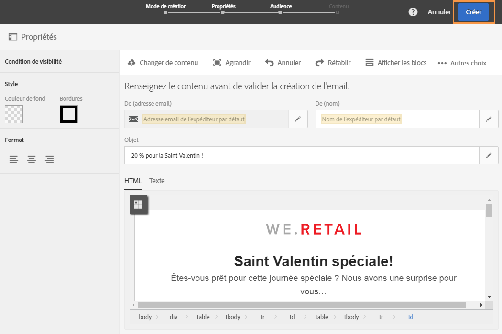
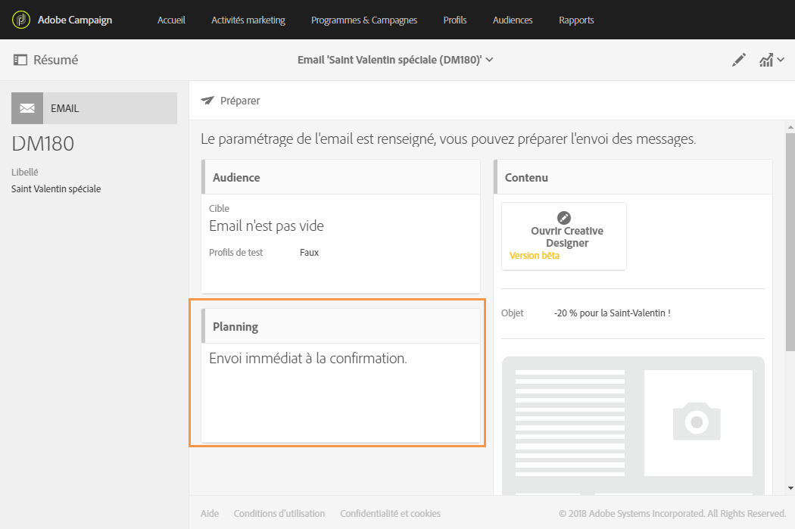
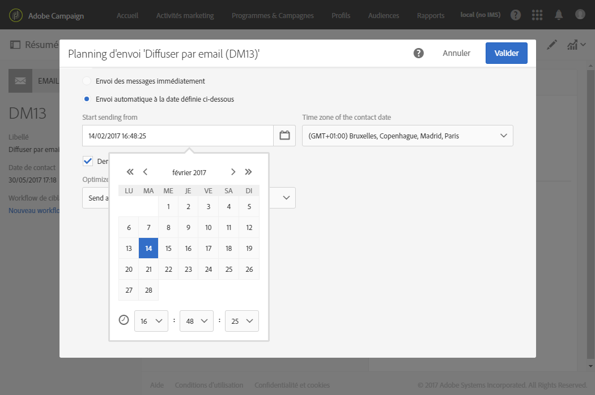
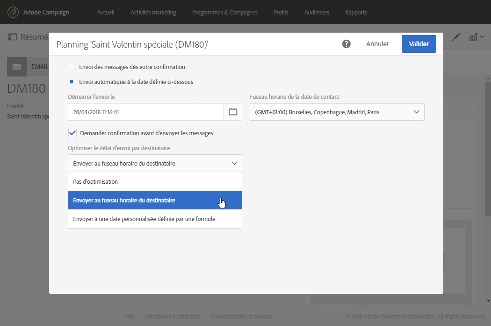
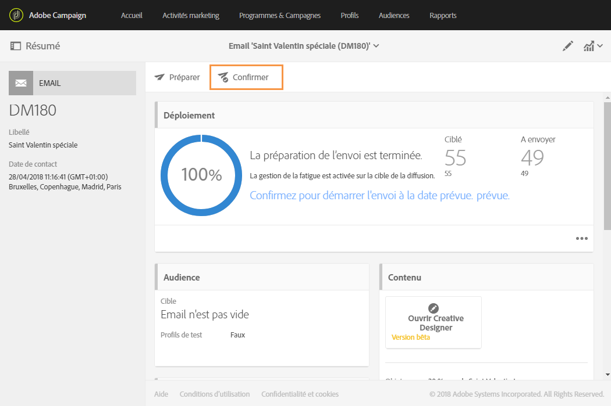

# Envoi des messages au fuseau horaire du destinataire{#sending-messages-at-the-recipient-s-time-zone}

Lorsque vous gérez une campagne dans laquelle la date et l'heure sont importantes, vous pouvez planifier une diffusion tenant compte de l'heure locale de chaque destinataire : celui-ci recevra un email, un SMS ou une notification push au moment programmé, dans son propre fuseau horaire.

>[!NOTE]
>
>Pour utiliser cette fonctionnalité, assurez-vous qu'un fuseau horaire est défini pour chaque profil ciblé par votre diffusion (**[!UICONTROL Propriétés &gt; section Adresse]).** Pour plus d'informations sur l'accès aux propriétés d'un profil, consultez cette [section](../../audiences/using/editing-profiles.md).

Pour envoyer une diffusion au fuseau horaire du destinataire, vous pouvez également utiliser l'activité **[!UICONTROL Planificateur]dans un workflow.** Pour plus d'informations à ce propos, consultez [cette page](../../automating/using/scheduler.md).

Dans l'exemple ci-après, vous voulez envoyer un code promotionnel valable uniquement le jour de la Saint-Valentin à tous vos clients à travers le monde. Pour avoir le temps d'utiliser ce code dans la journée, chaque destinataire doit recevoir votre message le 14 février à 8 heures, selon son fuseau horaire.

1. Dans l'onglet **[!UICONTROL Activités marketing], commencez à créer votre diffusion, un email dans le cas présent.** Pour plus d'informations sur la création d'une diffusion, consultez cette [section](../../channels/using/creating-an-email.md).
1. Après avoir conçu l'email pour le jour de la Saint-Valentin, cliquez sur **[!UICONTROL Créer]pour accéder au tableau de bord des diffusions.** Pour plus d'informations sur la conception d'un email, consultez cette [page](../../designing/using/example--email-personalization.md).

   

1. Dans le tableau de bord des diffusions, sélectionnez le bloc **[!UICONTROL Planning].**

   

1. Sélectionnez l'option **[!UICONTROL Envoi automatique à la date définie ci-dessous.]** Ensuite, dans le champ **[!UICONTROL Démarrer l'envoi le], définissez la date de contact, à savoir le 14 février à 8 heures, afin que chaque destinataire reçoive l'email le jour de la Saint-Valentin.**

   

1. Dans le champ **[!UICONTROL Fuseau horaire de la date de contact], sélectionnez dans quel fuseau horaire votre diffusion doit être envoyée par défaut.**

   If a profile's **[!UICONTROL Time zone]** is left as **[!UICONTROL Default]**, the recipients will receive the delivery depending on the chosen time zone here.

1. Dans le menu déroulant **[!UICONTROL Optimiser le délai d'envoi par destinataire]**, sélectionnez **[!UICONTROL Envoyer au fuseau horaire du destinataire]**. Les destinataires pourront ainsi recevoir l'email de la Saint-Valentin le 14 février selon leur fuseau horaire.

   

1. Une fois le planning de la diffusion validé, cliquez sur le bouton **[!UICONTROL Préparer]**, puis sur **Confirmer]pour confirmer votre diffusion.[!UICONTROL **

   Veillez à confirmer l'envoi au moins 24 heures à l'avance. Sinon, en fonction de leur localisation, certains destinataires pourraient recevoir la diffusion avant le jour de la Saint-Valentin.

   

Tous les destinataires recevront le message le 14 février à 8 heures heure locale, peu importe où ils se trouvent.
