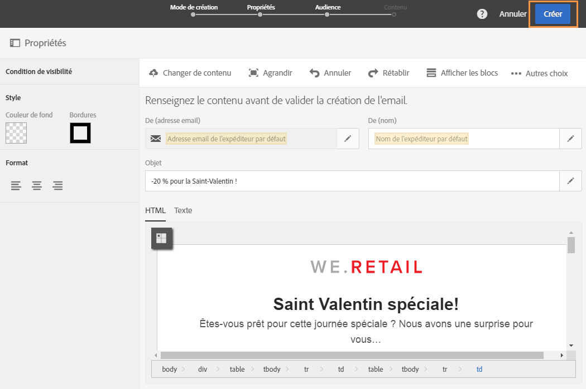
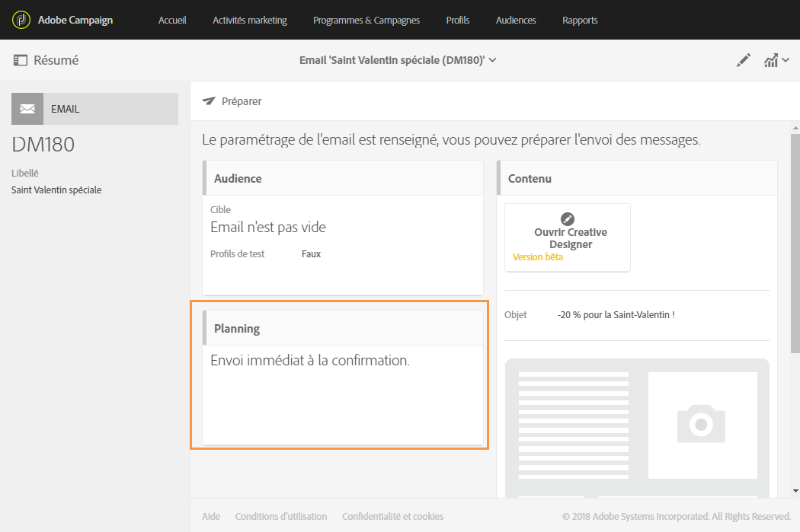
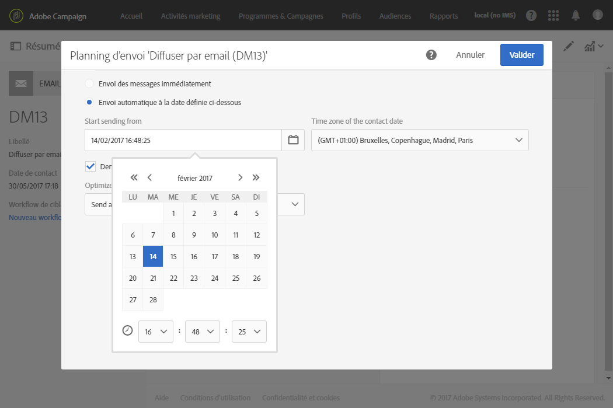
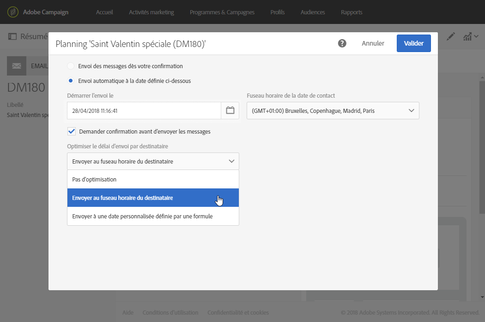
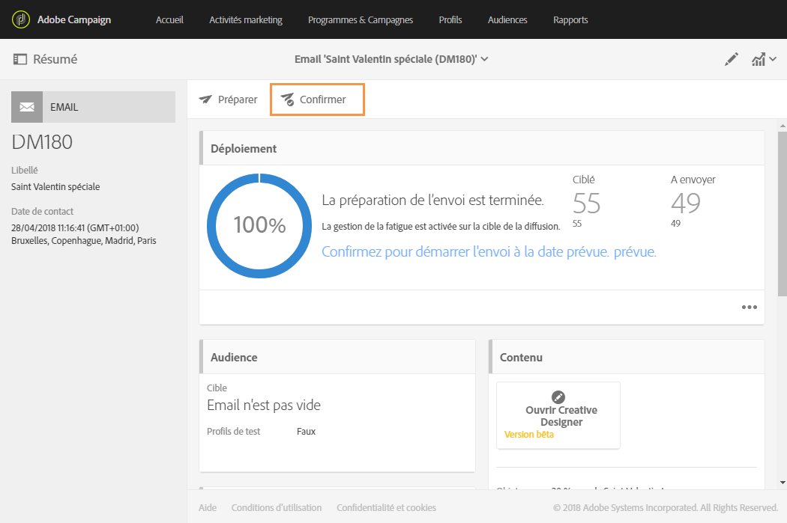

# Envoi des messages au fuseau horaire du destinataire{#sending-messages-at-the-recipient-s-time-zone}

Lorsque vous gérez une campagne dans laquelle la date et l&#39;heure sont importantes, vous pouvez planifier une diffusion tenant compte de l&#39;heure locale de chaque destinataire : celui-ci recevra un email, un SMS ou des notifications push au moment programmé, dans son propre fuseau horaire.

>[!NOTE]
>
>Pour utiliser cette fonctionnalité, assurez-vous qu&#39;un fuseau horaire est défini pour chaque profil ciblé par votre diffusion (**[!UICONTROL Propriétés > section Adresse]**). Pour plus d&#39;informations sur l&#39;accès aux propriétés d&#39;un profil, consultez cette [section](../../audiences/using/editing-profiles.md).

Pour envoyer une diffusion au fuseau horaire du destinataire, vous pouvez également utiliser l&#39;activité **[!UICONTROL Planificateur]** dans un workflow. Pour plus d’informations à ce sujet, consultez cette [page](../../automating/using/scheduler.md).

Dans l&#39;exemple ci-après, vous voulez envoyer un code promotionnel valable uniquement le jour de la Saint-Valentin à tous vos clients à travers le monde. Pour disposer de suffisamment de temps pour l’utiliser au cours de la journée, tous les clientes et clients doivent recevoir votre message le 14 février à 8:00 dans leur fuseau horaire.

1. Dans l&#39;onglet **[!UICONTROL Activités marketing]**, commencez à créer votre diffusion, un email dans le cas présent. Pour plus d&#39;informations sur la création d&#39;une diffusion, consultez cette [section](../../channels/using/creating-an-email.md).
1. Après avoir conçu l&#39;email pour le jour de la Saint-Valentin, cliquez sur **[!UICONTROL Créer]** pour accéder au tableau de bord des diffusions. Pour plus d&#39;informations sur la conception d&#39;un email, consultez cette [page](../../designing/using/personalization.md#example-email-personalization).

   

1. Dans le tableau de bord des diffusions, sélectionnez le bloc **[!UICONTROL Planning]**.

   

1. Sélectionnez l’option **[!UICONTROL Envoi automatique à la date définie ci-dessous]**. Ensuite, dans le champ **[!UICONTROL Commencer à envoyer le]**, définissez la date de contact, dans notre cas le 14 février à 8:00 afin que chaque destinataire la reçoive le jour de la Saint-Valentin.

   

1. Dans le champ **[!UICONTROL Fuseau horaire de la date de contact]**, sélectionnez dans quel fuseau horaire votre diffusion doit être envoyée par défaut.

   Si le **[!UICONTROL Fuseau horaire]** d&#39;un profil est conservé comme valeur **[!UICONTROL Par défaut]**, les destinataires recevront la diffusion selon le fuseau horaire sélectionné.

1. Dans le menu déroulant **[!UICONTROL Optimiser le délai d&#39;envoi par destinataire]**, sélectionnez **[!UICONTROL Envoyer au fuseau horaire du destinataire]**. Les destinataires pourront ainsi recevoir l&#39;email de la Saint-Valentin le 14 février selon leur fuseau horaire.

   

1. Une fois le planning de la diffusion validé, cliquez sur le bouton **[!UICONTROL Préparer]**, puis sur **[!UICONTROL Confirmer]** pour confirmer votre diffusion.

   Veillez à confirmer l&#39;envoi au moins 24 heures à l&#39;avance. Sinon, en fonction de leur localisation, certains destinataires pourraient recevoir la diffusion avant le jour de la Saint-Valentin.

   

Où qu’elles se trouvent, toutes personnes les destinataires recevront le message le 14 février à 8:00, heure locale.
