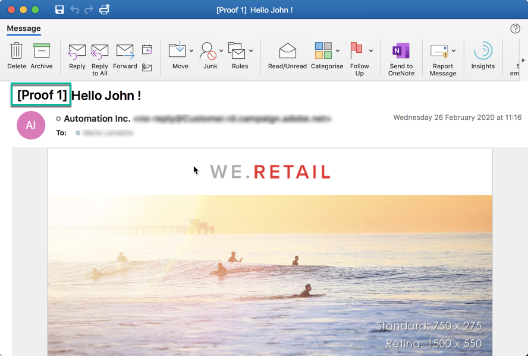
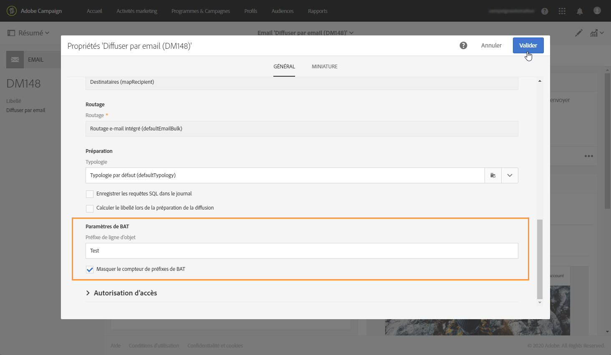

# Envoyer un bon à tirer {#sending-proofs}

## À propos des bons à tirer {#about-proofs}

Le bon à tirer (BAT) est un message spécifique qui permet de tester un message avant son envoi à la cible principale. Les destinataires du BAT sont chargés de la validation du message (contenu et forme).

Il existe deux types de destinataires de bons à tirer :

* Les **profils de test** permettent de cibler des destinataires additionnels, qui ne correspondent pas aux critères de ciblage définis.

   Ils peuvent être ajoutés à l’audience d’un message afin de détecter une utilisation frauduleuse de votre base de données de destinataires ou de contrôler la bonne réception de vos messages. Voir à ce sujet la section [Gérer les profils de test](../../audiences/using/managing-test-profiles.md).

   >[!NOTE]
   >
   >Pour pouvoir envoyer un bon à tirer, des profils de test doivent être inclus dans l’audience de votre message.

* Les **profils de substitution** vous permettent de vous mettre à la place de l’un des profils ciblés et d’obtenir une représentation exacte du message que le profil recevra. Pour plus d’informations, voir [Test des emails à l’aide des profils ciblés](../../sending/using/testing-messages-using-target.md).

   >[!NOTE]
   >
   >Cette fonctionnalité est disponible uniquement pour le canal Email.

## Envoyer un bon à tirer {#sending-a-proof}

Pour envoyer des bons à tirer, procédez comme suit :

1. Vérifiez que les destinataires des bons à tirer ont été configurés :
   * Les **profils de test** doivent être inclus dans l’audience de votre message.
   * Les **profils de substitution** doivent être ajoutés une fois que la préparation du message a été effectuée avec succès (voir [cette section](../../sending/using/testing-messages-using-target.md)).

1. Cliquez sur le bouton **[!UICONTROL Envoyer un test]**.

   

1. Sélectionnez le type de BAT que vous souhaitez utiliser :

   * **[!UICONTROL Rendu des emails]** : sélectionnez cette option pour tester la réception de votre message en fonction des boîtes de messagerie ciblées. Pour plus d’informations, voir [Rendu des emails](../../sending/using/email-rendering.md).
   * **[!UICONTROL Bon à tirer]** : sélectionnez cette option pour tester le message avant son envoi à la cible principale. Les destinataires du BAT sont chargés de la validation de la diffusion, tant sur son contenu que sur sa forme.
   * **[!UICONTROL Bon à tirer + Rendu des emails]** : cette option regroupe les deux options précédentes.

   

   >[!NOTE]
   >
   >Le rendu des emails est disponible avec les profils de test uniquement. Si aucun profil de test n’a été ajouté au message, seule l’option **[!UICONTROL Bon à tirer]** peut être sélectionnée.

1. Validez votre choix.

   Les bons à tirer sont envoyés aux destinataires qui ont été configurés.

   

1. Vous pouvez consulter les BAT depuis la liste déroulante **[!UICONTROL Bons à tirer]**.

   

1. Sélectionnez un BAT pour accéder à son résumé. Pour un email, si vous avez sélectionné l’option **rendu des emails** lors du choix des BAT, l’icône **[!UICONTROL Accéder au rendu des emails]** est affichée à droite du libellé du BAT. Voir [Rendu des emails](../../sending/using/email-rendering.md).

   

En fonction des remarques des personnes qui reçoivent le BAT, vous serez amené à modifier le contenu de la diffusion. Une fois vos modifications effectuées, vous devez relancer la préparation de l’email puis envoyer à nouveau un BAT. Chaque nouveau BAT est accessible depuis le bouton **[!UICONTROL Afficher les bons à tirer]**.

Vous devez envoyer autant de BAT que nécessaire jusqu’à ce que le contenu de votre diffusion soit finalisé. Dès lors, vous pouvez envoyer la diffusion à la cible principale et clore le cycle de validation.

## Configuration de la ligne d’objet du bon à tirer {#configuring-proofs-subject-line}

Lorsqu’un bon à tirer est envoyé, sa ligne d’objet est configurée par défaut avec le préfixe **« Bon à tirer »**, ainsi qu’un compteur indiquant le numéro du bon à tirer.

Pour modifier la ligne d’objet par défaut à utiliser, procédez comme suit :

1. Dans le tableau de bord des messages, cliquez sur le bouton **[!UICONTROL Ouvrir les propriétés]**.
1. Dans la section **[!UICONTROL Paramètres avancés]**, définissez le préfixe que vous souhaitez utiliser par défaut dans la ligne d’objet.

Pour masquer le numéro du bon à tirer dans la ligne d’objet, activez l’option **[!UICONTROL Masquer le compteur de préfixes de BAT]**.

>[!NOTE]
>
>Si vous souhaitez masquer l’intégralité du préfixe du bon à tirer, laissez vide le champ **[!UICONTROL Préfixe de ligne d’objet]**.

1. Cliquez sur **[!UICONTROL Valider]**. Les paramètres sont appliqués par défaut à tous les bons à tirer envoyés pour le message sélectionné.

**Rubrique connexe :**

* Vidéo [Envoyer un test, préparer un email et l’envoyer](https://docs.adobe.com/content/help/en/campaign-learn/campaign-standard-tutorials/getting-started/sending-test-preparing-sending-email.html)
* [Test des emails à l’aide des profils ciblés](../../sending/using/testing-messages-using-target.md)
* [Gestion des profils de test](../../audiences/using/managing-test-profiles.md)
* [Prévisualiser un message](../../sending/using/previewing-messages.md)
* [Configuration du canal Email](../../administration/using/configuring-email-channel.md)
