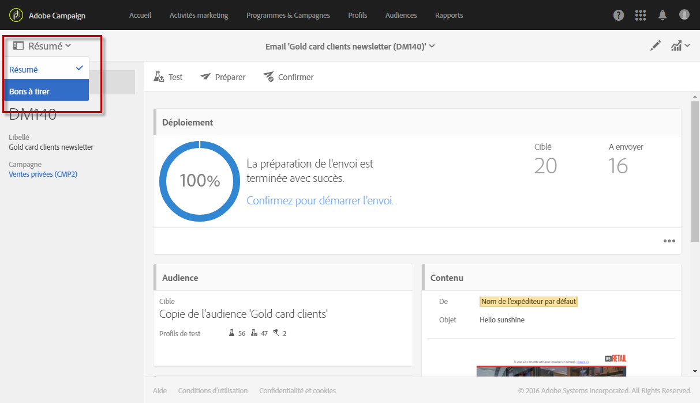

# Envoyer un bon à tirer {#sending-proofs}

Le bon à tirer (BAT) est un message spécifique qui permet de tester un message avant son envoi à la cible principale.

Les destinataires du BAT sont chargés de la validation du message (contenu et forme). Ils sont définis dans les **Profils de test**. Voir à ce sujet la section [Gérer les profils de test](../../audiences/using/managing-test-profiles.md).

Pour pouvoir envoyer un bon à tirer, des profils de test doivent être inclus dans l&#39;audience de votre message.

Au niveau d&#39;un message :

1. Cliquez sur le bouton **[!UICONTROL Envoyer un test]**.

   

1. Sélectionnez le type de BAT que vous souhaitez utiliser :

   * **[!UICONTROL Rendu des emails]** : sélectionnez cette option pour tester la réception de votre message en fonction des boîtes de messagerie ciblées. Pour plus d&#39;informations, voir [Rendu des emails](../../sending/using/email-rendering.md).
   * **[!UICONTROL Bon à tirer]** : sélectionnez cette option pour tester le message avant son envoi à la cible principale. Les destinataires du BAT sont chargés de la validation de la diffusion, tant sur son contenu que sur sa forme.
   * **[!UICONTROL Bon à tirer + Rendu des emails]** : cette option regroupe les deux options précédentes.
   

1. Validez votre choix.

   Les BAT sont envoyés aux profils de test.

   

1. Vous pouvez consulter les BAT depuis la liste déroulante **[!UICONTROL Bons à tirer]**.

   

1. Sélectionnez un BAT pour accéder à son résumé. Pour un email, si vous avez sélectionné l&#39;option **rendu des emails** lors du choix des BAT, l&#39;icône **[!UICONTROL Accéder au rendu des emails]** est affichée à droite du libellé du BAT. Voir [Rendu des emails](../../sending/using/email-rendering.md).

   

En fonction des remarques des personnes qui reçoivent le BAT, vous serez amené à modifier le contenu de la diffusion. Une fois vos modifications effectuées, vous devez relancer la préparation de l&#39;email puis envoyer à nouveau un BAT. Chaque nouveau BAT est accessible depuis le bouton **[!UICONTROL Afficher les bons à tirer]**.

Vous devez envoyer autant de BAT que nécessaire jusqu&#39;à ce que le contenu de votre diffusion soit finalisé. Dès lors, vous pouvez envoyer la diffusion à la cible principale et clore le cycle de validation.

**Rubrique connexe :**

Vidéo [Envoyer un test, préparer un email et l&#39;envoyer](https://docs.adobe.com/content/help/en/campaign-learn/campaign-standard-tutorials/getting-started/sending-test-preparing-sending-email.html)
