# Test des emails à l’aide des profils ciblés {#testing-message-profiles}

## Présentation {#overview}

En plus des [profils de test](../../audiences/using/managing-test-profiles.md), vous pouvez tester un email en vous mettant à la place de l’un des profils ciblés. Cela vous permet d’obtenir une représentation réaliste du message que le profil recevra (champs personnalisés, informations dynamiques et personnalisées, y compris les données additionnelles provenant des workflows...).

>[!NOTE]
>
> Cette fonctionnalité est disponible avec les emails uniquement.

Les étapes principales sont les suivantes :

1. Configurez votre message, puis lancez la phase de **préparation**.
1. **Sélectionnez un ou plusieurs profils** parmi les profils ciblés par l’email.
1. Associez à chaque profil une **adresse de substitution** à laquelle les bons à tirer seront envoyés.
1. (Facultatif) Pour chaque profil, définissez un **préfixe** à ajouter à l’objet du bon à tirer.
1. **Prévisualisez** dans le Concepteur d’email la manière dont l’email s’affichera pour les profils.
1. Envoyez les bons à tirer.

>[!IMPORTANT]
>
>Cette fonctionnalité vous permet d’envoyer des informations personnelles de profil à des adresses email externes. Gardez à l’esprit que l’exécution des demandes d’accès à des informations personnelles (RGPD et CCPA) dans Campaign Standard NE S’EXÉCUTERA PAS en externe.

 [Découvrez cette fonctionnalité en vidéo](#video)

## Sélection des profils et des adresses de substitution {#selecting-profiles}

Pour utiliser des profils ciblés à des fins de test, vous devez d’abord les sélectionner, puis définir les adresses de substitution qui recevront les bons à tirer. Pour ce faire, vous pouvez [sélectionner des profils spécifiques](#selecting-individual-profiles) parmi les profils ciblés ou [importer des profils à partir d’une audience existante](#importing-from-audience).

>[!NOTE]
>
>Vous pouvez sélectionner un maximum de 100 profils pour les tests.

### Sélection de profils individuels {#selecting-individual-profiles}

1. Dans le tableau de bord des messages, vérifiez que la préparation du message est réussie, puis cliquez sur le bloc **[!UICONTROL Audience]**.

   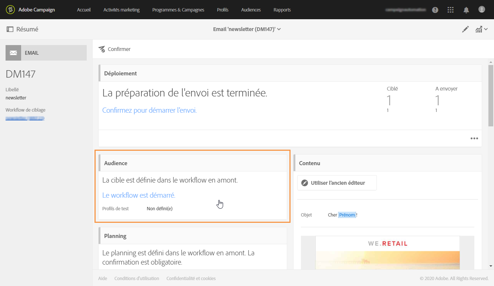

1. Dans l’onglet **[!UICONTROL Substitutions de profil]**, cliquez sur le bouton **[!UICONTROL Créer un élément]** pour sélectionner les profils à utiliser pour les tests.

   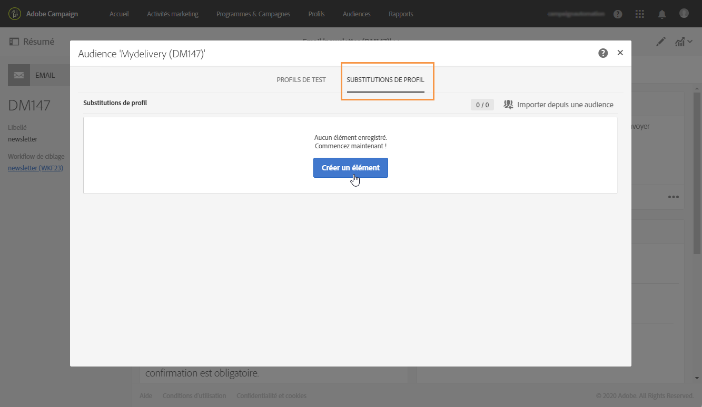

1. Cliquez sur le bouton de sélection du profil pour afficher la liste des profils ciblés par le message.

   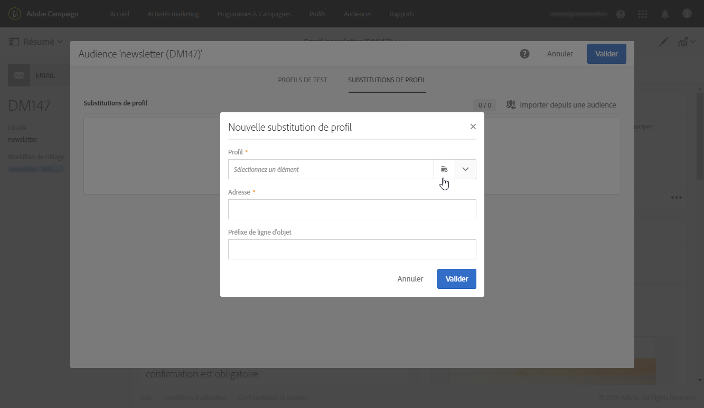

1. Sélectionnez le profil à utiliser pour le test, puis saisissez l’adresse de substitution souhaitée dans le champ **[!UICONTROL Adresse]** et cliquez sur **[!UICONTROL Valider]**. Tous les bons à tirer ciblant le profil seront envoyés à cette adresse email, plutôt qu’à celle définie dans la base de données pour ce profil.

   Si vous souhaitez ajouter un préfixe spécifique à l’objet du bon à tirer, renseignez le champ **[!UICONTROL Préfixe de ligne d’objet]**.

   >[!NOTE]
   >
   >Le préfixe de ligne d’objet peut contenir jusqu’à 500 caractères.

   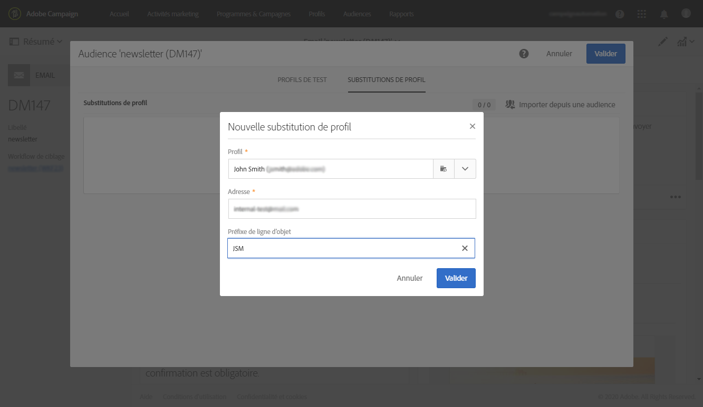

   Le préfixe s’affiche comme suit :

   

1. Le profil est ajouté à la liste, avec son adresse de substitution et son préfixe associés. Répétez les étapes ci-dessus pour tous les profils que vous souhaitez utiliser pour les tests, puis cliquez sur **[!UICONTROL Valider]**.

   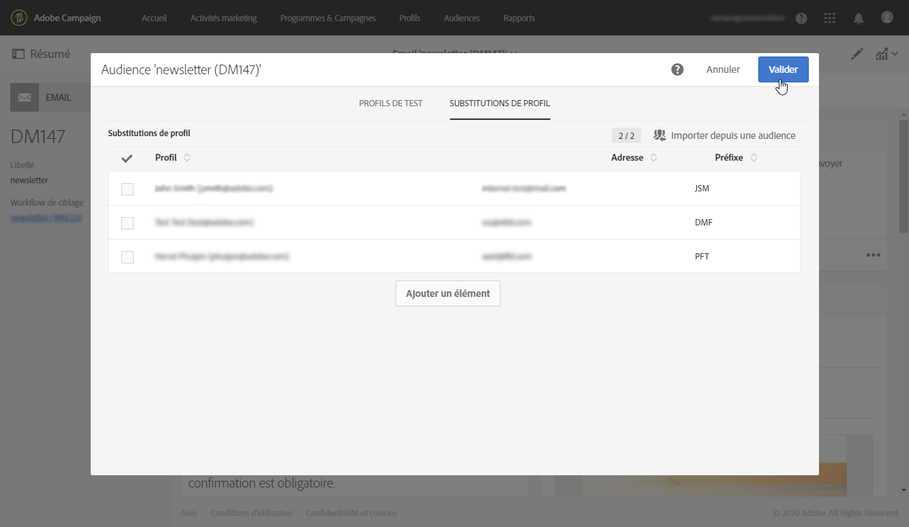

   Si vous souhaitez envoyer un bon à tirer à plusieurs adresses de substitution pour un même profil, vous devez ajouter ce profil autant de fois que nécessaire.

   Dans l’exemple ci-dessous, le bon à tirer reposant sur le profil John Smith sera envoyé à deux adresses de substitution différentes :

   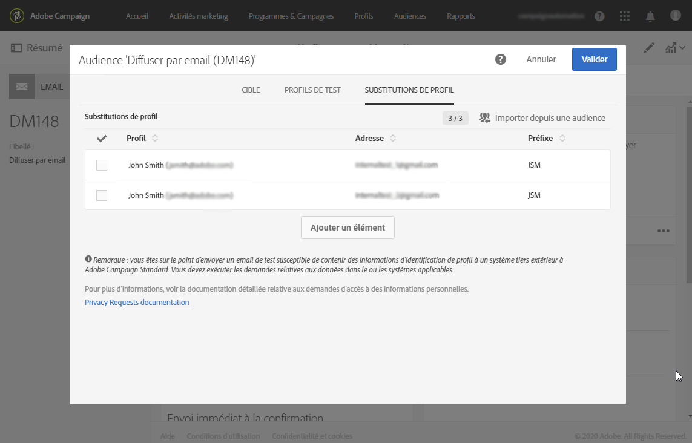

1. Une fois que tous les profils et adresses de substitution sont définis, vous pouvez envoyer un bon à tirer pour tester le message. Pour ce faire, cliquez sur le bouton **[!UICONTROL Test]** , puis sélectionnez le type de test à exécuter.

   Notez que si aucun profil de test n’a été ajouté à la cible du message, les options **[!UICONTROL Rendu des emails]** et **[!UICONTROL Bon à tirer + Rendu des emails]** ne sont pas disponibles.  Pour plus d’informations sur l’envoi des bons à tirer, consultez [cette section](../../sending/using/sending-proofs.md).

   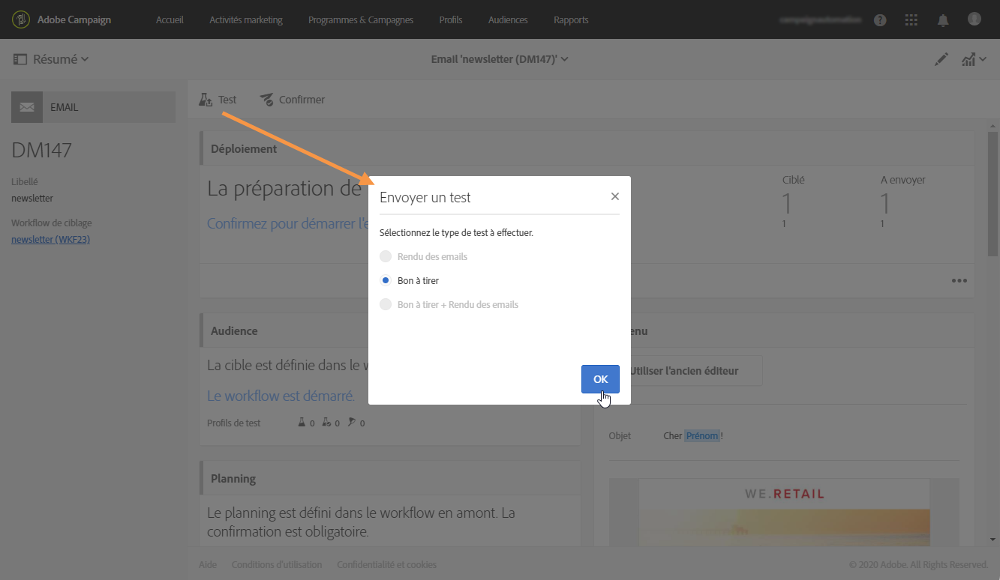

>[!IMPORTANT]
>
>Si vous apportez des modifications à votre message, veillez à relancer la préparation du message. Sinon, les modifications ne seront pas répercutées dans le profil.

### Import de profils à partir d’une audience {#importing-from-audience}

Campaign Standard vous permet d’importer une audience de profils que vous pouvez utiliser pour les tests. Vous pouvez par exemple envoyer à une adresse email unique un ensemble de messages ciblant différents profils.

De plus, si votre audience est déjà configurée avec les colonnes d’adresses et de préfixes, vous pourrez importer ces informations dans l’onglet **[!UICONTROL Substitutions de profil]**. Vous trouverez un exemple d’import d’audience avec des adresses de substitution dans [cette section](#use-case).

>[!NOTE]
>
>Lors de l’import d’une audience, seuls les profils correspondant à la cible du message sont sélectionnés et ajoutés à l’onglet **[!UICONTROL Substitutions de profil]**.

Pour importer des profils à utiliser pour les tests à partir d’une audience, procédez comme suit :

1. Dans le tableau de bord des messages, vérifiez que la préparation du message est réussie, puis cliquez sur le bloc **[!UICONTROL Audience]**.

   

1. Dans l’onglet **[!UICONTROL Substitutions de profil]**, cliquez sur **[!UICONTROL Importer depuis une audience]**.

   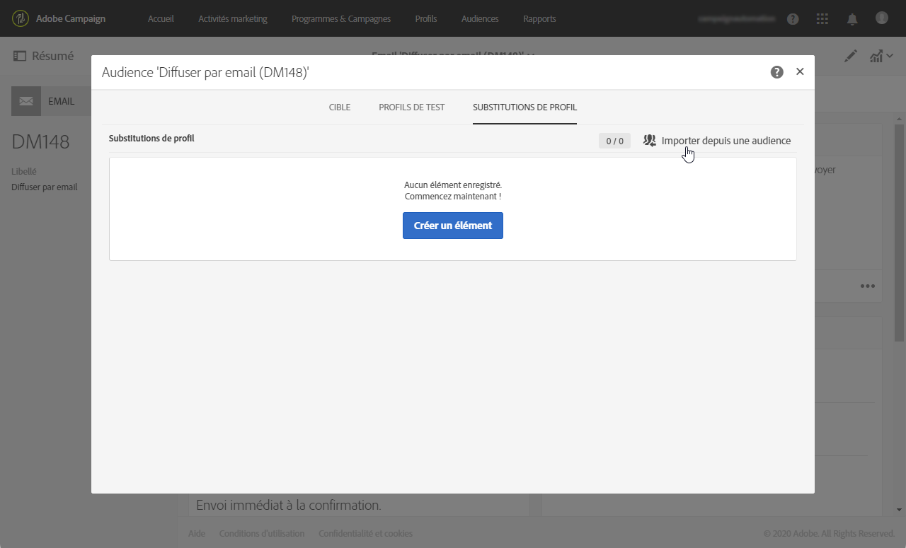

1. Sélectionnez l’audience à utiliser, puis saisissez l’adresse de substitution et le préfixe à utiliser pour les bons à tirer envoyés à l’audience.

   >[!NOTE]
   >
   >Le préfixe de ligne d’objet peut contenir jusqu’à 500 caractères.

   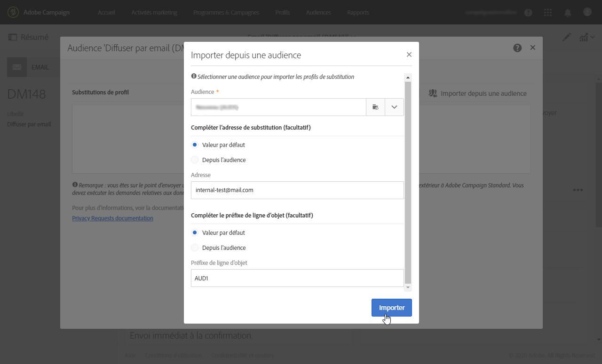

   Si les adresses de substitution et/ou les préfixes à utiliser ont déjà été définis dans votre audience, sélectionnez l’option **[!UICONTROL Depuis l’audience]**, puis spécifiez la colonne à utiliser pour récupérer ces informations.

   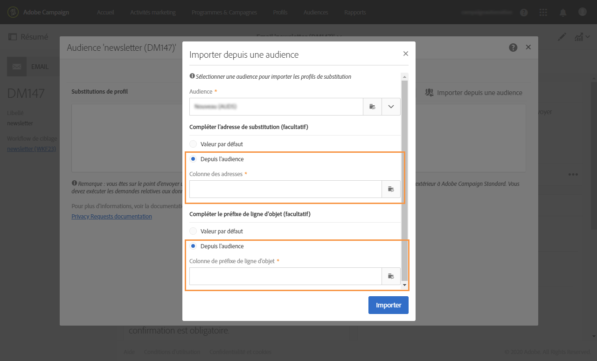

1. Cliquez sur le bouton **[!UICONTROL Importer]**. Les profils de l’audience correspondant à la cible du message sont ajoutés à l’onglet **[!UICONTROL Substitution de profil]**, ainsi que les adresses de substitution et les préfixes associés.

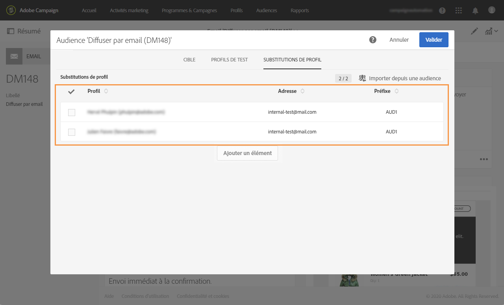

>[!NOTE]
>
>Si vous importez à nouveau la même audience, avec des adresses de substitution et/ou des préfixes différents, les profils seront ajoutés à la liste en plus de ceux de l’import précédent.

## Prévisualisation du message avec des profils ciblés

>[!NOTE]
>
>La prévisualisation est disponible avec le Concepteur d’email uniquement.

Pour pouvoir prévisualiser les messages à l’aide des profils ciblés, veillez à ajouter ces profils à la liste **[!UICONTROL Substitution de profil]** (voir [Définir les profils et les adresses de substitution](#selecting-profiles)).

Si vous souhaitez utiliser des champs de personnalisation dans le message, vous devez les ajouter **avant** de lancer la préparation du message. Sinon, ils ne seront pas pris en compte dans la prévisualisation. Par conséquent, veillez à relancer la préparation du message si une modification est apportée aux champs de personnalisation.

Pour prévisualiser les messages à l’aide de la substitution de profils, procédez comme suit :

1. Dans le tableau de bord des messages, cliquez sur la capture instantanée du contenu pour ouvrir le message dans le Concepteur d’email.

   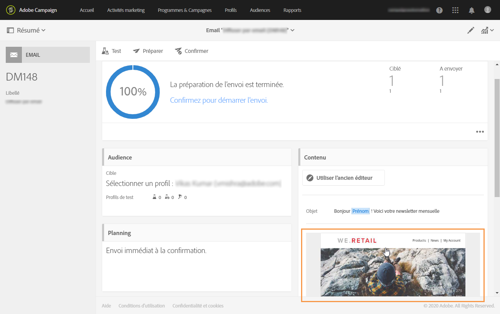

1. Sélectionnez l’onglet **[!UICONTROL Aperçu]**, puis cliquez sur **[!UICONTROL Changer de profil]**.

   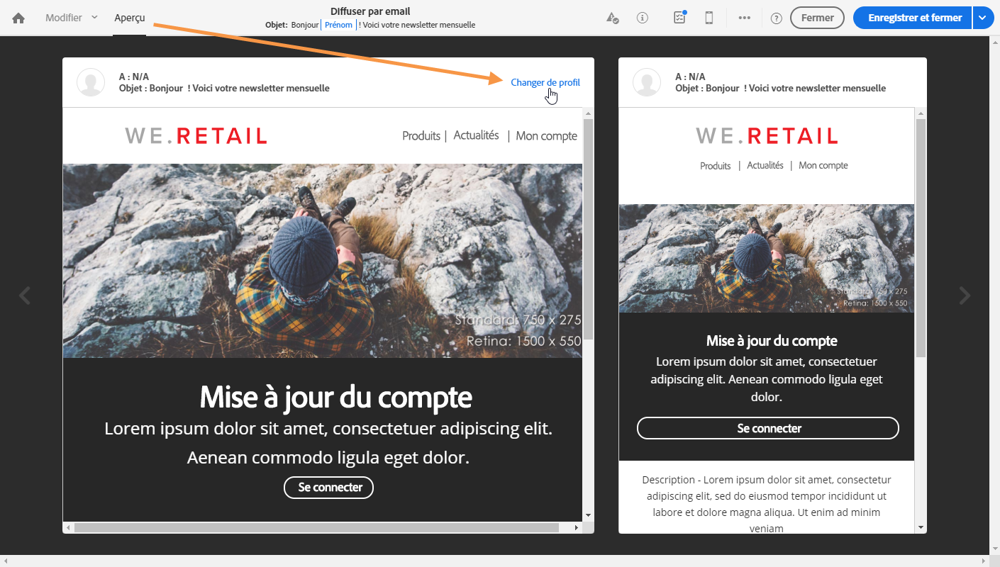

1. Cliquez sur l’onglet **[!UICONTROL Substitution de profil]** pour afficher les profils de substitution qui ont été ajoutés pour le test.

   Sélectionnez les profils à utiliser pour la prévisualisation, puis cliquez sur **[!UICONTROL Sélectionner]**.

   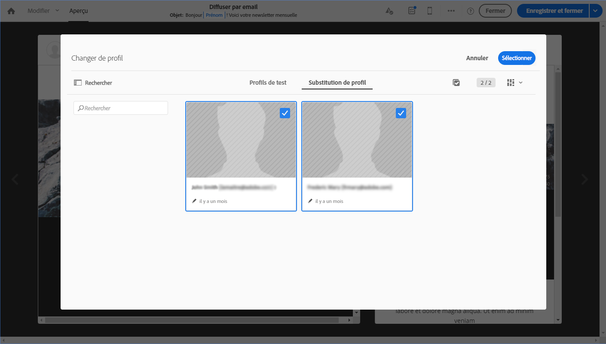

1. Une prévisualisation du message s’affiche. Utilisez les flèches pour naviguer entre les profils sélectionnés.

   

## Cas pratique {#use-case}

Dans ce cas pratique, nous souhaitons envoyer à un ensemble de profils spécifiques une newsletter électronique personnalisée. Avant d’envoyer la newsletter, nous voulons la prévisualiser à l’aide de certains des profils ciblés, et envoyer des bons à tirer aux adresses email internes définies dans un fichier externe.

Les principales étapes pour ce cas pratique sont les suivantes :

1. Créer l’audience à utiliser pour les tests
1. Construire un workflow pour cibler les profils et envoyer la newsletter
1. Configurer les substitutions de profil du message
1. Prévisualiser le message à l’aide des profils ciblés
1. Envoyer des bons à tirer

### Étape 1 : créer l’audience à utiliser pour les tests

1. Préparez le fichier à importer pour créer l’audience. Dans notre cas, il doit contenir l’adresse de substitution à utiliser pour le bon à tirer, et un préfixe à ajouter à l’objet du bon à tirer.

   Dans cet exemple, l’adresse email « oliver.vaughan@internal.com » recevra un bon à tirer du message ciblant le profil avec l’adresse email « john.doe@mail.com ». Le préfixe « JD » sera ajouté à l’objet du bon à tirer.

   

1. Construisez le workflow pour créer une audience à partir du fichier. Pour ce faire, ajoutez et configurez les activités suivantes :

   * Activité **[!UICONTROL Chargement de fichier]** : importe le fichier CSV (pour en savoir plus sur cette activité, reportez-vous à [cette section](../../automating/using/load-file.md)).
   * Activité **[!UICONTROL Réconciliation]** : associe les informations du fichier aux informations de la base de données. Dans cet exemple, nous utiliserons l’adresse email du profil comme champ de réconciliation (pour en savoir plus sur cette activité, reportez-vous à [cette section](../../automating/using/reconciliation.md)).
   * Activité **[!UICONTROL Sauvegarde d’audience]** : crée une audience à partir du fichier importé (pour en savoir plus sur cette activité, reportez-vous à [cette section](../../automating/using/save-audience.md)).

   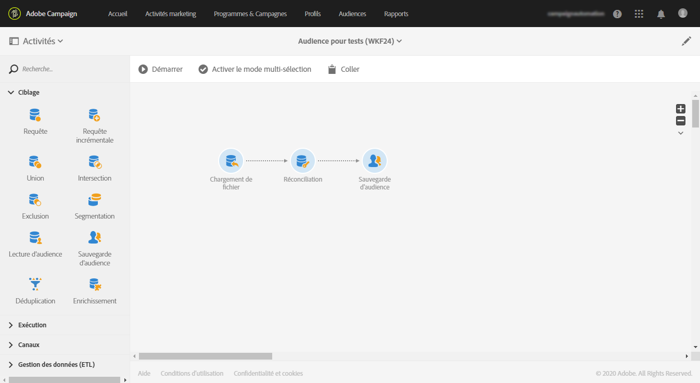

1. Exécutez le workflow, puis accédez à l’onglet **[!UICONTROL Audiences]** pour vérifier que l’audience a été créée avec les informations souhaitées.

   Dans cet exemple, l’audience est composée de trois profils. Chacun d’eux est lié à une adresse email de substitution qui recevra le bon à tirer, avec un préfixe à utiliser dans l’objet du bon à tirer.

   

### Étape 2 : construire un workflow pour cibler les profils et envoyer la newsletter

1. Ajoutez les activités **[!UICONTROL Requête]** et **[!UICONTROL Diffusion Email]** puis configurez-les en fonction de vos besoins (voir les sections [Requête](../../automating/using/query.md) et [Diffusion Email](../../automating/using/email-delivery.md)).

   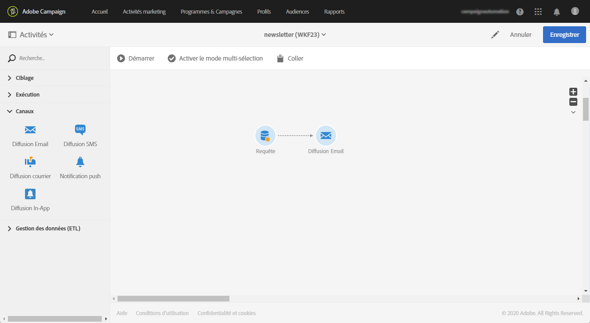

1. Exécutez le workflow et veillez à ce que la préparation du message soit réussie.

### Étape 3 : configurer l’onglet Substitution de profil du message

1. Ouvrez l’activité **[!UICONTROL Diffusion Email]**. Dans le tableau de bord des messages, cliquez sur le bloc **[!UICONTROL Audience]**.

   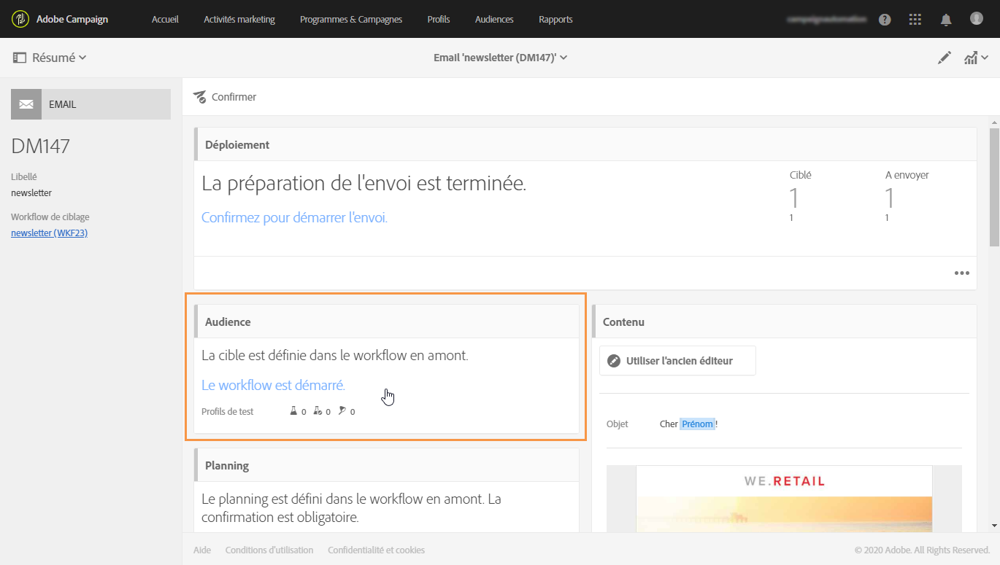

1. Sélectionnez l’onglet **[!UICONTROL Substitutions de profil]**, puis cliquez sur **[!UICONTROL Importer depuis une audience]**.

   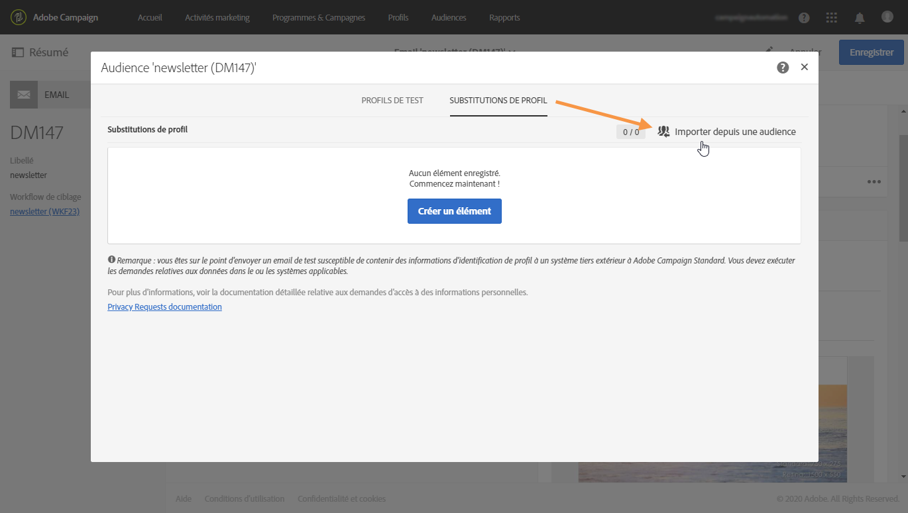

1. Dans le champ **[!UICONTROL Audience]**, sélectionnez l’audience créée à partir du fichier.

   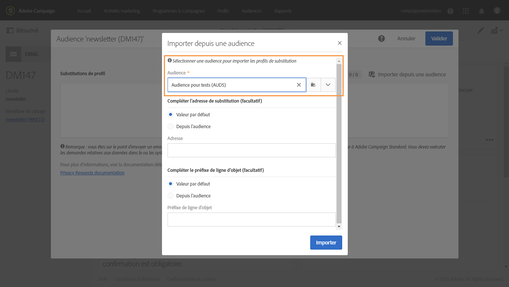

1. Définissez l’adresse de substitution et le préfixe de l’objet à utiliser lors de l’envoi des bons à tirer.

   Pour ce faire, sélectionnez l’option **[!UICONTROL Depuis l’audience]**, puis sélectionnez la colonne de l’audience qui contient les informations.

   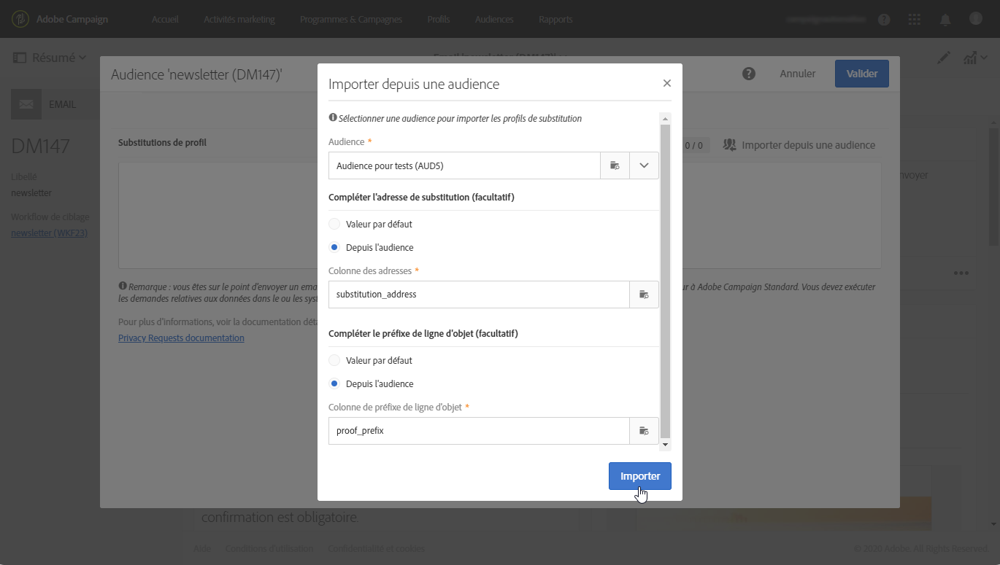

1. Cliquez sur le bouton **[!UICONTROL Importer]**. Les profils de l’audience sont ajoutés à la liste, avec leurs adresses de substitution et leurs préfixes d’objet associés.

   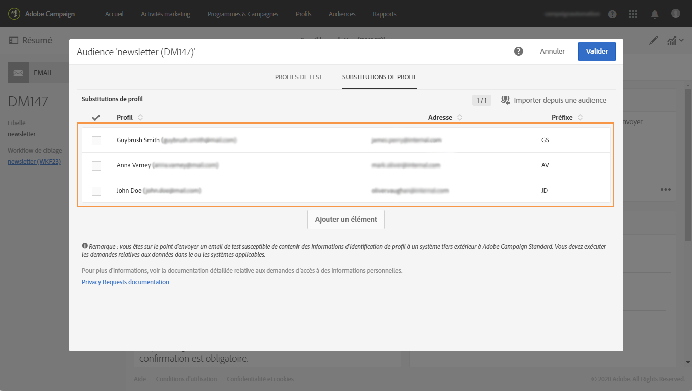

   >[!NOTE]
   >
   >Dans notre cas, tous les profils de l’audience sont visés par l’activité **[!UICONTROL Requête]**. Si l’un de ces profils ne faisait pas partie de la cible du message, il ne serait pas ajouté à la liste.

### Étape 4 : prévisualiser le message à l’aide des profils ciblés

1. Dans le tableau de bord des messages, cliquez sur la capture instantanée du contenu pour ouvrir le message dans le Concepteur d’email.

   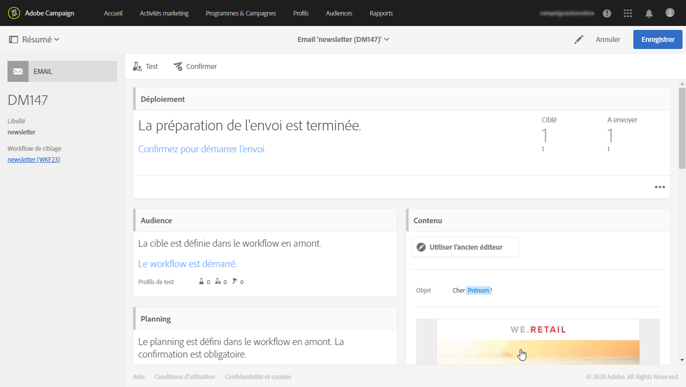

1. Sélectionnez l’onglet **[!UICONTROL Aperçu]**, puis cliquez sur **[!UICONTROL Changer de profil]**.

   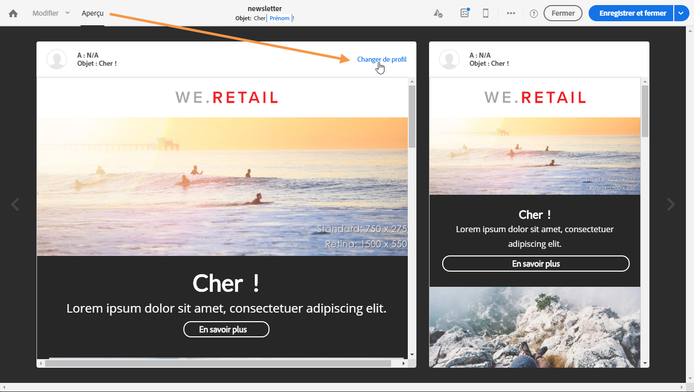

1. Cliquez sur l’onglet **[!UICONTROL Substitution de profil]** pour afficher les profils de substitution qui ont été ajoutés précédemment.

   Sélectionnez les profils à utiliser pour la prévisualisation, puis cliquez sur **[!UICONTROL Sélectionner]**.

   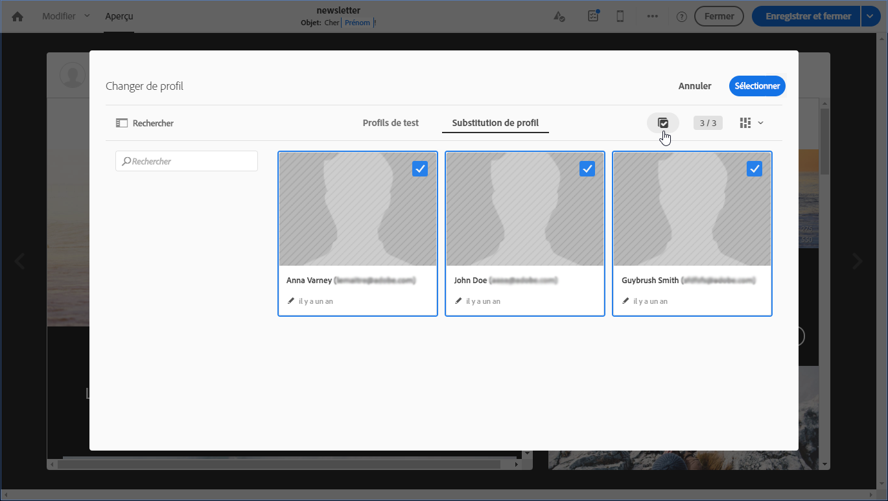

1. Une prévisualisation du message s’affiche. Utilisez les flèches pour naviguer entre les profils sélectionnés.

   

### Étape 5 : envoyer des bons à tirer

1. Dans le tableau de bord des messages, cliquez sur le bouton **[!UICONTROL Test]**, puis confirmez.

   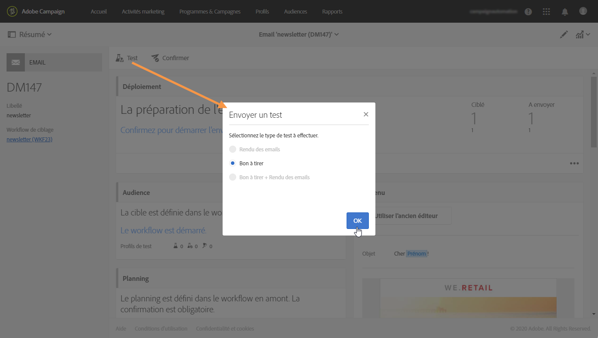

1. Les bons à tirer sont envoyés selon ce qui a été configuré dans l’onglet **[!UICONTROL Substitutions de profil]**.

   

## Tutoriel vidéo {#video}

Cette vidéo explique comment tester vos emails à l’aide de la substitution de profil.

>[!VIDEO](https://video.tv.adobe.com/v/32368?quality=12&captions=fre_fr)

D’autres vidéos pratiques sur Campaign Standard sont disponibles [ici](https://experienceleague.adobe.com/docs/campaign-standard-learn/tutorials/overview.html?lang=fr).
