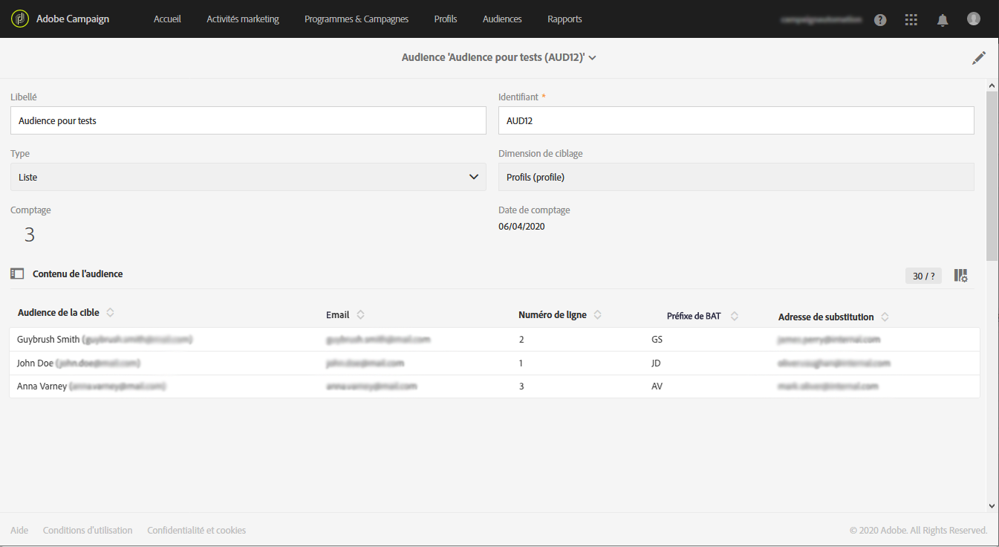

# Test des emails à l’aide des profils ciblés {#testing-message-profiles}

## Présentation {#overview}

En plus des [profils de test](../../audiences/using/managing-test-profiles.md), vous pouvez tester un email en vous mettant à la place de l’un des profils ciblés. Cela vous permet d’obtenir une représentation réaliste du message que le profil recevra (champs personnalisés, informations dynamiques et personnalisées, y compris les données additionnelles provenant des workflows...).

>[!NOTE]
>
> Cette fonctionnalité est disponible avec les emails uniquement.

Les étapes principales sont les suivantes :

1. Configurez votre message, puis lancez la phase de **préparation**.
1. **Sélectionnez un ou plusieurs profils** parmi les profils ciblés par l’email.
1. Associez à chaque profil une **adresse de substitution** à laquelle les bons à tirer seront envoyés.
1. (Facultatif) Pour chaque profil, définissez un **préfixe** à ajouter à l’objet du bon à tirer.
1. **Prévisualisez** dans le Concepteur d’email la manière dont l’email s’affichera pour les profils.
1. Envoyez les bons à tirer.

Pour plus d’informations sur le processus global, reportez-vous à la vidéo du tutoriel disponible [ici](https://docs.adobe.com/content/help/en/campaign-standard-learn/tutorials/communication-channels/email/profile-substitution.html).

>[!IMPORTANT]
>
>Cette fonctionnalité vous permet d’envoyer des informations personnelles de profil à des adresses email externes. Gardez à l’esprit que l’exécution des demandes d’accès à des informations personnelles (RGPD et CCPA) dans Campaign Standard NE S’EXÉCUTERA PAS en externe.

## Sélection des profils et des adresses de substitution {#selecting-profiles}

Pour utiliser des profils ciblés à des fins de test, vous devez d’abord les sélectionner, puis définir les adresses de substitution qui recevront les bons à tirer. Pour ce faire, vous pouvez [sélectionner des profils spécifiques](#selecting-individual-profiles) parmi les profils ciblés ou [importer des profils à partir d’une audience existante](#importing-from-audience).

>[!NOTE]
>
>Vous pouvez sélectionner un maximum de 100 profils pour les tests.

### Sélection de profils individuels {#selecting-individual-profiles}

1. Dans le tableau de bord des messages, vérifiez que la préparation du message est réussie, puis cliquez sur le bloc **[!UICONTROL Audience]**.

   

1. In the **[!UICONTROL Profile substitutions]** tab, click the **[!UICONTROL Create element]** button to select the profiles to use for testing.

   

1. Cliquez sur le bouton de sélection du profil pour afficher la liste des profils ciblés par le message.

   

1. Select the profile to use for testing, then enter in the **[!UICONTROL Address]** field the desired substitution address, then click **[!UICONTROL Confirm]**. Tous les bons à tirer ciblant le profil seront envoyés à cette adresse email, plutôt qu’à celle définie dans la base de données pour ce profil.

   If you want to add a specific prefix to the proofs&#39; subject line, fill in the **[!UICONTROL Subject line prefix]** field.

   

   Le préfixe s’affiche comme suit :

   

1. Le profil est ajouté à la liste, avec son adresse de substitution et son préfixe associés. Repeat the above steps for all the profiles that you want to use for testing, then click **[!UICONTROL Confirm]**.

   

   Si vous souhaitez envoyer un bon à tirer à plusieurs adresses de substitution pour un même profil, vous devez ajouter ce profil autant de fois que nécessaire.

   Dans l’exemple ci-dessous, le bon à tirer reposant sur le profil John Smith sera envoyé à deux adresses de substitution différentes :

   

1. Une fois que tous les profils et adresses de substitution sont définis, vous pouvez envoyer un bon à tirer pour tester le message. Pour ce faire, cliquez sur le bouton **[!UICONTROL Test]** , puis sélectionnez le type de test à exécuter.

   Note that if no test profile has been added to the message target, the **[!UICONTROL Email rendering]** and **[!UICONTROL Proof + Email rendering]** options are not available.  Pour plus d’informations sur l’envoi des bons à tirer, consultez [cette section](../../sending/using/sending-proofs.md).

   

>[!IMPORTANT]
>
>Si vous apportez des modifications à votre message, veillez à relancer la préparation du message. Sinon, les modifications ne seront pas répercutées dans le profil.

### Import de profils à partir d’une audience {#importing-from-audience}

Campaign Standard vous permet d’importer une audience de profils que vous pouvez utiliser pour les tests. Vous pouvez par exemple envoyer à une adresse email unique un ensemble de messages ciblant différents profils.

Moreover, if your audience is already configured with the address and prefix columns, you will be able to import these information in the **[!UICONTROL Profile substitutions]** tab. Vous trouverez un exemple d’import d’audience avec des adresses de substitution dans [cette section](#use-case).

>[!NOTE]
>
>When importing an audience, only the profiles corresponding to the message target are selected and added to the **[!UICONTROL Profile substitutions]** tab.

Pour importer des profils à utiliser pour les tests à partir d’une audience, procédez comme suit :

1. Dans le tableau de bord des messages, vérifiez que la préparation du message est réussie, puis cliquez sur le bloc **[!UICONTROL Audience]**.

   

1. Dans l’ **[!UICONTROL Profile substitutions]** onglet, cliquez sur **[!UICONTROL Import from an audience]**.

   

1. Sélectionnez l’audience à utiliser, puis saisissez l’adresse de substitution et le préfixe à utiliser pour les bons à tirer envoyés à l’audience.

   

   If the substitution addresses and/or prefixes to use have already been defined in your audience, select the **[!UICONTROL From Audience]** option, then specify the column to use to retrieve these information.

   

1. Cliquez sur le **[!UICONTROL Import]** bouton. The profiles from the audience corresponding to the message target are added to the **[!UICONTROL Profile substitution]** tab, as well as the associated substitution addresses and prefixes.

>[!NOTE]
>
>Si vous importez à nouveau la même audience, avec des adresses de substitution et/ou des préfixes différents, les profils seront ajoutés à la liste en plus de ceux de l’import précédent.

## Prévisualisation du message avec des profils ciblés

>[!NOTE]
>
>La prévisualisation est disponible avec le Concepteur d’email uniquement.

To be able to preview messages using targeted profiles, make sure you have added these profiles to the **[!UICONTROL Profile substitution]** list (see [Defining profiles and substitution addresses](#selecting-profiles)).

Si vous souhaitez utiliser des champs de personnalisation dans le message, vous devez les ajouter **avant** de lancer la préparation du message. Sinon, ils ne seront pas pris en compte dans la prévisualisation. Par conséquent, veillez à relancer la préparation du message si une modification est apportée aux champs de personnalisation.

Pour prévisualiser les messages à l’aide de la substitution de profils, procédez comme suit :

1. Dans le tableau de bord des messages, cliquez sur la capture instantanée du contenu pour ouvrir le message dans le Concepteur d’email.

   

1. Sélectionnez l’ **[!UICONTROL Preview]** onglet, puis cliquez sur **[!UICONTROL Change profile]**.

   

1. Click the **[!UICONTROL Profile Substitution]** tab to display the substitution profiles that have been added for testing.

   Select the profiles that you want to use for preview, then click **[!UICONTROL Select]**.

   

1. Une prévisualisation du message s’affiche. Utilisez les flèches pour naviguer entre les profils sélectionnés.

   

## Cas pratique {#use-case}

Dans ce cas pratique, nous souhaitons envoyer à un ensemble de profils spécifiques une newsletter électronique personnalisée. Avant d’envoyer la newsletter, nous voulons la prévisualiser à l’aide de certains des profils ciblés, et envoyer des bons à tirer aux adresses email internes définies dans un fichier externe.

Les principales étapes pour ce cas pratique sont les suivantes :

1. Créer l’audience à utiliser pour les tests
1. Construire un workflow pour cibler les profils et envoyer la newsletter
1. Configurer les substitutions de profil du message
1. Prévisualiser le message à l’aide des profils ciblés
1. Envoyer des bons à tirer

### Étape 1 : créer l’audience à utiliser pour les tests

1. Préparez le fichier à importer pour créer l’audience. Dans notre cas, il doit contenir l’adresse de substitution à utiliser pour le bon à tirer, et un préfixe à ajouter à l’objet du bon à tirer.

   Dans cet exemple, l’adresse email « oliver.vaughan@internal.com » recevra un bon à tirer du message ciblant le profil avec l’adresse email « john.doe@mail.com ». Le préfixe « JD » sera ajouté à l’objet du bon à tirer.

   

1. Construisez le workflow pour créer une audience à partir du fichier. Pour ce faire, ajoutez et configurez les activités suivantes :

   * **[!UICONTROL Load file]**   : Importe le fichier CSV (pour plus d’informations sur ce  , reportez-vous à [cette section](../../automating/using/load-file.md)).
   * **[!UICONTROL Reconciliation]**   : Associe les informations du fichier aux informations de la base de données. Dans cet exemple, nous utiliserons l’adresse email du profil comme champ de réconciliation (pour en savoir plus sur cette activité, reportez-vous à [cette section](../../automating/using/reconciliation.md)).
   * **[!UICONTROL Save audience]**   : Crée un   basé sur le fichier importé (pour plus d’informations sur ce  de, reportez-vous à [cette section](../../automating/using/save-audience.md)).
   

1. Exécutez le workflow, puis accédez à l’onglet **[!UICONTROL Audiences]** pour vérifier que l’audience a été créée avec les informations souhaitées.

   Dans cet exemple, l’audience est composée de trois profils. Chacun d’eux est lié à une adresse email de substitution qui recevra le bon à tirer, avec un préfixe à utiliser dans l’objet du bon à tirer.

   

### Étape 2 : construire un workflow pour cibler les profils et envoyer la newsletter

1. Add **[!UICONTROL Query]** and **[!UICONTROL Email delivery]** activities, then configure them according to your needs (see [Query](../../automating/using/query.md) and [Email delivery](../../automating/using/email-delivery.md) sections).

   

1. Exécutez le workflow et veillez à ce que la préparation du message soit réussie.

### Étape 3 : configurer l’onglet Substitution de profil du message

1. Open the **[!UICONTROL Email delivery]** activity. Dans le tableau de bord des messages, cliquez sur le bloc **[!UICONTROL Audience]**.

   

1. Sélectionnez l’ **[!UICONTROL Profile substitutions]** onglet, puis cliquez sur **[!UICONTROL Import from an audience]**.

   

1. Dans le champ **[!UICONTROL Audience]**, sélectionnez l’audience créée à partir du fichier.

   

1. Définissez l’adresse de substitution et le préfixe de l’objet à utiliser lors de l’envoi des bons à tirer.

   To do this, select the **[!UICONTROL From audience]** option, then select the column from the audience that contains the information.

   

1. Cliquez sur le **[!UICONTROL Import]** bouton. Les profils de l’audience sont ajoutés à la liste, avec leurs adresses de substitution et leurs préfixes d’objet associés.

   

   >[!NOTE]
   >
   >In our case, all profiles from the audience are targeted by the **[!UICONTROL Query]** activity. Si l’un de ces profils ne faisait pas partie de la cible du message, il ne serait pas ajouté à la liste.

### Étape 4 : prévisualiser le message à l’aide des profils ciblés

1. Dans le tableau de bord des messages, cliquez sur la capture instantanée du contenu pour ouvrir le message dans le Concepteur d’email.

   

1. Sélectionnez l’ **[!UICONTROL Preview]** onglet, puis cliquez sur **[!UICONTROL Change profile]**.

   

1. Click the **[!UICONTROL Profile Substitution]** tab to display the substitution profiles that have been added previously.

   Select the profiles that you want to use for preview, then click **[!UICONTROL Select]**.

   

1. Une prévisualisation du message s’affiche. Utilisez les flèches pour naviguer entre les profils sélectionnés.

   

### Étape 5 : envoyer des bons à tirer

1. Dans le tableau de bord des messages, cliquez sur le bouton **[!UICONTROL Test]**, puis confirmez.

   

1. The proofs are sent according to what has been configured in the **[!UICONTROL Profile substitutions]** tab.

   
