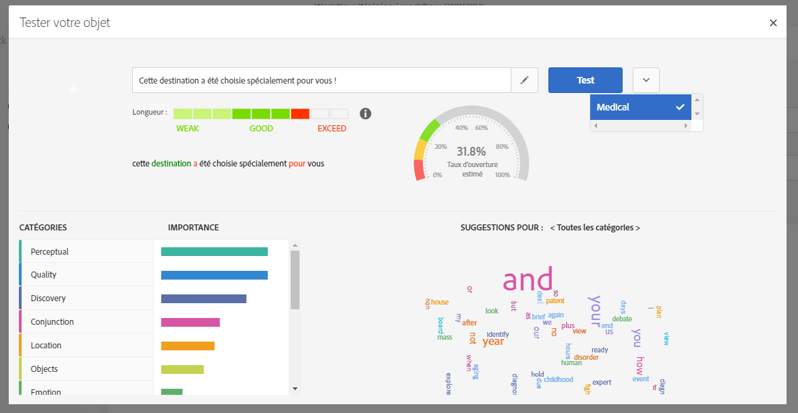

# Test de l’objet d’un email {#testing-a-subject}

## À propos de l’optimisation prédictive de l’objet {#about-predictive-subject-line}

Lors de l’édition d’un email, vous pouvez tester différents objets et obtenir une estimation de son taux d’ouverture avant l’envoi.

Cette fonctionnalité est désactivée par défaut. Elle est activée lors de l’import d’un premier modèle. Un modèle est créé à partir de jeux de données d’apprentissage spécifiques à un secteur d’activité donné. Les modèles permettent au système d’estimer le taux d’ouverture d’un email lorsqu’un nouvel objet est soumis.

>[!NOTE]
>
>Cette fonctionnalité est disponible pour les emails et les bases de données dont le contenu est en anglais uniquement. Si votre instance contient des emails dans d’autres langues, le modèle entraîné sera incohérent et donnera des résultats erronés. L’option permettant de tester un objet n’est visible que si un modèle est disponible dans votre instance.

Pour plus d’informations sur l’importation des modèles, reportez-vous à cette [section](#importing-models).

## Test de l’objet {#testing-subject-line}

Pour tester un objet, procédez comme suit :

1. Créez un email ou ouvrez un email existant.
1. Ouvrez le contenu et saisissez l’objet de l’email dans le champ de saisie prévu à cet effet.
1. Cliquez sur le bouton **[!UICONTROL Tester l’objet]** pour afficher la fenêtre **[!UICONTROL Tester la ligne d’objet]**. Vous pouvez toujours éditer l’objet dans cette fenêtre.
1. Choisissez le bon modèle à prendre en compte pour la prédiction du taux d’ouverture. Plusieurs modèles sont disponibles. Chacun d’entre eux correspond à un secteur d’activité spécifique. Pour plus d’informations sur l’utilisation des modèles, reportez-vous à cette [section](#importing-models).
1. Cliquez sur **[!UICONTROL Tester]**.

Votre objet est alors analysé.

>[!NOTE]
>
>Si l’objet est trop court, il ne peut pas être analysé et un message d’erreur s’affiche.

Plusieurs indicateurs sont calculés et un ensemble d’outils s’affiche en vue de vous aider :

* **Taux d’ouverture estimé** : ce graphique donne une idée du taux d’ouverture escompté de l’email avec l’objet actuellement testé.
* **Longueur de l’objet** : cet indicateur permet de déterminer si la longueur actuelle de l’objet est correcte ou si elle doit être allongée ou raccourcie.
* **Mots en couleur** : lors du test de l’objet, les mots surlignés en vert correspondent à ceux qui contribuent le plus à l’augmentation de la prédiction du taux d’ouverture. Les mots surlignés en rouge, quant à eux, correspondent à ceux qui contribuent le moins à l’augmentation de la prédiction du taux d’ouverture. Si vous ajoutez ou supprimez des mots de l’objet, les mots surlignés changent.
* **Catégories et suggestions de mots** : la partie inférieure de la fenêtre contient plusieurs catégories pertinentes pour le modèle sélectionné. Ces catégories, triées par ordre d’importance, permettent de déterminer si l’objet contient des mots qui leur sont associés grâce à une coche. Chaque catégorie contient un ensemble de mots proposés qui peuvent être utilisés dans votre objet afin de le rendre plus pertinent et augmenter le taux d’ouverture. Ces mots correspondent à ceux qui sont le plus souvent utilisés dans une catégorie donnée.

>[!NOTE]
>
>Les champs de personnalisation et les signes de ponctuation ne sont pas pris en compte dans l’analyse de l’objet. Pour les textes dynamiques/conditionnels, toutes les variantes sont traitées comme un seul objet.

## Importer des modèles      {#importing-models}

Par défaut, aucun modèle n’est exécuté sur le serveur Adobe Campaign. Deux méthodes permettent d’obtenir un modèle et d’activer la fonctionnalité :

* Vous pouvez entraîner un modèle local à partir des données des emails envoyés.
* Vous pouvez importer des modèles pré-entraînés qui sont spécifiques à certains secteurs d’activité (médical, etc.) à l’aide de la fonctionnalité d’[import de package](../../automating/using/managing-packages.md)

### Entraînement d’un modèle local {#training-local-model}

* Si vous utilisez déjà Adobe Campaign, le modèle local sera automatiquement entraîné avec les messages que vous avez déjà envoyés.
* Si vous utilisez Adobe Campaign pour la première fois, vous pouvez extraire de votre précédent système/fournisseur de services de messagerie un fichier CSV contenant 4 colonnes : date, objet, ouvertures, envoyés. Pour cela, accédez à **[!UICONTROL Administration]** > **[!UICONTROL Canaux]** > **[!UICONTROL Email]** > **[!UICONTROL Import d’objet d’emails]**, puis suivez les instructions affichées dans les différents écrans. Lorsque le téléchargement des objets est terminé, importez un modèle local en suivant la procédure qui est décrite ci-après. Le modèle local est automatiquement entraîné avec les données que vous avez téléchargées.
* Si vous utilisez Adobe Campaign pour la première fois et si vous ne pouvez pas obtenir de fichier CSV comme décrit plus haut, vous pouvez utiliser un [modèle pré-entraîné](#pre-trained-models) ou attendre que le système dispose de suffisamment de données de diffusion pour entraîner un modèle local. Le système détermine automatiquement si le jeu de données actuel contient suffisamment de données pour reconnaître des constantes et entraîner le modèle.

>[!NOTE]
>
>Il n’y a pas de nombre défini d’objets requis pour entraîner votre propre modèle. Pour plus d’informations à ce sujet, voir [Résolution des problèmes](#troubleshooting).
>
>Votre instance ne peut contenir qu’un seul modèle entraîné.

Pour former un modèle local :
1. Téléchargez le fichier subjectLineTraining.xml depuis [cet emplacement](https://experience.adobe.com/#/downloads/content/software-distribution/en/campaign.html) et utilisez la fonctionnalité d’[import de package](../../automating/using/managing-packages.md) pour le charger dans votre instance Adobe Campaign. Un workflow technique entraînera automatiquement le modèle.
1. Lorsque vous entraînez un modèle pour la première fois, un administrateur peut forcer le démarrage du **[!UICONTROL Workflow d’apprentissage de l’objet]** depuis le menu **[!UICONTROL Administration]** > **[!UICONTROL Paramétrage de l’application]** > **[!UICONTROL Workflows]**.
1. Une fois un modèle téléchargé et entraîné, la fonctionnalité est automatiquement activée. Une nouvelle option apparaît alors en regard de l’objet de vos messages.
1. Le workflow technique continue ensuite l’apprentissage du modèle toutes les semaines.

### Import de modèles pré-entraînés {#pre-trained-models}

Pour accéder à ces modèles, cliquez [ici](https://experience.adobe.com/#/downloads/content/software-distribution/en/campaign.html). Utilisez la fonctionnalité d’[import de package](../../automating/using/managing-packages.md) pour télécharger un modèle vers votre instance Adobe Campaign.

Les modèles disponibles sont les suivants :

* Secteur cosmétique : subjectInsightCosmetic.xml
* Secteur alimentaire : subjectInsightSupermarket.xml
* Secteur médical : subjectInsightMedical.xml
* Modèle à entraîner : subjectlineTraining.xml.

Ces modèles ne peuvent être entraînés.

Une fois un modèle téléchargé, la fonctionnalité est automatiquement activée. Une nouvelle option apparaît alors en regard de l’objet de vos messages.

>[!NOTE]
>
>L’import et la génération de modèles entraînés peuvent être uniquement effectués par un administrateur.

## Résolution des problèmes {#troubleshooting}

L’optimisation prédictive de l’objet est un processus d’apprentissage automatique qui prend en compte tous les objets que vous avez téléchargés avec leurs taux d’ouverture. Ce processus permet au système d’estimer le taux d’ouverture d’un email lorsqu’un nouvel objet est soumis.

Pour être en mesure d’entraîner votre propre modèle, les objets doivent être variés et ne doivent pas comporter de doublons, quel que soit le nombre d’objets utilisés pour entraîner votre modèle.

La qualité des objets est essentielle. S’il n’y a pas assez de données de qualité à traiter, ou si tous les objets précédents sont identiques, le système ne sera pas en mesure d’entraîner le modèle et un message d’erreur peut s’afficher. Cela signifie que votre jeu d’enregistrements existant ne permet pas de fournir une suggestion prédictive.

Dans ce cas, vous devez examiner les données que vous téléchargez et vous assurer que les objets sont suffisamment variés pour entraîner efficacement votre modèle.

<!--Some clients have reported this issue: I have had the subject line training workflow running for about a year now.  It has trained on 883 records and I am still seeing the message "The existing dataset is not enough to generate a model."  I do get an error in the workflow every time it runs "XML-110009 Unable to find the element 'runwf' of path '/' (document with schema 'serverConf')".

For this, campaign takes the subject line as training data and tries to come up with significant enough model to predict open rate with 95% confidence.

The 400 subject line number is mention with at least and is only indicative, model generation will also depend on quality of these lines.

It may happen that even 10k subject lines don't lead to model generation if they are too similar.

It means that it can be case that you don't have enough subject lines to generate the model and it is giving this error.

If you are getting an error/warning message, it means that your existing set of records is not enough for the predictive subject module to give a high confidence suggestion.

Adobe recommends reviewing the data you are uploading as the similarity of the subject lines might be the issue.-->
