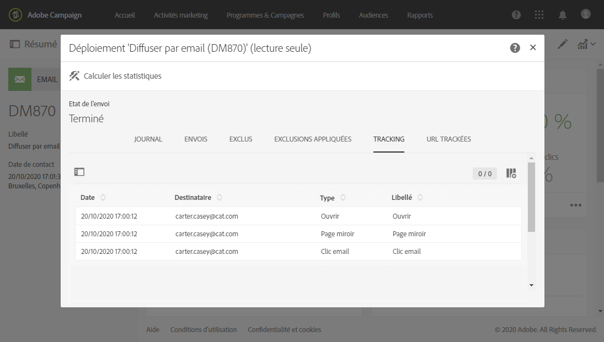
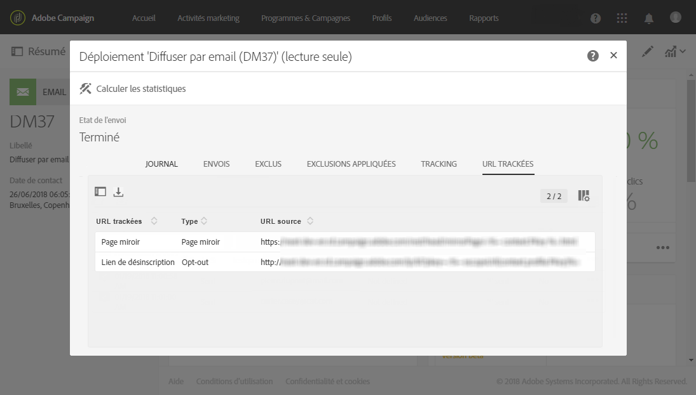

# Tracker les messages{#tracking-messages}

## A propos du tracking {#about-tracking}

Grâce à ses fonctionnalités de tracking, Adobe Campaign permet de tracker le comportement des destinataires de vos diffusions. Pour cela, Adobe Campaign utilise des cookies de session et des cookies permanents.

Ainsi, vous pouvez informer les utilisateurs de vos sites soumis au tracking web via une zone de demande de consentement (par exemple en surimpression de la page) proposant une case à cocher pour autoriser l'utilisation de cookies, ou afficher une bannière en haut de la première page visitée, etc. Les fenêtres de type pop-up sont à éviter car elles sont souvent bloquées par les navigateurs.

Adobe Campaign utilise deux types de cookies :

* Un cookie de session (nlid). Il contient l'identifiant de l'email envoyé au contact (broadlogId) et l'identifiant du modèle de message (deliveryId). Il est déposé lorsque le contact clique sur une URL contenue dans un email envoyé par Adobe Campaign et permet de tracker son comportement sur le web. Ce cookie de session est effacé automatiquement à la fermeture du navigateur. Le contact a la possibilité d'en interdire le dépôt en adaptant les paramètres de son navigateur.
* Un cookie partagé entre les solutions Adobe Experience Cloud. Il permet d'identifier un internaute qui interagit avec les solutions Experience Cloud lors de ses visites sur un site web. La description de ce cookie est disponible ici : [https://marketing.adobe.com/resources/help/fr_FR/whitepapers/cookies/cookies_mc.html](https://marketing.adobe.com/resources/help/en_US/whitepapers/cookies/cookies_mc.html).

Les informations de tracking sont disponibles pour chaque contact de votre base de données dans des **[!UICONTROL profils client intégrés]**. Voir à ce propos [cette section](../../audiences/using/integrated-customer-profile.md).

## Tracking {#tracking-logs}

L'onglet **[!UICONTROL Tracking]liste l'historique du tracking pour cette diffusion.** Cet onglet affiche les informations de tracking sur les messages envoyés, soit toutes les URL qui ont fait l'objet d'un tracking par Adobe Campaign. Les informations de tracking de cet onglet sont mises à jour toutes les 10 minutes.

>[!NOTE]
>
>Si le tracking n’est pas activé pour une diffusion, cet onglet n’est pas affiché. Le tracking est uniquement disponible pour les canaux **email** et **notification push**.

Dans l’exemple ci-dessus, le destinataire :

* a ouvert le message.
* a cliqué sur le lien personnalisé « EN SAVOIR PLUS ».
* a cliqué sur le lien de désinscription et sur celui de la page miroir.

Dans la colonne **[!UICONTROL Type], les valeurs possibles sont :**

* **[!UICONTROL Clic email]** : le destinataire a cliqué sur un lien personnalisé.
* **[!UICONTROL Page miroir]** : le destinataire a cliqué sur un lien vers la page miroir.
* **[!UICONTROL Ouverture]** : le destinataire a ouvert l’email.
* **[!UICONTROL Désabonnement]** : le destinataire a cliqué sur un lien de désabonnement.

>[!NOTE]
>
>En ce qui concerne le canal **notification push**, seuls les clics des notifications mobiles sont trackés. Dans ce cas, la valeur sera **[!UICONTROL Clic sur notification mobile]**.

Pour plus d’informations sur l’insertion de liens de tracking, voir [cette page](../../designing/using/inserting-a-link.md).

## URL trackées {#tracked-urls}

L'onglet **[!UICONTROL URL trackées]regroupe les URL contenues dans le message envoyé, leur type et leur URL source.**

Pour plus d'informations sur les liens de tracking, consultez [cette section](../../designing/using/about-tracked-urls.md).
