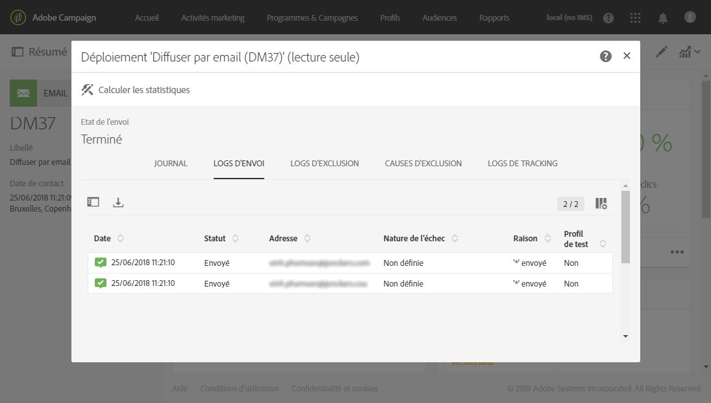
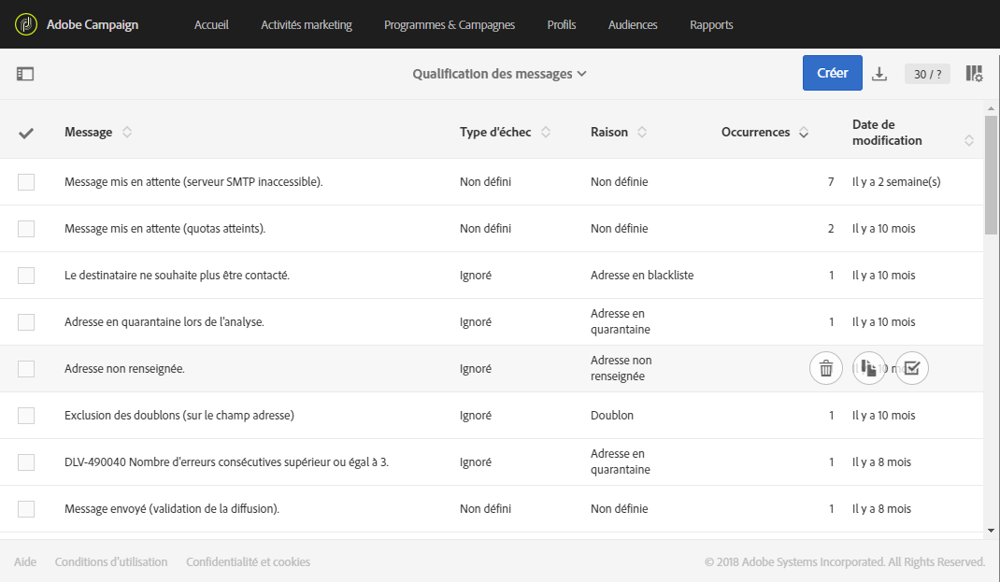

# Comprendre les diffusions en échec{#understanding-delivery-failures}

## A propos des diffusions en échec {#about-delivery-failures}

Lorsqu'une diffusion ne peut pas être envoyée à un profil, le serveur distant envoie automatiquement un message d'erreur, qui est récupéré par la plate-forme Adobe Campaign et qualifiée pour déterminer si l'adresse électronique ou le numéro de téléphone doit être quarantined. Voir [Qualification des emails bounce](../../sending/using/understanding-delivery-failures.md#bounce-mail-qualification).

>[!NOTE]
>
>Les messages d'erreur de type **Email** (ou "bounces") sont qualifiés par le processus inMail. Les messages d'erreur de type **SMS** (ou "SR" pour "Status Report") sont qualifiés par le processus MTA.

Les messages peuvent être également exclus pendant la préparation de la diffusion si une adresse est mise en quarantaine ou un profil blacklisté. Les messages exclus sont répertoriés dans l'onglet **[!UICONTROL Exclus]** du tableau de bord des diffusions (voir [cette section](../../sending/using/monitoring-a-delivery.md#exclusion-logs)).

**Rubriques connexes :**

* [Comprendre la gestion des quarantaines](../../sending/using/understanding-quarantine-management.md)
* [Gestion du blacklistage dans Campaign](../../audiences/using/about-opt-in-and-opt-out-in-campaign.md)

## Identifier les diffusions en échec pour un message {#identifying-delivery-failures-for-a-message}

Une fois une diffusion envoyée, l'onglet **[!UICONTROL Envois]** (voir [cette section](../../sending/using/monitoring-a-delivery.md#sending-logs)) permet de consulter le statut de la diffusion pour chaque profil ainsi que le type d'échec et la raison associés (voir [Types de diffusion en échec et raisons](../../sending/using/understanding-delivery-failures.md#delivery-failure-types-and-reasons)).

Un rapport d'usine dédié est également disponible. Ce rapport présente l'ensemble des statistiques d'erreurs hard et soft survenues lors des diffusions ainsi que le traitement automatique des retours. Voir à ce propos [cette section](../../reporting/using/bounce-summary.md).

## Types de diffusion en échec et raisons {#delivery-failure-types-and-reasons}

Trois types d'erreur sont liés à une diffusion en échec :

* **Hard** : une erreur de type 'hard’ indique une adresse invalide. Il s'agit d'un message d'erreur indiquant explicitement que l'adresse est invalide, par exemple : 'Utilisateur inconnu'.
* **Soft** : il s'agit d'une erreur qui peut être temporaire, ou qui n'a pas pu être qualifiée, par exemple : 'Domaine invalide' ou 'Boîte pleine'.
* **Ignoré** : il s'agit d'une erreur que l'on sait temporaire, par exemple 'Out of office', ou d'une erreur technique, par exemple si l'expéditeur est de type 'postmaster'.

Les motifs possibles d'une diffusion en échec sont les suivants :

* **[!UICONTROL Utilisateur inconnu]** (type Hard) : l'adresse n'existe pas. Aucune autre diffusion ne sera envoyée pour ce profil.
* **[!UICONTROL Adresse en quarantaine]** (type Hard) : l'adresse a été mise en quarantaine.
* **[!UICONTROL Inatteignable]** (type Soft/Hard) : une erreur s'est produite dans la chaîne de distribution du message. Il peut s'agir d'un incident sur le relais SMTP, d'un domaine temporairement inatteignable, etc. Selon l'erreur renvoyée par le fournisseur, l'adresse sera directement mise en quarantaine ou la diffusion sera envoyée à nouveau jusqu'à ce que Campaign reçoive une erreur justifiant le statut Quarantaine ou que le nombre d'erreurs atteigne 5.
* **[!UICONTROL Adresse non renseignée]** (type Hard) : l'adresse n'est pas définie.
* **[!UICONTROL Boîte pleine]** (type Soft) : la boîte de messagerie du destinataire est pleine et ne peut pas accepter d'autres messages. Cette adresse peut éventuellement être retirée de la liste des quarantaines pour faire une nouvelle tentative, et l'est automatiquement au bout de 30 jours.

   Pour que l'adresse soit automatiquement retirée de la liste des adresses en quarantaine, le workflow technique **[!UICONTROL Nettoyage de la base]** doit être démarré.

* **[!UICONTROL Refusé]** (type Soft/Hard) : l'adresse a été mise en quarantaine en raison d'un retour de sécurité signalant du spam. Selon l'erreur renvoyée par le fournisseur, l'adresse sera directement mise en quarantaine ou la diffusion sera envoyée à nouveau jusqu'à ce que Campaign reçoive une erreur justifiant le statut Quarantaine ou que le nombre d'erreurs atteigne 5.
* **[!UICONTROL Doublon]** : l'adresse a déjà été détectée dans la segmentation.
* **[!UICONTROL Non définie]** (type Soft) : l'adresse est en cours de qualification, car les erreurs n'ont pas encore été incrémentées.

   Ce type d'erreur apparaît lorsqu'un nouveau message d'erreur est envoyé par le serveur : il peut s'agir d'une erreur isolée, mais si elle se répète, le compteur d'erreur augmente, ce qui permet d'alerter les équipes techniques.

* **[!UICONTROL Erreur ignorée]** : l'adresse est en whiteliste et un email lui sera envoyé dans tous les cas.
* **[!UICONTROL Adresse en blackliste]** : l'adresse était en blackliste au moment de l'envoi.
* **[!UICONTROL Compte désactivé]** : (type Soft/Hard) : lorsque le Fournisseur d'Accès Internet (FAI) détecte une inactivité prolongée, il peut fermer le compte de l'utilisateur, ce qui rend les diffusions vers son adresse impossibles. Le type d'erreur Soft ou Hard dépend du type d'erreur reçu : si le compte est temporairement désactivé en raison d'une inactivité de 6 mois et qu'il peut toujours être activé, le statut **[!UICONTROL En erreur]sera affecté et la diffusion sera de nouveau envoyée.** Si l'erreur a reçu des signaux indiquant que le compte est définitivement désactivé, il sera mis directement en quarantaine.
* **[!UICONTROL Non connecté]** : le téléphone portable du profil est éteint ou n'est pas connecté au réseau au moment de l'envoi du message.
* **[!UICONTROL Domaine invalide]** (type Soft) : le domaine de l'adresse email est erroné ou n'existe plus. Ce profil sera ciblé de nouveau jusqu'à ce que le nombre d'erreurs atteigne 5. Ensuite, l'enregistrement sera défini sur le statut Quarantaine et aucune autre reprise ne sera effectuée.
* **[!UICONTROL Texte trop long]** : le nombre de caractères du SMS dépasse la limite autorisée. Voir à ce propos la section [Encodage, longueur et translittération des SMS](../../administration/using/configuring-sms-channel.md#sms-encoding--length-and-transliteration).
* **[!UICONTROL Caractère non supporté par l'encodage]** : le SMS contient un ou plusieurs caractères qui ne sont pas supportés par l'encodage. Voir à ce propos la section [Table des caractères - Norme GSM](../../administration/using/configuring-sms-channel.md#table-of-characters---gsm-standard).

## Reprises après une diffusion temporairement en échec {#retries-after-a-delivery-temporary-failure}

Si un message est en échec en raison d'une erreur temporaire du type **Ignoré**, les reprises seront effectuées pendant la durée de la diffusion. Pour plus d'informations sur les types d'erreurs, voir [Types de diffusion en échec et raisons](../../sending/using/understanding-delivery-failures.md#delivery-failure-types-and-reasons).

Pour modifier la durée d'une diffusion, accédez aux paramètres avancés de la diffusion ou du modèle de diffusion et indiquez la durée souhaitée dans le champ correspondant. Les propriétés avancées des diffusions sont présentées dans [cette section](../../administration/using/configuring-email-channel.md#validity-period-parameters).

Le paramétrage par défaut prévoit cinq reprises séparées d'une heure chacune, puis une reprise par jour pendant quatre jours. Le nombre de reprises peut être changé de manière globale (contactez l'administrateur technique Adobe) ou pour chaque diffusion ou modèle de diffusion (voir [cette section](../../administration/using/configuring-email-channel.md#sending-parameters)).

## Erreurs synchrones et asynchrones {#synchronous-and-asynchronous-errors}

Une diffusion peut échouer immédiatement (erreur synchrone) ou plus tard, après sont envoi (erreur asynchrone).

* **Erreur synchrone** : le serveur distant contacté par le serveur de diffusion Adobe Campaign a retourné immédiatement un message d'erreur. L'envoi de la diffusion au serveur du profil n'est pas autorisé.
* **Erreur asynchrone** : un email bounce ou un SR a été renvoyé plus tard par le serveur de réception. Les erreurs asynchrones peuvent se produire jusqu'à une semaine après l'envoi d'une diffusion.

## Qualification des emails bounce {#bounce-mail-qualification}

Les messages d'erreur des diffusions en échec (ou "bounces") sont relevés par la plateforme Adobe Campaign et qualifiés par le processus inMail afin d'enrichir la liste des règles de gestion des emails.

Cette liste est disponible pour les administrateurs uniquement. Elle contient toutes les règles utilisées par Adobe Campaign pour qualifier les diffusions en échec.

Pour accéder à cette liste, cliquez sur le logo **[!UICONTROL Adobe Campaign]**, en haut à gauche, puis sélectionnez **[!UICONTROL Administration &gt; Canaux &gt; Email &gt; Règles de gestion des emails]**.

Voir à ce propos [cette section](../../administration/using/configuring-email-channel.md#email-processing-rules).

Les statuts de qualification des bounces sont les suivants :

* **[!UICONTROL A qualifier]** : le mail bounce n'a pas pu être qualifié. La qualification doit être confiée à l'équipe Délivrabilité afin de garantir le bon fonctionnement de la délivrabilité de la plateforme. Tant qu'il n'est pas qualifié, le mail bounce n'est pas utilisé pour enrichir la liste des règles de gestion des emails.
* **[!UICONTROL Conserver]** : le mail bounce a été qualifié et sera utilisé par le workflow **Mise à jour pour la délivrabilité** pour être comparé aux règles de gestion des emails existantes et en enrichir la liste.
* **[!UICONTROL Ignorer]** : le mail rebond a été qualifié mais ne sera pas utilisé par le workflow **Mise à jour pour la délivrabilité.** Il ne sera donc pas envoyé vers les instances clientes.

Pour répertorier les différents bounces et les types d'erreur et raisons associés, cliquez sur le logo **[!UICONTROL Adobe Campaign]**, en haut à gauche, puis sélectionnez **[!UICONTROL Administration &gt; Canaux &gt; Quarantaines &gt; Qualification des messages]**.

## Optimiser la délivrabilité des emails avec le mécanisme de double opt-in {#optimizing-mail-deliverability-with-double-opt-in-mechanism}

Le mécanisme de double opt-in constitue une bonne pratique lors de l'envoi d'emails. Il protège la plate-forme des adresses email erronées ou non valides ainsi que des spammeurs, et empêche les éventuelles plaintes pour spam.

Le principe consiste à envoyer un email pour confirmer l'accord du visiteur avant de le stocker en tant que profil dans votre base de données Adobe Campaign : le visiteur remplit une landing page en ligne, il reçoit ensuite un email et doit cliquer sur le lien de confirmation afin de finaliser son abonnement.

Voir à ce propos [cette section](../../channels/using/setting-up-a-double-opt-in-process.md).
