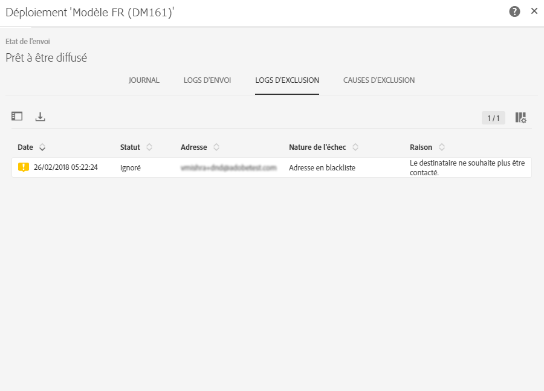
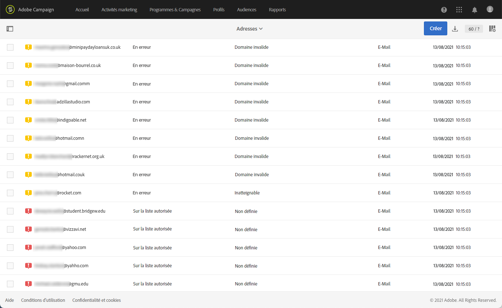
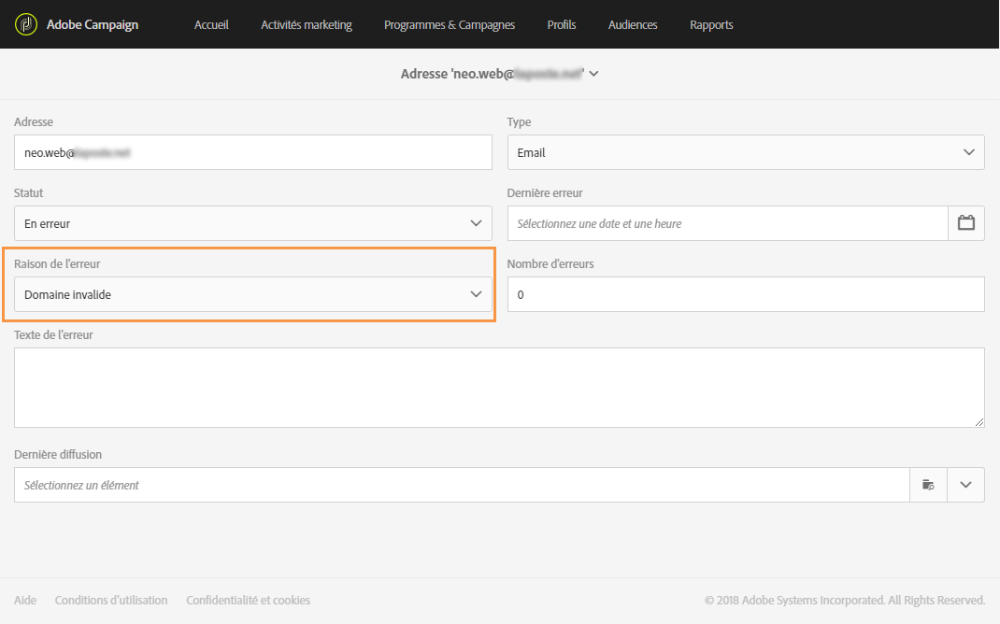

# Comprendre la gestion des quarantaines{#understanding-quarantine-management}

## A propos des quarantaines {#about-quarantines}

Une adresse email ou un numéro de téléphone peut être mis en quarantaine, par exemple, lorsque la boîte de messagerie est pleine ou si l'adresse n'existe pas.

Dans tous les cas, la mise en quarantaine répond à des règles précises qui sont décrites dans cette [section](../../sending/using/understanding-quarantine-management.md#conditions-for-sending-an-address-to-quarantine).

### Optimiser votre diffusion par le biais des mises en quarantaine  {#optimizing-your-delivery-through-quarantines}

Les profils dont l'adresse email ou le numéro de téléphone est en quarantaine sont exclus automatiquement lors de la préparation des messages (voir [Identifier les adresses en quarantaine pour une diffusion](../../sending/using/understanding-quarantine-management.md#identifying-quarantined-addresses-for-a-delivery)). Le taux d'erreur ayant une incidence importante sur la vitesse de diffusion, les envois sont ainsi accélérés.

Certains fournisseurs d'accès Internet considèrent automatiquement les emails comme du spam si le taux d'adresses invalides est trop élevé. Les mises en quarantaine permettent donc d'éviter des blacklistages de la part de ces fournisseurs.

De plus, elles réduisent les coûts d'envoi des SMS en excluant les numéros de téléphone erronés des diffusions.

Pour plus d'informations sur les bonnes pratiques en matière de sécurisation et d'optimisation de vos diffusions, consultez [cette page](https://docs.campaign.adobe.com/doc/standard/getting_started/fr/ACS_DeliveryBestPractices.html).

### Mise en quarantaine et blacklistage {#quarantine-vs-blacklisting}

La **mise en quarantaine** concerne uniquement une adresse, pas le profil lui-même. Cela signifie que si deux profils utilisent la même adresse email, en cas de mise en quarantaine de l'adresse, les deux profils seront impactés.

De même, un profil, dont l'adresse email est en quarantaine, qui met à jour son profil et enregistre une nouvelle adresse pourra de nouveau être ciblé par des actions de diffusions.

En revanche, en cas de **blacklistage**, c'est le profil qui ne sera plus ciblé par aucune diffusion, par exemple après une désinscription (opt-out). Pour plus d'informations sur le blacklistage, consultez la section [Gestion du blacklistage dans Campaign](../../audiences/using/about-opt-in-and-opt-out-in-campaign.md).

>[!NOTE]
>
>Lorsqu'un utilisateur répond à un SMS avec un mot-clé tel que "STOP" pour se désinscrire des diffusions SMS, son profil n'est pas blacklisté comme c'est le cas pour la désinscription des emails. Le numéro de téléphone du profil est envoyé en quarantaine avec le statut **[!UICONTROL Blacklisté]**. Ce statut se rapporte uniquement au numéro de téléphone. Le profil n’est pas blacklisté afin que l’utilisateur puisse continuer à recevoir des emails. Voir à ce propos [cette section](../../channels/using/managing-incoming-sms.md#managing-stop-sms).

## Identifier les adresses en quarantaine  {#identifying-quarantined-addresses}

Les adresses en quarantaine peuvent être répertoriées pour une diffusion spécifique ou l'ensemble de la plateforme.

>[!NOTE]
>
>Si vous souhaitez sortir une adresse de quarantaine, contactez votre administrateur technique.

### Identifier les adresses en quarantaine pour une diffusion  {#identifying-quarantined-addresses-for-a-delivery}

Les adresses en quarantaine pour une diffusion spécifique sont répertoriées pendant la phase de préparation de la diffusion, dans l'onglet **[!UICONTROL Exclus]** du tableau de bord des diffusions (voir [cette section](../../sending/using/monitoring-a-delivery.md#exclusion-logs)). Pour plus d'informations sur la préparation des diffusions, consultez [cette section](../../sending/using/preparing-the-send.md).

### Identifier les adresses en quarantaine pour l'ensemble de la plateforme  {#identifying-quarantined-addresses-for-the-entire-platform}

Les administrateurs peuvent répertorier les adresses en quarantaine pour l'ensemble de la plateforme depuis le menu **[!UICONTROL Administration &gt; Canaux &gt; Quarantaines &gt; Adresses]**.

>[!NOTE]
>
>Ce menu répertorie les éléments en quarantaine pour les canaux **Email**, **SMS** et **Notification push**.

>[!NOTE]
>
>L'augmentation du nombre de quarantaines est un phénomène normal, lié à "l'usure" de la base de données. Par exemple, si l'on considère que la durée de vie d'une adresse email est de trois ans et que la table des destinataires augmente de 50 % tous les ans, l'augmentation des quarantaines peut être calculée comme suit : Fin de l'année 1 : (1*0,33)/(1+0,5)=22 %. Fin de l'année 2 : ((1,22*0,33)+0,33)/(1,5+0,75)=32,5 %.

## Conditions de mise en quarantaine d'une adresse  {#conditions-for-sending-an-address-to-quarantine}

Adobe Campaign gère les quarantaines selon le type de diffusion en échec et la raison affectée pendant la qualification des messages d'erreur (voir [Types de diffusion en échec et raisons](../../sending/using/understanding-delivery-failures.md#delivery-failure-types-and-reasons) et [Qualification des emails bounce](../../sending/using/understanding-delivery-failures.md#bounce-mail-qualification)).

* **Erreur de type Ignoré** : les erreurs de type Ignoré ne mettent pas une adresse en quarantaine.
* **Erreur de type Hard** : l'adresse email correspondante est mise immédiatement en quarantaine.
* **Erreur de type Soft** : les erreurs de type Soft ne provoquent pas de mise en quarantaine immédiate mais incrémentent un compteur d'erreurs. Quand le compteur d'erreurs atteint le seuil limite, l'adresse passe en quarantaine. Dans les paramétrages par défaut, le seuil est de cinq erreurs : deux erreurs sont significatives si elles sont séparées d'au moins 24h. L'adresse est mise en quarantaine à la sixième erreur. Le seuil du compteur d'erreurs peut être modifié. Pour plus d'informations à ce propos, consultez [cette page](../../administration/using/configuring-email-channel.md#email-channel-parameters).

   Lorsqu'une diffusion aboutit après une nouvelle tentative, le compteur d'erreurs de l'adresse précédemment en quarantaine est réinitialisé. Le statut de l'adresse passe en **[!UICONTROL Valide]** et est supprimé de la liste des quarantaines après deux jours grâce au workflow **[!UICONTROL Nettoyage de la base]**.

Si un utilisateur qualifie un email comme du spam (**système de gestion des plaintes (feedback loop)**), le message est automatiquement redirigé vers une boîte email technique gérée par Campaign. L’adresse email de l’utilisateur est alors automatiquement mise en quarantaine avec le statut **[!UICONTROL Blacklistée]**. Ce statut ne concerne que l’adresse. Le profil n’est pas blacklisté afin que l’utilisateur puisse continuer à recevoir des SMS et des notification push.

>[!NOTE]
La quarantaine dans Adobe Campaign respecte la casse. Veillez à importer les adresses email en minuscules, de telle sorte qu'elles ne soient pas reciblées ultérieurement.

Dans la liste des adresses en quarantaine (voir [Identifier les adresses en quarantaine pour l’ensemble de la plateforme](../../sending/using/understanding-quarantine-management.md#identifying-quarantined-addresses-for-the-entire-platform)), le champ **[!UICONTROL Raison de l’erreur]** indique pourquoi l’adresse sélectionnée a été mise en quarantaine.

