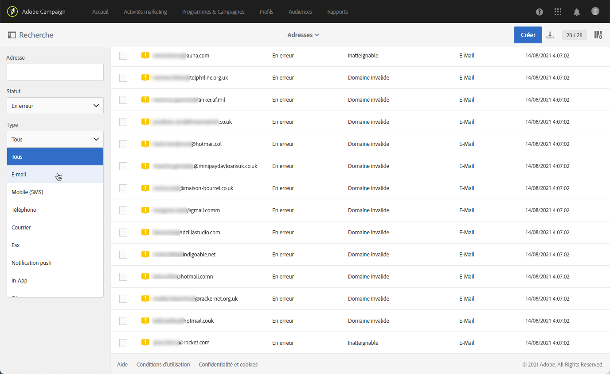
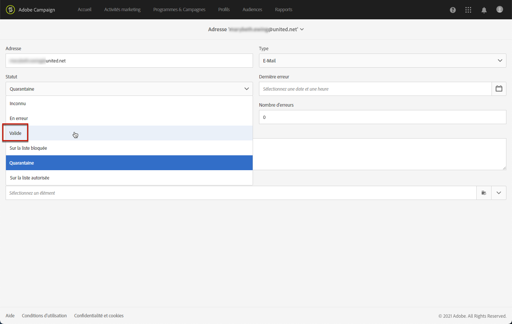

# Comprendre la gestion des quarantaines{#understanding-quarantine-management}

## À propos des quarantaines {#about-quarantines}

Une adresse email ou un numéro de téléphone peut être mis en quarantaine, par exemple, lorsque la boîte de messagerie est pleine ou si l’adresse n’existe pas.

Dans tous les cas, la mise en quarantaine répond à des règles précises qui sont décrites dans cette [section](#conditions-for-sending-an-address-to-quarantine).

### Optimiser votre diffusion par le biais des mises en quarantaine       {#optimizing-your-delivery-through-quarantines}

Les profils dont l&#39;adresse email ou le numéro de téléphone est en quarantaine sont exclus automatiquement lors de la préparation des messages (voir [Identifier les adresses en quarantaine pour une diffusion](#identifying-quarantined-addresses-for-a-delivery)). Le taux d&#39;erreur ayant une incidence importante sur la vitesse de diffusion, les envois sont ainsi accélérés.

Certains fournisseurs d&#39;accès Internet considèrent automatiquement les emails comme du spam si le taux d&#39;adresses invalides est trop élevé. La quarantaine permet donc d’éviter d’être ajouté à une liste bloquée par ces fournisseurs.

De plus, elles réduisent les coûts d’envoi des SMS en excluant les numéros de téléphone erronés des diffusions.

Pour plus d’informations sur les bonnes pratiques en matière de sécurisation et d’optimisation de vos diffusions, consultez [cette page](../../sending/using/delivery-best-practices.md).

### Quarantaine et liste bloquée {#quarantine-vs-denylist}

La quarantaine et la liste bloquée ne s’appliquent pas au même objet :

* La **quarantaine** s’applique uniquement à une **adresse** (ou un numéro de téléphone, etc.), et non au profil lui-même. Par exemple, un profil dont l’adresse e-mail est en quarantaine peut mettre à jour son profil et saisir une nouvelle adresse, puis être ciblé de nouveau par des actions de diffusion. De même, si deux profils ont le même numéro de téléphone, ils seront tous deux affectés si le numéro est mis en quarantaine.

  Les adresses ou numéros de téléphone mis en quarantaine s’affichent dans les [logs d&#39;exclusion](#identifying-quarantined-addresses-for-a-delivery) (pour une diffusion) ou dans la [liste de quarantaine](#identifying-quarantined-addresses-for-the-entire-platform) (pour l&#39;ensemble de la plateforme).

* En revanche, en cas d&#39;insertion en **liste bloquée**, le **profil** ne sera plus ciblé par aucune diffusion, par exemple après une désinscription (opt-out), pour un canal donné. Par exemple, si un profil de la liste bloquée pour le canal e-mail comporte deux adresses e-mail, les deux adresses seront exclues de la diffusion. Pour plus d’informations sur le processus de liste bloquée, voir la section [À propos des processus d’opt-in et d’opt-out dans Campaign](../../audiences/using/about-opt-in-and-opt-out-in-campaign.md).

  Vous pouvez vérifier si un profil est sur liste bloquée pour un ou plusieurs canaux dans la section **[!UICONTROL Ne plus contacter (sur liste bloquée)]** de l’onglet **[!UICONTROL Général]** du profil. Consultez [cette section](../../audiences/using/managing-opt-in-and-opt-out-in-campaign.md#managing-opt-in-and-opt-out-from-a-profile).

>[!NOTE]
>
>La mise en quarantaine inclut un statut **Sur liste bloquée**, qui s’applique lorsque les destinataires signalent votre message comme étant du spam ou répondent à un message SMS avec un mot-clé tel que « STOP ». Dans ce cas, l’adresse ou le numéro de téléphone du profil impliqué est mis en quarantaine avec le statut **[!UICONTROL Sur liste bloquée]**. Pour plus d&#39;informations sur la gestion des messages SMS STOP, consultez [cette section](../../channels/using/managing-incoming-sms.md#managing-stop-sms).

&lt;!Lorsqu’un utilisateur ou une utilisatrice répond à un SMS avec un mot-clé tel que « STOP » pour se désabonner des diffusions SMS, son profil n’est pas mis en liste bloquée comme c’est le cas pour le processus d’opt-out des e-mails. Au lieu de cela, le numéro de téléphone du profil est envoyé en quarantaine avec le statut **[!UICONTROL Sur la liste bloquée]**. Ce statut ne concerne que le numéro de téléphone, ce qui signifie que le profil continuera à recevoir des e-mails.<!-- Also, if the profile has another phone number, he can still receive SMS messages on the other number. For more on this, refer to [this section](../../channels/using/managing-incoming-sms.md#managing-stop-sms).-->

## Identifier les adresses en quarantaine  {#identifying-quarantined-addresses}

Les adresses en quarantaine peuvent être affichées pour une diffusion spécifique ou l&#39;ensemble de la plateforme.

<!--
If you need to remove an address from quarantine, contact your technical administrator.
-->

### Identifier les adresses en quarantaine pour une diffusion  {#identifying-quarantined-addresses-for-a-delivery}

Les adresses en quarantaine pour une diffusion spécifique sont répertoriées pendant la phase de préparation de la diffusion, dans l’onglet **[!UICONTROL Exclus]** du tableau de bord des diffusions (voir [cette section](../../sending/using/monitoring-a-delivery.md#exclusion-logs)). Pour plus d’informations sur la préparation des diffusions, consultez [cette section](../../sending/using/preparing-the-send.md).

### Identifier les adresses en quarantaine pour l’ensemble de la plateforme       {#identifying-quarantined-addresses-for-the-entire-platform}

Les administrateurs peuvent accéder à la liste détaillée des adresses e-mail en quarantaine pour l’ensemble de la plateforme depuis le menu **[!UICONTROL Administration > Canaux > Quarantaines > Adresses]**.

<!--
This menu lists quarantined elements for **Email**, **SMS** and **Push notification** channels.
-->

>[!NOTE]
>
>L’augmentation du nombre de quarantaines est un phénomène normal, lié à l’« usure » de la base de données. Par exemple, si l’on considère que la durée de vie d’une adresse e-mail est de trois ans et que la table des destinataires augmente de 50 % tous les ans, l’augmentation des quarantaines peut être calculée comme suit : fin de l’année 1 : (1&#42;0,33)/(1+0,5)=22 %. Fin de l&#39;année 2 : ((1,22 &#42; 0,33) + 0,33) / (1,5 + 0,75) = 32,5 %.

Des filtres sont disponibles pour vous aider à parcourir la liste. Vous pouvez filtrer par adresse, statut et/ou canal.

Vous pouvez modifier ou [supprimer](#removing-a-quarantined-address) chaque entrée, ainsi qu’en créer de nouvelles.

Pour modifier une entrée, cliquez sur la ligne correspondante et modifiez les champs selon les besoins.

Pour ajouter manuellement une entrée, utilisez le bouton **[!UICONTROL Créer]** .

Définissez l’adresse (ou le numéro de téléphone, etc.) et le type de canal. Vous pouvez définir un statut pour figurer dans la liste de quarantaine et un motif d’erreur. Vous avez également la possibilité d’indiquer la date d’erreur, le nombre d’erreurs et de saisir le texte d’erreur. Si nécessaire, sélectionnez la dernière diffusion envoyée à l&#39;adresse dans la liste déroulante.

## Suppression d’une adresse de la quarantaine {#removing-a-quarantined-address}

### Mises à jour automatiques {#unquarantine-auto}

Les adresses qui correspondent à des conditions spécifiques sont automatiquement supprimées de la liste de quarantaine par le workflow Nettoyage de la base de données. En savoir plus sur les workflows techniques dans [cette section](../../administration/using/technical-workflows.md#list-of-technical-workflows).

Les adresses sont automatiquement supprimées de la liste de quarantaine dans les cas suivants :

* Les adresses dont le statut est **[!UICONTROL En erreur]** seront supprimées de la liste de quarantaine après une diffusion réussie.
* Les adresses dont le statut est **[!UICONTROL En erreur]** seront supprimées de la liste de quarantaine si la dernière erreur de type Rebond temporaire a eu lieu il y a plus de 10 jours. Pour plus d&#39;informations sur la gestion des erreurs de type Soft, consultez [cette section](#soft-error-management).
* Les adresses dont le statut est **[!UICONTROL En erreur]** et qui ont rebondi avec l&#39;erreur **[!UICONTROL Boîte pleine]** sont supprimées de la liste de quarantaine après 30 jours.

Leur état devient ensuite **[!UICONTROL Valide]**.

Le nombre maximal de reprises à effectuer en cas de statut **[!UICONTROL En erreur]** et le délai minimal entre les reprises se fondent désormais sur la performance historique et actuelle d’une IP sur un domaine donné.

>[!IMPORTANT]
>
Les destinataires avec une adresse dont le statut est **[!UICONTROL En quarantaine]** ou **[!UICONTROL Sur liste bloquée]** ne font jamais l’objet d’une suppression, même s’ils/elles reçoivent un e-mail.

### Mises à jour manuelles {#unquarantine-manual}

Vous pouvez également retirer une adresse en quarantaine manuellement.  Pour supprimer manuellement une adresse de la liste de quarantaine, vous pouvez la retirer de la liste ou changer son statut en **[!UICONTROL Valide]**.

* Sélectionnez l’adresse dans la liste **[!UICONTROL Administration > Canaux > Quarantaines > Adresses]**, puis l’option **[!UICONTROL Supprimer l’élément]**.

  

* Sélectionnez une adresse et remplacez son **[!UICONTROL Statut]** par **[!UICONTROL Valide]**.

  

### Mises à jour en bloc {#unquarantine-bulk}

Vous devrez peut-être effectuer des mises à jour en bloc sur la liste de quarantaine, par exemple en cas de panne du FAI. Dans ce cas, les e-mails sont incorrectement marqués comme rebonds, car ils ne peuvent pas être correctement remis à leur destinataire. Ces adresses doivent être supprimées de la liste de quarantaine.

Pour ce faire, créez un workflow et ajoutez une activité **[!UICONTROL Requête]** sur votre table de quarantaine pour filtrer tous les destinataires concernés. Une fois identifiés, ils peuvent être supprimés de la liste de quarantaine et inclus dans les prochaines diffusions e-mail de Campaign.

En fonction du calendrier de l’incident, voici les instructions recommandées pour cette requête.

* **Le texte d’erreur (texte de quarantaine)** contient « 550-5.1.1 » ET **Le texte d’erreur (texte de quarantaine)** contient « support.ISP.com »,

  où « support.ISP.com » peut être « support.apple.com » ou « support.google.com », par exemple.

* **Statut de la mise à jour (@lastModified)** à partir du `MM/DD/YYYY HH:MM:SS AM`
* **Statut de la mise à jour (@lastModified)** le ou avant le `MM/DD/YYYY HH:MM:SS PM`

Une fois que vous disposez de la liste des destinataires concernés, ajoutez une activité **[!UICONTROL Mise à jour de données]** pour définir le statut de leur adresse e-mail sur **[!UICONTROL Valide]** afin qu’ils soient supprimés de la liste de quarantaine par le workflow **[!UICONTROL Nettoyage de la base de données]**. Vous pouvez également les supprimer uniquement de la table de quarantaine.

## Conditions de mise en quarantaine d&#39;une adresse  {#conditions-for-sending-an-address-to-quarantine}

Adobe Campaign gère les quarantaines selon le type de diffusion en échec et la raison affectée pendant la qualification des messages d’erreur (voir [Types de diffusion en échec et raisons](../../sending/using/understanding-delivery-failures.md#delivery-failure-types-and-reasons) et [Qualification des e-mails rejetés](../../sending/using/understanding-delivery-failures.md#bounce-mail-qualification)).

* **Erreur de type Ignoré** : les erreurs de type Ignoré ne mettent pas une adresse en quarantaine.
* **Erreur de type Hard** : l&#39;adresse email correspondante est mise immédiatement en quarantaine.
* **Erreur de type Soft** : les erreurs de type Soft ne provoquent pas de mise en quarantaine immédiate mais incrémentent un compteur d&#39;erreurs. Pour plus d&#39;informations, voir la section [Comprendre la gestion des erreurs de type Soft](#soft-error-management).

  <!--
  When the error counter reaches the limit threshold, the address goes into quarantine. In the default configuration, the threshold is set at five errors, where two errors are significant if they occur at least 24 hours apart. The address is placed in quarantine at the fifth error. The error counter threshold can be modified. For more on this, refer to this [page](../../administration/using/configuring-email-channel.md#email-channel-parameters).
  When a delivery is successful after a retry, the error counter of the address which was prior to that quarantined is reinitialized. The address status changes to **[!UICONTROL Valid]** and it is deleted from the list of quarantines after two days by the **[!UICONTROL Database cleanup]** workflow.
  -->

Si un utilisateur qualifie un email comme du spam ([système de gestion des plaintes (feedback loop)](https://experienceleague.adobe.com/docs/deliverability-learn/deliverability-best-practice-guide/transition-process/infrastructure.html?lang=fr#feedback-loops)), le message est automatiquement redirigé vers une boîte email technique gérée par Adobe. L’adresse email de l’utilisateur est alors automatiquement mise en quarantaine avec le statut **[!UICONTROL Sur liste bloquée]**. Ce statut ne concerne que l’adresse. Le profil n’est pas placé sur liste bloquée afin que l’utilisateur puisse continuer à recevoir des SMS et des notifications push.

>[!NOTE]
>
La quarantaine dans Adobe Campaign respecte la casse. Veillez à importer les adresses email en minuscules, de telle sorte qu’elles ne soient pas reciblées ultérieurement.

Dans la liste des adresses mises en quarantaine (voir [Identifier les adresses mises en quarantaine pour l’ensemble de la plateforme](#identifying-quarantined-addresses-for-the-entire-platform)), le champ **[!UICONTROL Raison de l’erreur]** indique pourquoi l’adresse sélectionnée a été mise en quarantaine.

### Gestion des erreurs de type Soft {#soft-error-management}

Contrairement aux erreurs de type Hard, les erreurs de type Soft ne provoquent pas de mise en quarantaine immédiate mais incrémentent un compteur d&#39;erreurs.

Les reprises seront effectuées pendant la [durée de diffusion](../../administration/using/configuring-email-channel.md#validity-period-parameters). Quand le compteur d&#39;erreurs atteint le seuil limite, l&#39;adresse passe en quarantaine. Pour en savoir plus, voir la section [Reprises après une diffusion temporairement en échec](understanding-delivery-failures.md#retries-after-a-delivery-temporary-failure).

<!--In the default configuration, the threshold is set at five errors, where two errors are significant if they occur at least 24 hours apart. The address is placed in quarantine at the fifth error.
The error counter threshold can be modified.-->

Le compteur d&#39;erreurs est réinitialisé si la dernière erreur significative s&#39;est produite plus de 10 jours avant. Le statut de l&#39;adresse passe à **Valide** et est supprimé de la liste des quarantaines grâce au workflow **Nettoyage de la base**. (Pour plus d&#39;informations sur ces workflows, consultez [cette section](../../administration/using/technical-workflows.md#list-of-technical-workflows).)
