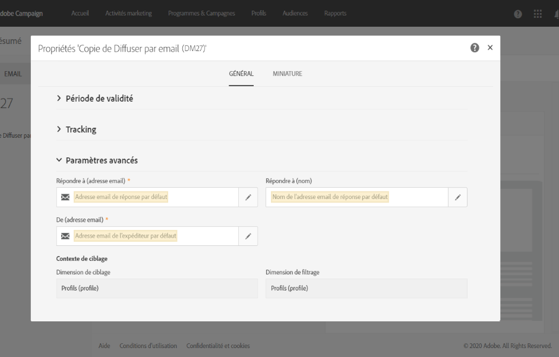
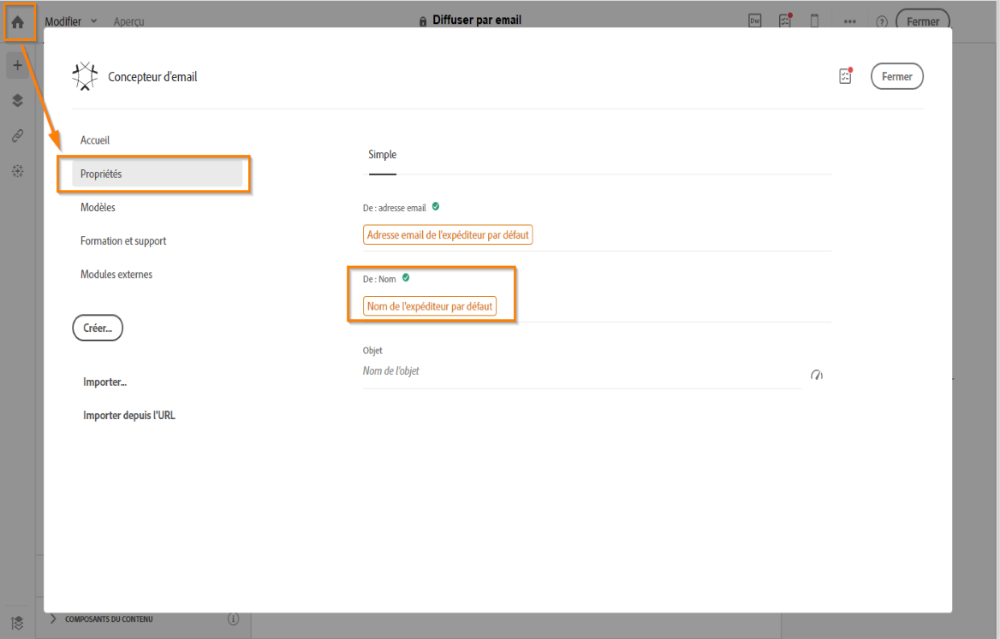
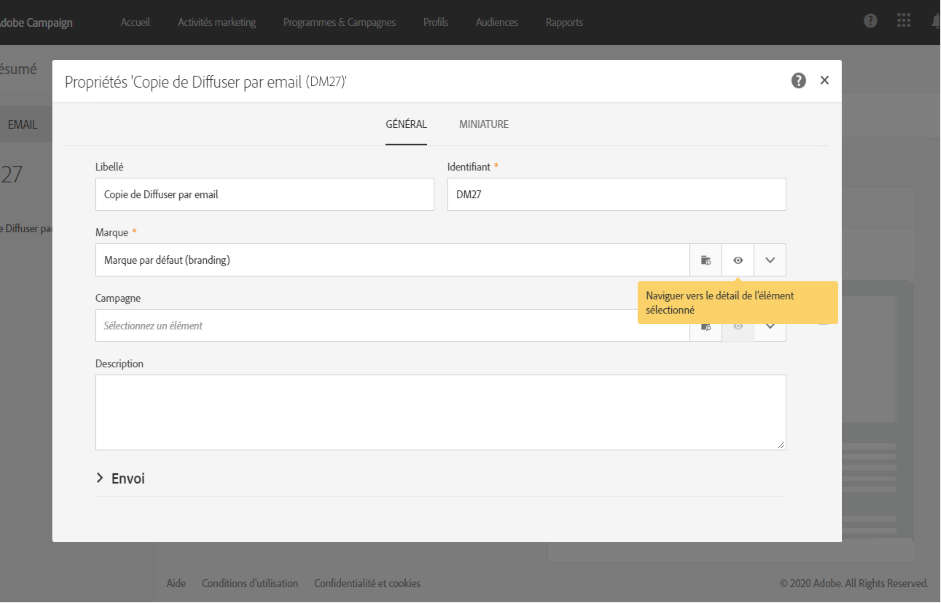

# Utilisez les modèles {#use-templates}

Les modèles de diffusion accroissent l&#39;efficacité en offrant des configurations prêtes à l&#39;emploi pour les types d&#39;activité les plus courants. Grâce aux modèles, les marketeurs peuvent déployer plus rapidement de nouvelles campagnes avec une personnalisation minimale.

En savoir plus sur les modèles de diffusion dans [cette section](../../start/using/marketing-activity-templates.md).

## Prise en main des modèles de diffusion {#gs-templates}

Un [modèle de diffusion](../../start/using/marketing-activity-templates.md#creating-a-new-template) vous permet de définir une fois un ensemble de propriétés techniques et fonctionnelles qui répond à vos besoins et qui peut être réutilisé pour de prochaines diffusions. Vous pouvez ensuite gagner du temps et normaliser les diffusions si nécessaire.

Si vous gérez plusieurs marques dans Adobe Campaign, Adobe recommande de disposer d’un sous-domaine par marque. Une banque peut, par exemple, avoir plusieurs sous-domaines qui correspondent à chacune de ses agences régionales. Si une banque détient le domaine bluebank.com, ses sous-domaines peuvent être @ny.bluebank.com, @ma.bluebank.com, @ca.bluebank.com, etc. Disposer d’un modèle de diffusion par sous-domaine vous permet de toujours utiliser les paramètres préconfigurés adéquats pour chaque marque et d’éviter ainsi des erreurs tout en gagnant du temps.

**Conseil** : afin d’éviter toute erreur de paramétrage dans Campaign, il est recommandé de dupliquer un modèle natif et d’en modifier les propriétés plutôt que d’en créer un nouveau.

## Configurer les adresses

* L&#39;adresse de l&#39;expéditeur est obligatoire pour permettre l&#39;envoi d&#39;un email.

* Certains FAI vérifient la validité de l’adresse de l’expéditeur avant d’accepter les messages.

* Une adresse erronée peut causer un refus de la part du serveur receveur. Vous devez vous assurer qu’une adresse correcte est bien renseignée.

* L&#39;adresse doit identifier explicitement l&#39;expéditeur. Le domaine doit appartenir à l&#39;expéditeur et être enregistré auprès de lui.

* Adobe recommande de créer des comptes email qui correspondent aux adresses indiquées pour les envois et les réponses. Parlez-en avec votre administrateur du système de messagerie.

Dans la section **[!UICONTROL Paramètres avancés]** des propriétés d&#39;un modèle d&#39;email, le champ **[!UICONTROL De (adresse email)]** correspond à l&#39;adresse de l&#39;expéditeur.

Le domaine d’adresse doit être identique au sous-domaine que vous avez configuré.

Les champs **[!UICONTROL Répondre à]** correspondent à l&#39;adresse email et au nom utilisés pour les réponses.

**Conseil** : Adobe recommande d&#39;utiliser une adresse réelle existante comme l&#39;Assistance clientèle de votre marque. Ainsi, si un destinataire envoie une réponse, l&#39;Assistance clientèle sera en mesure de la traiter.

Pour modifier le nom de l’expéditeur qui apparaîtra dans l’en-tête des messages envoyés, accédez à l’onglet **[!UICONTROL Propriétés]** de la page d’accueil du Concepteur d’email (accessible par le biais de l’icône Accueil) et cliquez sur le bloc **[!UICONTROL Nom de l’expéditeur par défaut]**.

Pour accroître le taux d&#39;ouverture de vos diffusions, Adobe vous recommande d&#39;utiliser un nom facilement identifiable par les destinataires comme le nom de votre marque.

**Conseil** : pour améliorer davantage l&#39;expérience des destinataires, vous pouvez ajouter le nom d&#39;une personne, par exemple « Emma de Megastore ».

Pour plus d&#39;informations sur la personnalisation du nom de l&#39;expéditeur, voir [Expéditeur d&#39;un email](../../designing/using/subject-line.md#email-sender).

## Personnaliser le nom de l&#39;expéditeur de SMS

Dans la section **Paramètres avancés** des propriétés d&#39;un modèle de SMS, l&#39;option **De** permet de personnaliser le nom de l&#39;expéditeur du SMS à l&#39;aide d&#39;une chaîne de caractères. C&#39;est le nom qui s&#39;affichera dans le champ correspondant à l&#39;expéditeur du SMS sur le téléphone mobile du destinataire.

Si ce champ est vide, c&#39;est le numéro source renseigné dans le compte externe qui sera utilisé. Si aucun numéro source n&#39;y figure, c&#39;est le numéro court qui sera utilisé. Voir à ce propos la section [Configuration des SMS](../../administration/using/configuring-sms-channel.md).

**Conseil** : vérifiez la loi en vigueur dans votre pays concernant la modification de l&#39;adresse de l&#39;expéditeur. Vérifiez également auprès de votre fournisseur de service SMS s&#39;il propose cette fonctionnalité.

## Configurer une population témoin

Une fois que la diffusion est envoyée, vous pouvez comparer le comportement des destinataires exclus à celui des destinataires qui ont reçu la diffusion. Vous pouvez ensuite mesurer l’efficacité de vos campagnes. En savoir plus sur les populations témoins dans [cette section](../../sending/using/control-group.md).

## Utiliser des typologies pour appliquer des filtres ou des règles de contrôle

Une typologie contient les règles de vérification qui sont appliquées lors de la phase d&#39;analyse, avant tout envoi.

Dans la section **[!UICONTROL Paramètres avancés]** > **[!UICONTROL Préparation]** des propriétés du modèle, changez la typologie par défaut en fonction de vos besoins.

Pour mieux contrôler le trafic sortant, par exemple, vous pouvez définir quelles adresses IP peuvent être utilisées en spécifiant une affinité par sous-domaine et en créant une typologie par affinité. Les affinités sont définies directement dans le fichier de configuration de l&#39;instance. Contactez votre administrateur Adobe Campaign.

Pour plus d’informations sur les typologies, consultez [cette section](../../sending/using/managing-typologies.md).

## Associer une marque à un modèle

Les paramètres des emails envoyés relatifs à l&#39;identité d&#39;une marque (le logo de la marque et l&#39;adresse de l&#39;expéditeur, par exemple) sont gérés de manière centralisée dans Adobe Campaign. Vous pouvez créer une ou plusieurs marques et les associer à des modèles de diffusion.

Pour plus d&#39;informations sur l&#39;utilisation et la configuration des marques dans Adobe Campaign, voir Marques.

Pour afficher ou modifier la marque affectée à un modèle de diffusion, cliquez sur le bouton Editer les propriétés du modèle et accédez aux détails de la marque.

Pour plus d&#39;informations sur l&#39;association d&#39;une marque à un modèle, voir [Affecter une marque à un email](../../administration/using/branding.md#assigning-a-brand-to-an-email).

Découvrez comment créer et configurer une marque [dans cette section](../../administration/using/branding.md#creating-a-brand).
