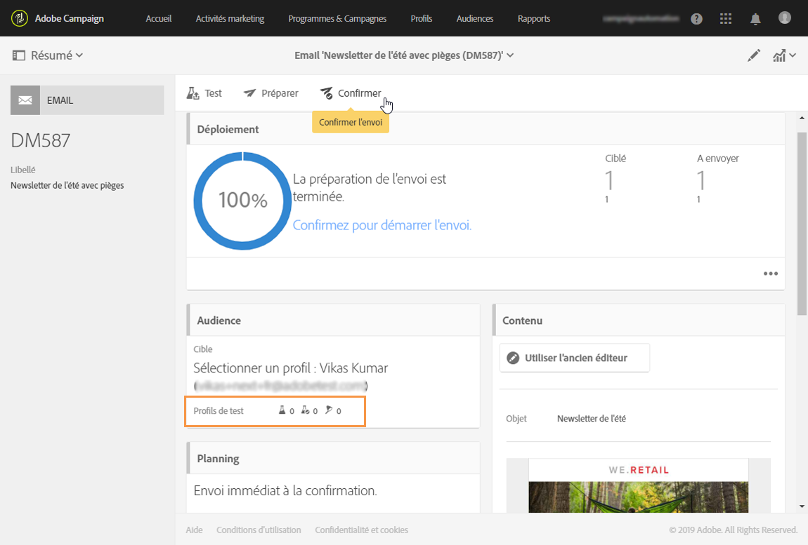

# Utilisation des pièges {#using-traps}

Lors de l’utilisation de pièges, le message est envoyé au [profil de test](../../audiences/using/managing-test-profiles.md) tel qu’il est envoyé à la cible principale, notamment pour identifier une utilisation frauduleuse de votre fichier client.

Les pièges ont été conçus à l’origine pour les diffusions courrier. Ils vous permettent de :

* Vérifier que votre fournisseur de courrier envoie vraiment la communication ;
* Recevoir le courrier en même temps et dans les mêmes conditions que vos clients ;
* Conserver une copie exacte du courrier qui a été envoyé ;
* Vérifier que votre liste de clients n’est pas utilisée de façon frauduleuse par votre fournisseur de courrier. En effet, si une autre communication est envoyée à l’adresse de votre profil de test, votre fichier client peut avoir été utilisé à votre insu. C’est pourquoi l’adresse du profil de test ne doit être utilisée qu’à cette fin.

Pour plus d’informations sur l’ajout de pièges à l’audience d’un courrier, voir [Ajout de profils de test et de type piège](../../channels/using/defining-the-direct-mail-audience.md#adding-test-and-trap-profiles).

Pour les autres canaux de communication, vous pouvez ajouter des profils de test de type piège à votre cible principale afin d’effectuer les opérations suivantes :

* Vérifier que votre message a bien été envoyé ;
* Obtenir et conserver une copie exacte de votre message ;
* Suivre quand il a été envoyé et reçu.

Pour utiliser un profil de test comme piège, il doit être inclus dans l’audience de votre message.

>[!NOTE]
>
>Contrairement aux profils de test utilisés pour les [bons à tirer](../../sending/using/sending-proofs.md) ou le [rendu des emails](../../sending/using/email-rendering.md), le message est envoyé simultanément à la cible principale et aux profils de test utilisés comme pièges.

Lors de la définition de l’audience d’un message :

1. Dans l’onglet **[!UICONTROL Profils de test]**, sélectionnez un profil de test ; Assurez-vous qu’il affiche **[!UICONTROL Piège]** comme utilisation prévue.

   

1. Une fois que le contenu de votre message est prêt, cliquez sur le bouton **[!UICONTROL Préparer]**. Voir [Préparer l’envoi](../../sending/using/preparing-the-send.md).
   >[!NOTE]
   >
   >Vérifiez que vous avez sélectionné une cible principale. Sinon, votre message ne peut pas être envoyé.

1. Cliquez sur le bouton **[!UICONTROL Confirmer.]** Voir [Confirmer l’envoi](../../sending/using/confirming-the-send.md).

   

Le message est envoyé à la cible principale et au profil de test.

Vous pouvez utiliser des pièges lors de l’envoi de messages transactionnels. Dans ce cas, le profil de test recevra un message par configuration d’événement. Pour plus d’informations sur les messages transactionnels, voir cette [section](../../channels/using/getting-started-with-transactional-msg.md).

>[!NOTE]
>
>Lors de l’utilisation d’un profil de test en tant que piège, pour les champs enrichis d’un message, les données supplémentaires correspondantes sont sélectionnées de manière aléatoire à partir d’un profil cible réel et affectées au profil de test de piège. Pour plus d’informations sur l’enrichissement, consultez [cet exemple](../../automating/using/enriching-profile-data-file.md).
