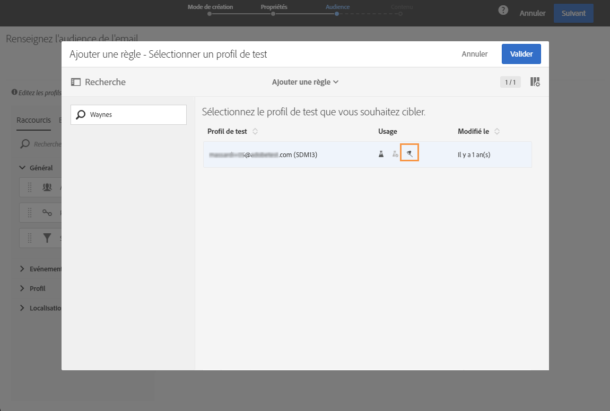

# Utilisation des pièges {#using-traps}

Lors de l&#39;utilisation de pièges, le message est envoyé au [profil de test](../../audiences/using/managing-test-profiles.md) tel qu&#39;il est envoyé à la cible principale, notamment pour identifier une utilisation frauduleuse de votre fichier client.

Les pièges ont été conçus à l&#39;origine pour les diffusions courrier. Ils vous permettent de :

* Vérifier que votre fournisseur de courrier envoie vraiment la communication ;
* Recevoir le courrier en même temps et dans les mêmes conditions que vos clients ;
* Conserver une copie exacte du courrier qui a été envoyé ;
* Vérifier que votre liste de clients n&#39;est pas utilisée de façon frauduleuse par votre fournisseur de courrier. En effet, si une autre communication est envoyée à l&#39;adresse de votre profil de test, votre fichier client peut avoir été utilisé à votre insu. C&#39;est pourquoi l&#39;adresse du profil de test ne doit être utilisée qu&#39;à cette fin.

Pour plus d&#39;informations sur l&#39;ajout de pièges à l&#39;audience d&#39;un courrier, voir [Ajout de profils de test et de type piège](../../channels/using/defining-the-direct-mail-audience.md#adding-test-and-trap-profiles).

Pour les autres canaux de communication, vous pouvez ajouter des profils de test de type piège à votre cible principale afin d&#39;effectuer les opérations suivantes :

* Vérifier que votre message a bien été envoyé ;
* Obtenir et conserver une copie exacte de votre message ;
* Suivre quand il a été envoyé et reçu.

Pour utiliser un profil de test comme piège, il doit être inclus dans l&#39;audience de votre message.

>[!NOTE]
>
>Contrairement aux profils de test utilisés pour les [bons à tirer](../../sending/using/sending-proofs.md) ou le [rendu des emails](../../sending/using/email-rendering.md), le message est envoyé simultanément à la cible principale et aux profils de test utilisés comme pièges.

Lors de la définition de l&#39;audience d&#39;un message :

1. From the **[!UICONTROL Test profiles]** tab, select a test profile. Make sure that it has **[!UICONTROL Trap]** as the intended use.

   

1. Once your message content is ready, click the **[!UICONTROL Prepare]** button. Voir [Préparer l&#39;envoi](../../sending/using/preparing-the-send.md).
   >[!NOTE]
   >
   >Vérifiez que vous avez sélectionné une cible principale. Sinon, votre message ne peut pas être envoyé.

1. Cliquez sur le **[!UICONTROL Confirm]** bouton. Voir [Confirmer l&#39;envoi](../../sending/using/confirming-the-send.md).

   

Le message est envoyé à la cible principale et au profil de test.

Vous pouvez utiliser des pièges lors de l’envoi de  de. Dans ce cas, le de test recevra un message par configuration . For more on transactional messaging, see this [section](../../channels/using/about-transactional-messaging.md).

>[!NOTE]
>
>Lors de l&#39;utilisation d&#39;un profil de test en tant que piège, pour les champs enrichis d&#39;un message, les données supplémentaires correspondantes sont sélectionnées de manière aléatoire à partir d&#39;un profil cible réel et affectées au profil de test de piège. Pour plus d&#39;informations sur l&#39;enrichissement, consultez [cet exemple](../../automating/using/enrichment.md#example--enriching-profile-data-with-data-contained-in-a-file).
